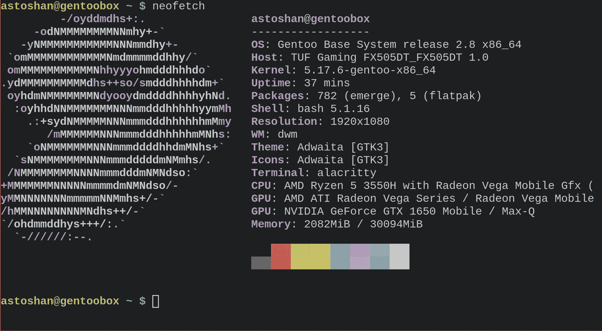

# 结束我无休止的流浪

> 原文：<https://blog.devgenius.io/an-end-to-my-ceaseless-distro-hopping-9852b1be6c3a?source=collection_archive---------12----------------------->

很长一段时间以来，我一直在从 Linux 发行版跳到 Linux 发行版。这些发行版都没有让我满意。我试过 Arch、Debian、Ubuntu、哥鲁达、Pop-OS、Manjaro、Kali、Parrot-OS 和其他几个发行版。所有这些操作系统虽然神奇而独特，但还没有真正满足我的需求和愿望。那是直到…

我运行 Gentoo 的笔记本电脑的屏幕截图

巴布亚！！！我发现 Gentoo 是最好的发行版之一，我怀疑它将结束我的发行版跳槽。这是出于多种原因，尽管我们将在后面讨论。首先我来说说安装之旅进行的如何。

在这次成功尝试之前，我曾两次尝试安装 Gentoo。我相信这是我的 fstab(一个用于管理启动时分区挂载位置的文件)在挂载/boot 目录时出现的问题。虽然这是题外话。这一次，我能够顺利地安装它。有一些困难，特别是让它在我的笔记本电脑屏幕和外部显示器之间无缝切换。虽然据我所知，在这一点上，这是我的理想和完美的分布。我认为安装 Gentoo 并不像许多人想象的那么难。虽然这需要一段时间。对我来说，完成基本安装大约需要 4 个小时(有几次中断),完成所有安装需要几天时间。然而，我认为这是值得的。

我认为这是值得的，原因有很多，但最重要的是，与其他发行版相比，你可以更好地控制你的系统及其内核。包括阿奇。这主要是因为使用 Gentoo，您可以从源代码编译所有内容，而不是在预先构建的内核上安装二进制文件。您自己配置和编译内核，使其更接近 LFS。(从零开始的 Linux。)虽然它也允许您进一步优化系统上的一切。(大多在 portage make.conf 文件中。)如果您没有尝试过 Gentoo，我建议您至少尝试一次安装。

它做的另一件事是向我介绍了我最喜欢的窗口管理器(一个更简单的桌面环境)DWM。在我开始安装 Gentoo 之前，我从未听说过 DWM，这是因为我使用的大多数发行版都预装了 GUI，或者不利于窗口管理器。我发现 DWM 是最适合我使用计算机的。它改变了我对图形用户界面的看法。总的来说，Gentoo 将向您介绍一系列新概念，引导您发现关于您的计算机偏好的东西。也许你喜欢 KDE 也许你喜欢 Gnome 的修改版本。您可以尝试任何发行版上的东西，但是 Gentoo 几乎强迫您找出您更喜欢的。这导致一个系统不仅在技术上得到更好的优化(如果你知道你在做什么)，而且是一个迎合你的系统。你不是在适应一个系统，而是在让一个系统适应你。这听起来并没有很大的不同，但它改变了你运行电脑的方式。

总结一下。Gentoo 迫使您创建一个更好的优化系统，这也迫使您找出自己喜欢的系统类型。尽管 Gentoo 有一些不好的方面，但是如果不去掉它好的方面，这些缺点是不容易解决的。不好的方面是让巴布亚变得巴布亚的原因。(不，我不想因为他们不支持很多更快的编译器而烦恼。)尽管对我来说，我热爱 Gentoo 还有一个更深层次的原因。

这是骄傲和体贴的问题。像大多数事情一样，当你得到一个基本上开箱即用的操作系统时，你就不那么欣赏它了。尤其是像 Linux 这样的免费软件。尽管当你花费数小时安装一个你了如指掌的系统。突然变得更私人了。我知道我听起来像是对我的电脑和系统着迷的人。(我是)虽然这真的是一种需要你自己去感受的体验。就像你最终在滑板上变戏法的那种满足感。或者是你自制的令人满意的面包片。或者仅仅是当你知道某样东西是你的时候的那种感觉。不是说你拥有它，而是说你创造了它。你做了一些真正有意义的事情。很特别…