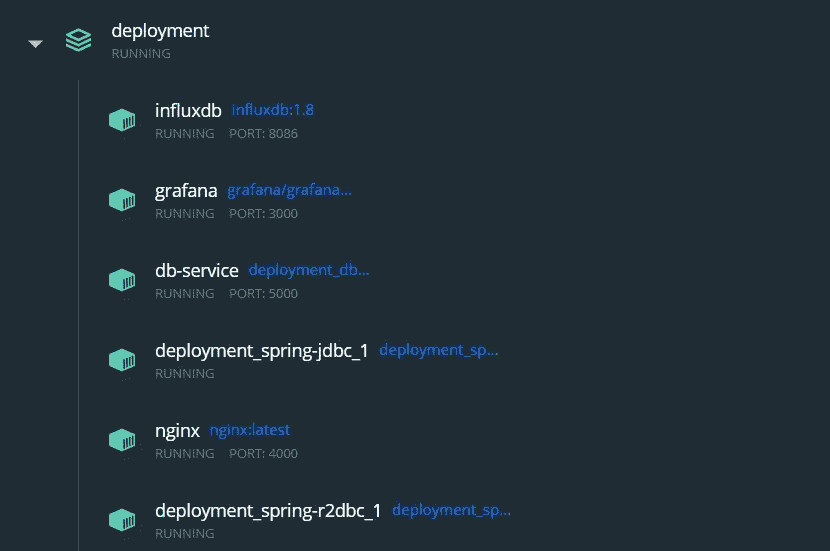
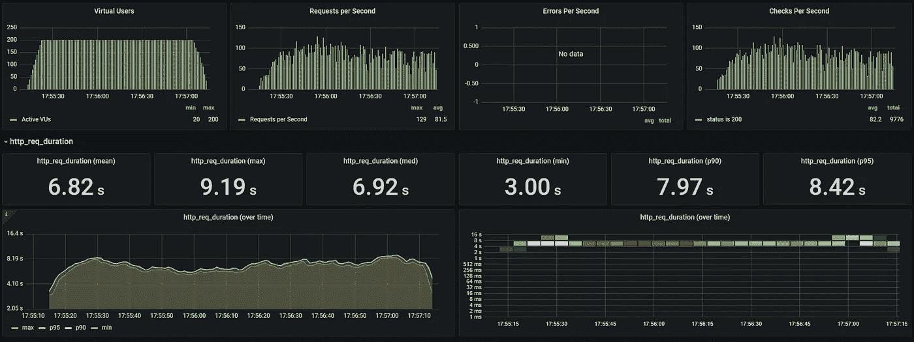
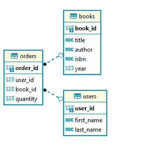
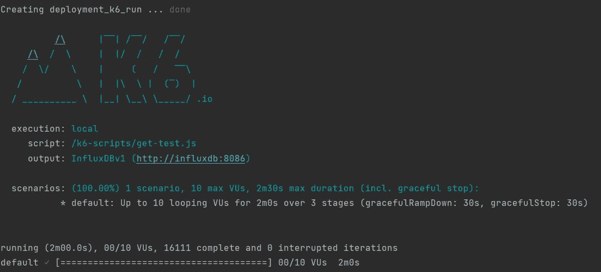
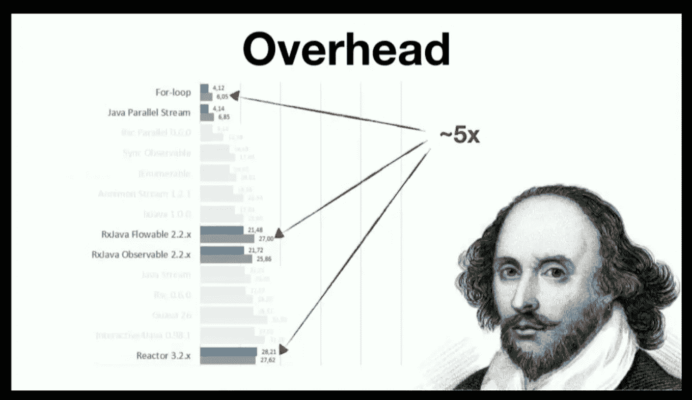

# 史诗般的故事:现实世界中 JDBC 和 R2DBC 的比较(第 1/2 部分)

> 原文：<https://blog.devgenius.io/an-epic-tale-comparing-jdbc-and-r2dbc-in-a-real-world-scenario-a536db512834?source=collection_archive---------1----------------------->

## 整个探索围绕着一个简单但难以回答的问题:“使用 R2DBC 有意义吗？”

在谷歌上搜索一下，可以找到几个精确说明 R2DBC 具有高并发性的基准。然而，这些基准是建立在一个远离真正的数据库密集型应用的场景之上的。他们通常在数据库表上测试一个简单的“get ”:这太简单了。


由[https://unsplash.com/@linussandvide](https://unsplash.com/@linussandvide)在 Unsplash 上拍摄的照片

*   所以我用 SPRING-BOOT 以阻塞(JDBC)和反应(R2DBC)的方式编写了自己的用例
*   在容器化的环境中使用 docker-compose 部署一切
*   测试了几次，改变了一些有见地的参数

我得出的结论是，**“R2DBC 高并发更快”这句话，*基本上是错误的。***

# *介绍*

*我的测试环境部署包含以下容器:*

**

*应用程序使用的容器。*

*我使用了 **GRAFANA** 和 **INFLUXDB** 来帮助我用一个非常漂亮的配置来绘制结果，可以绘制如下图:*

**

*Grafana k6 负载测试*

*部署的 **POSTGRES** 数据库服务包含一个足够简单的模式，它是在容器开始时自动创建的。*

**

*数据库库模式*

*NGINX 被放在那里仅仅是为了相同种类的多个容器之间的负载平衡——如果有的话。只有 JDBC 和 R2DBC 容器才是真正的测试对象。**(并且已经配置为在高压下完全执行)***

*负载测试已经在运行**临时 K6 容器**的情况下执行，通过指定不同的 ENV 参数从不同的执行中改变。*

# *经典的 GET 测试*

*让我们从直接在 book 表上测试一个简单的 HTTP GET 开始，就像在网上找到的各种场景中一样。但是…我还参数化了从单个 GET 中检索到的数据库条目的数量，这就是问题所在！*

*让我们从具有以下配置的单个容器开始:*

```
*spring-jdbc:
  build:
    context: ../spring-jdbc
  depends_on:
    - db-service
  restart: always
  environment:
    **- POOL_SIZE=20**
  ports:
    - "8080:8080"
  deploy:
    replicas: 1
  **  resources:
      limits:
        cpus: 2
        memory: 2G
      reservations:
        memory: 2G**

spring-r2dbc:
  build:
    context: ../spring-r2dbc
  depends_on:
    - db-service
  restart: always
  environment:
   ** - POOL_SIZE=20**
  ports:
    - "8081:8080"
  deploy:
    replicas: 1
   ** resources:
      limits:
        cpus: 2
        memory: 2G
      reservations:
        memory: 2G***
```

*让我们通过改变这些参数来运行一些测试:**访问端点的同时期用户和从数据库中检索的条目数量。***

*对于这个分析，我们将只考虑 k6 执行的成功和完整迭代的次数，它给出了给定时间内的总吞吐量(HTTP 请求持续时间和每秒请求数等其他参数将在后续测试中进行评估)。*

**

*k6 测试截图。*

```
*Database Items retrieved: 

       6000 / 3000 / 1500Troughput: Case 1: 500 users - R2DBC: **4083** / 5373 / 10689
  - JDBC:  3321 / 5447 / **22765** Case 2: 250 users

  - R2DBC: **4385** / 7364 / 15152
  - JDBC: 3520 / 6944 / **20255**

  Case 3: 100 users

  - R2DBC: **4057** / 7636 / 15341
  - JDBC: 3247 / 8835 / **22079**

  Case 4: 10 users

  - R2DBC: 4541 / 8823 / 16111
  - JDBC: **6841 / 12031 / 26349***
```

*上述结果意味着阻塞堆栈在行数较少的情况下性能更好。还要记住，在呼叫实际结束之前可以处理反应输出(这是反应驱动程序的全部目的)
结果是一个足够清楚的陈述:*

> ***只有在处理数据流而不是涓涓细流有意义时，才使用反应式堆栈:】T2***

*R2DBC 似乎只有在检索超过 100 个并发用户的 3000 个项目时才明显更好。这是一个非常有限的场景。是否有很多应用程序需要一次超过 3000 个数据库行，并且有超过 100 个并发用户？考虑到查询分页也是一个选项，答案是显而易见的。在我看来，对于绝大多数数据库密集型 web 应用程序来说，完全反应式堆栈并不是一个好的选择。*

*反应式堆栈所做的优化(使用额外的队列来最大限度地减少 CPU 和 CPU 上下文切换的使用)在从数据库中检索很少行的情况下不够好。请始终记住，反应式项目增加了大量的处理开销，这可能是 R2DBC 在某些情况下看起来更慢的原因。*

**

*来自一个很棒的视频[该做的和不该做的:避免初次反应式程序员地雷](https://www.youtube.com/watch?v=0rnMIueRKNU)*

# *结论*

*现在，让我们继续。如果我们使用 Spring-JDBC 阻塞堆栈和 Spring-R2DBC 电抗堆栈来实现两个不同的应用，会怎么样？*

*在本文的第二部分，我们将看到这个测试环境的完整代码和应用程序！敬请关注。*

## *更新:下面是第二部分。*

*[](/an-epic-tale-comparing-jdbc-and-r2dbc-in-a-real-world-scenario-part-2-2-d908df49651c) [## 史诗般的故事:现实世界中 JDBC 和 R2DBC 的比较(下)

### 整个探索围绕着一个简单但难以回答的问题:“使用 R2DBC 有意义吗？”

blog.devgenius.io](/an-epic-tale-comparing-jdbc-and-r2dbc-in-a-real-world-scenario-part-2-2-d908df49651c) 

一如既往，非常感谢您的阅读。*