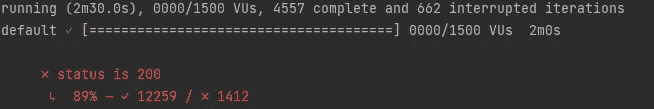

# 史诗般的故事:现实世界中 JDBC 和 R2DBC 的比较(下)

> 原文：<https://blog.devgenius.io/an-epic-tale-comparing-jdbc-and-r2dbc-in-a-real-world-scenario-part-2-2-d908df49651c?source=collection_archive---------2----------------------->

## 整个探索围绕着一个简单但难以回答的问题:“使用 R2DBC 有意义吗？”


照片由 [Gowrisha CV](https://unsplash.com/@gcvphotography?utm_source=medium&utm_medium=referral) 在 [Unsplash](https://unsplash.com?utm_source=medium&utm_medium=referral) 上拍摄

在本文的第一部分中，我通过测量 GET 请求不同场景下的总吞吐量，展示了一个 **spring boot JDBC** 阻塞应用程序和一个 **spring boot R2DBC** 反应应用程序的不同性能。

[](/an-epic-tale-comparing-jdbc-and-r2dbc-in-a-real-world-scenario-a536db512834) [## 史诗般的故事:现实世界中 JDBC 和 R2DBC 的比较

### 整个探索围绕着一个简单但难以回答的问题:“使用 R2DBC 有意义吗？”

blog.devgenius.io](/an-epic-tale-comparing-jdbc-and-r2dbc-in-a-real-world-scenario-a536db512834) 

我得到的结果清楚地表明，R2DBC 仅在特殊情况下比 JDBC 快:在单次调用中需要从数据库中检索超过 6k 行，并且超过 100 个并发用户到达端点。

**在本文中，我将通过测量两个应用程序的性能来继续分析 HTTP-Bombing 3 端点:**

1.  **获取/书籍** →从数据库中获取越来越多的项目(书籍)
2.  **POST /books →** 在 books 数据库表上创建一个新行
3.  **发布/订单** →创建一个新订单，该订单链接一本书和一个用户

数据库本身是一个 POSTGRES 容器映像，它通过将一个 shell 脚本( **init-db.sh** )复制到一个特定的文件夹来初始化，如下面的 Dockerfile 片段所示:

```
FROM postgres
COPY init-db.sh /docker-entrypoint-initdb.d/init-db.sh
RUN sed -i -e 's/\r$//' /docker-entrypoint-initdb.d/init-db.sh
```


数据库库模式

关于这两个应用程序，我试图实现三个端点，使它们尽可能相似。举例来说，在下面的片段中给出了第一个端点。如您所见，唯一真正的区别在于编程风格。

从 JDBC 和 R2DBC 获取所有行

与第一篇文章一样，负载测试是在运行一个**临时 K6 容器**的情况下执行的，通过指定不同的 ENV 参数来改变不同的执行:用于在 JDBC 或 R2DBC 应用程序之间切换的“**类型**，以及通过端点循环的并发虚拟用户的数量“**用户**”。下面的代码片段展示了使用的主要测试。

为了在 docker 容器中运行这个测试，我需要一个 docker-compose 服务，配置如下:

```
k6:
  container_name: k6
  image: loadimpact/k6:latest
  ports:
    - "6565:6565"
  environment:
    - K6_OUT=influxdb=http://influxdb:8086/k6
  volumes:
    - ./js:/k6-scripts
```

使用以下命令运行:

```
docker-compose run --rm 
  k6 run /k6-scripts/load-test.js 
  -e TYPE=jdbc|r2dbc -e USERS=10|20... 
```

[k6](https://k6.io/) 容器将在 [InfluxDB](https://www.influxdata.com/) 上写入结果，该结果用作 [Grafana](https://grafana.com/) 的数据源。


简化的负载测试架构。

我决定从 NGINX 传递，而不是直接调用两个 spring boot 应用程序暴露的端口，以便能够添加容器的副本，并依赖于 [Docker 的嵌入式 DNS 服务器](https://docs.docker.com/v17.09/engine/userguide/networking/configure-dns/)，该服务器将使用[循环](https://en.wikipedia.org/wiki/Round-robin_DNS)实现来基于服务名称解析 DNS 请求，并将它们分发到各个 Docker 容器副本。

我必须配置 NGINX，使其不成为瓶颈，并且能够处理大量的并发请求，如下面的代码片段所示:

Nginx 配置使它能够处理大量并发 HTTP 请求！

本文末尾链接的 Github 库提供了所用实现的其他细节，以及如何运行测试的详细说明。

**让我们开始评估性能**:只有一个分配了 2 个 CPU 和最大 2GB 内存的容器，考虑两个应用程序的吞吐量。

```
- Concurrency: 1000 / 750 / 250 / 100 / 10
- Containers: 1
- Resources:
    - CPU: 2
    - RAM: 2 gb
    - POOL size: 20
    - R2DBC: 5178 / 5210 / 4709 / 5184 / 5167
- JDBC:  6099 / 6271 / 5631 / 5617 / 6648
```

在低并发的情况下，JDBC 阻塞驱动程序的性能要好得多(用第二个斜率表示),这也是意料之中的结果。


每秒请求数 R2DBC(左)JDBC(右)

如果我们将并发用户增加到 1000 人，性能比较仍然非常相似，JDBC 总是领先。

相反，考虑另一个场景，其中我们将使用的 CPU 减少到 1，并增加更多的并发性。奇怪的事情发生了。

```
- Concurrency: 1000 / 1500
- Containers: 1
- Resources:
  - CPU: 1
  - RAM: 1 gb
  - POOL size: 20- R2DBC: 2724 / 4557
- JDBC:  2622 / 4104
```

对于 JDBC 的情况，从下图可以看到有 1000 个请求，由于请求超时(60 秒)，我们开始遇到一些错误。这些错误只占完成的请求的 2%。我本可以将超时设置得更长，但是我认为将一个简单的 web 请求的 60 秒视为错误是正确的。


Grafana 仪表板显示 1K 虚拟用户同时点击 3 个 JDBC 端点的性能。


2% JDBC 请求达到 60 秒限制，导致错误

相反，对于 R2DBC 的情况，我们最终得到了稍微好一点的结果，具有相同的错误百分比(2%)。


Grafana 仪表板显示 1K 虚拟用户同时点击 3 个 R2DBC 端点的性能。


2%的 2DBC 请求达到了 60 秒的限制，导致了错误

最后，对于 1500 个并发用户，我们可以看到高并发真正意味着什么。正如您在下图中看到的，在 JDBC 的情况下，我们有超过 31%的请求达到 60 秒(从而导致错误)。


在 1500 个并发用户的情况下，每秒的错误和请求数达到 3 个 JDBC 端点。


31%的 JDBC 请求达到了 60 秒的限制，导致了错误。

相反，在 R2DBC 不阻止实现的情况下，只有 11%的请求达到了 60 秒的限制。


在 1500 个并发用户的情况下，命中 3 个 R2DBC 端点的每秒错误数和请求数。



11%的 R2DBC 请求达到了 60 秒的限制，导致了错误。

**这是否意味着 R2DBC 在高并发时确实表现更好？不，这只是意味着 R2DBC 在这种特殊和非常具体的情况下更好。**

例如，如果我们将 CPU 增加到 3，并且仍然考虑 1500 个并发用户:

```
- Concurrency: 1500
- Containers: 1
- Resources:
  - CPU: 3
  - RAM: 2 gb
  - POOL size: 20- R2DBC: 5437 complete and 7% errors
- JDBC:  7664 complete and 2% errors
```

阻塞堆栈似乎又快了。

还要记住，测试的 3 个终点同样是独特的，非常具体。现在我们来了:这篇文章的真正目的只是给你一个真正的机会(只修改几行代码)来测试你自己的特殊场景，并独自面对 JDBC 和 R2DBC。

**您可以定制 spring boot 容器的副本数量、数据库池的大小、使用的 CPU 数量、到达端点的并发用户数量以及端点本身。**尽可能具体地模仿您认为您的应用程序流会是什么样子(您已经知道这是:D 最复杂的部分),阻塞和解除阻塞堆栈之间的选择对您来说很简单。

[](https://github.com/GaetanoPiazzolla/spring-boot-jdbc-vs-r2dbc) [## GitHub-GaetanoPiazzolla/spring-boot-JDBC-vs-r2dbc

### 这个库包含的代码能够测试不同的性能之间的弹簧引导阻塞…

github.com](https://github.com/GaetanoPiazzolla/spring-boot-jdbc-vs-r2dbc) 

**Post Scriptum:** 在选择时，请考虑非阻塞代码很难看，而且读起来很复杂(IMHO)。例如，在下面的代码片段中，可以看到在 JDBC 和 R2DBC 堆栈中实现的相同应用程序逻辑之间的差异。

额外订单示例，JDBC vs R2DBC

不过嘿，这只是我个人的看法。

非常感谢您的阅读。