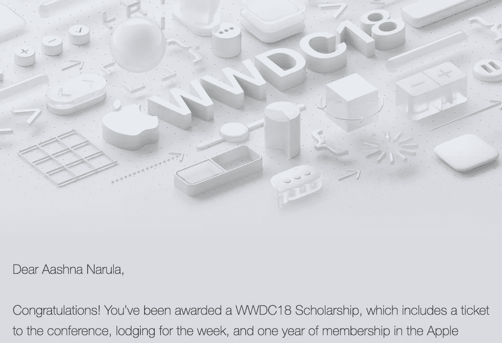
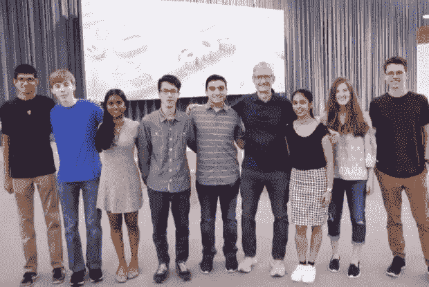
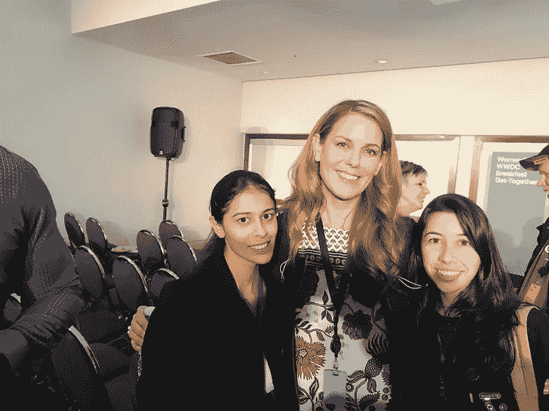
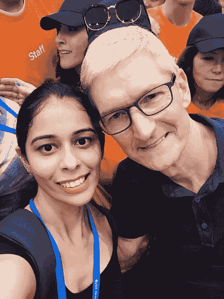
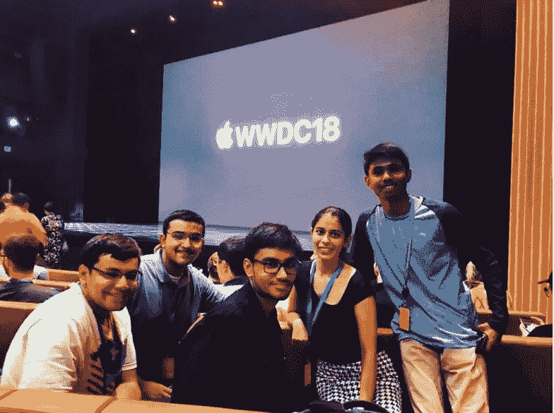
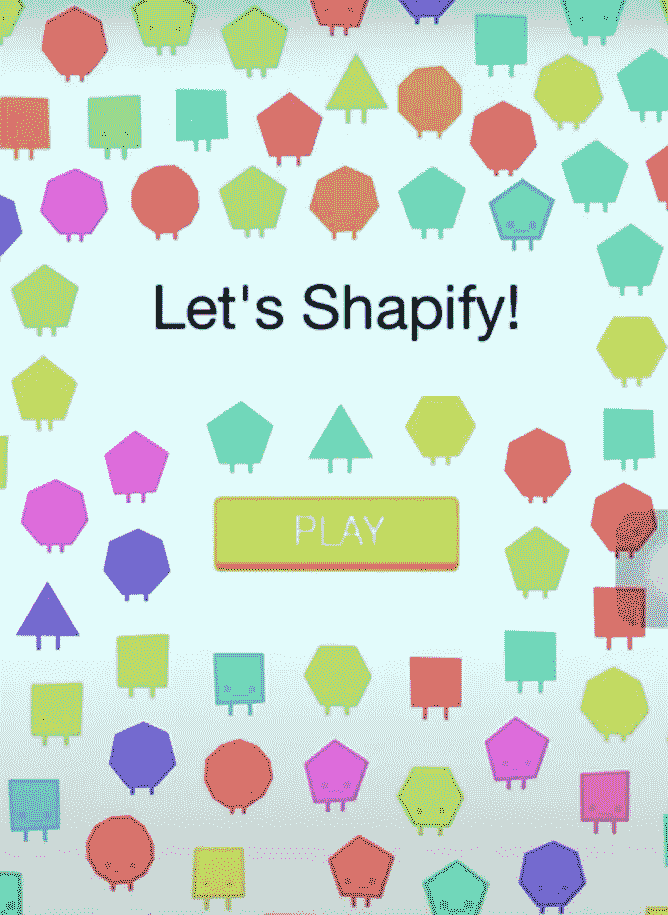
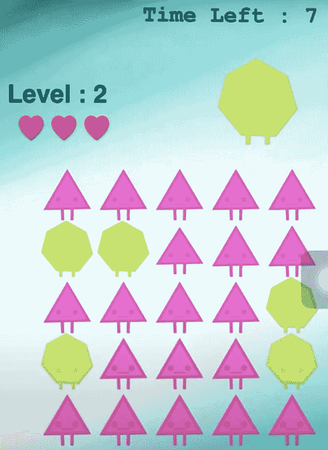
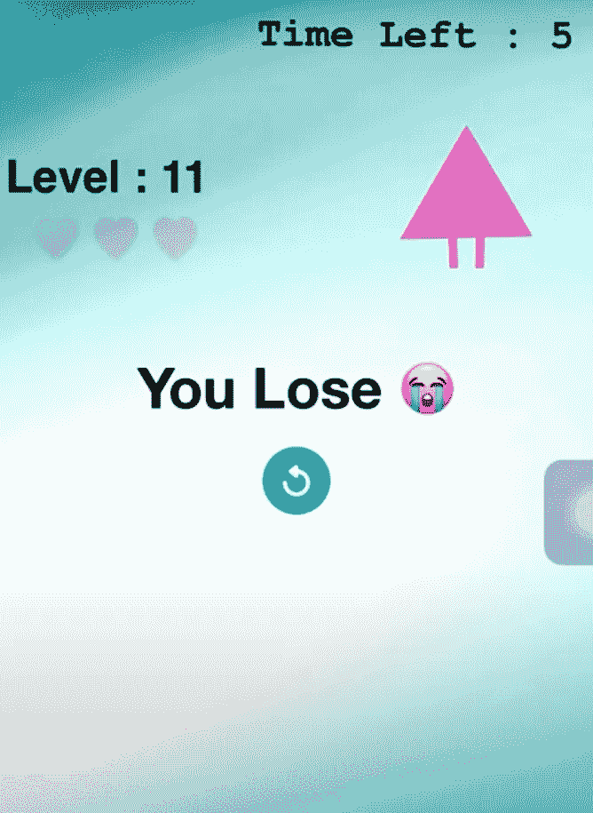
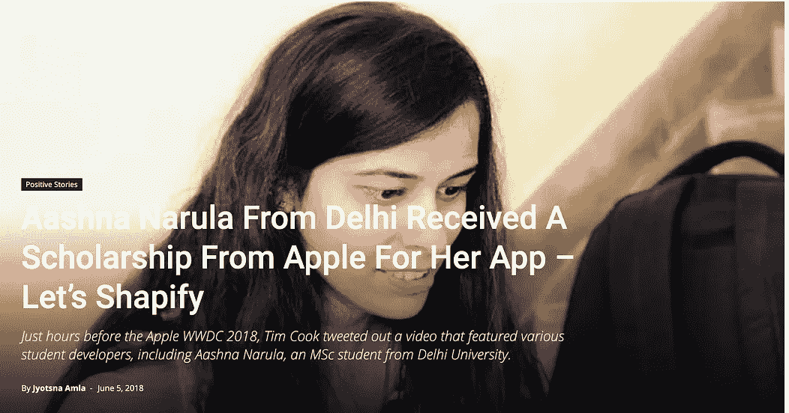
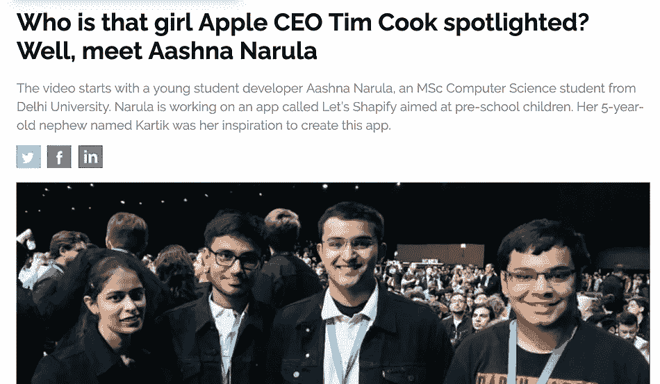

# 一生的经历…WWDC18 奖学金

> 原文：<https://blog.devgenius.io/an-experience-of-a-lifetime-wwdc18-scholarship-68370956d733?source=collection_archive---------19----------------------->

两年前，我收到一封来自苹果的邮件，主题是**“你获得了 WWDC18 奖学金”**。我欣喜若狂地阅读了邮件，因为这是我的第一次尝试，我被选中参加苹果最大的活动之一。我一点也不知道，这 7 天的经历将永远改变我的生活。

我不仅有机会现场见证了这一事件，还亲眼见到了**蒂姆·库克**。这就像一个梦想成真。我记得当我看到他站在我旁边和我谈论我的屈服时，我是多么紧张。

我不仅见到了蒂姆，还见到了这么多了不起的苹果工程师和我的最爱之一**埃丝特·海尔**。那一周我参加的最令人惊讶的会议之一是我和所有女性开发人员的晨会， **Women@WWDC** 。所有女性分享的故事是如此鼓舞人心，以至于我惊讶地看到女性是如何引领她们在当今技术领域的足迹的。此外，我们有幸参观了史蒂夫·乔布斯剧院。苹果团队在苹果公园为我们举办了一场盛大的欢迎会。

# 我的投稿:“让我们 Shapify”

作为 Swift 学生挑战赛的一部分，我提交了我的操场，**“让我们沙皮化”**。*让我们 Shapify* 最初是为我的侄子 Kartik 打造的，后来给我带来了无数的荣誉。像许多其他孩子一样，Kartik 也面临着无法区分相同和不同的问题。在学前班，他很难处理形状、颜色、字母和数字。但是，在不断地玩这个游戏之后，我们可以注意到 Kartik 的观察和分类技能有了显著的变化。不仅如此，他能很好地判断形状和颜色，而且他喜欢每次获胜时形状发出的声音。看到他脸上的笑容，真是锦上添花。

**Youtube:**[***https://youtu.be/INsfbSmFpyA***](https://youtu.be/INsfbSmFpyA)

但它不仅仅止于此。我和苹果团队进行了很多互动采访。他们让我们感到如此舒适和热情。他们的能量更上一层楼。现在，接下来发生的事情真的很大…我很幸运地成为新闻和技术页面的主角。

为此，我非常感谢印度和美国的苹果公关团队，感谢他们在我在 WWDC 的日子里突出了我。他们整个星期都非常支持我。它们是当时人们了解我的最大原因之一。毫无疑问，我可以说苹果公关团队在让我在 WWDC 的经历如此美妙的过程中发挥了重要作用。

# **我的 WWDC 外卖**

WWDC 奖学金为我铺平了道路，让我最终能够提升自己，拥有一份令我今天感到自豪的职业，并激励许多其他学生参与奖学金。当学生们在 LinkedIn 上给我发消息，告诉我我是他们选择参加奖学金的灵感来源时，感觉棒极了。我一直想成为某个人的灵感来源，某个崇拜我的人，老实说，这是激励不止一两个学生，而是这么多有创造力和才华的学生的最好方式。当我在毕业后的最后一个学期申请 WWDC 奖学金时，有人是我的灵感来源，今天，我感到很幸运能成为别人的灵感来源。

又到了一年中的这个时候……**主题演讲**。随着 **WWDC 2020** 的开始，我决定通过在媒体上以小文章的形式分享我的 Swift 知识来为社区做出一些贡献，因为我觉得通过分享知识，我能够以更好的方式学习和塑造自己。这将是真正伟大的建议和更正/评论。

***让我们一起学习吧！让我们一起学习吧！***