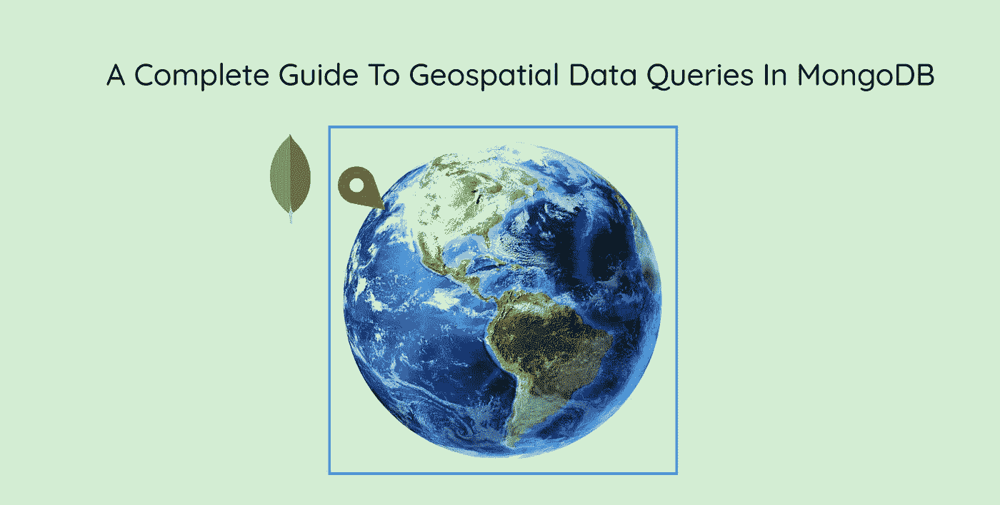
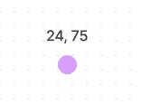
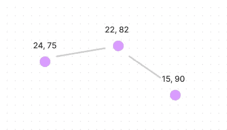
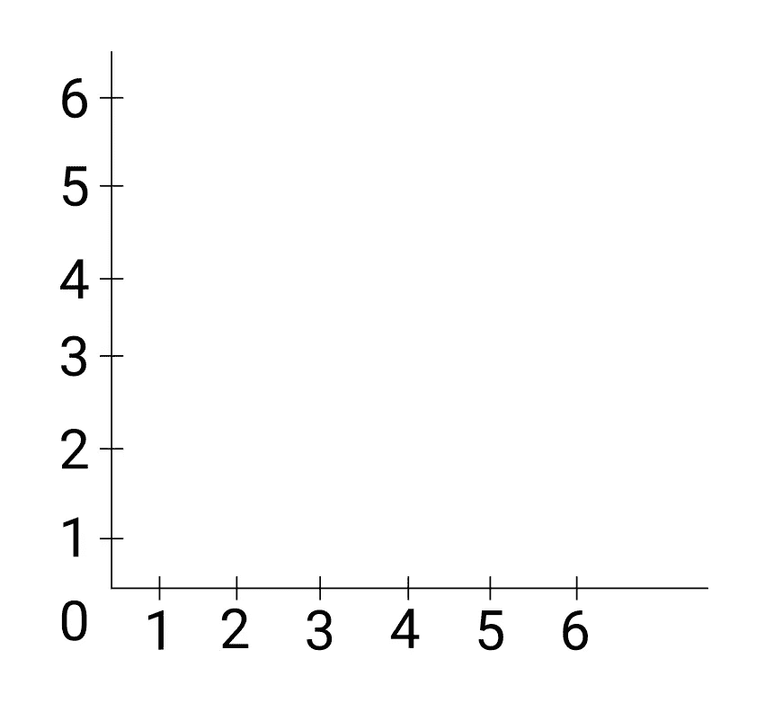
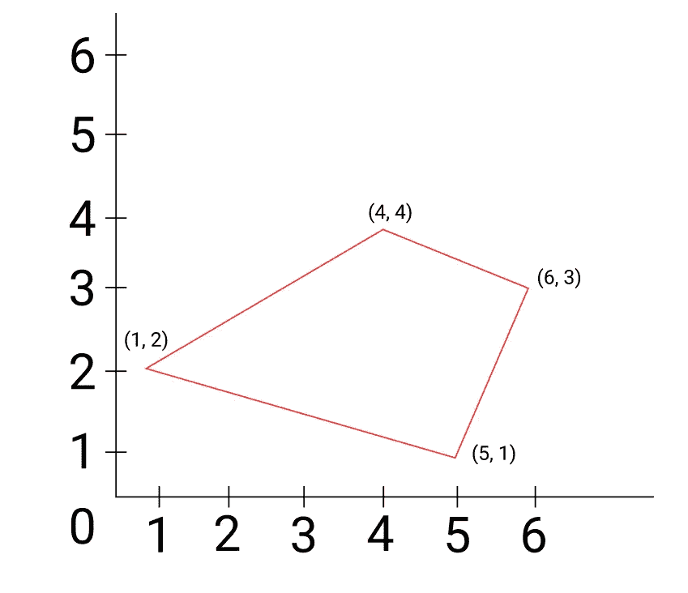
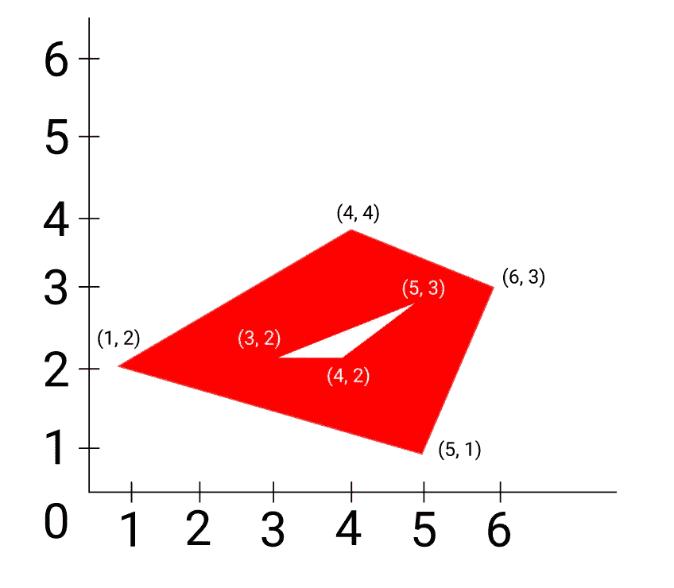

# 地理空间 MongoDB 数据沉浸式指南

> 原文：<https://blog.devgenius.io/an-immersive-guide-to-geospatial-mongodb-data-9ee3529aab9d?source=collection_archive---------4----------------------->



处理坐标可能是一个巨大的痛苦，所以为什么不采取简单的方法呢？与其在前端纠结坐标，不如把它推到后端，让 mongoDB 来做这项工作。今天，我们将看看如何在 mongoDB 或 mongoose 中处理地理空间数据。我们名单上的第一个是`GeoJSON`。

# 杰奥森

它有各种数据类型，使处理坐标变得容易。请记住，经度在纬度之前:

## 要点

所有类型中最简单的，它基本上是一个坐标，即经度和纬度:



```
// A point
{ type: "Point", coordinates: [ 40, 5 ] }
```

## 线串

这是一个坐标数组的数组，它们将被连接起来形成一条线。它基本上由一系列点组成。



```
// A linestring
{ type: "LineString", coordinates: [ [ 40, 5 ], [ 41, 6 ] ] }
```

## 多边形

是多边形，就是这样！正方形、长方形、六边形、十边形、四边形等等。这必须是一个封闭的数字(第一点必须与最后一点相同，我现在听起来像我的数学老师😅).

我们使用`LineString` s 绘制多边形的边。现在，为了更好地说明这一点，我将绘制一个非常非常简单的坐标网格(别担心，没什么复杂的)。



(我代表我糟糕的设计技巧为这个粗糙的网格道歉😅)

现在，让我们画一个简单的多边形:



下面是我们如何用代码来表示这一点:

```
{
  type : "Polygon",
  coordinates : [
     [ [ 1 , 2 ] , [ 4 , 4 ] , [ 6 , 3 ] , [ 5 , 1 ], [1, 2] ],
  ]
}
```

这里有一些需要注意的地方:

*   嵌套的数组有 3 层，我一会儿会再回到这个问题上
*   在图中，只有 4 个点，但是我们在代码中写了 5 个点。这是因为图中的第一个点和最后一个点重叠，所以看不到。为了使这成为一个封闭的数字和一个有效的`Polygon`，我们需要指定最后一个值与第一个值相同，以告诉 mongoDB 该数字已经结束。

正如我之前承诺的，我将解释嵌套数组的秘密:

*   第一个数组保存所有的环(我马上会解释这一点)。
*   第二个持有每个戒指

## 戒指

现在，什么是戒指？基本上就是多边形里面的一个洞。因此，该图形包含多边形之间的区域。这里有一个图表:



里面的白色三角形是一只`ring`。该图包含外部多边形内部但在白色区域外部的区域(包含红色阴影区域)。

此多边形的代码如下所示:

```
{
  type : "Polygon",
  coordinates : [
     [ [ 1 , 2 ] , [ 4 , 4 ] , [ 6 , 3 ] , [ 5 , 1 ], [1, 2] ],
     [ [ 3 , 2 ] , [ 5 , 3 ] , [ 4 , 2 ] , [ 3 , 2 ] ],
  ]
}
```

那是一堂很长的数学课(希望不会无聊)。让我们实际上研究一下这些类型，并了解更多的操作符。

# $几何

它保存我们的几何数据类型(例如:`Point`，`Polygon`)，并与其他操作符协同使用。

```
{
  $geometry: {
    type : "Polygon",
    coordinates : [
     [ [ 1 , 2 ] , [ 4 , 4 ] , [ 6 , 3 ] , [ 5 , 1 ], [1, 2] 
    ]
  }
}
```

# `$geoIntersects`

它检查文档中的坐标是否与提供的几何类型相交(不一定完全在里面)(必须是 2d 类型，即`Polygon`)。

```
Places.find(
   {
     location: {
       $geoIntersects: {
            $geometry: {
              type : "Polygon",
            coordinates : [
               [ 
                  [ 1 , 2 ] , [ 4 , 4 ] , [ 6 , 3 ] , [ 5 , 1 ], [1, 2] 
               ]
            ]
         }
       }
     }
   }
)
```

# $地理范围内

检查文件中的坐标是否完全在提供的`Polygon`(单/多圈)内。

```
Places.find(
   {
     location: {
       $geoWithin: {
            $geometry: {
              type : "Polygon",
            coordinates : [
               [ 
                  [ 1 , 2 ] , [ 4 , 4 ] , [ 6 , 3 ] , [ 5 , 1 ], [1, 2] 
               ]
            ]
         }
       }
     }
   }
)
```

如果你想做同样的事情，但在一个圆里(即在一个特定的坐标半径内)，我们使用`$center`。它接受一个有两个元素的数组。第一个是中心的坐标，第二个是半径。格式是`[[coordinateX, coordinateY], radius]`

```
Places.find(
  {
    location: { $geoWithin: { $center: [ [-74, 40.74], 10 ] }  
  }
);
```

# 附近的美元

获取与指定坐标有一定距离的所有文档，该坐标可以使用最小和最大长度进行控制。此外，它将从最近到最远的文件排序。

```
Places.find(
   {
     location:
       { $near :
          {
            $geometry: {
              type: "Point",
              coordinates: [ -68, 35 ] 
            },
          }
       }
   }
)
```

我们可以随意指定一个`$minDistance`和`$maxDistance`。

```
Places.find(
   {
     location:
       { $near :
          {
            $geometry: {
              type: "Point",
              coordinates: [ -68, 35 ],
              $minDistance: 500,
              $maxDistance: 2000
            },
          }
       }
   }
)
```

# 结论

你可能会想，这有什么用？嗯，假设我们的用户正在寻找他附近的餐馆，我们可以提供 10 英里半径内的所有餐馆。

感谢阅读到这里。如果你喜欢这篇文章，并且今天学到了一些东西，别忘了留下你的赞，在 medium 上关注我！此外，查看我的 [twitter](https://twitter.com/akashshyam11) ，在那里我为开发者发布了技巧、窍门和迷因。