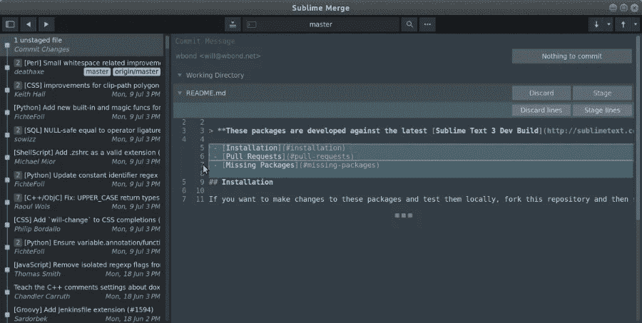
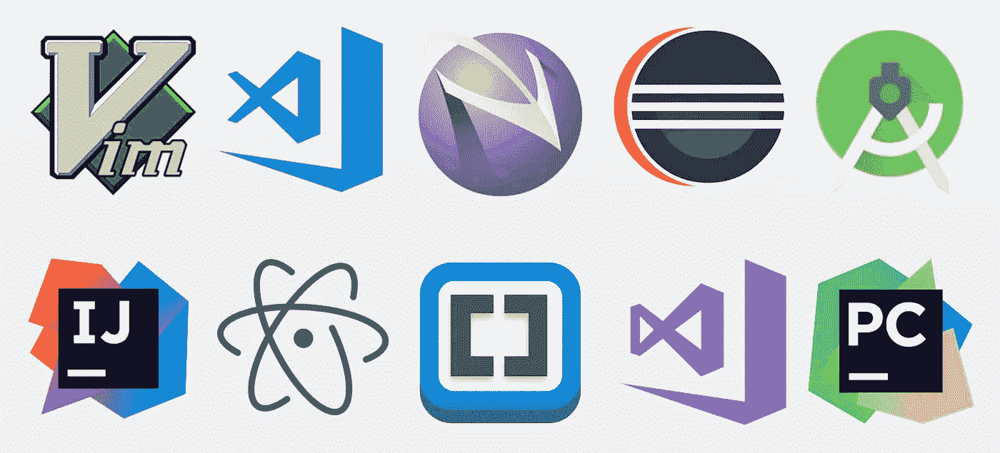

# 文本编辑器深度指南

> 原文：<https://blog.devgenius.io/an-in-depth-guide-to-text-editors-101eb6686de7?source=collection_archive---------14----------------------->

选择文本编辑器从未变得如此简单。

每个人使用不同的文本编辑器。每位教师都使用文本编辑器。但是，您可以使用另一个文本编辑器。以下是关于选择文本编辑器的细节。

作为一名开发人员，你使用哪种编程语言来开发你的程序？

不同的编程语言和不同的文本编辑器。但是，找到满足自己需求的文本编辑器的方法不止一种。不过，如果你同时用多种语言编程，这可能会很困难。所以，主要的问题是你使用哪种编程语言？为了使这一部分更清楚，我们可以一次为专门用于一种编程语言或多种语言的文本编辑器划分主题。

**如果你只用一种编程语言会怎么样？**

高度专业化的文本编辑器或 ide(集成开发环境)支持各种编程语言，因为它们没有任何语言特有的特性。

**专用 ide:**

特别是与 Python 和 R 一起使用。如果您有 Anaconda Navigator 的 Spyder、Jupyter 和用于数据科学和科学计算的 R Studio。现在，我们将深入研究开发人员通常使用的每个专门的 ide。

Spyder :面向初学者的用户友好文本编辑器。除 PyCharm 之外最好的文本编辑器，不用于大型项目。

**Jupyter** :一般用于导师给的 python 作业。有些仍然用于科学计算和各种练习。最强大的部分是这样一个事实，如果你是一名教师，向你的学生发送了一个文件，你必须有权访问学生的文件。你甚至可以检查他们的答案，而不会占用你的电脑太多空间。

PyCharm :最强大的 python IDE，因为它被用于所有 python 项目中。特别是用于巨大的 python 项目。如果你要进行计算。这是你需要的文本编辑器。坏处是；学习需要相当长的时间。

RStudio :一个只和 r 一起使用的文本编辑器。但是，它的功能更加强大，因为它已经被专门用于统计和数学分析。即使它已经被 R 使用过；它仍然可以打开用不同语言编码的某些文件扩展名。

**括号**:开发者不经常使用。仅用于 web 开发的 HTML、CSS 和 JavaScript。

**多语言 ide:**

当你在没有专门的文本编辑器的情况下使用一种编程语言或者同时使用多种语言时。在这一节中，我们将深入研究支持各种编程语言的通用文本编辑器。

Atom:以太坊开发者经常使用的最新文本编辑器之一。与其他文本编辑器相比，它的效率更低。然而，它是第一个不是由集中实体创建的 ide。

**VS 代码**:全球众多开发者使用的微软支持的文本编辑器。它提供了一个简单的设置，并在编程期间与终端一起使用。而且，它支持几乎所有的编程语言及其开源社区构建的扩展。但是，它不能进行特定的计算，你需要一个专门的 IDE 来确保所有的计算都是正确的。

**Eclipse**:Java 开发者常用。但是它很慢，需要很长时间来建立所有需要的软件开发环境。更重要的是，它消耗了大量的计算能力，却几乎没有任何优势。

你觉得 IDEs 怎么样？请在下面的评论区分享你的经历。