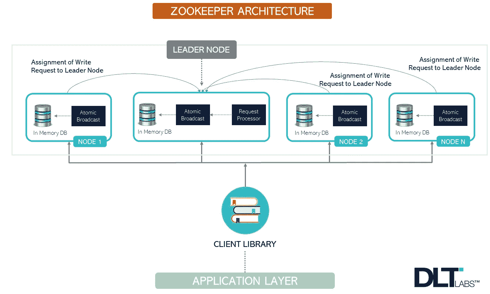
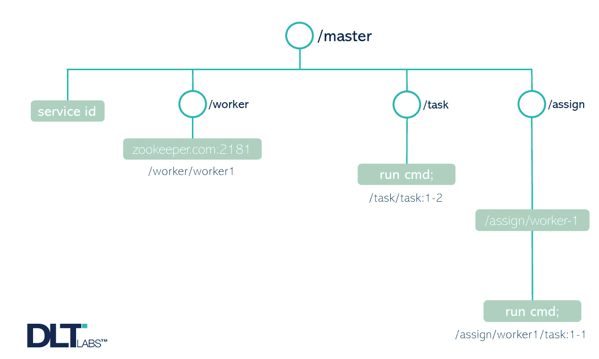

# 深入了解动物园管理员

> 原文：<https://blog.devgenius.io/an-in-depth-look-at-zookeeper-ced6d6695d79?source=collection_archive---------2----------------------->

以前，应用程序通常是在单台计算机上运行的单个程序。但是在今天的分布式系统世界中，一个应用程序是由运行在一堆计算机上的独立程序组成的。因此，协调这些多个独立的程序成为一个真正的挑战。

在阅读本文之前，熟悉以下概念很重要:

*   *聚类*
*   *集中系统*
*   *分布式系统*
*   *元数据*

(假设您知道上面提到的术语，让我们继续)

# 什么是动物园管理员？

让我们试着从逻辑上简化它:

*   ***动物园*** 是一个收藏动植物的机构
*   ***饲养员*** 是维护和照看某物的人，在这里指的是动物园

从本质上讲，一个动物园管理员以一种类似于多个独立项目的方式来管理各种各样的动植物。

从技术上讲，根据官方文档，ZooKeeper 是一个集中式的、开源的分布式应用程序协调服务。

它有助于同步和管理分布式系统的配置。

ZooKeeper 非常容易使用和编程。它公开了类似于标准文件系统的 API。

# 我们为什么需要动物园管理员？

ZooKeeper 处理独立程序之间的协调，让开发人员更专注于应用逻辑。我说的协调，是指:

*   *选举主人*
*   *管理群组成员资格*
*   *管理元数据*

例如，电子邮件服务的用户对他/她的邮箱内容感兴趣。但是这个用户对知道处理他或她的请求的幕后服务器级信息不感兴趣。

因此，分离应用数据和协调数据是必要的。

只给用户提供他们想要的，并封装其余的，这就是 ZooKeeper 的作用。在这种情况下，*应用数据*是*邮箱内容*，而*协调数据*是*邮箱到任何邮件服务器的映射*。Zookeeper 有助于实现后者。

> ZooKeeper 数据模型类似于标准的文件系统。这个数据模型由另一个时髦词组成—**“z nodes”。**

## ZooKeeper 服务器可以在两种模式下运行

**>独立模式**

*   在这种设置中，只有一台服务器。它不可复制。

**>法定人数模式**

*   名为 **ZooKeeper ensemble** 的服务器集群复制状态。他们一起服务于客户的要求。
*   只要大多数节点都在工作，动物园管理员群体就还活着。

# **构成 ZooKeeper 架构的 5 个组件**

在 ZooKeeper 中，除了领导者节点之外的所有节点都是追随者节点| [来源](http://www.dltlabs.com)

**1。领导者和追随者**

*   领导者被称为*主*节点
*   追随者被称为*工作者*节点

**2。请求处理器**

*   它在 leader 节点中处于活动状态，负责处理所有写请求。
*   处理完写请求后，它将更改广播给从节点，以便它们可以用这些更改更新状态。

**3。原子广播**

*   领导者和追随者节点都有这个组件。它负责将更改发送到其他节点。

**4。内存数据库**

*   它存储数据，是一个复制的数据库。
*   这里，每个节点都有自己的数据库。

**5。客户端**

*   它将 ZooKeeper 与请求连接起来，可以是分布式应用程序中的任何节点。
*   它向服务器发送一条消息，让它知道客户机还活着。
*   服务器向客户端确认。
*   如果客户端没有收到该服务器的确认，它会尝试连接另一台服务器。

## 关于 ZooKeeper 的架构，这里有 7 点需要记住(见图 1)

1.  我们的应用程序通过*客户端库*调用 ZooKeeper。客户端库与 zookeeper 服务器交互。
2.  ZooKeeper 服务中有两种类型的节点— *领导者节点*和*追随者节点*。
3.  **领导节点**负责**处理写请求**和**向所有从节点**广播结果。
4.  **跟随节点**负责**服务读取请求**
5.  在设置 Apache ZooKeeper 服务器时，我们没有将任何节点标记为领导者，它是内部选举的。
6.  除了领导者节点以外，所有节点都是追随者节点。
7.  如果现有领导者失败，追随者节点在选举新领导者时也起着重要作用。

# **ZooKeeper 的数据模型是什么？**

动物园管理员| [中的一个节点树来源](http://www.dltlabs.com)

ZooKeeper 数据模型类似于标准的文件系统。这个数据模型由另一个术语组成—**“z nodes”。**

**z 节点**又名数据节点，由以**/**开头的唯一绝对路径识别。一个 znode 可以存储高达 *1MB* 的数据。

ZooKeeper 不允许对 znode 进行部分读取或写入。znode 维护一个提供 Znode 元数据的 stat。

它包括:

1.  *版本号*(写在 znode 上的数据版本)
2.  *一个“ACL”*，访问控制列表的缩写(这是一种访问用于*读/写*操作的 znodes 的认证机制)
3.  *时间戳*
4.  *数据长度*

> 注意:如果缺少任何数据，它可能传达关于 znode 的重要信息。

例如，缺少“/master”z node 意味着没有选出主节点。

图 2 示出了 znode 树。根节点有四个子节点。
**其中三个节点下有其他节点:**

*   **/worker** znode 是 worker 的父 znode。在图 2 中，它构成了系统中的一个工作者(zookeeper.com:2181)。
*   **/task** znode 是所有已创建并等待工人执行的任务的父 znode。
*   **/assign** 代表所有代表任务分配的 znode 的父 znode。当父节点将任务分配给工人时，子节点被添加到**/分配**。

叶节点代表数据。

# 有哪些不同类型的锌电极？

## **1。持久节点—** 它们必须被明确删除。

即使数据的创建者不再是系统的一部分，也需要保留数据。

例如，即使当执行任务分配的主机崩溃时，也需要保留对工作者的任务分配。

## **2。短暂节点—** 这些节点保持活动状态，直到客户端连接活动。

像持久的 znodes 一样，这些也可以被显式删除。

因为例如主节点是短暂的。如果主节点在主节点崩溃时没有被删除，可能会导致 ZooKeeper ensemble 对其可用性的混淆。

## 3.**顺序节点—** 这些节点可以是*持久节点*或*短暂节点*。

对于顺序 znode，ZooKeeper 通过在原始名称后附加一个 10 位数的序列号来设置 znode 的路径。

> 例如对于*/任务/任务-****1000770000****，或者/任务/任务-* ***2000980001。***

# **在 ZooKeeper 中 sessions 是如何工作的？**

在 ZooKeeper ensemble 上执行任何请求之前，客户端与服务建立会话。当会话因任何原因结束时，在该会话期间创建的临时节点将被删除。

如果客户端没有从服务器获得确认，会话可能会被移动到不同的服务器，将会话移动到不同的服务器是由客户端库处理的。

如果客户端有一个打开的会话，请求的 *FIFO* 顺序保持不变。但是，如果单个客户端创建多个会话，那么 *FIFO* 顺序可能会保留，也可能不会保留。

# *动物园管理员*中的手表(通知)

手表就像**客户端设置的一次性**订阅。该订阅在以下情况下发送通知(技术上称为“事件”):

1.  对节点中的数据进行更新，
2.  对节点的存在进行更新
3.  如果有必要得到孩子的名单。

如果客户想要一个新的通知，它必须设置一个新的*手表。*

手表永远不会被错过，但如果客户端从服务器断开连接，手表将不会被接收。如果客户端重新连接，以前注册的手表可以重新注册并再次触发。

但是，有一种情况可能会遗漏一个监视:如果在客户端与服务器断开连接时创建并删除了 znode，那么为 znode 的“*存在设置的监视将会遗漏。*

> 手表的概念是透明的。来自 Zookeeper 的观察事件的顺序反映了 ZooKeeper 服务看到的更新的顺序。

# **是什么让 ZooKeeper 如此有效？**

1. ***可靠性***

2. ***原子性***

3. ***单系统映像*** —无论客户端连接到哪个服务器，都会看到相同的服务状态。

4. ***顺序一致性*** —来自客户端的请求将按照它们被请求的顺序被应用。

你现在一定已经意识到动物园管理员是一个很大的研究课题。因此，我决定把这个话题分成几个部分。在我即将发表的文章中，我将讨论 ZooKeeper 中的数据流和请求、领导者选举、ZooKeeper 公开的 API、ZooKeeper 配置、ZooKeeper 编程等等。

到那时再见。

好奇如何在 Docker 上搭建多节点 Kafka 集群？你可以在这里找到怎么做:

 [## 在 Docker 中运行多个 Kafka Brokers 和 ZooKeeper 服务

medium.com 的 DLT 实验室](https://medium.com/better-programming/kafka-docker-run-multiple-kafka-brokers-and-zookeeper-services-in-docker-3ab287056fd5) 

*作者——DLT 实验室的迪维娅·辛格*

**关于作者:**她是一名精通 Node.js、Javascript、Linux、R、Tableau 的软件开发人员。

