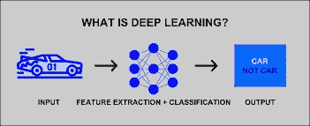
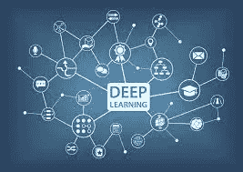

# 对深度学习的洞察

> 原文：<https://blog.devgenius.io/an-insight-into-deep-learning-750bc22a0048?source=collection_archive---------14----------------------->

**深度学习——意味着什么？**

[**深度学习**](https://machinelearningmastery.com/what-is-deep-learning/) 是人工智能的一个分类，它强调让 PC 准备好人们的基本冲动。
在深度学习中，PC 计算找出如何直接对复杂信息(如图片、文本或声音)执行排列任务。这些计算可以实现尖端的、最先进的精度，并且有时令人惊讶地实现令人难以置信的人类水平的执行。他们准备了大量的标记信息和神经组织结构，包括许多层。

**深度学习在现实生活用例中的集成**

[**虚拟助手**](https://prisma.ai/wireless-and-contactless-solutions.html) **:**

需要解释人类话语和语言的中心用途是深度学习。仆人助手的基本实例是 Cortana、Siri 和 Alexa。

**没有司机的自动汽车:**

要理解街道的情况、标志的作用、行人、各种标志的含义、速度限制和许多类似的情况，需要大量真实的信息。

有了大量的信息，计算的熟练程度将会提高，这将以这种方式增加动态流。

**客服使用** [**聊天机器人**](https://prisma.ai/prisma-solutions.html) **:**

聊天机器人不间断地与人联系，为客户提供管理，这需要可靠的反应。

为了以支持的方式对每一个有趣的询问做出反应，需要深度学习来准备计算。

**翻译:**

在众多方言中自然破译话语，需要深度学习管理。这对度假者、探险者和政府当局来说是一个有用的工具。

[面部识别](https://prisma.ai/products.html) **:**

面部识别有许多亮点，从用于安全到标记工具/包括它在脸书上的应用。

除了意义，它也有一些合理的问题。例如，感知体重增加、体重减轻、面部有毛发、没有面部毛发生长、新发型等的相似个体。

**购物和娱乐:**

所有的 [**网上购物应用**](https://snap2life.in/) 如亚马逊和 Myntra 和流媒体服务提供商如亚马逊 Prime 和网飞存储你的信息和购买倾向，以显示未来购买和观看的想法。

它通常以“你可能会抓住观看/购买的机会”为标题。在深度学习计算中输入的信息越多，它在实践中变得越有成效。

**药店:**

根据特定的基因组和疾病改变药物治疗。深度学习扩大了这种应用的范围，并获得了最大的药物组织的考虑。

除此之外，其他深度学习应用还有虚假陈述识别、虚拟确认、医疗服务、娱乐等等。

**为什么被称为“深度学习”而不仅仅是“** [**人工神经网络**](https://prisma.ai/core-algorithm.html) **”？**

深度学习是机器学习不可或缺的一部分，由各种算法组成，这些算法由大脑的功能和结构设计，称为人工神经网络。

深度学习计算试图滥用信息分布中的模糊设计来寻找伟大的描绘，通常在不同的级别，更高级别的学习亮点被表征为低级别亮点。

深度学习技术的目标是从由较低级别的亮点构成的更重要级别的命令中获取亮点链。自然地，不同审议程度的学习亮点允许框架学习复杂的能力，直接从信息规划对产出的贡献，而不完全依赖于人类创造的亮点。

**在结尾部分……**

本文简单扼要地总结了深度学习的概念及其在现实世界中的含义。日复一日，深度学习技术正在发展到如此程度，以至于产生了覆盖各种领域的各种各样的解决方案。事实上，计算机科学的这一分支还有很长的路要走，并且可以提供更多的东西。