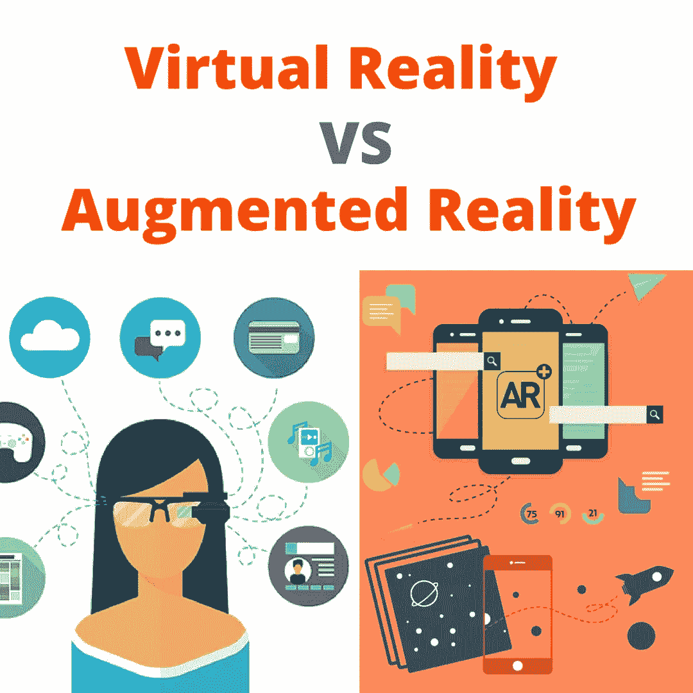
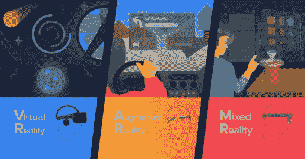

# 洞察现实:虚拟与增强

> 原文：<https://blog.devgenius.io/an-insight-to-reality-virtual-augmented-edf0a0240c63?source=collection_archive---------31----------------------->

曾经想过现实也可以是富有想象力的或者是你做的东西，主要是看到标题，让我们不要把自己和虚拟现实混淆。在虚拟现实(VR)中，用户对现实的感知完全基于虚拟信息，而在增强现实(AR)中，用户被提供了额外的计算机生成的信息，这些信息增强了他们对现实的感知。AR 是真实世界环境的交互式体验，其中驻留在现实中的对象通过计算机生成的感知信息得到增强，在 AR 的情况下，图形、声音和触摸反馈被添加到我们的自然世界中，以创建增强的用户体验。存在几个 AR 类别，每个类别在它们的目标和应用用例方面有不同的差异。让我们来探索一下制造增强现实(AR)的各种类型的技术。商业 AR 体验最初是在娱乐和游戏业务中引入的。随后，它们的应用跨越了教育、通信、医疗和娱乐等行业。在教育中，可以通过使用移动设备扫描或查看图像，或者通过使用无标记 AR 技术来访问内容。

虚拟现实(VR)传统上是一种孤独的体验。戴上耳机后，你通常会被孤立(即使你坐在一个群体中)，即使是多人体验也只能让两三个人分享同一个世界。但不一定要这样。一个虚拟的、三维的、计算机生成的环境，以一种让我们仿佛身临其境的方式呈现在我们的面前。现在，问题是为什么是虚拟现实？虚拟现实可以在影响我们日常生活的领域带来令人兴奋的新发现。每当在现实中做某事太危险、太昂贵或不切实际时，虚拟现实就是答案。随着虚拟现实成本的下降，它成为主流，我们可以期待更多的用途，如教育或生产力应用程序，来到前台。

*   基于标记的 AR:又名图像识别，它使用摄像机和某种类型的视觉标记，如 QR/2D 码，只有当标记被阅读器感应到时，才能产生结果。基于标记的应用程序使用设备上的摄像头来区分标记和任何其他真实世界对象。独特而简单的图案(如 QR 码)被用作标记。还计算位置和方向，然后将某种类型的内容和/或信息覆盖在市场上。
*   无标记增强现实:增强现实最广泛的应用之一，无标记又称基于位置、基于位置或 GPS。已知使用嵌入在设备中的 GPS、数字罗盘、速度计、加速度计来提供基于位置的数据。无标记 AR 背后的强大力量是智能手机的广泛可用性及其提供的位置检测功能。它最常用于绘制方向图、查找附近的企业和其他以位置为中心的移动应用程序。
*   基于投影的 AR:这些 AR 将人造光投射到真实世界的表面上。它们甚至允许通过将光发送到真实世界表面上，然后感应投影光的人类交互来进行人类交互。通过区分已知投影和改变的投影(由于用户的交互)来检测用户的交互。基于投影的 AR 的另一个有趣的应用利用激光等离子体技术将 3D 交互式全息图投影到半空中。
*   基于叠加的增强现实:在这种增强现实中，对象识别起着至关重要的作用，因为如果应用程序不能确定对象是什么，它就不能用增强视图替换原始视图。宜家 AR 家具目录就是一个例子。通过下载应用程序并扫描印刷或电子产品目录中的选定页面，用户可以在家中摆放虚拟宜家家具。

虚拟现实及其增强现实可能会改变我们与数字技术互动的方式，同时继续使我们的技术人性化。从独特的角度来看，Parallux 创造了允许 VR 头戴设备链接在一起的技术，但它也从头开始创造了像 Cave 这样的内容。虽然翠贝卡的观众人数将被限制在 16 人，但凯夫最初是为 30 人设计的。