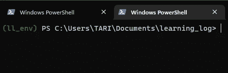

# Django 简介第 1 部分

> 原文：<https://blog.devgenius.io/an-intro-to-django-part-1-694c9663b54c?source=collection_archive---------11----------------------->

[费萨尔](https://unsplash.com/@faisaldada?utm_source=medium&utm_medium=referral)在 [Unsplash](https://unsplash.com?utm_source=medium&utm_medium=referral) 上的照片

用 Python 最流行的 web 框架来跳探戈吧

首先，姜戈是什么？这是一个 Python web 框架。好吧，那么什么是网络框架？web 框架是一套旨在帮助您构建交互式网站的工具。通过这 6 篇文章，你和我将建立我们的第一个网络应用程序，学习日志。这是一个为用户提供在线日志的网络应用程序，用户可以在日志中登录，就他们想要的任何主题进行记录，并获得任何其他好处。现在听起来可能不酷，但是记住这只是对 Django 的介绍。在后面的文章中会有更多的内容。

## 澄清项目规范

当你成为一名更好的开发人员，并开始构建越来越多的项目时，在项目开发的早期建立项目规范会让你走上正轨。这会帮助你避免分心，让你更快地达到目标。下面是我们将使用的规格:

> 我们将创建一个名为 Learning Log 的 web 应用程序，允许用户记录感兴趣的主题，并在他们了解每个主题时记录日志。学习日志主页将被更新，描述站点，并邀请用户注册或登录。当用户登录后，他或她可以创建新主题、添加新条目、阅读现有主题和编辑现有条目。

我们的应用可能没有解决任何现实世界的问题，但它使学习过程更加有效。怎么会？通过提供一个你可以追踪和重温你所学的地方。你可以用笔记本来做这件事，但我们的网络应用不会随着时间的推移而退化。

**建立虚拟环境**

对于我们的项目，我们将使用`virtualenv`。如果没有安装的话。打开您的终端(如命令提示符或 Powershell)并输入:

> `pip install --user virtualenv`

我们为什么要使用虚拟环境？因为通常大多数项目都需要具有不同依赖关系的库。例如，你的电脑上可能有一个需要 django 1.0 的项目，但是对于这个项目，我们需要 django 4.2(这只是一个例子😂).假设你升级了你的 django。下一次你试图运行项目 1 时，它不会工作。因此，为了避免所有这些麻烦，最好使用虚拟环境——Python 环境，这样安装在其中的 Python 解释器、库和脚本与安装在其他虚拟环境中的那些相隔离，并且(默认情况下)任何库安装在“系统”Python 中，即作为操作系统的一部分安装的 Python。如果你现在不理解这个概念，没关系，随着我们继续深入，我相信你会理解的。如果不是在[推特上 DM 我。](https://twitter.com/MyhnTari)

现在我们确信已经安装了`virtualenv`。转到你的文档或任何你想存储这个项目的地方，创建一个名为“learning_log”的目录。

接下来，打开你的终端。我将使用 Powershell。因为我喜欢感觉我有力量，叫我 snap 吧😝

但是严肃地说，使用`cd`命令进入你的 PC 上的 learning_log 目录。并使用以下代码激活虚拟环境:

> `python -m venv ll_env`

检查“learning_log”文件夹中名为 ll_env 的文件夹。如果它在那里，那么你做得很好，继续前进。接下来将这个输入到您的终端:

对于 Mac / Linux → `source ll_env/bin/activate`

对于 Windows:

1.  Powershell → `ll_env/Scripts/Activate`或`ll_env/Scripts/Activate.ps1`
2.  CMD → `ll_env/Scripts/activate`

您的虚拟环境现在应该被激活了，您应该会在您的终端上看到类似这样的内容。如果不是这样，我的 DMs 是开放的。

此时，您可以尝试运行`pip list`，您会发现您安装在 PC 上的大多数库在这个环境中都不可用。事情就是这样。在安装之前，这些库不会成为虚拟环境的一部分。

上面解释的一个图片例子。

**开始主项目**

现在，我们已经建立并运行了虚拟环境。是时候安装 django 了。我们就这样做

接下来，使用`django-admin`命令输入，我们将像这样开始我们的项目。

注意:上面的完整命令是`django-admin startproject learning_log .`不要忘记点“.”因为这样做会导致不必要的压力，所以请删除 learning_log/learning_log 文件夹，然后重新执行该命令。

现在，如果你在你的文件浏览器上检查你的 learning_log 文件夹，你会看到 Django 已经创建了一个名为 *learning_log* 的新目录以及一个 *manage.py* 文件——这是一个简短的程序，它接受命令并将它们发送到 Django 的适当部分来执行。

进一步检查发现，learning_log 文件夹包含 4 个文件，但只有三个文件是最重要的。它们是 *settings.py、urls.py 和 wsgi . py。**settings . py*规定 Django 如何与你的 PC 交互并管理你的项目。在这 6 篇文章中，我们将修改这些设置并添加一些我们自己的设置。文件 *urls.py* 指示 Django 生成哪些页面来响应浏览器请求。最后， *wsgi.py* — P.S wsgi 是 *web 服务器网关接口的首字母缩写，*第三重要的文件协助 Django 提供它生成的文件。

我们项目的下一阶段将是创建一个数据库，因为 Django 将项目的大部分信息存储在数据库中。因此，在我们的活动环境中，我们将输入以下内容。

上面是怎么回事？我们正在迁移数据库。这就是我们创建数据库时所发生的事情。数据库迁移就是将数据从一个或多个源平台移动到另一个目标数据库。对于这个项目，我们的源平台将是用户选择的浏览器，他们输入的内容将是我们的数据，最后，我们的目标数据库将是我们上面创建的内容。我们第一次使用 SQLite 运行上面的命令(稍后会详细介绍)，Django 为我们创建了一个新的数据库。上面我们看到 Django 报告说，它将准备数据库来存储处理管理和认证任务所需的信息。

对 *learning_log* 文件夹的检查显示 Django 创建了一个名为 db.sqlite3 的文件。

**附注:** SQLite 是一个运行单个文件的数据库。它非常适合创建简单的应用程序，因为您不必担心数据库管理。

# 结论→查看项目

为了结束第一篇文章，让我们确保 Django 已经很好地设置了项目。输入以下内容:

你的终端应该有点像我的。Django 应该检查项目是否设置得很好，然后报告正在使用的 Django 版本，最后启动一个服务器并报告提供 URL 的服务器。那就是 [http://127.0.0.1.8000/](http://127.0.0.1.8000/.) 。这表明该项目正在侦听您计算机上的端口 8000，该端口被称为本地主机。Localhost 指的是只在您的系统上处理请求的服务器；它不允许其他任何人看到您正在处理的页面。

打开网址 [http://localhost:8000/](http://localhost:8000/) 或 [http://127.0.0.1:8000/](http://127.0.0.1:8000/) 而不关闭你的终端(那是你的服务器你为什么要关闭它😂).您应该会看到类似下图的内容。如果你做了，那么你做得很好。如果您想停止服务器，只需在终端中键入 CTRL-C，然后按 enter 键。

您能发现我使用了 localhost:8001 而不是 localhost:8000 吗？那是因为我的 8000 端口上已经有东西在运行了。你可能也是。如果你的终端显示一个错误信息，告诉 Django 输入`python manage.py runserver 8001`使用另一个端口，然后继续增加数字，直到你找到一个开放的端口。下一篇文章再见。再见👋

照片由 [Shaah Shahidh](https://unsplash.com/@shaahshahidh?utm_source=medium&utm_medium=referral) 在 [Unsplash](https://unsplash.com?utm_source=medium&utm_medium=referral) 上拍摄

**哟，如果你有任何问题，请随时在**[**Twitter**](https://twitter.com/MyhnTari)**上问我，或者如果你需要认真的辅导，你可以在这里** 联系我

# **参考**

**[1。Eric Matthes 的“Python 速成班:基于项目的编程入门”](https://books.google.com.ng/books/about/Python_Crash_Course.html?id=RXoZCwAAQBAJ&source=kp_book_description&redir_esc=y)**