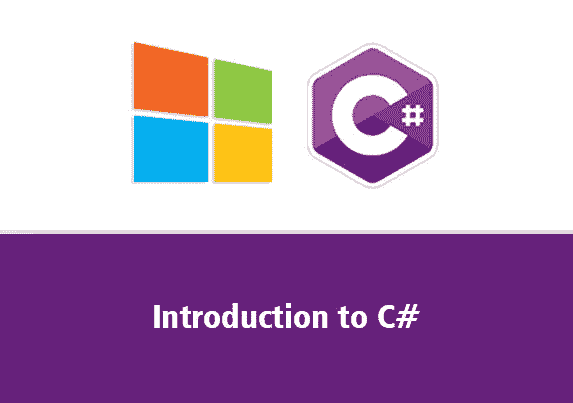

# c#和。Net 库。

> 原文：<https://blog.devgenius.io/an-introduction-to-c-and-the-net-library-a893246759?source=collection_archive---------19----------------------->

# 什么是 C#，为什么是 c#？

C#是一种通用的、面向对象的语言，由微软公司开发。它运行并安装在。Net 框架。你可能会问我为什么要学 c#？答案是:它是一种广泛使用的开发语言，用于开发 web 应用程序、桌面应用程序、移动应用程序、后端服务、游戏开发、区块链和分布式账本技术、人工智能和机器学习、物联网、云应用程序、互操作性软件，如 SQL、SharePoint 等..

现在让我们详细看看 C#

这是 C#环境中头文件的样子，仔细看看它，因为我将要详细解释它。

使用系统；

命名空间 HelloWorld

{

班级计划

{

静态 void Main(string[] args)

{

控制台。WriteLine("Hello World！");

}

}

}

**第 1 行:**使用 System 意味着我们可以使用 System 命名空间中的类。

**第二行:**空行。C#忽略空白。然而，多行代码使代码更具可读性。

**第 3 行:**命名空间用来组织你的代码，它是类和其他命名空间的容器。

第 4 行:花括号{}标记了代码块的开始和结束。

**第 5 行:**类是数据和方法的容器，为你的程序带来功能。C#中运行的每一行代码都必须在一个类中。在我们的例子中，我们将这个类命名为 Program。

**第 7 行:**主方法；花括号{}内的任何代码都将被执行。

**第 9 行:** Console 是 System 命名空间的一个类，它有一个 WriteLine()方法，用来输出/打印文本。

**注意:**如果您省略了 using System 行，您将不得不编写 System。打印/输出文本。此外，C#中的每条语句都以；。

# **变量:**

变量是我们存储数据的实体

**Integers:** integer 数据类型是 int 的缩写，是 1、2、3 等整数..

**浮点:**浮点数据类型是十进制类型的数字。

**字符串:**字符串数据类型是字符的组合。

**Char:** char 数据类型为单字符。

**布尔:**布尔数据类型可以是真也可以是假。

**初始化和声明变量:**

为了创建和初始化一个变量，你必须从指定数据类型开始，并给它赋值

示例:

string name = "数据类型"；

int number = 20

浮点小数= 0.1；

char letter = " q

bool isTrue = true

注意:如果你希望某些变量保持不变，你可以添加 const。

示例:

const int number = 1；

显示和获取用户输入:

为了在 c#控制台中显示屏幕。使用了 WriteLine()。

示例:

string displayName = "Hello World

控制台。WriteLine(显示名称)

若要写入屏幕，请使用

控制台。WriteLine(name)方法。

示例:

string name = "输入名称"；

控制台。WriteLine(名称)；

**算术运算符:**

算术运算符用于执行数学运算，让我们看看下表:

**赋值运算符:**

赋值运算符用于给变量赋值。让我们看看下表:

**逻辑运算符:**

逻辑运算符用于确定变量或值之间的逻辑。让我们看看下表:

**休息:**

break 语句用于跳出循环或 switch 语句。

命名空间 HelloWorld

{

班级计划

{

静态 void Main(string[] args)

{

for(int I = 0；我< 10; i++)

{

if (i == 4)

{

break;

}

Console.WriteLine(i);

}}

}}

**继续:**

continue 语句用于在出现指定条件时中断循环中的一次迭代，然后继续循环中的下一次迭代。

sing 系统；

命名空间 HelloWorld

{

班级计划

{

静态 void Main(string[] args)

{

int I = 0；

while (i < 10)

{

Console.WriteLine(i);

i++;

if (i == 4)

{

break;

}}

}}}

**开关语句:**

switch 语句用于从几个要执行的代码块中选择一个。

语法:

开关(表达式)

{

案例 a:

//代码块

打破；

案例 b:

//代码块

打破；

默认值:

//代码块

打破；

}

**循环:**

C#中的循环用于重复某个代码语句，直到满足某个条件。让我们看看 c#中的一些循环类型:

**While 循环:**

while 循环遍历一个代码块，直到条件保持为真。

语法:

while(条件)

{

//代码条件

}

示例:

int a = 6；

当(a > 1)时

{控制台。WriteLine("while 循环")；

a++；

}

**For 循环:**

当您知道要在一个代码块中循环多少次时，最好使用 for 循环。

语法:

for(语句 1；声明 2；报表 3)

{

情况

}

示例:

for(int a = 0；一个< 5; a ++)

{

Console.WriteLine(“for loop”); }

**数组:**

数组用于在单个变量中存储同一数据类型的多个值。

语法:

String[]名称；

//上面的数组声明包含字符串。为了在其中输入值，我们这样做:

String[] names = {"James "，" Dan "，" Chris " }；

为了访问数组中的元素，我们使用数组中每个值的索引号。

控制台。WriteLine(names[0])；

输出:詹姆斯。

。有这么多的数组函数，随着我们的继续，我将介绍它们。

# 方法:

C#中的方法允许我们创建一个可以在程序的任何部分重用的代码块。这使我们能够消除重复代码，使我们的代码更短、更干净，帮助我们避免并轻松发现错误/进行更正，计算机处理器也很欣赏这一点，因为我们通过更快的加载时间帮助他们减少工作量。

若要在 c#中创建方法，请执行以下操作:

将光标移至课程程序方括号之外。

首先调用“私有静态 void 函数”,然后是你想调用的方法名和两个像“()”这样的花括号。

完成上述操作后，像这样打开两个方括号“{}”，并开始在中间键入代码。

为了运行你的方法，回到方括号内的“class program ”,输入你的函数名和“()”。

下面是一个方法的实例，该方法尊重一个字符串。

使用系统；

使用系统。线程。任务；

命名空间简单方法

{

班级计划

{

静态 void Main(string[] args)

{

reverse string()；

控制台。ReadLine()；

}

私有静态 void ReverseString()

{

string message = " Hello World

char[] messageArray = message。ToCharArray()；

数组。reverse(message array)；

foreach(message array 中的 char 项)

{

控制台。WriteLine(项目)；

}}

}}

**让我们创建一个接受多个参数的方法**

。**涉及步骤:**

1.  创建方法并指定方法类型。
2.  在函数大括号内传入数据类型。
3.  现在在新的一行上打开和关闭你的函数花括号，在花括号之间，输入你的代码语句和条件。
4.  完成上述步骤后，转到 static void main()部分，键入带有弯括号的函数名，并在括号内键入您在步骤 2 中创建的数据类型的参数。
5.  回到你的功能块，把你的变量打印到屏幕上。

使用系统；

命名空间 new_cs

{

班级计划

{

静态 void Main(string[] args)

{

控制台。WriteLine("Hello World！");

SayHi(“迈克”，40)；

赛希(《汤姆》，80)；

}

静态 void SayHi(字符串名称，整数)

{

控制台。WriteLine("hello" + ' ' + name + ' ' +"你是"+ ' ' + age + ' ' +"岁")；

}}}

**方法重载:**

方法重载允许我们在程序中给几个方法相同的名字，但是有不同的参数和数据类型。

示例:

int MyMethod(int x)

float MyMethod(float x)

double MyMethod(双 x，双 y)

继续，您可以将几个方法重载到一个单独的

方法，使用“PlusMethod”。这里有一个例子:

使用系统；

命名空间 MyApplication

{

班级计划

{

static int PlusMethodInt(int x，int y)

{

返回 x+y；

}

静态 double PlusMethodDouble(双 x，双 y)

{

返回 x+y；

}

静态 void Main(string[] args)

{

int myNum1 = PlusMethodInt(8，5)；

double mynum 2 = PlusMethodDouble(4.3，6.26)；

控制台。WriteLine(" Int:"+mynum 1)；

控制台。WriteLine(" Double:"+mynum 2)；

}

}

}

**让我们创建一个接受多个参数或一个参数并返回值的方法。**

1.  创建方法并指定方法类型，例如:int 或 string。
2.  在函数大括号内传入数据类型。
3.  现在在新的一行上打开和关闭你的函数花括号，在花括号之间，输入你的代码语句和条件。
4.  完成上述步骤后，转到 static void main()部分，键入带有弯括号的函数名，并在括号内键入您在步骤 2 中创建的数据类型的参数。
5.  在要将其值返回到屏幕的变量旁边使用 return 关键字。

使用系统；

命名空间 new_cs

{

班级计划

{

静态 void Main(string[] args)

{

int cubed num = cube(5)；

控制台。WriteLine(cubed num)；

}

静态 int cube(int num)

{

int result = num * num * num

返回结果；

}

}

}

**这是我在这一集中讲述的几件事的组合，继续解码，找出它是否有任何错误，在你希望的地方更新和修改，玩得开心些:)**

使用系统；

命名空间 new_cs

{

班级计划

{

静态 void Main(string[] args)

{

bool isMale = true

bool isTall = false

if(isMale && isTall)

{

控制台。WriteLine(“你是高个男”)；

控制台。ReadLine()；

}

else if(isMale &&！isTall)

{

控制台。WriteLine(“你是个矮个子男”)；

}

else if(！isMale && isTall)

{

控制台。WriteLine(“你不是男的”)；

}

else if(isMale ||！isTall)

{

控制台。WriteLine(“你是男的”)；

}

其他

{

控制台。WriteLine(“你不是男的，也不高”)；}

}}}

结论:这只是第一集，是对 C#的介绍。其他剧集也会跟进，我会在制作过程中涉及更多实际的话题。我的目标仍然是传递在开发领域高度分类的实用知识和技能。所以在我们前进的时候跟着我