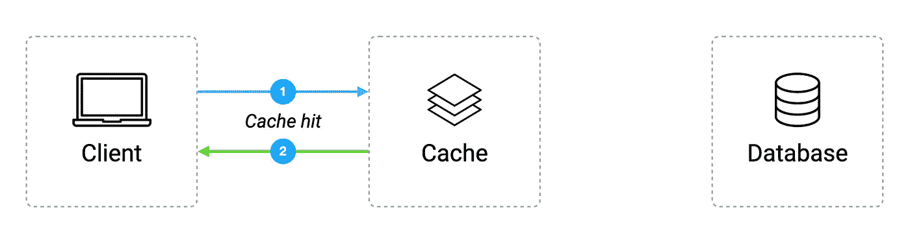
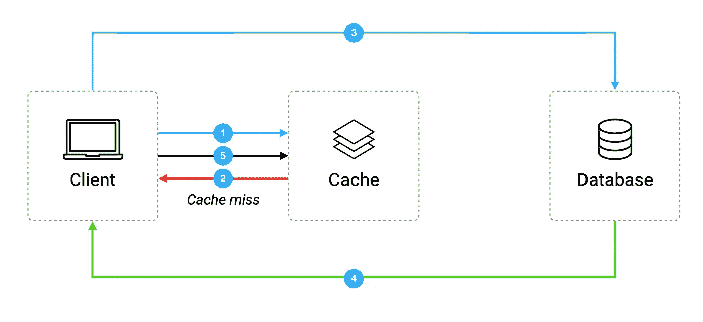
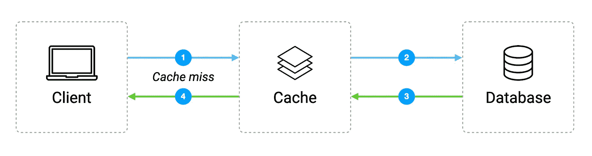
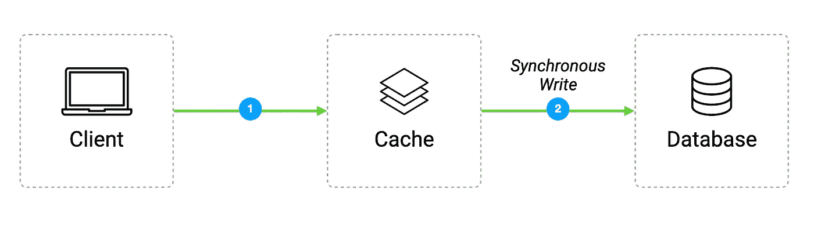

# 缓存模式介绍

> 原文：<https://blog.devgenius.io/an-introduction-to-caching-patterns-839111a4a150?source=collection_archive---------6----------------------->

🚀 [**打造分层微服务**](https://learnbackend.dev/books/build-layered-microservices) 这本书出来了！现在就在 [learnbackend.dev](https://learnbackend.dev/books/build-layered-microservices) 购买你自己的副本。

一个**缓存**是一个软件组件，它存储一个瞬态数据的子集，以便将来对该数据的请求可以得到更快的服务。

简而言之，它可以被认为是一个高速数据存储层，其主要目的是通过减少访问永久存储器或不必要地重新计算数据的需求来提高应用程序的性能。

其理念是，每当处理一个新请求时，该请求的结果都会存储在高速缓存中，以便在同一请求再次运行时可以检索和重用，这最终有助于减少网络开销、CPU 使用量以及总体基础架构成本。

# 缓存模式

## 备用缓存

缓存备用模式是指应用程序第一次从缓存中请求数据的时候。

如果数据存在于缓存中，则直接发送回应用程序，这一事件称为**缓存命中。**

相反，如果数据丢失，该事件被称为**缓存未命中**，应用程序将向数据库发送另一个请求，并将其写入缓存，以便下次可以再次从缓存中检索数据。

## 通读(延迟加载)

通读或延迟加载模式非常相似，不同之处在于，当发生缓存未命中时，不是应用程序而是缓存本身从数据库中提取数据，并在将数据发送回应用程序之前存储数据。

## 直写

在直写模式的情况下，当应用程序发送要存储的数据时，缓存会捕获数据并将其同步写入内存和数据库。

这种模式通常在没有频繁写入的情况下使用，对于数据恢复和一致性非常有帮助，但会带来延迟，因为我们必须写入两个不同的位置。

## 写在后面

最后，写后缓存模式采用了与直写模式类似的方法，只是对主数据库的写入是异步完成的。

但是由于存储在缓存中的数据是不稳定的，如果缓存关闭，显然会有数据丢失的风险。

但幸运的是，一些先进的缓存解决方案，如 Redis，现在提供了一个故障保险来减少数据丢失。

# 缓存挑战

尽管缓存是提高系统性能的一种相当简单的方法，就像任何软件解决方案一样，但在实现这种机制时，仍有一些相关的挑战需要认真解决。

## 选择要缓存的数据

首先要注意的是内存管理。

事实上，RAM 空间通常非常有限，如果在同一台机器上运行的多个应用程序之间共享，甚至会更有限，我们真的需要注意不要让大数据太快填满缓存，这自然会导致确定将哪些数据放入缓存。

原则上，缓存应该始终准备好存储经常需要的数据，这些数据需要花费大量时间来生成或检索，但不幸的是，识别这些数据不是一项简单的任务，将需要几轮开发，直到找到正确的值来存储。

## 维护数据一致性

第二个挑战是根据我们能够容忍的向用户提供潜在陈旧数据的时间来定义数据应该缓存多长时间，因为实际上，拥有相同数据的两个副本最终会导致它们随着时间的推移而出现差异。

因此，我们必须定义最佳的缓存更新或失效机制，以避免由于将损坏或过时的信息存储到数据库中而使系统失去平衡。

## 处理缓存未命中

最后，第三个挑战是保持较低的缓存未命中，因为请求缓存中不可用的数据会增加不必要的请求往返，从而引入延迟，这在不使用缓存的系统中是不会发生的。

因此，为了充分受益于缓存速度的提高，与缓存命中相比，缓存未命中必须保持尽可能低的水平。

# 下一步是什么？

不要忘记👏🏻x50 如果你喜欢读我的作品！

👉你喜欢这种内容？在 [https://learnbackend.dev](https://learnbackend.dev/) 查看《如何使用 Express framework 构建生产就绪的分层认证微服务》一书 [**构建分层微服务**](https://learnbackend.dev/books/build-layered-microservices) ，该书从第一行代码到最后一行文档都符合开发实践和软件架构方面的行业标准。