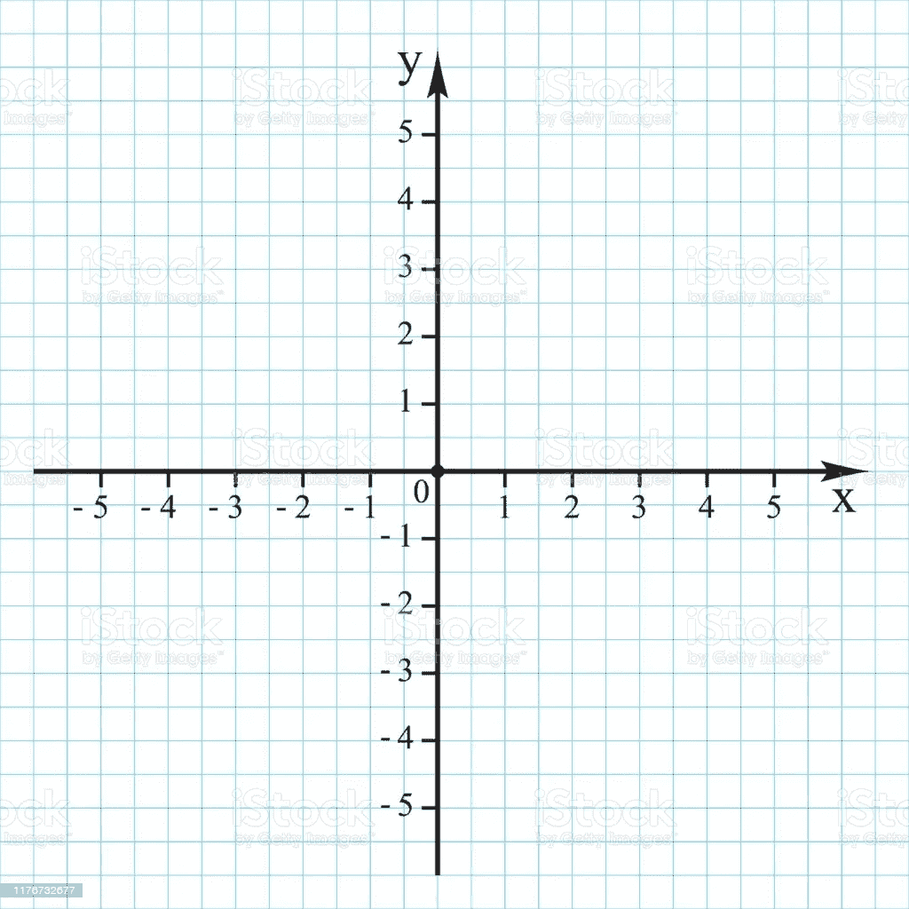
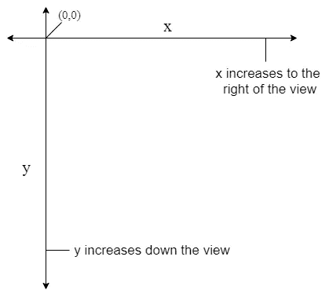
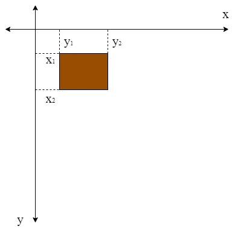
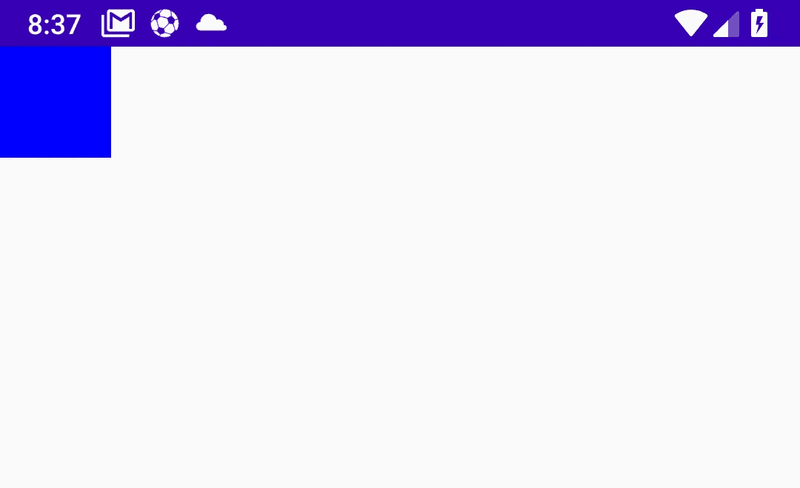
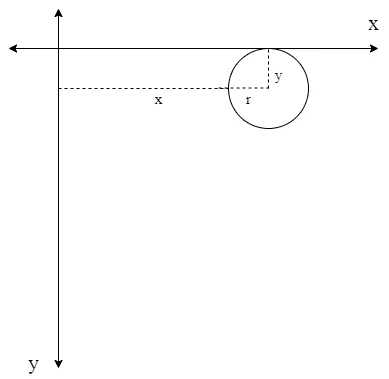
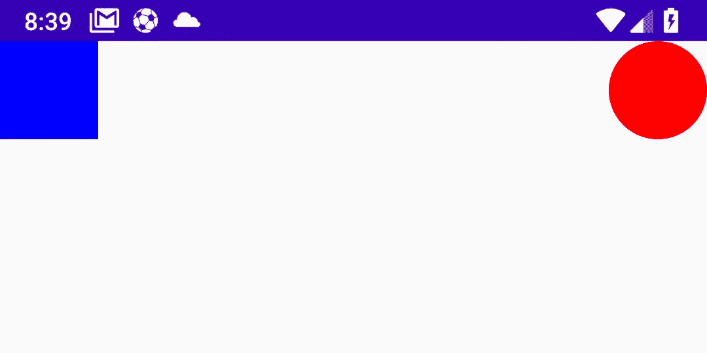

# Android 自定义视图介绍—第 1 部分

> 原文：<https://blog.devgenius.io/an-introduction-to-custom-views-on-android-part-1-4972a10fb133?source=collection_archive---------8----------------------->

图片来源:斯蒂夫·约翰森 Pexels

当构建 android 应用程序时，我们使用 Android UI 框架提供给我们的视图，无论是显示存储在本地数据库中的文本的`TextView`还是显示通过网络加载的图像的`ImageView`。这些视图迎合了我们的基本需求，令人惊叹的 android 应用程序利用这些预先存在的视图来提供出色的体验。材料设计库也为 Android 设计生态系统带来了统一感，世界各地的设计师和工程师都在遵循当今构建应用程序的既定准则。

但是，我们可能想要建立一些不同的东西，一些 Android 没有提供的东西。设计规范各不相同，android 工程师有时会发现自己陷入困境，想出一个“特殊”的观点是唯一的出路。在这种情况下，我们看到了自定义视图，这是一种可扩展的方法，提供了一种将自定义逻辑和设计定义到视图中的方法。

## 但是什么是自定义视图呢？，真的。

> 定制视图是对现有的**视图**或**视图组**实现的子类化，以提供对元素外观和功能的绝对控制。

可以通过两种方式创建自定义视图，这两种方式是:

1.  **扩展视图:**我们通过扩展现有的视图(如 TextView、EditText e.t.c)来创建这些视图，并为其提供自定义实现，定义我们的自定义逻辑。如果我们想从头创建一个视图，而不依赖于现成视图的特性，我们也可以扩展基本视图类。
2.  **扩展视图组:**这有点不同，因为它需要创建一个视图组的自定义实现，例如 ConstraintLayout、LinearLayout 等。通常，当所需的视图不需要从头开始构建，但可以通过隔离同一视图组下的不同视图(具有密切相关的功能)来获得时，会使用这种方法。这被称为**复合组件**。它们建立在现有视图组的基础上。如果您对此感兴趣，或者想了解更多关于**复合元件**的信息，可以查看[我的复合元件系列](https://medium.com/android-dev-hacks/a-kotlin-based-introduction-to-compound-components-on-android-part-1-2d28323b9ef9)，希望对您有用。

## 但是我们将会看到一个视图的扩展，以及自定义视图在这里是如何工作的。我们走吧！。

## 自定义视图的工作方式。

现在，我可能过度强调了视图的“扩展”(最后一次，我保证)。创建自定义视图时，有两个非常重要的过程，即:

1.  图画
2.  测量

绘制我们的视图需要将形状、文本、图像(或任何你能想到的东西)映射到屏幕上，这基本上是你想要创建的东西的绘图。

测量我们的视图与尺寸有关，并决定在不同的屏幕条件(大小、密度等)下显示视图的正确部分。这是在屏幕上正确呈现我们的视图，并确保在“不寻常”的情况下不会变得一塌糊涂的过程。

## 在这篇文章中，我们倾向于绘画方面。

# 绘制自定义视图

绘制自定义视图时，需要理解三个重要概念，即:

1.  **画什么** —形状、文本、图像等等
2.  **在哪里画** —画布类。
3.  **怎么画** —画类。

## 了解 Android 画布

想象一下，给你一块巨大的、没有杂质的白色石板，并让你用它做任何事情。你的第一个想法(如果你和我一样的话)会是理解石板的结构，然后在石板上尝试不同的物体，看看什么有用(或者没用)。你(实际上是我)可能会用一支钢笔、一支铅笔、一支记号笔——无论什么。android 画布就是这样。我们的视图类给我们的一个区域，我们可以随意绘制。想象一个巨大的白色艺术板。

## 那么我的画布有多大？和景色一样大。

## 绘画课

上面提到的 Paint 类指定了“如何绘制”。这个类允许我们定义希望绘制的元素采用的样式。它的用途范围很广，从简单的绘制矩形/圆形轮廓、向文本添加格式(倾斜、缩放)到更复杂的样式，如使用混合模式组合两幅图像以提供合成效果。所有这些以及更多的都可以使用 Paint 类来实现。再一次，想象这是你的画笔——你要在你的画板上使用的画笔。

## 在 Android 画布上绘画

在我们研究在 android 画布上绘图之前，让我们创建第一个自定义视图。继续创建一个名为`MyFirstCustomView.kt` 的新 Kotlin 文件。这个文件将包含我们的自定义视图定义和业务逻辑。

创建扩展视图类的类的代码。

首先，视图类有许多需要在子类(MyFirstCustomView)中实现的构造函数，让我们快速看一下这些构造函数。

视图类中存在的构造函数定义。

视图类(如上所示)有四个对象构造器，每个构造器都可以根据对象实例化的条件调用。在我们的例子中，我们必须在视图子类中提供构造函数定义，方法是创建二级构造函数并将调用连接到超类，如下面的代码片段所示👇🏾

MyFirstCustomView 类显示视图构造函数重载。

好吧，这解决了我们的问题(这并不完全是一个问题)，但是如果你像我一样是 Kotlin 的粉丝，你可能总是想把这样的实现做得更好。好消息是:**我们可以**。更类似 Kotlin 的方法是在构造函数定义中使用命名和默认参数。让我们更仔细地看看这个。

## @JvmOverloads 批注

当添加到构造函数定义中时，该注释指示 transpiler (to Java)提供构造函数定义的重载。我们首先为 MyFirstCustomView 类创建一个辅助构造函数。

使用@JvmOverloads 注释来减少我们编写的构造函数的数量。

这里，我们创建了一个构造函数，所有参数都被传入(同时传入超类)，但是除了`ctx`对象之外，所有参数都使用默认值。这是因为它是在实例化过程中唯一一个**必须**传入的对象——而不是我们自己负责实例化。等等，这段代码要被转换成 Java，而 Java(据我所知)不知道如何处理默认参数——这就是为什么我们有了`@JvmOverloads`注释，帮助我们在最终的 Java 源代码中创建已定义构造函数的重载。

添加注释后，我们的最终代码是:

现在我们已经建立了我们的第一个自定义视图类，我们如何绘制呢？我们通过覆盖视图类提供给我们的`onDraw`方法来做到这一点。其签名声明如下👇🏾

onDraw 方法定义

View 类提供的`onDraw`方法是我们**绘制自定义视图的地方。一个可空的`Canvas`对象被传入，如果你还记得的话，`Canvas`类是我们巨大的画板，在这里我们可以绘制大量的元素。我们在`Canvas`类中有一些方法可以帮助绘制矩形— `drawRect`、圆形— `drawCircle`、路径— `drawPath`等等。不言而喻，这个方法是许多绘图调用的宿主，这些调用最终往往是内存密集型的，因此在这个方法中声明和/或实例化对象并不是一个好主意，以避免降低性能。因此，所有对象实例化都将在该方法之外完成。**

**这似乎是在屏幕上绘制我们的第一个元素的好时机，但是我们还需要理解**画布** **坐标系统**，它将在我们的开发中大量使用。**

## **画布坐标系统**

**回到高中，我们学习了笛卡尔平面，它使用 **X(水平)**和 **Y(垂直)**轴来表示平面的不同方向。**

****

**笛卡尔平面**

## ****看着眼熟？****

**现在我已经重新点燃了一些高中的记忆，我们需要明白画布坐标系仍然使用 X 轴和 Y 轴，但不是以如上所示的方式。下图更加清晰。**

****

**画布坐标系统**

**上图显示了 X 和 Y 轴在 android 画布上的移动。这表明视图的左上部分是画布的原点(0，0)。X 轴向右增加，Y 轴沿视图向下增加。**

## **现在我们已经巩固了 android 画布的坐标系统，是时候绘制我们的第一个形状了。同时，如果在这一点上，你有一个渴望的问题，请在下面留下评论或在 twitter 上给我发一个 DM-我很乐意回答。**

# **画一个矩形**

**Canvas 类中的`drawRect`方法正好完成了这个任务。这个方法有许多重载，我们将快速查看一下。**

**drawRect 方法定义。**

**第一个重载接受两个参数，第一个是 Rect (r)对象。这个 draw 调用使用传递的矩形绘制一个矩形，并根据传递的对象的属性设置其边界(高度和宽度)。第二个重载接受一些位置(在画布上)参数，这些参数决定了我们的矩形从左、右、上、下要画多远。另一方面，Paint 对象指定样式选项，如要绘制的矩形的颜色、笔画和整体设计。让我们来看看这个插图。**

****

**在屏幕上绘制矩形需要左、上、右和下的值。在上图中，我们以左— x1、上— y1、右— x2 和下— y2 的形式指定值。x1 和 y1 线相交于同一点，形成矩形的左上边缘。x2 和 y2 线从各自的原点出发，在矩形的右下边缘相交。**

## **让我们画画。**

**首先，让我们为矩形创建画图对象，并在`init`块中初始化它的属性。**

**一旦我们初始化了 paint 对象，我们就在 init 块中将颜色设置为蓝色。添加了一条额外的线(isAntiAlias = true)，这告诉 paint 对象确保平滑将要绘制的任何对象的边缘，以避免不规则的形状。**

**接下来，在我们的 onDraw 方法中，我们调用一个名为 drawRectangle 的方法，并传入我们的 canvas 对象，该方法将进行绘制，以避免 onDraw 过度拥挤。**

**我们的`**drawRectangle**`方法定义如下👇🏾**

**本质上，我们告诉画布的是:“**给我画一个矩形，左边和上边都没有间距，矩形的右边应该从视图的左边偏移 150f，矩形的下边应该从上边偏移 150 f**”。**

**有了这个，我们想出了这个👇🏾，而蓝色是因为传入了 paint 对象。**

****

## **接下来，我们将画一个圆。**

# **画一个圆**

**为此，我们从创建自己的 paint 对象和初始化必要属性的相同方法开始。**

**然后我们在`onDraw`方法中添加一个对`drawCircle`方法的调用。**

**在我们绘制之前，让我们检查一下画布对象中的`drawCircle`方法的签名。**

**`cx`和`cy`参数表示 X 轴和 Y 轴的交点——这将帮助我们确定圆心。`radius`参数表示我们圆的一半宽度，最后是我们熟悉的`paint`物体。请看下面的图形表示，了解更多的上下文。**

****

**这里，我们需要我们的`X`和`Y`值。这些线的交点表示圆的中心，而`r`表示半径——圆宽度的一半。**

## **现在，我们抽签！**

**这里，**我们从视图的总宽度中减去 75px，因此它位于屏幕的末端，我们的 Y 值位于视图顶部的 75px 处。我们的半径是 75px，所以我们正好有足够的空间。我们还传入我们的 paint 对象来应用红色**。结果如下所示，我们最初绘制的矩形。**

****

# **包裹**

**这是这一部分的结尾，我们已经讲述了绘制自定义视图的要点，并且我们已经实验了矩形和圆形。在下一部分中，我们将通过学习 canvas 翻译来更深入地研究 canvas 对象，并为我们的自定义视图添加一些动态性。如果你有任何问题，欢迎在下面留言或在 twitter 上给我发信息。**

**感谢阅读！。😊**