# 使用 Python 的 EDA(探索性数据分析)简介

> 原文：<https://blog.devgenius.io/an-introduction-to-eda-exploratory-data-analysis-using-python-ee04c32066a?source=collection_archive---------2----------------------->

我们每天都看到数据，但我们需要理解它，就像**探索** it *也许* …当 **EDA** 进入画面时会发生什么。

它是关于发现模式和探索未被发现和触及的各个方面，因为其对应的描述性分析只描述数据，并不局限于特定的目标，也不超出该目标。

去找官方更正式的定义，

***探索性数据分析*** *是指对数据进行初步调查，以便在汇总统计和图形表示的帮助下发现模式、发现异常、测试假设和检查假设的关键过程。*

# 样本数据集上的 EDA

在这里，我从 Kaggle 获取了全球饥饿指数数据集:

 [## 全球饥饿指数

### 全球饥饿指数数据集

www.kaggle.com](https://www.kaggle.com/datasets/whenamancodes/the-global-hunger-index) 

现在来看编码部分，一些 python 库是执行各种功能所必需的(比如我们的胳膊是用来抓东西的，腿是用来走路的…明白了吗..是啊)这些是**熊猫，NumPy，Seaborn，Matplotlib。**

*pandas —数据探索，NumPy —数值运算，seaborn&matplotlib—graphs&plots*

让我们一步一步来，

首先，我们导入库

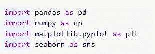

导入库

下载的数据集是 zip 格式的，所以我们需要解压缩它(不像人一样),我们用一个 python 库本身这样做

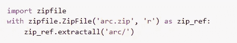

使用 zipfile 库解压缩数据集

现在数据文件被**解压**并发现它们在**中。csv** 格式我们用熊猫库函数把它导入到一个变量中。 **read_csv()**

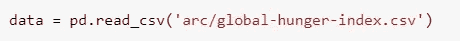

节约。csv 文件到数据变量

你知道数据是什么样的吗？我之所以知道，是因为我使用了 pandas **head()** 函数，该函数返回了**数据帧**的第一个**少数实体**。

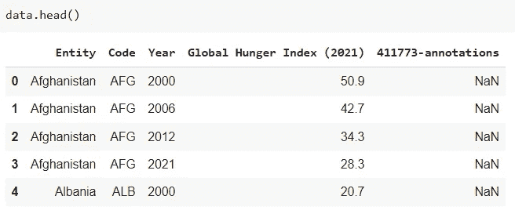

数据框简明视图

对于概述来说，看起来简洁是很酷的，但是一旦涉及到操作数据，我们需要理解它的组件和属性，比如**数据类型，现在的行数和列数**不是空的吗？我们用**来做。**熊猫**中的 info()** 函数

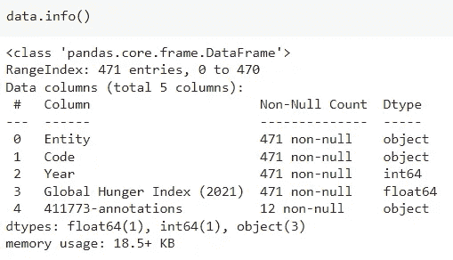

关于数据框的基本信息

谁喜欢统计学，当然是我..哈哈的笑..但是如果你想分析和建立分析和假设，你也应该这样做，在这种情况下可以使用**。描述()**如**计数、均值、标准差、最小值、最大值和四分位数 1、2、3。**

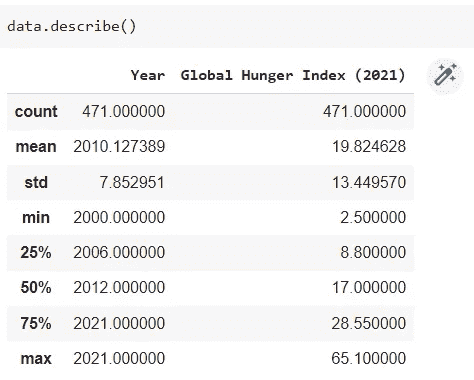

数据框的基本统计分析

让我们看看数据框中每一列的计数，

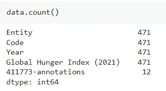

数据框中每列的计数

所以我继续想，让我们来看看在提到的这些年里，每个特定国家相对于全球饥饿指数的计数。 **value_counts()** 函数在 pandas 中同样用于返回 series 对象的唯一值。

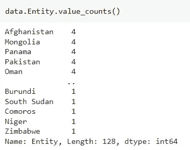

数据框中显示的每个国家的 GHI 计数

由于数据集很大，我们需要改变图形的大小，以便它可以正确显示

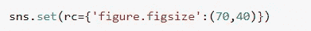

在 seaborn 中更改图形的大小

基于所看到的数据，我们使用直方图进行图形表示，

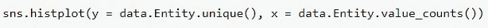

使用。seaborn 的 histplot()函数

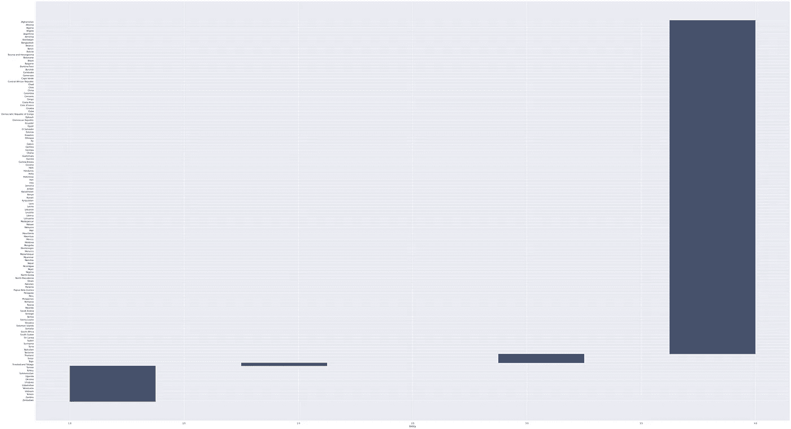

查看国家数字量 w.r.t GHI

为了确定异常值及其范围，我们使用了箱线图

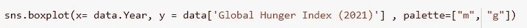

。seaborn 的 boxplot()函数

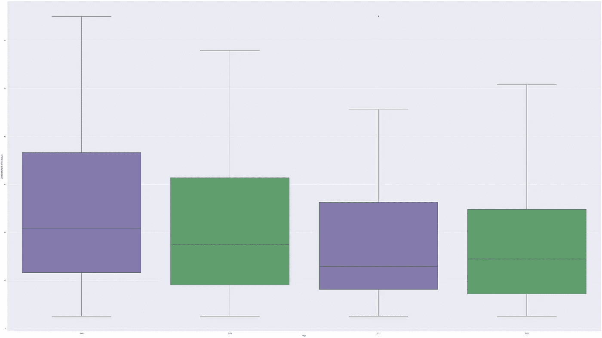

年度箱线图与 GHI

我们得到国家和年份的唯一值，因为它们经常使用**重复出现。**在**熊猫中的独特作用。**

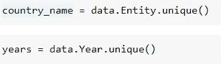

在变量中存储唯一值

我们使用**。pandas 中的 corr()** 函数来获取数据属性之间的相关性。

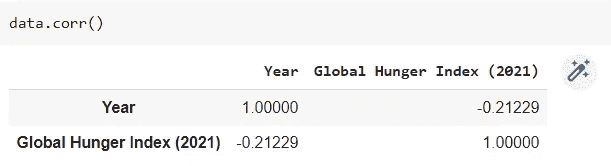

可以看出 GHI 与年份呈负相关

负相关意味着 GHI 随着一年的增长而下降，尽管这是一个非常模糊的说法，因为总的来说，整个国家都在下降，但不是单个国家。

现在，这是结束，因为这篇文章只是把光放在 EDA 和我们如何去做它更深入的探索需要经验和分析思维。

带**全码**的 Colab 笔记本

 [## 谷歌联合实验室

### 编辑描述

colab.research.google.com](https://colab.research.google.com/drive/1OMTCuRGA2szcBxBfpYcJap2HUfdzRvx3?usp=sharing) 

> 参考
> 
> [https://seaborn.pydata.org/examples/grouped_boxplot.html](https://seaborn.pydata.org/examples/grouped_boxplot.html)
> 
> [https://www . ka ggle . com/datasets/whenamancodes/the-global-hunger-index](https://www.kaggle.com/datasets/whenamancodes/the-global-hunger-index)
> 
> [https://buildwithmalik . medium . com/I-made-a-python-cheat-sheet-for-data-structures-and-algorithms-used-for-leet code-b 304754 fad 9 c](https://buildwithmalik.medium.com/i-made-a-python-cheat-sheet-for-data-structures-and-algorithms-useful-for-leetcode-b304754fad9c)

我的网站如果你想连接:[https://tripathiaditya.netlify.app/](https://tripathiaditya.netlify.app/)