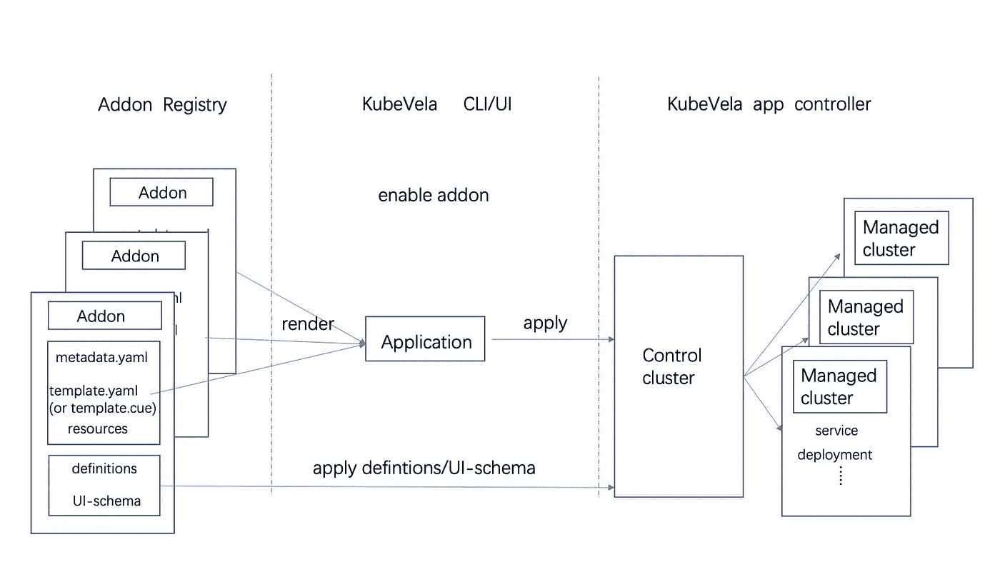
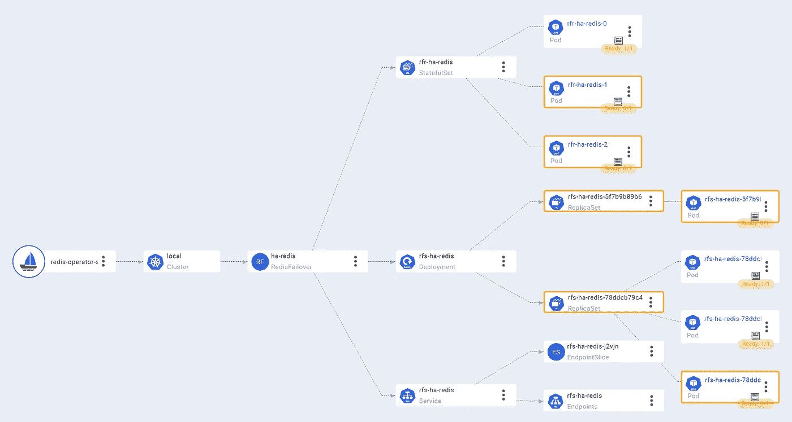
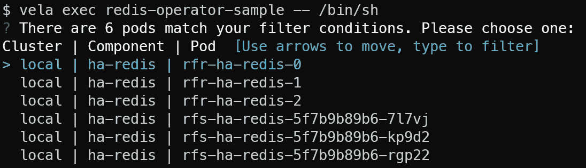
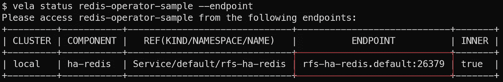

# KubeVela 插件简介:扩展你自己的平台能力

> 原文：<https://blog.devgenius.io/an-introduction-to-kubevela-addons-extend-your-own-platform-capability-d5a32ef03d17?source=collection_archive---------17----------------------->

*由查理·蒋(库比韦拉团队)*

众所周知，KubeVela 是一个高度可扩展的平台，用户可以在其上使用[定义](https://kubevela.io/docs/platform-engineers/oam/x-definition)构建自己的定制。KubeVela 插件是一种将所有这些定制及其依赖项打包在一起的便捷方式，可以扩展您自己的平台功能！

这个博客介绍了插件的主要概念，并指导你快速开始构建一个插件。最后，我们将向您展示最终用户的体验，以及所提供的功能是如何整合到一致的用户友好体验中的。

# 为什么要使用[插件](https://kubevela.io/blog/2022/10/18/building-addon-introduction#why-use-addons)

我们通常使用带有[插件目录](https://github.com/kubevela/catalog)的插件，这是一个包含插件的注册表，包含 KubeVela 社区精心制作的各种定制。你只需点击一下就可以下载并安装这些插件。例如，通过安装`[fluxcd](https://github.com/kubevela/catalog/tree/master/addons/fluxcd)` addon，您可以将 KubeVela 应用程序中的 Helm Chart 部署到集群中。

与一键安装的便利性相反，如果没有 KubeVela 插件，您必须以这种方式手动安装 [FluxCD](https://fluxcd.io/) :

1.  使用舵图或下载的 yaml 清单安装 FluxCD
2.  手动将 FluxCD CRD 与您的系统粘合，这可以通过在 KubeVela 中添加组件或特征定义来完成

实际上，这是我们在 KubeVela v1.1 之前安装 FluxCD 的方式。虽然看起来只需要 2 个步骤，但我们发现这相当麻烦:

1.  **安装复杂:**用户需要参考文档手动安装 FluxCD 并解决可能出现的错误
2.  **零散资源:**用户需要从不同的地方获取不同的资源文件
3.  **硬分发:**用户必须手动下载清单，这使得很难以统一的方式分发所有这些资源
4.  **缺乏多集群支持:** KubeVela 非常强调多集群交付。然而，手动安装使得多集群支持难以实现。
5.  **无版本管理:**用户需要自行管理定义、控制器、对应版本之间的关系。

KubeVela 插件就是为了解决这些问题而诞生的。

# 库伯韦拉如何工作[](https://kubevela.io/blog/2022/10/18/building-addon-introduction#how-kubevela-addons-work)

KubeVela 插件主要包含两个部分:

*   一个是能力提供者的安装，它通常是 CRD 运营商。安装过程本质上是利用 KubeVela 应用程序来工作。
*   另一个是粘合层，它是 OAM 定义和其他扩展。这些 OAM 定义通常依赖于功能提供者，并从最佳实践中提供用户友好的抽象。



插件的整个工作机制如上图所示。KubeVela 应用程序具有多集群功能，有助于将附加组件的 CRD 操作符交付到这些集群中。定义文件仅由 KubeVela 控制平面使用，因此它们将仅存在于控制平面集群中。

**提示**

**安装后，将创建一个应用程序对象，所有相关资源将标记对该应用程序的 Once 引用。当我们想要卸载一个插件时，我们只需要删除该应用程序，Kubernetes 的 ownerReference 机制将帮助清理所有其他资源。**

让我们构建一个 Redis 插件作为例子，它使得在应用程序中使用 Redis 组件来创建 Redis 集群成为可能。这样的插件将至少包括一个 Redis 操作符(创建 Redis 集群)和一个 ComponentDefinition(定义什么是`redis`组件)。

插件的安装过程包括安装应用程序(包括 Redis 操作符)、定义等。

# 创建自己的插件[](https://kubevela.io/blog/2022/10/18/building-addon-introduction#create-your-own-addon)

***注***

***确保你使用的是 KubeVela 1.5+版，拥有下面提到的所有这些功能。***

我们将指导你完成制作 redis 插件的整个过程。本指南的完整源代码位于[目录/redis-operator](https://github.com/kubevela/catalog/tree/master/experimental/addons/redis-operator) 中。

**提示**

作为介绍，我们不会涵盖所有功能。如果有兴趣自己搭建 addon，最好参考 [**“自制 Addon”**](https://kubevela.io/docs/platform-engineers/addon/intro)**文档了解详情。**

首先，我们需要考虑我们的插件能给最终用户提供什么。假设我们的 Redis 插件可以提供一个名为`redis-failover`的组件，当在应用程序中声明时，它将创建一个完整的 Redis 集群。

然后我们会想出如何实现这一点。为了定义一个`redis-failover`组件，我们需要编写一个 ComponentDefinition。为了能够创建 Redis 集群，我们使用一个 [Redis 操作符](https://github.com/spotahome/redis-operator)作为功能提供者。

现在我们的目标很明确:

*   编写一个 OAM 应用程序，其中包括 Redis 操作符的安装。(参考完整源代码中的`[template.cue](https://github.com/kubevela/catalog/blob/master/experimental/addons/redis-operator/template.cue)`和`[resources/](https://github.com/kubevela/catalog/tree/master/experimental/addons/redis-operator/resources)`。)
*   写一个 [ComponentDefinition](https://kubevela.io/docs/platform-engineers/components/custom-component) ，它定义了名为`redis-failover`的组件。(参考`[definitions/](https://github.com/kubevela/catalog/tree/master/experimental/addons/redis-operator/definitions)`文件夹中的完整源代码。)

但是在我们开始编码之前，我们需要理解一个插件目录的结构。我们将在后面描述每个文件，只是对现在需要哪些文件有一个基本的了解。

**提示**

**命令** `**vela addon init**` **可以帮助你创建 scaffold addon 目录和文件作为初始化。**

```
redis-operator/ 
├── definitions 
│   └── redis-failover.cue 
├── resources              
│   ├── crd.yaml       
│   ├── redis-operator.cue 
│   └── topology.cue       # (Optional)
├── metadata.yaml          
├── parameter.cue         
├── README.md            
└── template.cue
```

让我们逐一解释所有这些文件和文件夹:

1.  `redis-operator/`是目录名，和 addon 名一样。
2.  `definitions/`文件夹存储定义，包括 TraitDefinition、ComponentDefinition 等。
3.  `redis-failover.cue`定义组件定义了如何使用`redis-failover`组件，以及它如何与底层资源集成。
4.  `resources/`文件夹包含资源文件，这些文件将在`template.cue`中组成一个完整的应用程序。
5.  `crd.yaml`在`resources/`文件夹中是 Redis 操作符附带的 CRD。这个文件夹中的 Yaml 文件将直接应用到 Kubernetes。
6.  `redis-operator.cue`定义一个 web 服务组件，它安装 Redis 操作符。
7.  `topology.cue`是可选的，它帮助 KubeVela 建立应用程序和底层资源之间的关系。
8.  `metadata.yaml`定义该插件的元数据，包括名称、版本、标签、维护者等。这个信息可以是对任何注册表暴露的插件的概述。
9.  `parameter.cue`定义了这个插件的参数，最终用户可以使用它们来定制他们的插件安装。
10.  `README.md`引导用户快速开始使用该插件。
11.  是插件的模板，安装后将形成整个应用程序。

现在让我们一个一个地深入研究如何写它们。

**提示**

**我们将在以下部分广泛使用提示语言，因此** [**提示基本**](https://kubevela.io/docs/platform-engineers/cue/basic) **可能会有用。**

# parameter . cue[](https://kubevela.io/blog/2022/10/18/building-addon-introduction#parametercue)

```
parameter: {
    //+usage=Redis Operator image.
    image: *"quay.io/spotahome/redis-operator:v1.1.0" | string
    // ...omitted
```

`parameter.cue`中定义的参数是用户在安装插件时可以自定义的，就像头盔值一样。您可以稍后通过`parameter.<parameter-name>`在 CUE 中访问这些参数的值。在我们的例子中，`image`用于让用户定制 Redis 操作员图像，并且可以通过`parameter.image`在`redis-operator.cue`中访问。

除了定制一些字段，你还可以做一些有创意的事情，比如参数化安装插件。比如`fluxcd` addon 有一个参数叫`[onlyHelmComponents](https://github.com/kubevela/catalog/blob/master/addons/fluxcd/parameter.cue)`。因为`fluxcd`插件很大，包括 5 个不同的控制器，不是所有的用户都想要这么重的安装。因此，如果用户将`onlyHelmComponents`参数设置为`true`，将只安装 2 个控制器，这是一个相对较轻的安装。如果你对这是如何实现的感兴趣，你可以参考 [fluxcd addon](https://github.com/kubevela/catalog/blob/master/addons/fluxcd/template.cue#L25) 了解详情。

当您设计向用户提供什么参数时，您可以遵循我们的最佳实践，使其对用户友好。

**最佳实践**

*   **不要给你的用户提供每一个可能的参数，让他们自己想办法拨几十个旋钮。将细粒度的旋钮抽象成一些宽泛的参数，这样用户可以输入几个参数，得到一个可用但可定制的插件。**
*   首先决定合理的违约。让用户开始使用你的插件，即使他们没有提供参数(如果可能的话)。
*   **提供每个参数的用法，可以像示例一样在参数上方标注注释。**
*   **保持不同版本的参数一致，以避免升级过程中的不兼容性。**

# `template.cue`和`resources/`文件夹[和](https://kubevela.io/blog/2022/10/18/building-addon-introduction#templatecue-and-resources-folder)

OAM 应用程序存储在这里，它包含了插件的实际安装过程。在我们的例子中，我们将创建一个包含 Redis 操作符的应用程序，让我们的集群能够创建 Redis 集群。

`template.cue`和`resources/`目录都服务于相同的目的——定义一个应用程序。抛开历史原因，我们之所以一分为二，是为了可读性。当我们在 template.cue 中拥有大量资源时，它最终会变得太长而无法阅读。因此，我们通常将应用程序支架放在`template.cue`目录中，将应用程序组件放在`resources`目录中。

## template . cue[](https://kubevela.io/blog/2022/10/18/building-addon-introduction#templatecue)

`template.cue`定义一个应用程序的框架。这里的大部分内容可以是样板文件，它们被解释为代码块中的注释。

```
// package name should be the same as the CUE files in resources directory,
// so that we can refer to the files in resources/.
*package* main

output: {
    // This is just a plain OAM Application
    apiVersion: "core.oam.dev/v1beta1"
    kind:       "Application"
    // No metadata required
    spec: {
        components: [
            // Create a component that includes a Redis Operator
            redisOperator // defined in resources/redis-operator.cue
        ]
        policies: [
        // What namespace to install, whether install to sub-clusters
        // Again, these are boilerplates. No need to remember them. Just refer to the full source code.
        // https://github.com/kubevela/catalog/blob/master/experimental/addons/redis-operator/template.cue
        // Documentation: https://kubevela.io/docs/end-user/policies/references
        ]
    }
}
// Resource topology, which can help KubeVela glue resources together.
// We will discuss this in detail later.
// Documentation: https://kubevela.io/docs/reference/topology-rule
outputs: topology: resourceTopology // defined in resources/topology.cue
```

`output`字段是该模板的关键字，它包含将要部署的应用程序。在应用程序中，`spec.components`字段将引用在`resources/`文件夹中定义的对象。

`outputs`字段是另一个关键字，可以用来定义任何你想和这个插件一起部署的辅助资源。这些资源必须遵循 Kubernetes API。

## `resources/`文件夹[文件夹](https://kubevela.io/blog/2022/10/18/building-addon-introduction#resources-folder)

这里我们定义了将在`template.cue`中引用的应用组件。我们将使用一个`webservice`组件来安装 Redis 操作符。当然，如果你对额外的依赖(FluxCD addon)感到舒服，你可以使用`helm`组件直接安装 Redis 操作员舵图。但是写 addon 的一个原则就是减少外部依赖，所以我们用的是`webservice`组件，是 KubeVela 的内置组件，而不是`helm`。

```
// resources/redis-operator.cue

// package name is the same as the one in template.cue. So we can use `redisOperator` below in template.cue
*package* main

redisOperator: {
    // an OAM Application Component, which will create a Redis Operator
    // https://kubevela.io/docs/end-user/components/references
    name: "redis-operator"
    type: "webservice"
    properties: {
        // Redis Operator container image (parameter.image is defined in parameter.cue)
        image:           parameter.image
        imagePullPolicy: "IfNotPresent"
    }
    traits: [
        // ...omitted
    ]
}
```

您可以参考代码块中的注释来了解每个字段的详细用法。

## KubeVela [](https://kubevela.io/blog/2022/10/18/building-addon-introduction#highlights-of-the-glue-capability-provided-by-kubevela)提供的胶水功能亮点

其中一个显著的特点就是 [*拓扑规则*](https://kubevela.io/docs/reference/topology-rule) (或者资源拓扑，资源关系)。虽然不是必需的，但它可以帮助 KubeVela 构建由 KubeVela 应用程序管理的资源的拓扑关系。这就是 KubeVela 如何将各种资源粘合到一个应用程序中。当我们使用 Kubernetes 定制资源(CR)时，这尤其有用(在这个例子中正是这种情况)。

```
// resources/topology.cue

*package* main

*import* "encoding/json"

resourceTopology: {
    apiVersion: "v1"
    kind:       "ConfigMap"
    metadata: {
        name:      "redis-operator-topology"
        namespace: "vela-system"
        labels: {
            "rules.oam.dev/resources":       "true"
            "rules.oam.dev/resource-format": "json"
        }
    }
    data: rules: json.Marshal([{
        parentResourceType: {
            group: "databases.spotahome.com"
            kind:  "RedisFailover"
        }
        // RedisFailover CR manages the three resource below
        childrenResourceType: [
            {
                apiVersion: "apps/v1"
                kind:  "StatefulSet"
            },
            // Topologies of Deployment and etc. are built-in.
            // So we don't need to go deeper to Pods.
            {
                apiVersion: "apps/v1"
                kind:  "Deployment"
            },
            {
                apiVersion: "v1"
                kind:  "Service"
            },
        ]
    }])
}
```

在我们的例子中，`redis-failover`组件将创建一个名为`RedisFailover`的 CR。如果我们没有*拓扑规则*，尽管我们知道`RedisFailover`正在管理几个部署和服务，但 KubeVela 不会神奇地知道这一点。所以我们可以*用*拓扑规则*告诉* KubeVela 我们的理解。一旦 KubeVela 知道了一个`RedisFailover`里面有什么，它就会知道应用程序内部所有资源的关系。

**提示**

**这可以带来巨大的好处，并为我们提供所有扩展资源的一致体验:**

*   **在 VelaUX** 中可以提供从应用到底层 pod 的资源拓扑图
*   **对各种应用组件使用** `**vela exec**`一致执行命令成舱
*   **使用**T5 为各种应用组件提供一致的转发端口
*   **一致使用** `**vela log**`从 pods 获取各种应用组件的日志
*   **一致使用** `**vela status --pod/--endpoint**`为各种应用组件获取 pod 或访问端点

可以参考[运行我们的插件](https://kubevela.io/blog/2022/10/18/building-addon-introduction#run-our-addon)看看真实的用户体验。

# `definitions/`文件夹[文件夹](https://kubevela.io/blog/2022/10/18/building-addon-introduction#definitions-folder)

Definitions 文件夹包含 KubeVela [定义](https://kubevela.io/docs/getting-started/definition)，包括 ComponentDefinitions、TraitDefinitions 等。这是插件最重要的部分，因为它为最终用户提供了真正的能力。使用这里定义的组件和特征类型，用户可以在他们的应用程序中使用它们。

编写插件的定义和编写常规的 OAM 定义是一样的，这是一个很大的主题，所以我们不会深入介绍插件，你可以参考下面的文档来学习如何编写各种定义。

*   [组件定义](https://kubevela.io/docs/platform-engineers/components/custom-component)
*   [特质定义](https://kubevela.io/docs/platform-engineers/traits/customize-trait)
*   [政策定义](https://kubevela.io/docs/platform-engineers/policy/custom-policy)
*   [工作流程步骤定义](https://kubevela.io/docs/platform-engineers/workflow/workflow)。

在我们的 redis 插件示例中，我们应该参考[组件定义](https://kubevela.io/docs/platform-engineers/components/custom-component)和 [Redis 运算符](https://github.com/spotahome/redis-operator/blob/master/README.md)来编写我们的组件定义。我们将此组件类型命名为`redis-failover`。它将创建一个名为 RedisFailover 的 CR。随着 RedisFailover 的创建，我们插件应用程序中的 Redis 操作符将为我们创建一个 Redis 集群。

在这里可以参考源代码[。](https://github.com/kubevela/catalog/blob/master/experimental/addons/redis-operator/definitions/redis-failover.cue)

# 元数据. yaml[](https://kubevela.io/blog/2022/10/18/building-addon-introduction#metadatayaml)

顾名思义，这些都是一个插件的元数据，包括插件的名称、版本、系统要求等。详见本[文件](https://kubevela.io/docs/platform-engineers/addon/intro#basic-information-file)。下面列出的示例包含所有可用字段。

**TIP**

**有一些遗留支持，而我们关注的是 kubella v 1.5+中引入的新插件格式。例如，旧的** `**deployTo.runtimeCluster**` **应弃用而用** `**topology policy define in application**`作其替代。你可以参考 `[**template.cue**](https://github.com/kubevela/catalog/blob/master/experimental/addons/redis-operator/template.cue#L28)` **中的完整源代码。**

```
# addon name, the same as our directory name
name: redis-operator
# addon description
description: Redis Operator creates/configures/manages high availability redis with sentinel automatic failover atop Kubernetes.
# tags to show in VelaUX
tags:
  - redis
# addon version
version: 0.0.1
# addon icon
icon: https://xxx.com
# the webpage of this addon
url: https://github.com/spotahome/redis-operator
# other addon dependencies, e.g. fluxcd
dependencies: []

# system version requirements
system:
  vela: ">=v1.5.0"
  kubernetes: ">=1.19"
```

# 运行我们的插件[](https://kubevela.io/blog/2022/10/18/building-addon-introduction#run-our-addon)

现在我们已经完成了大部分工作。是时候运行它了！如果有任何细节被跳过，您可以下载完整的[源代码](https://github.com/kubevela/catalog/tree/master/experimental/addons/redis-operator)来完成它们。

在我们完成所有的`redis-operator`插件后，我们可以使用命令`vela addon enable redis-operator/`在本地启用它。它可以帮助我们调试和编写关于最终用户体验的文档。

至于说我们的例子 addon，你可以参考[自述](https://github.com/kubevela/catalog/tree/master/experimental/addons/redis-operator/README.md)来了解应该如何介绍。

***注意事项***

README.md 非常重要，因为它指导用户开始使用一个不熟悉的插件。

使用这个插件，用户只需要写 4 行 yaml 就可以得到一个 3 节点的 Redis 集群！与手动安装 Redis Operator 相反，即使是手动管理 Redis 实例，使用一个插件也大大改善了用户体验。

```
apiVersion: core.oam.dev/v1beta1
kind: Application
metadata:
  name: redis-operator-sample
spec:
  components:
    # This component is provided by redis-operator addon.
    # In this example, 2 redis instance and 2 sentinel instance
    # will be created.
    - type: redis-failover
      name: ha-redis
      properties:
        # You can increase/decrease this later to add/remove instances.
        replicas: 3
```

只用几行 yaml 就创建了一整棵树的复杂资源，如下图所示。由于我们已经为插件编写了*拓扑规则*，用户可以很容易地看到 Redis 集群的所有资源(Pods、服务)的拓扑。他们现在不局限于 KubeVela 应用程序的可观察性级别，相反，他们可以浏览底层资源的状态。例如，在我们的图中，我们可以看到某些 Redis Pods 仍未就绪:



在执行`vela exec/log/port-forward`时，用户还可以选择我们的示例应用程序的底层资源，即 3 个 Redis Pods 和 3 个 Sentinal Pods。



**提示**

**乍一看，如果您正在运行单个集群，那么将** `**exec**` **放入一个 Pod 似乎并不有用。但是，如果您正在运行多集群安装，选择跨多个集群的资源可以节省大量时间。**

`vela status`可以获得一个应用程序的状态。有了`Topology Rules`，我们可以更进一步——直接找出应用程序中的端点。在我们的示例中，用户可以通过以下方式连接到 Redis Sentinel 的端点:



# [总结](https://kubevela.io/blog/2022/10/18/building-addon-introduction#wrap-up)

在本指南结束时，你可能已经很好地掌握了插件的功能和制作方法。总之，您将获得以下好处:

1.  将平台功能扩展成一个捆绑包，易于使用并与整个社区共享。
2.  通过 KubeVela 应用程序和 CUE，以灵活的方式将所有基础架构资源编排和模板化到多集群中。
3.  通过各种扩展功能为最终用户提供一致的体验。

最后，如果你已经成功地建立了自己的插件，我们非常欢迎你把它加入到插件目录中。因此，KubeVela 社区中的每个人都可以发现并受益于扩展您强大的平台功能！