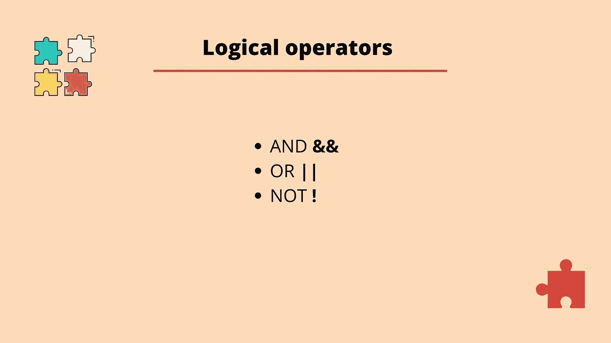
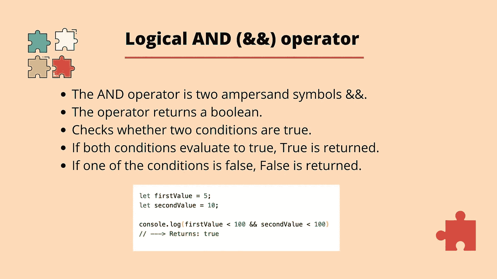
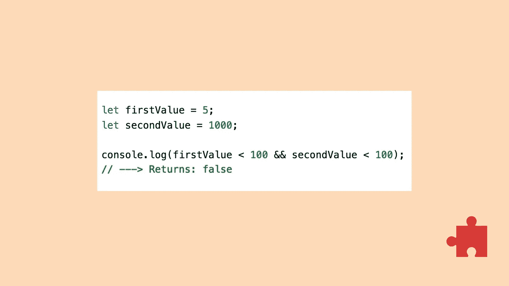
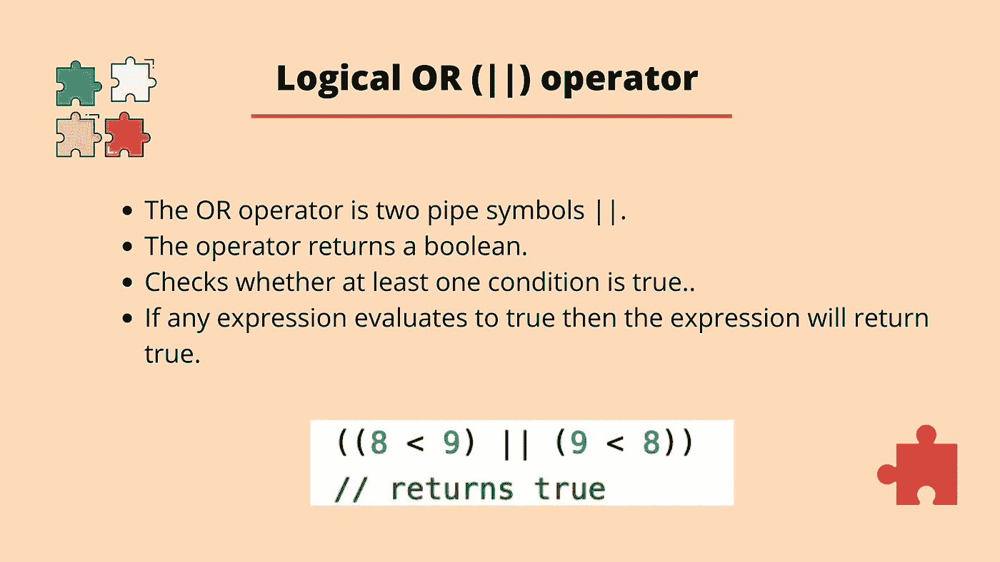
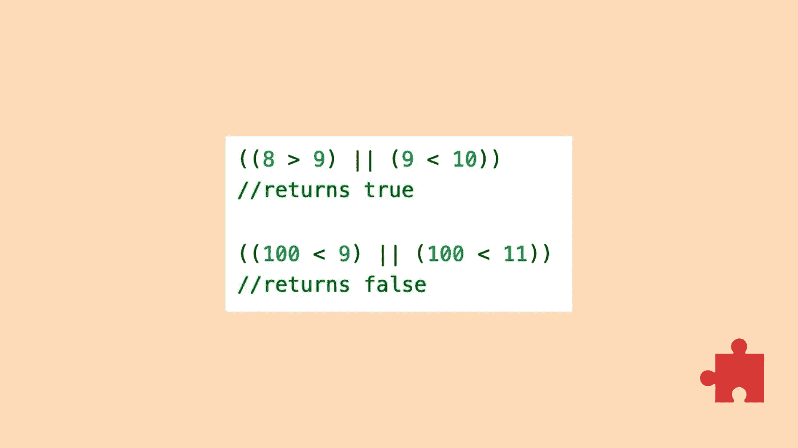
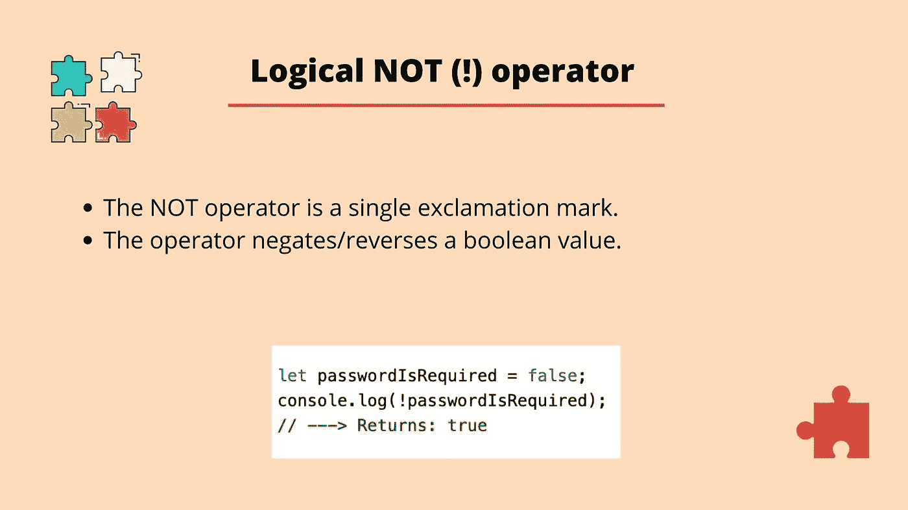
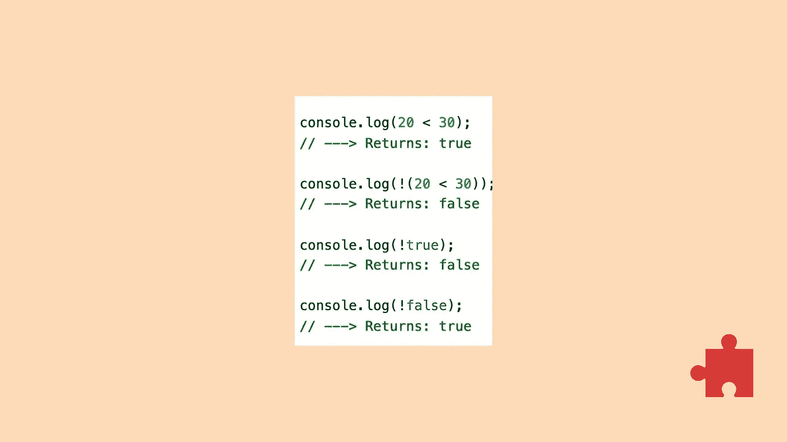

# JavaScript 中逻辑运算符的介绍

> 原文：<https://blog.devgenius.io/an-introduction-to-logical-operators-in-javascript-77b9f7a54a2f?source=collection_archive---------8----------------------->

JavaScript 中有三种逻辑操作符:操作符**和**、**或**以及**非**操作符。逻辑操作符使我们能够使代码中的逻辑变得更复杂，并允许我们一次检查两个或更多的条件。

如果我们有一个允许客户订购食品杂货的应用程序，我们可能会有一个客户想要订购一些香蕉的场景。在我们允许他们继续下订单之前，我们需要检查我们是否有香蕉库存。如果我们还想确保客户没有订购我们库存的所有香蕉，事情会变得有点复杂，因为这可能会惹恼其他客户，意味着他们不能订购任何香蕉。现在我们有一个情况，当客户订购一些香蕉时，我们必须检查我们有库存香蕉*和*客户订购了 5 个或更少的香蕉。在这种情况下，逻辑运算符会很方便…

## 和

我们将从查看**和**操作符开始。AND 运算符由两个&符号组成，它检查两个条件的计算结果是否为真。为了清楚起见，当我们说一个条件时，这可能是 2 是否大于 1。回到库存示例，检查库存中的香蕉数量是否大于零是一个条件，然后检查客户订购的香蕉数量是否小于或等于 5 个是另一个条件。

当我们使用 AND 运算符时，可能的结果如下:

*   如果两个条件都为真，返回值将为真。
*   如果所有条件都不为真，返回值将为假。
*   如果只有一个条件为假，则整组条件的计算结果都为假。

上面是一个使用 AND 运算符的示例，返回值为真，这是因为 5 小于 100，10 小于 100。

现在我们将再次尝试，但这一次我们将把第一个表达式设置为计算结果为 true 的条件，把第二个表达式设置为计算结果为 false 的条件。

这次我们得到 false 作为返回值，因为虽然 5 小于 100，但 1000 不小于 100，因此整个表达式的计算结果不为 true。

## 运筹学

接下来是 OR 运算符。OR 运算符由两个管道字符(||)组成。使用 or 运算符，我们可以检查一组条件中的一个是否为真。

*   如果其中一个条件为真，那么下一个条件甚至不会被检查，因为 OR 运算符只在前面的条件为假时检查剩余的条件。在这种情况下，返回值将为 true。
*   如果没有一个条件为真，那么返回值为假。

在上面的例子中，我们首先检查 8 是否小于 9。这个值为 true，所以第二个表达式甚至不需要检查，我们得到 true 作为返回值。

现在我们再试一次，检查 100 是否小于 9，或者 100 是否小于 11。由于第一个表达式为假，我们继续检查第二个条件，第二个条件也为假，因此返回值为假。

## 不

最后，我们没有操作员。非运算符(**！**)反转或否定布尔值，因此 NOT 运算符将在值为 true 时返回 false，在值为 false 时返回 true。NOT 运算符的返回值将始终是布尔值。

NOT 操作符可以用于非布尔数据类型，但是这些值在被取反之前会根据值是 true 还是 falsy 被转换成布尔值，你可以在 mdn 网站[这里](https://developer.mozilla.org/en-US/docs/Glossary/Falsy)找到一个错误值的列表。

在上面的例子中，我们用布尔值 false 初始化变量 *passwordIsRequired* 。在 console.log 中，我们用 NOT 运算符对该值求反。这意味着我们将 true 作为返回值。

让我们试试另一个例子，如果我们说 20 比 30 小，我们会得到真值。现在，如果我们使用 not 操作符并再次执行这个操作，我们会得到 false，因为返回值现在被求反了。最后两个例子展示了如果我们使用 not 操作符和布尔值 true 和 false 会发生什么。值再次被否定，所以*！true* 返回 false 和*！false* 返回 true。

请随时张贴任何意见，问题或反馈！

这篇文章的视频可以在下面找到。

我也有一门 Udemy 课程，涵盖了这个主题以及更多内容。

下次见！