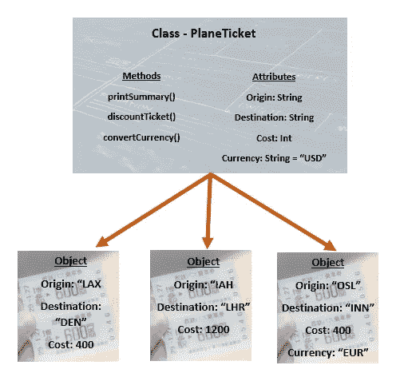

# 面向对象编程(OOP)简介

> 原文：<https://blog.devgenius.io/an-introduction-to-object-oriented-programming-oop-6caaa9c932ce?source=collection_archive---------14----------------------->

照片由 [JJ 英](https://unsplash.com/@jjying?utm_source=medium&utm_medium=referral)在 [Unsplash](https://unsplash.com?utm_source=medium&utm_medium=referral)

当开始一个新项目时，知道从哪里开始可能是压倒性的。人们倾向于在没有明确的攻击计划的情况下就一头扎进代码中，然而，从长远来看，一致的方法是成功的关键。

面向对象编程(OOP)可以提供这一点——一种以数据对象而不是算法为中心的一致的开发方法。

OOP 涉及到设置开发人员希望用作类的对象(比如为房子制作蓝图)，以及他们在创建实例时引用该模型(根据蓝图建造房子)。

在 JavaScript 的上下文中，这将是为一个组件创建一个特定的类(或子类)，然后从主脚本调用该类中的方法(而不是在每个单独的脚本中定义函数或数据对象)。从 Swift 的角度来看，这将是在一个单独的结构中定义数据对象，而不是直接在视图模型中定义。

# 四个主要元素

和大多数事情一样，OOP 最容易通过例子来理解。让我们以一个销售飞机票的项目为例。(我将避免使用代码示例，因为 OOP 的原理不是特定于语言的)

**类** —类是用户定义的数据类型，充当对象的蓝图。例如，我们将定义一张机票由一个表示出发地和目的地的字符串、一个包含机票费用的 double 字符串、一个表示与费用相关的货币的字符串组成。我们生成的每一张机票都将依据这个大纲

**Objects** —对象是类的一个特定实例，例如一张特定的机票。该对象是基于类本身中定义的蓝图指令制作的。为了创建一个对象，需要设置一些属性(例如我们飞机票的目的地或出发地)，而一些属性可以由类中设置的变量继承(也许默认货币总是设置为 USD)

**方法** —方法是在类内部定义的函数，描述与对象的交互或行为。对于我们的示例，可以有一个定义为“旅程长度”的方法，该方法返回机票目的地和出发地之间的距离，或者有一个调用，该调用打印出机票费用的描述，例如“您的机票将花费 X 美元”(其中 X 是金额，美元是指定的货币)。方法对于需要在对象上重复执行的操作非常有用。

**属性** —拼图的最后一块是属性。这些也在类中定义，表示对象的状态。

OOP 实际应用的例子:PlaneTicket 类的 3 个对象实例，包括方法和属性

# 优势

为每一个你想处理的对象建立一个不同的文件可能看起来工作量很大，但是特别是当程序变大时，OOP 有很多好处。

**模块化** —通过为数据对象构建一个类，可以在整个项目的许多地方引用该类，消除了多次声明的需要。

**可扩展的** —类允许扩展(创建继承其所有父属性和方法的子类)。例如，如果您定义了一个名为“staff”的类来涵盖与公司员工相关的所有信息，那么公司开始雇用实习生，他们需要与员工几乎相同的蓝图，但是具有一些与培训相关的附加功能，这样就可以将“实习生”类定义为“Staff”类的扩展，并继承所有原始的方法和属性，让您只需定义新的内容。

安全 —在一个类中私有某些函数或属性的能力增加了安全性，也意味着用户只能修改或访问你需要的内容

协作**—OOP 对协作开发非常有益，在协作开发中，项目被分成小组。由于该类是核心的，并且独立于特定的文件，因此它可以被多个用户访问或细化，而不需要重复的代码或对其他脚本的复杂依赖。**

# **缺点**

**与所有方法一样，您应该知道一些缺点。**

****简单项目的复杂性** —如果您的项目代码有限，或者结构相对简单，以后不会扩展，那么添加类文件和方法会增加复杂性，但不一定会带来上面提到的好处。**

****编译时间增加** —文件和文件间交互的增加会增加编译时间**

# **摘要**

**OOP 是一种处理数据的一致的模块化方法。通过创建一个类对象作为蓝图，并根据需要引用它来创建类的实例，OOP 允许用户以对象本身为中心编写代码。**

**OOP 由一个类组成，这个类由方法和属性组成，并被引用来从中创建对象。这种方法对于涉及多个利益相关者的大型复杂项目非常有益。**

> **感谢阅读！如果你喜欢这篇文章并想阅读更多，请务必查看我的个人资料或[订阅](https://medium.com/subscribe/@simply_stef)类似的文章。**
> 
> **订阅 Medium 可以无限制地获取所有可用的内容和想法。如果你通过这个链接加入 Medium，我会从你的费用中收取很少的一部分——而且不会花你任何额外的钱！**