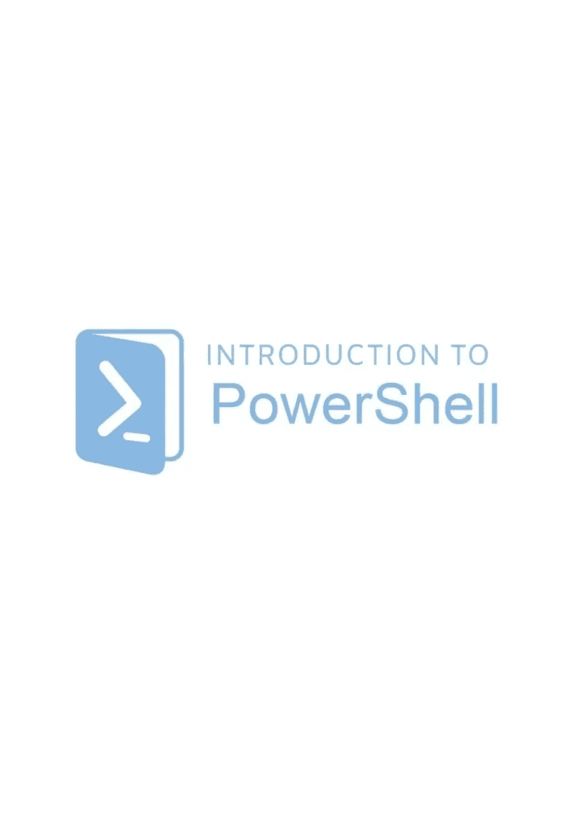
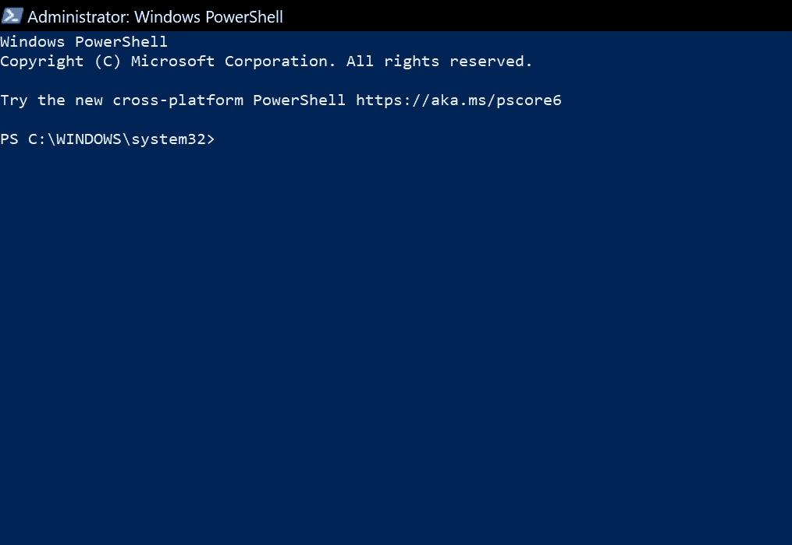

# PowerShell 简介第 1 部分。

> 原文：<https://blog.devgenius.io/an-introduction-to-powershell-part-1-bb0910c6ce35?source=collection_archive---------17----------------------->

**什么是 PowerShell:**

简单地说，PowerShell 基本上是一个交互式命令行环境。NET Framework，它自动化了那些被认为是重复的、长时间的并且很可能是令人讨厌的任务。您可以执行称为“脚本”的程序，其中包含各种 cmdlets(类、方法、对象、类型等)。)

注意:在我们继续之前，请注意 PowerShell 不区分大小写，因此您可以键入大写字母或小写字母。

**Cmdlet 详情:**

cmdlet 是一个命令，通过它我们可以在 PowerShell 环境中执行操作。PowerShell 遵循动词-名词命名系统，即命令必须有动词(它做什么)和名称(它叫什么)，一些实例是:Get-Help、Get-Process、Get-Member。

以下是 PowerShell 中可用的一些命令:

类是对象的参数。类描述了一个对象应该是什么样子，以及它实际能做什么&如何创建一个对象。

下面是如何在 PowerShell 中创建类的图示:

**对象:**

对象基本上是我们希望在 PowerShell 中自动化的操作的 cmdlet 表示；对象通常分为两类:属性(它解释了对象所代表的属性)，然后再一次，我们基本上是方法(这些基本上是代码块，它们执行我们上面讨论的特定动作)。为了创建一个对象，我们可以使用表示类的类型 accelerator []，然后使用每个类的默认函数 new()。

**类型:**

基本上，类型是对象描述的一部分。这基本上意味着类型是对一个对象必须拥有的属性或成员的描述。例如，如果我们运行 Get-Process，我们会得到一堆对象，这些对象是“processinfo 类型的对象”。意味着计算机当前正在运行的进程类型&它们都有相同的属性。下面是 PowerShell 本身的分解:核心语言运行时(CLR)。Net —库— PowerShell — PowerShell 模块。

总之:类型是对象所有成员的定义。

类型包含对象，对象包含属性。

要在 PowerShell 中表示类型，请遵循以下语法:[在此处包含您的类型]

例如，要引用一个 sting 类型，我们可以这样做:[string]。我们仍然可以用这种方式存储值:

$a(你可以用任何东西代替来存储值。在这种情况下，我选择了 a) = '乔，球，游戏'

[string]$a ($获取存储在中的数据，然后将其转换为字符串，这称为强制转换)

在一行中输入这些，我们有:$a = 'joe，ball，game '

[string]$a 然后按 enter 键。

如果你有一个你不熟悉的类型，你可以运行:$a. GetType()

**音符属性:**

注意属性是由 PowerShell 创建的，它们没有任何特定的类型，可以放在任何地方

**性状:**

这些属性有特定的类型和名称，它们有限制，只允许中的适当类型。

**方法:A.K.A FUNCTIONS:**

只是一个执行特定操作的代码块。方法允许我们对某个对象执行某些操作，就像属性方法在类型之间共享一样，即每个进程都有相同的进程方法，每个文件对象都有相同的方法，等等。

就像命令一样，方法可以有参数。

方法的参数只接受特定的类型。

**现在让我们来讨论一下 PowerShell 环境(PowerShell lSE vs PowerShell )**

PowerShell ISE 基本上是一个图形用户界面(GUI)，它使我们能够执行、创建和修改命令和脚本。PowerShell。同时，PowerShell 是一个环境或命令行界面(CLI)，我们可以在其中编写和执行代码。

以下是 PowerShell ISE 环境的外观:

以下是 PowerShell 环境的外观:

**变量:**

一般来说，变量是存储数据的内存单元。在 PowerShell 中，我们可以这样写来表示一个变量:a = 1 美元，4 = 4.00 美元“john”。这里的意思是任何前面有“$”的字符都会变成一个变量

**power shell 中可用的数据类型:**

它们包括整数、字符串、浮点值或小数、布尔值和日期时间值。GetType 方法返回给定变量的当前数据类型。

**整数:**

它们是整数，任何可用的小数都被四舍五入。

**字符串:**

它们是一组字符或字母。

**浮点值或小数:**

它们是十进制值。

**布尔人:**

它们是可以是真或假的价值观。

**日期时间值:**

它们是通常包含时间的值。

注意:变量也可以通过“显式转换”从一种类型转换为另一种类型。

**数组&哈希表:**

数组用于存储数据或值的列表，它可以是任何数据类型，并且它们大部分是相似的。另一方面，哈希表是一种更高级的数组形式，用于存储彼此相关且基本互补的数据。

下面是一个数组声明:

下面是一个哈希表声明:

然而，我知道本系列有很多东西没有涉及；我会尽我最大的努力推出另一个细分系列，以尽可能简单的形式谈论这么多术语，但在此之前，请参考 get-help cmdlet，试着通读一下，它实际上没有那么长:

要访问 web 浏览器，请在您的 PowerShell 环境中键入:get-help get-help -online，然后按 enter 键，或者直接转到您的浏览器，复制并粘贴以下链接:

 [## 获取帮助(微软。PowerShell.Core) - PowerShell

### Get-Help cmdlet 显示有关 PowerShell 概念和命令的信息，包括 cmdlet、函数、常见…

docs.microsoft.com](https://docs.microsoft.com/en-us/powershell/module/microsoft.powershell.core/get-help?view=powershell-5.1&WT.mc_id=ps-gethelp) 