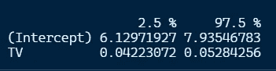

# 简单线性回归简介

> 原文：<https://blog.devgenius.io/an-introduction-to-simple-linear-regression-7ad6c5287225?source=collection_archive---------11----------------------->

广告数据集的快速总结—

在开始任何分析之前，我们会遇到大量关于数据的问题。当我们得到数据时，我们可能想了解

1.  变量之间有关系吗？
2.  关系有多牢固？
3.  我们能多精确地预测响应变量？
4.  反应变量和预测变量之间的关联有多大？
5.  关系到底是不是线性的？
6.  哪些预测因素与目标变量相关？
7.  预测者之间有协同或交互作用吗？

线性回归帮助我们回答所有这些问题。线性回归有两种类型

1.  简单线性回归
2.  多元线性回归

在本教程中，我们将讨论**简单线性回归**，这将帮助我们回答前面提到的 5 个问题

每当我们有一个数据科学监督的问题，我们开始估计一个 Y 作为 x 的函数。


来源:ISLR [书](https://www.statlearning.com/)

*(我们一会儿就来^)*

简单线性回归是一种假设响应变量(Y)和**单一**预测值(X)之间存在线性关系的方法

它采用以下数学形式:

Y ≈ β₀ + β₁X(回到我们的高中数学课堂..😒)

> 其中，≈表示近似模拟为，β₀和β₁代表模型系数。
> 
> β₀是截距(X = 0 时 y 的值)
> β₁是斜率(y 随 x 单位变化的变化率)

每当我们得到一个数据集时，它通常是从一个样本中提取的数据(因为为一个群体提取数据会太大和昂贵)。因此，当我们使用这些数据估计系数时，实际总体参数可能会有所不同。由于模型系数只是总体系数的估计值，我们在它们上面放了一个帽子符号(^)

yˇ=βˆ₀+βˆ₁x，

其中^代表估计值

我们通过拟合数据来估计βˆ₀和βˆ₁。我们的目标是以这样一种方式找到这些系数，即我们创建一条尽可能接近我们所拥有的数据点的直线。

*有很多方法可以衡量这种接近程度，然而最常见的方法是使用* ***最小二乘估计。***

这里我们将使用 kaggle [这里](https://www.kaggle.com/datasets/ashydv/advertising-dataset)上的广告数据进行解释

让我们加载数据集并查看数据中的几个条目

```
# View the data 
head(Advertising)
```


我们有 3 个变量，电视、广播和报纸的花费是美元，销售额是单位。

让我们看看电视消费和销售的关系。

```
library(ggplot2)ggplot(data = Advertising, aes(x = TV, y = Sales)) + geom_point(shape = 1) + geom_smooth(method = “lm”)
```


蓝线显示通过拟合数据的最小二乘估计，阴影区域显示估计值周围 95%的置信区间。

正如我们所看到的，这些点离线有点远，但是这条线最小化了误差/残差的平方和(点离线的垂直距离)

## 什么是错误，我们为什么会有错误？

误差是实际点与预测点(位于蓝线上)之间的差异

eᵢ= yᵢ −yˆᵢ (i 代表个别点)

我们取这些误差，并取平方和，称为残差平方和。

> 我们定义残差平方和:


来源:ISLR [书](https://www.statlearning.com/)


来源:ISLR [书](https://www.statlearning.com/)


来源:ISLR [书](https://www.statlearning.com/)

使用微积分，我们可以得到βˆ₀和βˆ₁的值来拟合 RSS 最小的直线(为了简单起见，我们在这里不涉及推导)🙌)

在这里应用 R 中的模型将完成所有这些计算，并将给出系数估计

```
# Applying Linear Model to get intercept and Slope
lm_sales = lm(Sales ~ TV, data = Advertising)
summary(lm_sales) # Review the results
```


***好，太好了；但是我们如何解读这些数字呢？***

从结果中，我们可以看到我们的截距为 7.032，斜率为 0.047。意义；额外增加 1000 美元的电视广告支出将使销售额增加 47.5 个单位(电视预估)，当我们不做广告时，我们将获得 7032 个销售额(截距预估)。

```
# Plotting Linear Fit using the model coefficients
ggplot(data = Advertising, aes(x = TV, y = Sales)) + geom_point(color="red") + 
geom_segment(aes(x = TV, y = Sales, xend = TV, yend = lm_sales$fitted.values), col = "grey35") + geom_abline(intercept =   7.032594, slope = 0.047537, size = 1, col = "deepskyblue3") + 
labs(title = "predicting Sales using TV advertising")
```


**评估系数的准确性:置信区间**

*现在我们有了估计值，这些估计值与我们试图建立关系的实际人口有多准确或接近？*

为了回答这种接近性，我们将建立一个置信区间，在标准误差(我们使用的样本数据的标准偏差)的帮助下测量这些值

这里我们将直接提到 TV 截距和斜率的标准误差公式，而不进行任何推导


来源:ISLR [书](https://www.statlearning.com/)


来源:ISLR [书](https://www.statlearning.com/)

*我们假设所有点的误差方差都是常数，并且不相关(n =总数据点)*

在报告这些估计值时，我们通常希望报告一个区间，我们可以 95%确信，如果我们从实际人口(我们不知道)中重复取样，95%的时间它将落在我们的区间内


来源:ISLR [书](https://www.statlearning.com/)

```
confint(lm_sales,level = 0.95)
```



*请注意，intercept 和 TV 都不包含 0*

**线性回归中的假设检验**

线性回归中的假设检验帮助我们回答问题，以确定 X 和 Y 变量之间是否存在统计上显著的关系。

标准误差可以用来进行假设检验。我们在简单线性回归中考虑的假设包括:

*H0:X 和 Y 没有关系
哈:X 和 Y 有些关系*

数学上，
*h0:*βˆ₀*̸= 0；*

*哈:* βˆ₁ *̸= 0*

我们使用一个 **t 检验**来检验这个假设，看看βˆ₁离 0 有多远(t 检验将给出βˆ₁离 0 的标准差，如果显著的话)


来源:ISLR [书](https://www.statlearning.com/)

假设β1 = 0，我们计算 p 值，即观察到绝对值等于|t|或更大的任何数的概率

小 p 值(小于 5%或 1%)用于表示由于偶然因素，不可能观察到预测值和反应之间的这种实质性关联


在我们的结果中，由于 p 值非常小，我们拒绝零假设，并得出结论，βˆ₀ ̸= 0 和βˆ₁ ̸= 0，因此我们看到的电视和销售的关系在统计上是显著的。

**评估模型的准确性**

拒绝零假设后，我们将有兴趣知道数据的拟合度。

我们可以用两个量来评估精确度。
残差标准误 2。r 平方统计量

1.  RSE: RSE 是ϵ(误差)的标准偏差或响应偏离回归线的平均量。


来源:ISLR [书](https://www.statlearning.com/)

RSE 提供不适合的估计值作为绝对测量值，并且总是很难知道 RSE 的好值是多少。因此，我们通常使用 R 平方的其他度量来估计精度。在我们的模型中，我们观察到每个市场的销售额平均偏离 3259 个单位。


2.R 平方:R 平方是我们模型解释的方差的比例；因此它总是在 0 和 1 之间


来源:ISLR [书](https://www.statlearning.com/)

TSS =总平方和


来源:ISLR [书](https://www.statlearning.com/)

TSS 测量总方差
RSS 测量执行回归后未解释的可变性数量

因此，TSS — RSS 给出了模型中的解释变量


对于我们的模型，61.19%的销售方差可以用电视上的线性回归来解释。

在模型中，我们可以看到紧挨着 R 平方的另一个指标调整后的 R 平方。R-square 的一个主要缺陷是它从不减少。当我们向模型中添加更多的变量时，无论变量的相关性如何，它总是会增加，因此我们通常考虑后一种度量，这随着模型中添加更多的变量而变得不利。


来源:[堆栈交换](https://datascience.stackexchange.com/questions/14693/what-is-the-difference-of-r-squared-and-adjusted-r-squared#:~:text=However%2C%20there%20is%20one%20main%20difference%20between%20R2,the%20dependent%20variable.%20What%20Is%20the%20Adjusted%20R-squared%3F)

***哪个 R-square 适合我？***

好的 R 平方的值可以根据场景而变化，例如，在某些物理问题中，我们可能知道数据确实来自具有小残差的线性模型。在这种情况下，我们预计会看到非常接近 1 的 R 平方值，而小得多的 R 平方值可能表明生成数据的实验存在严重问题。另一方面，在生物学、心理学、市场营销和其他领域的典型应用中，线性模型充其量是对数据的极其粗略的近似，并且由于其他不可测量的因素导致的残差通常非常大。在这种情况下，我们预计只有很小一部分的响应方差可以用预测因子来解释。

最后，我希望你喜欢这篇文章。