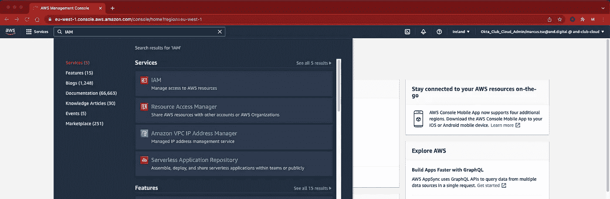
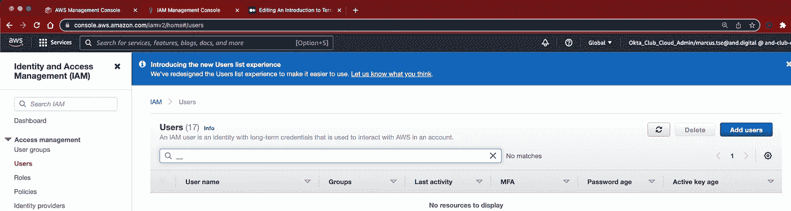
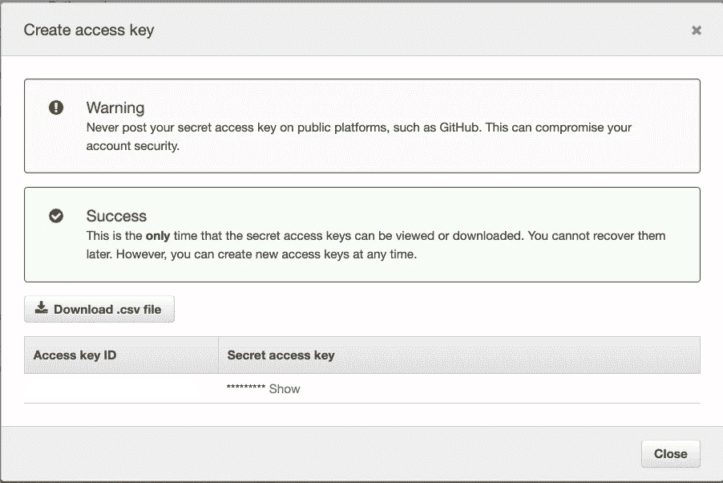
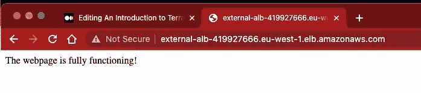
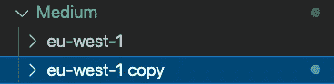

# Terragrunt 简介

> 原文：<https://blog.devgenius.io/an-introduction-to-terragrunt-dfe9921f5e48?source=collection_archive---------1----------------------->

## 关于如何使用 Terragrunt 和 Terraform 注册模块部署基本 AWS 资源的教程


# 欢迎

这是我们 Terragrunt 系列的第二部分。我们将学习如何使用 Terragrunt 在 AWS 中管理基础设施和部署资源的基础知识。这篇文章专门针对初级到中级用户，提供了整个过程的逐步演练。如果你想知道[为什么在 2022 年](https://medium.com/@marcus.tse_70031/why-use-terragrunt-in-2022-5e97c61cc539)使用 Terragrunt，请查看第一部分。

# Terragrunt & Terraform 注册表

官方文件描述:

> Terragrunt 是一个瘦包装器，它提供了额外的工具来保持您的配置干燥，使用多个 Terraform 模块，以及管理远程状态。

【https://terragrunt.gruntwork.io/】来源:[](https://terragrunt.gruntwork.io/)

*[Terragrunt](https://terragrunt.gruntwork.io/) 是一个开源工具，作为 Terraform 的扩展而存在，用于保持代码[干燥](https://en.wikipedia.org/wiki/Don%27t_repeat_yourself)，并在使用多个 Terraform 模块时管理 Terraform 状态以及其他[漂亮的功能](https://terragrunt.gruntwork.io/docs/#features)，这些功能集成在 Terragrunt 中。Terragrunt 还解决了一个主要问题:在存储远程状态时，Terraform 不允许为其后端类型使用变量或路径插值，比如 s3 bucket。*

## *地形注册表*

> *经验证的模块由 HashiCorp 审查，并由贡献者积极维护，以保持最新并与 Terraform 及其各自的提供商兼容。*

**来源:*[*https://www.terraform.io/registry/modules/verified*](https://www.terraform.io/registry/modules/verified)*

*Terraform registry 同时拥有验证模块和社区模块。社区模块可以具有高质量，并且可以被积极地管理。该术语仅表示社区模块不是由 HashiCorp 合作伙伴创建的。注册中心充当创建和运行基础设施的模板存储库。*

*所有模块都必须遵守[官方文件](https://www.terraform.io/docs/language/modules/develop/index.html)中规定的代码标准。*

# *先决条件*

1.  *创建一个 [AWS 账户](https://aws.amazon.com/premiumsupport/knowledge-center/create-and-activate-aws-account/)*
2.  *下载[地形和地形地貌](https://terragrunt.gruntwork.io/docs/getting-started/install/)*

# *1.创建 AWS 帐户*

*[Terraform](https://www.terraform.io/) 是一个开源的基础设施，作为一个代码工具，兼容众多的云提供商:AWS，Azure，GCP，阿里云[和更多的](https://registry.terraform.io/browse/providers)。对于本教程，选择[亚马逊网络服务(AWS)](https://aws.amazon.com/?nc2=h_lg&aws-products-analytics.sort-by=item.additionalFields.productNameLowercase&aws-products-analytics.sort-order=asc&aws-products-business-apps.sort-by=item.additionalFields.productNameLowercase&aws-products-business-apps.sort-order=asc&aws-products-containers.sort-by=item.additionalFields.productNameLowercase&aws-products-containers.sort-order=asc&aws-products-compute.sort-by=item.additionalFields.productNameLowercase&aws-products-compute.sort-order=asc&aws-products-databases.sort-by=item.additionalFields.productNameLowercase&aws-products-databases.sort-order=asc&aws-products-fe-mobile.sort-by=item.additionalFields.productNameLowercase&aws-products-fe-mobile.sort-order=asc&aws-products-game-tech.sort-by=item.additionalFields.productNameLowercase&aws-products-game-tech.sort-order=asc&aws-products-iot.sort-by=item.additionalFields.productNameLowercase&aws-products-iot.sort-order=asc&aws-products-ml.sort-by=item.additionalFields.productNameLowercase&aws-products-ml.sort-order=asc&aws-products-mgmt-govern.sort-by=item.additionalFields.productNameLowercase&aws-products-mgmt-govern.sort-order=asc&aws-products-migration.sort-by=item.additionalFields.productNameLowercase&aws-products-migration.sort-order=asc&aws-products-network.sort-by=item.additionalFields.productNameLowercase&aws-products-network.sort-order=asc&aws-products-security.sort-by=item.additionalFields.productNameLowercase&aws-products-security.sort-order=asc&aws-products-storage.sort-by=item.additionalFields.productNameLowercase&aws-products-storage.sort-order=asc) 是因为:*

*   *它是世界上最全面、最广泛采用的云平台*
*   *AWS 提供了一个免费层，允许免费体验一系列 AWS 服务*

# *2.下载 Terraform 和 Terragrunt*

*遵循先决条件中的说明，并使用以下命令检查是否安装了 Terraform 和 Terragrunt:*

```
*$ terraform 
terraform
Usage: terraform [global options] <subcommand> [args](...)$ terragrunt DESCRIPTION:
   terragrunt - Terragrunt is a thin wrapper for Terraform that provides extra tools for working with multiple
   Terraform modules, remote state, and locking. For documentation, see [https://github.com/gruntwork-io/terragrunt/](https://github.com/gruntwork-io/terragrunt/).(...)*
```

# *辅导的*

*完成先决条件后，按照下面列出的指南创建资源。由于本指南旨在从 Terraform 过渡到 Terragrunt，因此一些关于云的先验知识将是有益的。下面是这个过程的分解:*

1.  *创建 IAM 帐户*
2.  *将密钥和访问密钥作为环境变量导出*
3.  *创建一个 terragrunt.hcl 文件，并将内容粘贴到模块的根级别*
4.  *遵循项目结构*
5.  *通过运行 Terragrunt 命令创建 S3 桶和 VPC*
6.  *继续创建 AWS 资源(负载平衡器、web 服务器)*
7.  *启动网络服务器集群*
8.  *在单独的区域启动 web 服务器*
9.  *清理资源*

## *您可以在这里找到本教程的源代码:*

*[https://github.com/marwai/medium-terragrunt](https://github.com/marwai/medium-terragrunt)*

# *我们开始吧！*

# *1.创建 IAM 帐户*

*首次设置 AWS 帐户后，您将被分配一个名为 root 用户的身份。root 用户使您能够拥有对 AWS 服务和资源的所有访问权限。建议创建一个具有有限权限的 IAM 帐户。当给予用户执行其功能所需的最低权限时，遵循最低权限原则是最佳实践。*

***注**:本教程不赘述 IAM。拥有完全访问权限的 IAM 用户就足够了。*

*要加强 IAM 访问，您可以只将以下权限附加给用户:*

*   *`AmazonEC2FullAccess`*
*   *`AmazonS3FullAccess`*
*   *`IAMFullAccess`*

*在控制台中，搜索 **IAM** 。在下一页中，导航至**用户**和**添加用户**。输入适合项目的**用户名**并选择**访问键—编程访问****

**

*在搜索栏中键入 IAM*

**

*单击 IAM 控制台页面右侧的“添加用户”按钮*

**

# *2.将密钥和访问密钥作为环境变量导出*

*访问您的终端并复制 AWS 凭证文件中的内容，或者直接使用 [AWS configure](https://docs.aws.amazon.com/cli/latest/reference/configure/) 命令进行配置，并将访问密钥和秘密密钥作为环境变量保存到您的机器中。*

```
*$ nano ~/.aws/credentials [terragrunt]
aws_access_key_id=<access_key>
aws_secret_access_key=<secret_key># create a profile with a name of your choice, paste the format as shown and replace <access_key> and <secret_key> with the details created in AWS # Navigate back to your project and export the profile$ cd ~/Documents/terragrunt-medium$ export AWS_PROFILE=terragrunt* 
```

*使用你选择的文本编辑器，vim 或 nano 输入你的密码和访问密钥。*

# *3.创建一个 terragrunt.hcl 文件，并将内容粘贴到模块的根级别*

*Terragrunt 保持后端配置干燥。它是在根级别定义的，子模块使用`.hcl`继承配置*

```
*$ touch terragrunt.hcl# Copy the contents below into the file 
remote_state {
  backend = "s3"
  config = {
    bucket  = "medium-terragrunt-example"
    key     = "terragrunted/${path_relative_to_include()}.tfstate"
    region  = "eu-west-1"
    encrypt = true
  }
}terraform {
  extra_arguments "common_vars" {
    commands = get_terraform_commands_that_need_vars()
    optional_var_files = [
      find_in_parent_folders("regional.tfvars"),
    ]
  }
}generate "providers" {
  path      = "providers.tf"
  if_exists = "overwrite"
  contents  = <<EOF
provider "aws" {
  region = var.aws_region
}variable "aws_region" {
  description = "AWS region to create infrastructure in"
  type        = string
}terraform {
  backend "s3" {
  }
}EOF
}*
```

*复制上面的代码，并确保区域是适当的，并且 bucket 名称是全局唯一的。*

*   *`remote state` : Terraform 将状态数据存储在远程数据存储中，可以在团队的所有成员之间共享。该工具支持在[地形云](https://www.hashicorp.com/products/terraform/)、[哈希公司咨询](https://www.consul.io/)、亚马逊 S3 等存储状态。在本例中，远程状态存储在一个名为 *medium-terragrunt-example、*的 S3 桶中，密钥*terra grunt/relative _ file _ path、*位于 *eu-west-1 区域*中，最后确保被加密。*
*   *`generate`:这可用于生成多个 Terraform 模块共享的通用 terraform 配置。在这个例子中，可以通过将代码块放在根级别来一致地创建提供者块*
*   *`S3`:将“中型-地形起伏-示例”改为全球唯一的**，见下图:***

> ***全局唯一，命名空间由所有 AWS 帐户共享。这意味着在创建一个存储桶后，该存储桶的名称不能被任何 AWS 区域中的其他 AWS 帐户使用，直到该存储桶被删除。***

****来源:*[*https://docs . AWS . Amazon . com/Amazon S3/latest/user guide/using bucket . html*](https://docs.aws.amazon.com/AmazonS3/latest/userguide/UsingBucket.html)***

# ***4.遵循项目结构***

***本教程将遵循一个相对扁平的模块结构来实现可重用的基础设施。模块可以用来创建更轻的抽象和独立的服务，而不是像一个整体一样有一个中心的 main.tf 或 terragrunt.hcl。***

```
***├── Medium
│   └── eu-west-1
│       ├── infrastructure
│       │   └── vpc
│       └── regional.tfvars
├── modules
└── terragrunt.hcl***
```

***要创建上面的结构，请复制下面的代码:***

```
***$ mkdir -p medium/eu-west-1/infrastructure/vpc && touch medium/eu-west-1/regional.tfvars && mkdir modules $ touch README.md $ cd medium/eu-west-1/infrastructure/vpc && touch terragrunt.hcl***
```

***导航到**Medium/eu-west-1/infra structure/VPC:**中的 terragrunt.hcl 文件***

```
***$ cd Medium/eu-west-1/infrastructure/vpc# Copy contents below include {
  path = find_in_parent_folders()
}terraform {
  source = "git::https://github.com/terraform-aws-modules/terraform-aws-vpc.git//?ref=v3.11.0" extra_arguments "init_args" {
    commands = [
      "init"
    ] arguments = [
    ]
  }
}inputs = {
  name = "Main"
  cidr = "10.0.0.0/16" azs             = ["eu-west-1a", "eu-west-1b", "eu-west-1c"]
  private_subnets = ["10.0.1.0/24", "10.0.2.0/24", "10.0.3.0/24"]
  public_subnets    = ["10.0.101.0/24", "10.0.102.0/24", "10.0.103.0/24"] enable_nat_gateway    = true
  single_nat_gateway    = true
  enable_dns_hostnames  = true
  enable_dns_support    = true tags = {
    Name        = "VPC" 
    Owner       = ""
    Contact     = ""
    Project     = "Terragrunt Medium"
    Environment = "Development"
  }
}***
```

> ***默认 VPC 可供您使用，因此您无需创建和配置自己的 VPC。您可以立即将 Amazon EC2 实例启动到您的默认 VPC 中。***

****来源:*[*https://docs . AWS . Amazon . com/VPC/latest/user guide/default-VPC . html*](https://docs.aws.amazon.com/vpc/latest/userguide/default-vpc.html)***

***自 2013 年 12 月 4 日起，创建 AWS 帐户将自动生成一个配置到路由表和互联网网关的默认 VPC。它可以很容易地启动 EC2 实例以及 AWS 服务。在本教程中，我们将创建一个自定义 VPC 来进行实践。为了网络和安全，建议使用新的 VPC。用户可以准确管理哪些流量可以通过网络。***

***导航到**Medium/eu-west-1/regional . TF vars**中的 terragrunt.hcl 文件，以复制静态值:***

```
***aws_region = "eu-west-1"***
```

# ***5.通过运行 Terragrunt 命令创建 S3 桶和 VPC***

***本教程将使用基本的 [CLI Terragrunt 命令](https://terragrunt.gruntwork.io/docs/reference/cli-options/#cli-commands)。首先，制定一个执行计划，将基础架构的当前状态与期望状态进行比较:***

```
***# navigate to **medium/eu-west-1/infrastructure/vpc** and run the following $ terragrunt plan Remote state S3 bucket medium-terragrunt-example does not exist or you don't have permissions to access it. Would you like Terragrunt to create it? (y/n)# Terragrunt automatically creates a bucket for you if one hasn’t been created.$ yInitializing the backend...Successfully configured the backend "s3"! Terraform will automatically
use this backend unless the backend configuration changes.(...)Plan: 20 to add, 0 to change, 0 to destroy.(...)***
```

***如上面的代码所示，不需要手动初始化文件。Terragrunt 具有自动初始化功能，如官方文档[中所述](https://terragrunt.gruntwork.io/docs/features/auto-init/):***

> ***自动初始化是 Terragrunt 的一个特性，它使得`terragrunt init`不需要在其他 Terragrunt 命令之前被显式调用。***

****来源:*[*https://terragrunt.gruntwork.io/docs/features/auto-init/*](https://terragrunt.gruntwork.io/docs/features/auto-init/)***

```
***$ terragrunt apply ...
 vpc_ipv6_cidr_block                         = (known after apply)
  + vpc_main_route_table_id                     = (known after apply)
  + vpc_owner_id                                = (known after apply)
  + vpc_secondary_cidr_blocks                   = []Do you want to perform these actions?
  Terraform will perform the actions described above.
  Only 'yes' will be accepted to approve.Enter a value: **yes*****
```

****提示:首次创建 VPC 需要几分钟时间。****

# ***6.设置应用程序负载平衡器***

***导航至**/基础设施**并设置以下模块:***

*   ***负载平衡器/外部-alb***
*   ***负载平衡器/外部安全组***

```
***$ pwd terragrunt-medium/Medium/eu-west-1/infrastructure/vpc# Navigate to the infrastructure 
$ cd ../infrastructure $ mkdir -p load-balancer/external-alb load-balancer/external-security-group***
```

## ***创建外部安全组***

***导航到**外部安全组**并为外部安全组模块创建一个 **terragrunt.hcl** 。***

***在 terragrunt.hcl 中，复制以下内容:***

```
***include {
  path = find_in_parent_folders()
}terraform {
  source = "git::[https://github.com/terraform-aws-modules/terraform-aws-security-group.git//?ref=v4.3.0](https://github.com/terraform-aws-modules/terraform-aws-security-group.git//?ref=v4.3.0)"extra_arguments "init_args" {
    commands = [
      "init"
    ]arguments = [
    ]
  }}dependency "vpc" {
  config_path = "../..//vpc"
}inputs = {
  name        = "external-security-group"
  description = "SG to use with external ALB, allow specific traffic internally but limit based on route based rules"
  vpc_id      = dependency.vpc.outputs.vpc_id
  ingress_cidr_blocks = concat(
    ["<INSERT-YOUR-OWN-IP>/32"]
  )

  ingress_rules = ["http-80-tcp"]
  egress_with_cidr_blocks = [
    {
      from_port   = 0
      to_port     = 0
      protocol    = "-1"
      description = "All egress"
      cidr_blocks = "0.0.0.0/0"
    }
  ]tags = {
    Name        = "external-lb-security-group"
    Owner       = "<INSERT-COMPANY-NAME>"
    Contact     = "<INSERT-NAME>"
    Project     = "Terragrunt Medium"
    Environment = "Development"
  }
}***
```

***用您的 IP 和详细信息更新第 28、44、45 行(可选)。IP 应该包括/32 前缀长度。***

***部署应用程序负载平衡器***

***导航到**负载平衡器/外部-alb** 到将以下内容复制到 terragrunt.hcl:***

```
***include {
  path = find_in_parent_folders()
}terraform {
  source = "git::[https://github.com/terraform-aws-modules/terraform-aws-alb.git//?ref=v6.6.1](https://github.com/terraform-aws-modules/terraform-aws-alb.git//?ref=v6.6.1)"extra_arguments "init_args" {
    commands = [
      "init"
    ]arguments = [
    ]
  }}dependency "vpc" {
  config_path = "../../vpc"
}dependency "external-security-group" {
  config_path = "../external-security-group/"
}inputs = {
  name               = "external-alb"
  load_balancer_type = "application"
  vpc_id             = dependency.vpc.outputs.vpc_id
  subnets            = dependency.vpc.outputs.public_subnets
  security_groups    = [dependency.external-security-group.outputs.security_group_id]
  internal           = false
  target_groups = [
    {
      name             = "external-route-to-nothing"
      backend_protocol = "HTTP"
      backend_port     = "80"
    }
  ]
  http_tcp_listeners = [
    {
      port     = "80"
      protocol = "HTTP"
    }
  ]
  tags = {
    Service     = "external-alb"
    Owner       = "<INSERT-COMPANY-NAME>"
    Contact     = "<INSERT-NAME>"
    Project     = "Terragrunt Medium"
    Environment = "Development"
  }
}***
```

## ***Terragrunt 运行-全部适用***

***运行以下命令，在提示三次后输入 **y** 。run-all 命令可用于跨多个模块应用各种更改，而不是像使用 terraform 一样单独运行“terraform apply”或“terragrunt apply”。***

```
***$ terragrunt run-all applyAre you sure you want to run 'terragrunt apply' in each folder of the stack described above? (y/n) y$ y (...)lb_dns_name = "external-alb-419927666.eu-west-1.elb.amazonaws.com"***
```

***复制 lb_dns_name 的输出，供以后使用。***

# ***7.启动网络服务器集群***

```
***$ cd ../../../../../modules/
$ mkdir web-server
$ cd web-server
$ mkdir lib && touch main.tf***
```

***首先，创建一个名为 lib/ **web_server.sh.tpl** 的文件，内容如下:***

```
***#!/bin/bash
apt update -y
apt install apache2 -y
systemctl start apache2
bash -c 'echo The webpage is fully functioning! > /var/www/html/index.html'***
```

***这是一个 bash 脚本，写着“网页功能齐全！”去 index.html。***

***接下来，将以下内容插入 main.tf:***

```
***####################################################################
##                       Data sources                             ##                      
####################################################################
data "aws_iam_account_alias" "current" {
}####################################################################
##                        EC2                                     ##                      
####################################################################
data "aws_iam_policy_document" "ec2_role_trust" {
  statement {
    actions = ["sts:AssumeRole"]
    effect  = "Allow"
    principals {
      type        = "Service"
      identifiers = ["ec2.amazonaws.com"]
    }
  }
}
data "aws_ami" "ec2" {
  most_recent = true
filter {
    name   = "name"
    values = ["ubuntu/images/hvm-ssd/ubuntu-focal-20.04-amd64-server-*"]
  }
filter {
    name   = "virtualization-type"
    values = ["hvm"]
  }
owners = ["099720109477"]
}
####################################################################
##                             IAM                                ##                      
####################################################################
resource "aws_iam_instance_profile" "instance_profile" {
  name = "${var.environment}-${var.service}"
  role = aws_iam_role.iam_role.name
}
# IAM Role
resource "aws_iam_role" "iam_role" {
  name               = "${var.environment}-${var.service}"
  assume_role_policy = data.aws_iam_policy_document.ec2_role_trust.json
}
####################################################################
##                       Autoscaling Group                        ##                      
####################################################################
resource "aws_autoscaling_group" "dev" {
  name                      = "${var.environment}-${var.service}-asg"
  max_size                  = var.max
  min_size                  = var.min
  desired_capacity          = var.desired_capacity
  health_check_grace_period = 300
  health_check_type         = "EC2"
# EC2 instead of ELB, now load balancer only serves when ec2 is healthy
  force_delete         = true
  launch_configuration = aws_launch_configuration.dev.name
  vpc_zone_identifier  = var.private_subnet_ids
  target_group_arns    = [aws_lb_target_group.web_server.arn]
  lifecycle {
    create_before_destroy = true
  }
}
####################################################################
##                        Launch Configuration                    ##                      
####################################################################
resource "aws_launch_configuration" "dev" {
  name_prefix          = "${var.environment}-${var.service}-web-config"
  image_id             = data.aws_ami.ec2.id
  instance_type        = var.instance_type
  security_groups      = [aws_security_group.security_group.id]
  iam_instance_profile = aws_iam_instance_profile.instance_profile.id
  enable_monitoring    = true
  user_data = templatefile("${path.module}/lib/web_server.sh.tpl",
    {
      service_name     = var.service
      environment      = var.environment
      aws_account_name = data.aws_iam_account_alias.current.account_alias
  })
  root_block_device {
    encrypted = true
  }
  lifecycle {
    create_before_destroy = true
  }
}
####################################################################
##                             Listener Rule                      ##         
####################################################################
resource "aws_lb_listener_rule" "external_forwarder_rule" {
  listener_arn = var.external_lb_listener_arn
  action {
    type             = "forward"
    target_group_arn = aws_lb_target_group.web_server.arn
  }
  condition {
    path_pattern {
      values = ["/"]
    }
  }
  priority = 1
}####################################################################
##                                Security Group                  ##
####################################################################resource "aws_security_group" "security_group" {
  name   = "${var.environment}-${var.service}-instance-sg"
  vpc_id = var.vpc_idtags = {
    Name = "web-security-group"
  }
}####################################################################
##                          Security Group Rules                  ##            
####################################################################
# Inbound HTTP Port
resource "aws_security_group_rule" "external_port" {
  description       = "Ingress port - 80"
  from_port         = 80
  protocol          = "tcp"
  security_group_id = aws_security_group.security_group.id
  # security_group_id        = 
  to_port                  = 80
  type                     = "ingress"
  source_security_group_id = var.external_lb_security_group_id
}
# egress all
resource "aws_security_group_rule" "egress_all" {
  description       = "Egress all"
  type              = "egress"
  to_port           = 0
  from_port         = 0
  protocol          = "-1"
  security_group_id = aws_security_group.security_group.id
  cidr_blocks       = ["0.0.0.0/0"]
}
####################################################################
##                          Target Group                          ##            
####################################################################
resource "aws_lb_target_group" "web_server" {
  health_check {
    interval            = 20
    path                = "/"
    protocol            = "HTTP"
    timeout             = 10
    healthy_threshold   = 3
    unhealthy_threshold = 5
  }name        = "${var.environment}-http"
  port        = 80
  protocol    = "HTTP"
  vpc_id      = var.vpc_id
  target_type = "instance"tags = {
    Name = "${var.environment}-${var.service}-http-target-group"
  }lifecycle {
    create_before_destroy = true
  }
}####################################################################
##                             Variables                          ##
####################################################################variable "environment" {
  default     = "tools"
  type        = string
  description = "Environment name"
}variable "service" {
  default     = "web-server"
  type        = string
  description = "Service name"
}variable "instance_type" {
  default     = "t2.micro"
  type        = string
  description = "type of instance"
}variable "vpc_id" {
  type        = string
  description = "ID of the VPC"
}variable "private_subnet_ids" {
  type        = list(string)
  description = "ID of the private subnet"
}variable "public_subnet_ids" {
  type        = list(string)
  description = "ID of the subnet subnet"
}variable "max" {
  default     = 6
  type        = number
  description = "Maximum number of autoscaling group instances"
}variable "min" {
  default     = 3
  type        = number
  description = "Minimum number of autoscaling groups instances"
}variable "desired_capacity" {
  default     = 3
  type        = number
  description = "Desired number of Autoscaling Groups"
}variable "log_expire_days" {
  default     = 7
  type        = number
  description = "value"
}variable "available_zones" {
  type = list(string)
}variable "company_name" {
  default     = "Change this to the client"
  type        = string
  description = "Name of the company"
}variable "lb_ingress_rules" {
  default     = ["null"]
  type        = list(string)
  description = "allowed ips to web-server"
}variable "create_load_balancer" {
  default     = true
  type        = bool
  description = "whether to create resource"
}variable "external_target_group_arns" {
  type    = list(string)
  default = []
}variable "project_name" {
  type    = string
  default = "Medium"
}variable "external_lb_listener_arn" {
  type        = string
  default     = ""
  description = "Listener arn for the external load balancer"
}variable "external_lb_name" {
  type        = string
  description = "Name of external load balancer"
  default     = "medium-lb"
}variable "external_lb_zone_id" {
  type        = string
  description = "Zone ID of external load balancer"
}variable "external_lb_security_group_id" {
  type        = string
  description = "Security group of external load balancer"
}####################################################################
##                          Output                                ##                                        
####################################################################
output "asg_arn" {
  value = aws_autoscaling_group.dev.arn
}***
```

***一旦您复制了上面的配置，您将需要调用顶层的模块。然后，导航到 **Medium/eu-west-1/** ，创建一个新文件夹 **services/web-server/** ，并再次创建一个 **terragrunt.hcl** 文件。***

```
***$ cd Medium/eu-west-1/ && mkdir services/web-server/
$ touch terragrunt.hcl***
```

***在 terragrunt.hcl 文件中，复制以下内容:***

```
***include {
  path = find_in_parent_folders()
}terraform {
  source = "../../../../modules//web-server"extra_arguments "init_args" {
    commands = [
      "init"
    ]arguments = [
    ]
  }}dependency "vpc" {
  config_path = "../../infrastructure/vpc"
}dependency "external_alb" {
  config_path = "../../infrastructure/load-balancer/external-alb"
}dependency "external_security_group" {
  config_path = "../../infrastructure/load-balancer/external-security-group"
}inputs = {# VPC
  available_zones    = dependency.vpc.outputs.azs
  vpc_id             = dependency.vpc.outputs.vpc_id
  private_subnet_ids = dependency.vpc.outputs.private_subnets
  public_subnet_ids  = dependency.vpc.outputs.public_subnets# Set Inputs
  company_name     = "and"
  lb_ingress_rules = [<YOUR-IP>/32] # CHANGE THIS TO YOUR IP
  project_name     = "Terragrunt Medium"# listener configuration 
  external_lb_security_group_id = dependency.external_security_group.outputs.security_group_id
  external_lb_listener_arn      = dependency.external_alb.outputs.http_tcp_listener_arns[0]
  external_lb_name              = dependency.external_alb.outputs.lb_dns_name
  external_lb_zone_id           = dependency.external_alb.outputs.lb_zone_id
  external_target_group_arns    = dependency.external_alb.outputs.target_group_arnstags = {
    Name        = "Terragrunt-VPC"
    Owner       = "<INSERT-COMPANY-NAME>"
    Contact     = "<INSERT-NAME>"
    Project     = "Terragrunt Medium"
    Environment = "Development"
  }
}***
```

***整体结构应该是这样的:***

```
***├── Medium
│   ├── eu-west-1
│      ├── infrastructure
│      │   ├── load-balancer
│      │   │   ├── external-alb
│      │   │   │   └── terragrunt.hcl
│      │   │   └── external-security-group
│      │   │       └── terragrunt.hcl
│      │   └── vpc
│      │       └── terragrunt.hcl
│      ├── regional.tfvars
│      └── services
│          └── web-server
│              └── terragrunt.hcl
├── README.md
├── modules
│   └── web-server
│       ├── README.md
│       ├── lib
│       │   └── web_server.sh.tpl
│       └── main.tf
└── terragrunt.hcl***
```

***现在，检查计划并应用更改。应用更改后，您可以转到 AWS 控制台，查看自动缩放组、启动配置、安全组和目标组中更新的配置。***

***Terragrunt 应用:***

```
***# Run terragrunt apply and read through the output. Type "yes" and hit enter.$ terragrunt apply 
(...)# aws_security_group_rule.external_port will be created
  + resource "aws_security_group_rule" "external_port" {
      + description              = "Ingress port - 80"
      + from_port                = 80
      + id                       = (known after apply)
      + protocol                 = "tcp"
      + security_group_id        = (known after apply)
      + self                     = false
      + source_security_group_id = "sg-097110dc519ca5ef7"
      + to_port                  = 80
      + type                     = "ingress"
    }Plan: 9 to add, 0 to change, 0 to destroy.Changes to Outputs:
  + asg_arn = (known after apply)***
```

***将之前的 dns 名称粘贴到您的浏览器中，或将以下内容粘贴到终端中:***

```
***lb_dns_name = "external-alb-419927666.eu-west-1.elb.amazonaws.com"$ curl external-alb-419927666.eu-west-1.elb.amazonaws.com
The webpage is fully functioning!***
```

******

***恭喜你，你已经用 Terragrunt 创建了你的第一个 web 服务器集群！您可以通过终止实例来测试 ASG。为此，转到**实例** >点击**实例状态**按钮> **终止实例**。ASG 将检测到更改，并启动替换实例来维护该组所需的容量。***

## ***8.在单独的区域启动网络服务器***

***网络服务器目前仅在 eu-west-1 中可用，要复制 eu-west-2 中的基础架构，请遵循以下步骤:***

*   ***复制并粘贴 eu-west-1 的整个配置***

******

*   ***将名称重命名为`eu-west-2`***

***在**medium/eu-west-2/infra structure/VPC/terra grunt . HCl**中，更改以下内容:***

```
***azs = ["eu-west-1a", "eu-west-1b", "eu-west-1c"]***
```

***收件人:***

```
***azs = ["eu-west-2a", "eu-west-2b", "eu-west-2c"]***
```

***terragrunt.hcl 文件应该如下所示:***

```
***include {
  path = find_in_parent_folders()
}terraform {
  source = "git::[https://github.com/terraform-aws-modules/terraform-aws-vpc.git//?ref=v3.11.0](https://github.com/terraform-aws-modules/terraform-aws-vpc.git//?ref=v3.11.0)"extra_arguments "init_args" {
    commands = [
      "init"
    ]
    arguments = [
    ]
  }
}inputs = {
  name = "Main"
  cidr = "10.0.0.0/16"azs             = ["eu-west-2a", "eu-west-2b", "eu-west-2c"]
...***
```

***对**medium/eu-west-2/services/we B- server/terra grunt . HCl**重复上述步骤***

***改变:***

```
***environment = "tools-eu-1"***
```

***收件人:***

```
***environment = "tools-eu-2"***
```

***像之前一样使用`terragrunt run-all apply`应用更改，在 eu-west-2 中出现提示时按“y”应用更改。现在，将 eu-west-2(伦敦)中的新 dns 名称复制到您的浏览器中，查看配置是否正常工作。***

## ***最终项目结构***

```
***├── Medium
│   ├── eu-west-1
│   │   ├── infrastructure
│   │   │   ├── load-balancer
│   │   │   │   ├── external-alb
│   │   │   │   │   └── terragrunt.hcl
│   │   │   │   └── external-security-group
│   │   │   │       └── terragrunt.hcl
│   │   │   └── vpc
│   │   │       └── terragrunt.hcl
│   │   ├── regional.tfvars
│   │   └── services
│   │       └── web-server
│   │           └── terragrunt.hcl
│   ├── eu-west-2
│       ├── infrastructure
│       │   ├── load-balancer
│       │   │   ├── external-alb
│       │   │   │   └── terragrunt.hcl
│       │   │   └── external-security-group
│       │   │       └── terragrunt.hcl
│       │   └── vpc
│       │       └── terragrunt.hcl
│       ├── regional.tfvars
│       └── services
│           └── web-server
│               └── terragrunt.hcl
├── README.md
├── modules
│   └── web-server
│       ├── README.md
│       ├── lib
│       │   └── web_server.sh.tpl
│       └── main.tf
└── terragrunt.hcl***
```

***这是取自 GitHub 的 Terragrunt 项目的最终树形图。***

# ***清理资源***

***一旦你完成了教程，最好删除所有的资源，这样 AWS 就不会向你收费。这是一个简单的过程，您可以运行以下命令:***

```
***$ pwd                       
~/documents/terragrunt-medium$ terragrunt run-all destroy*** 
```

***出现提示时，按并输入“y”。**terra grunt run-all destroy**可用于销毁整个模块和两个区域中的所有依赖项。***

# ***结论***

***现在您应该对 Terragrunt 和 Terraform 注册模块有了基本的了解。两者的结合使代码保持干爽，并消除了使用社区/验证模块从头创建模块的需要。***

***请注意，本教程只是触及了 Terragrunt 的皮毛。为了更透彻地理解这个主题，请访问官方文档获取更多信息。***

***如果你遵循了教程，请在评论中告诉我你的想法！如果你遇到任何问题，请联系我，我会尽力帮助你。***