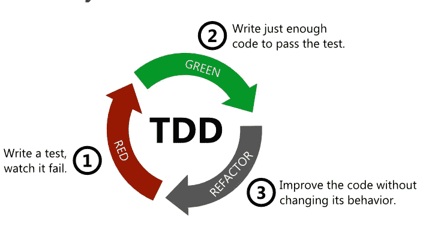

# 测试驱动部署介绍

> 原文：<https://blog.devgenius.io/an-introduction-to-test-driven-deployment-tdd-7f10f8cafb12?source=collection_archive---------10----------------------->

约翰·施诺布里奇在 [Unsplash](https://unsplash.com?utm_source=medium&utm_medium=referral) 上的照片

测试是部署任何网站或 web 应用程序的基本步骤，可以通过多种方式执行，遵循多种不同的方法*(查看我在* [*上的帖子《测试基础知识》*](https://medium.com/@simply_stef/code-based-testing-what-is-it-and-why-is-it-important-ae5b4f72026f) *了解更多信息)*

使用的测试方法因公司和个人而异，但是一个常见的方法是*测试驱动部署*或 TDD。

这篇文章将介绍什么是 TDD，如何使用它，以及为什么它是一个在 reach 产品之前帮助检测错误的好方法。

# 什么是 TDD？

TDD 是编写自动化测试脚本的过程，该脚本将在编写代码本身之前验证代码是否工作。虽然为还没有被编写的东西编写测试最初听起来很奇怪，但其中有一些坚实的逻辑(我保证)。

这个想法是，当开始编写一段实现代码时，首先要确定成功的目标是什么，例如，一个脚本将接受用户的输入，并将其格式化为不带空格的标题。然后，在编写实现该目标的函数之前，设置一个测试脚本，如果所有这些目标都满足，该脚本将通过。

脚本运行，自然会失败，因为实现代码不存在，然后开发程序。测试脚本可以在整个过程中运行，直到所有测试都通过。如果实现代码的目标改变了，测试脚本将在继续之前进行修改。

从[思考到编码](https://www.thinktocode.com/2018/02/05/what-is-tdd/)的 TDD 循环示例

简而言之，测试脚本驱动开发，而编写实现代码的目的只是让失败的测试脚本通过。

# 示例应用程序

这个过程用一个实例应该更容易理解。让我们假设一个客户想要更新他们的网站，使其具有将开尔文转换为摄氏度的功能。

jaros aw kwoczaa 在 [Unsplash](https://unsplash.com?utm_source=medium&utm_medium=referral) 上拍摄的照片

使用 TDD，您的第一步将是定义成功的标准，并为此编写一个测试脚本。例如:

*   如果没有返回错误，输入数字必须是正数(因为温度不可能低于绝对零度)
*   如果输入为 300K，则返回值 26.85degC

一旦编写了这个测试脚本，就将它链接到您的空白实现代码脚本并运行测试。测试应该会失败，因为您还没有编写转换。(如果测试通过，这表明您的测试脚本中存在错误，导致需要修复误报)

开始用测试脚本开发实现代码检查过程。当测试脚本通过时，目标就完成了。

如果在这个过程中，客户还想增加华氏温度，那么在停止和定义测试之前，您不应该处理这个功能。TDD 的一个基本部分是，如果不是为了解决失败的测试，就不会编写代码。

# 利益

使用 TDD 的主要好处已经在上面演示过了，但是还有以下几点:

*   该方法确保测试不会总是返回肯定的结果，因为第一次运行被设计为失败
*   所有的开发都集中在实现项目目标上，因为编写的唯一实现代码的目标是通过测试。
*   设计周期仍然集中在项目目标上，并且在代码中开发之前，使用成功标准设置适当地确定任何动态变化的范围。
*   错误可以在早期阶段被捕获，因为从项目的开始运行已经定义的测试代码是快速和容易的

总之，测试驱动开发是确保结果聚焦测试策略的强大方法。虽然在编写主程序之前设计一个测试脚本看起来不太直观，但是这种方法有很多好处。为了设计测试，开发人员必须对他们试图用他们的函数或脚本实现什么有一个清晰的认识，这只会在开始设计时有所帮助。此外，在早期阶段准备好测试脚本意味着在过程中更早地发现错误，而不是在一切都完成后才发现错误，从而降低返工成本。

> 如果你喜欢这篇文章并想阅读更多，一定要查看我的类似文章。考虑成为一个媒体成员，以获得无限的接触最好的想法和作家。
> 
> [***如果你通过这个链接加入 Medium，我会从你的费用中收取很少的一部分——而且不会花你任何额外的钱！提前感谢。***](https://medium.com/@simply_stef/membership) ***💰***
> 
> **感谢阅读！**