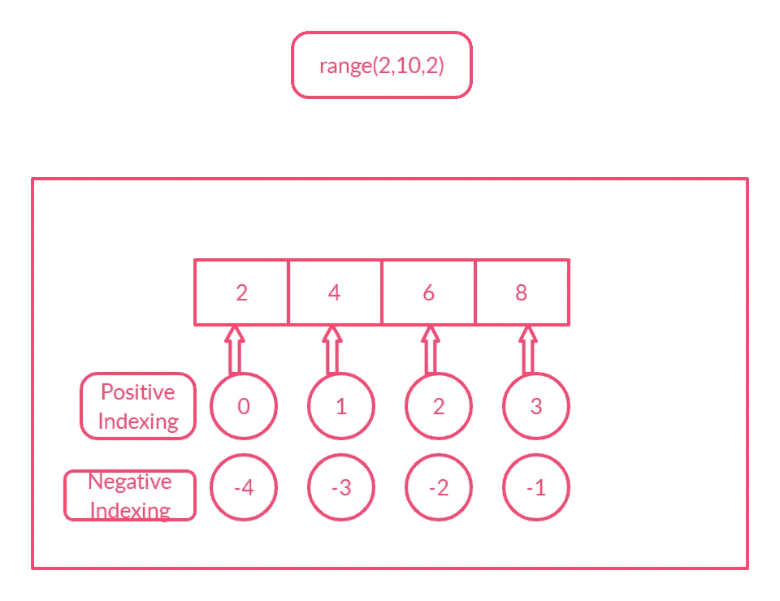

# Python 范围函数简介。

> 原文：<https://blog.devgenius.io/an-introduction-to-the-python-range-function-8dc8047161ef?source=collection_archive---------6----------------------->

## 我们来详细了解一下 python 的 range 函数。


照片由[在](https://unsplash.com/@drew_beamer?utm_source=unsplash&utm_medium=referral&utm_content=creditCopyText) [Unsplash](https://unsplash.com/?utm_source=unsplash&utm_medium=referral&utm_content=creditCopyText) 上绘制光束

# 范围:

> **范围**类型代表一个不可变的数字序列，通常用于在**循环中循环特定的次数。- [python 文档](https://docs.python.org/3/library/stdtypes.html#ranges)**

```
**range(stop)
range(start,stop,step)**
```

`**start**` *启动*参数的值(如果未提供该参数，则为`0`)

`**stop**` *停止*参数的值

`**step**` 第*步*参数的值(如果没有提供参数，则为`1`)。
如果步长为 0，将引发 **ValueError。**

range 函数的参数应该是整数。(内置`int`或任何实现`__index__`特殊方法的对象)

**例 1:只给出停止参数。**

`range(10)`

*   **默认启动**将为 **0** 而**默认步进**将为 **1**
*   `stop`给定为 **10** 。
*   不包括止损值。它只在 9 点之前产生价值。
*   它将返回一个 range 对象，包含从 **0 到 9** 的数字。
*   我们可以使用 **list()** 构造函数将 range 对象转换为 list。
*   我们也可以对循环使用**进行迭代**

```
r=range(10)
print (r)*#Output:range(0, 10)* print (type(r))*#Output:<class 'range'>* print (list(r))
*#Output:[0, 1, 2, 3, 4, 5, 6, 7, 8, 9]*
```

**例 2:只给出启动和停止参数。**

`**range(1,10)**`

*   **步的**默认会是 **1**
*   它将生成从 **1 到 9** 的数字序列。

```
r=range(1,10)
print (r)*#Output:range(1, 10)
#Converting range object to list* print (list(r))
*#Output:[1, 2, 3, 4, 5, 6, 7, 8, 9]*
```

**例 3:给定启动、停止和步进参数**

`range(1,10,2)`

*   它将从 **1** 开始产生一个序列，递增 **2** ，并在 **9** 处停止。

```
r=range(1,10,2)
print (r)*#Output:range(1, 10, 2)
#Converting range object to list* print (list(r))
*#Output:[1, 3, 5, 7, 9]*
```

例 4:我们也可以通过提到一个负数来减少步长。

`range(10,1,-2)`

*   它将从 **10** 开始产生一个数字序列，递减 **2** ，并在 **1** 处停止。
*   使用循环的**遍历范围对象。**

```
r=range(10,1,-2)
print (r)*#Output:range(10, 1, -2)* **for** i **in** r:
 print (i)
**'''Output
10
8
6
4
2
'''**
```

**例 5:**

```
r=range(0)
print (r)*#Output:range(0,0)* print (list(r))*#Output:[]* r1=range(2,2)
print (list(r1))*#Output:[]*
```

**例 6:步长给定为 0。它将引发 ValueError。**

```
r=range(1,10,0)
print (r)
*#Output:ValueError: range() arg 3 must not be zero*
```

**例 7:开始、停止和步进也可以是负数。**

```
r=range(-10,-20,-2)
print (list(r))
*#Output:[-10, -12, -14, -16, -18]*
```

**例 8:启动、停止和步进作为变量 a、b、c 给出**

```
a=1
b=5
c=2
r=range(a,b,c)
print (list(r))
*#Output:[1, 3]*
```

**例 9: range()函数不支持浮点数。它将引发 TypeError。**

```
r=range(2.0,10.0,2)
*#Output:TypeError: 'float' object cannot be interpreted as an integer*
```

## 范围对象上的常见序列操作:

1.  成员测试
2.  索引
3.  限幅
4.  len()
5.  最小值()
6.  最大()
7.  索引()

## 1.成员测试

可以使用 `in`和`not in`运算符进行成员资格测试。

s- `True`中的 x 如果 *s* 中的一项等于 *x* ，否则`False`

如果 *s* 的一项等于 *x* 则 x 不在 s- `False`中，否则`True`

**示例:**

```
a1=range(5)
print (3 **in** a1)*#Output:True* print (5 **not in** a1)*#Output:True*
```

## **2。分度**

在**范围**对象中也支持索引。

索引从`0`开始。索引 `0`表示序列中的第一个元素。

负索引从-1 开始。索引`-1`表示序列中的最后一个元素。



图片来源:作者

```
r=range(2,10,2)
print (r[0])*#Output:2* print (r[3])*#Output:8* print (r[-1])*#Output:8*
```

# 索引错误

试图使用过大的索引将导致 IndexError。

```
r=range(2,10,2)
print (r[4])
*#Output:IndexError: range object index out of range*
```

# 3.切片:

范围对象支持切片。

参考我的[索引切片的故事。](https://medium.com/python-in-plain-english/indexing-and-slicing-in-python-2d8387b47e75)

在切片中，我们可以指定一个索引范围。

```
s[i:j:k] — slice of *s* from *i* to *j* with step *k*
```

示例:`s[1:3]` —返回从第一个索引到第三个索引的元素(排除)。

```
r=range(2,10,2)
print (list(r[1:3]))
*#Output:[4, 6]*
```

## 4.len()

返回 range 对象中元素的个数。

**举例:**

```
r=range(2,10,2)
print (len(r))
*#Output:4*
```

## **5.min()**

返回 range 对象中的最小元素。

```
**r=range(2,10,2)
print (min(r))
*#Output:2* r1=range(-10,-20,-2)
print(min(r1))*#Output:-18***
```

## **6.max()**

返回 range 对象中最大的元素。

```
r=range(2,10,2)
print (max(r))
*#Output:8* r1=range(-10,-20,-2)
print(max(r1))*#Output:-10*
```

## **7.index()**

返回 range 对象中指定元素的索引。如果元素不在对象意味着的范围内，它将引发 ValueError。

```
r=range(2,10,2)
print (r.index(4))
*#Output:1* print (r.index(10))
*#Output:ValueError: 10 is not in range*
```

## 串联和重复运算符:

range 对象中不支持串联和重复运算符。

Range 对象只支持遵循特定模式的项目序列，因此不支持序列**串联或重复**。

*   **range 对象中不支持串联**。

```
r1=range(5)
r2=range(10)
print (r1+r2)
*#Output:TypeError: unsupported operand type(s) for +: 'range' and 'range'*
```

*   range 对象中不支持**重复**运算符。

```
r1=range(5)
print (r1*2)
*#Output:TypeError: unsupported operand type(s) for *: 'range' and 'int'*
```

## **使用 itertools.chain()进行串联**

Python 没有连接两个或更多范围对象的内置函数。我们可以通过使用 **itertools.chain()来实现这一点。**

> **chain():
> 它会将连续的序列视为单个序列。— [python 文档](https://docs.python.org/3/library/itertools.html#itertools.chain)`itertools.chain(*iterables)`**

**例如:**

```
**import** itertools
r=range(2,10,2)
r1=range(-10,-20,-2)
r2=itertools.chain(r,r1)
print (list(r2))
*#Output:[2, 4, 6, 8, -10, -12, -14, -16, -18]*
```

## **测距功能的优点:**

> 与常规的**列表**或**元组**相比， **range** 类型的优势在于，range 对象将始终占用相同(少量)的内存，无论它所代表的范围大小如何(因为它仅存储`**start**`、`**stop**`和**、**、`**step**`的值)。- [python 文档](https://docs.python.org/3/library/stdtypes.html#range)

## 结论:

1.  **范围**功能仅支持**整数。**(内置`int`或任何实现`__index__`特殊方法的对象)
2.  如果步长为 0，将产生**值错误。**
3.  **范围**功能不支持**串联**和**重复**。
4.  Python 没有连接两个或更多范围对象的内置函数。我们可以通过使用 **itertools.chain()来实现这一点。**

## 资源(Python 文档):

**普通顺序操作**

 [## 内置类型- Python 3.8.5 文档

### 以下部分描述了解释器内置的标准类型。主要的内置类型…

docs.python.org](https://docs.python.org/3/library/stdtypes.html#sequence-types-list-tuple-range) 

**范围**

 [## 内置类型- Python 3.8.5 文档

### 以下部分描述了解释器内置的标准类型。主要的内置类型…

docs.python.org](https://docs.python.org/3/library/stdtypes.html#ranges) 

**范围功能**

 [## 4.更多控制流工具——Python 3 . 8 . 5 文档

### 除了刚刚介绍的语句，Python 还使用了其他语言中常见的流控制语句，包括…

docs.python.org](https://docs.python.org/3/tutorial/controlflow.html#the-range-function) 

*关注这个空间，获取更多关于 Python 和数据科学的文章。如果你喜欢看我的更多教程，就关注我的* [***中***](https://medium.com/@IndhumathyChelliah) ，[***LinkedIn***](https://www.linkedin.com/in/indhumathy-chelliah/)***，***[***Twitter***](https://twitter.com/IndhuChelliah)***。***

感谢阅读！