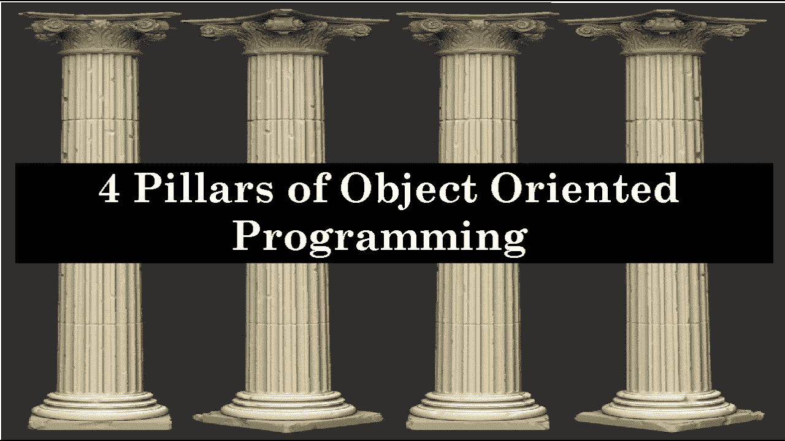
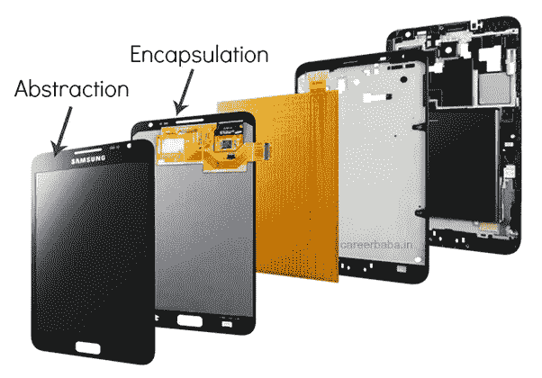

# OOPs 的 4 大支柱概述

> 原文：<https://blog.devgenius.io/an-overview-of-4-pillars-of-oops-a4874c43faf?source=collection_archive---------30----------------------->

面向对象编程是一种为了更好的可维护性和可重用性而编写代码的方法。坚持规则，让复杂的代码更容易开发、重用和维护。主要有四个概念可以帮助我们实现这一点，我们通常称它们为 OOPs 四大支柱。

在这篇文章中，我将用实时例子简单解释这 4 个概念。我将使用我在上一篇文章中用来解释类和对象的同一个例子。在继续之前，您可以阅读[和](https://saileshdhakal.com.np/posts/oops-concept)。



*图片提供:谷歌*

让我们从每一个的定义开始，然后通过例子来理解它们。

# **抽象化**

> 抽象是只向外界展示实体/对象的本质/必要特征，而隐藏其他不相关信息的过程。

现在让我们看看这个例子，试着把它和定义联系起来

我们上一篇文章中那个制作智能手机的家伙后来也为他最好的朋友做了一个。他的朋友第一次看到它，不知道该怎么办。这个人简单地向他解释说，他可以将这个设备用于多种用途。如果你想打电话给我，只要从这里拨我的号码，然后按这个按钮。如果你想拍照，打开相机，点击这个按钮。用视频键记录美好瞬间。这个人解释了玩游戏、看电影、听广播等等的程序。他很高兴得到它，并在那里开始拍照。他不知道那东西内部是如何工作的，他甚至不需要知道。

他需要了解界面，即屏幕，以及如何通过它访问不同的功能。从这里，我们可以说 phone 的**实现已经从接口**中抽象出来，以使其更容易和有效地使用。

回到定义上来，抽象是只向外界显示实体/对象的基本/必要特征(带有访问特征的图标的屏幕)并隐藏其他不相关信息(使这些特征可用的所有硬件和软件组件)的过程。

将它与编程联系起来，我们通过使用**接口和抽象类**来实现抽象。我将在接下来的文章中详细介绍接口和抽象类。

> *简而言之，抽象通过将接口从实现中分离出来降低了代码的复杂性。它让我们专注于对象做什么，而不是它如何做。*

# **封装**

> 封装意味着将数据(属性)和成员函数(方法)包装在一个单元中，以保护数据的值或状态免受外部干扰和误用。

让我们继续这个例子。开发的智能手机有一个摄像头。相机实际上是使用一些电缆安装在主板上，并被编程为执行不同的操作，如放大、缩小、聚焦、模糊等。这个家伙想捕捉离他很远的物体。为此，他在屏幕上拖动两个手指，放大物体。但在内部，手机如何能够解释这些人类手势来操作相机硬件和改变焦距是未知的。

这个人不需要知道相机是如何工作的，但是他肯定知道当他在屏幕上把两个手指分开时物体会放大。

回到定义上来，封装意味着将数据(属性)和成员函数(方法)一起包装成一个单元(硬件组件、软件和接口作为一个组件)，以保护数据(内部操作)的值或状态免受外部干扰和误用(通过根据我们的选择提供接口)。我们总是可以控制用户可以执行的操作。

与编程相关，封装是使用类来实现的。我们通常在属性上定义访问权限(使用访问修饰符),并使从该类之外的方法访问它们是非法的。该属性的值只能通过该类的公共方法在类外部访问。

> *封装和抽象的意思听起来可能相似，但是封装是实现抽象的方法。换句话说，封装是抽象子集。封装基本上是拒绝对内部实现的访问或对外部世界内部的了解，而抽象是给出任何有助于外部世界与之交互的实现的通用视图。*



*图片提供:谷歌*

# **继承**

> 继承是从现有类创建新类的能力。继承允许一个类(子类)获得另一个类(超类)的属性和行为，它可以有额外的属性或行为。

让我们试着用例子来理解它。我们看到这个家伙创造了一个智能手机，他可以用它打电话、拍照、玩游戏、存储照片和视频等等。长此以往，他厌倦了，想增加更多的功能。他想到添加一个移动路由器，通过 WiFi 连接到互联网，使用指纹传感器和音频插孔连接到耳机或头戴式耳机，为他的手机提供安全性。为了创建这个，他不需要从头开始，因为他已经创建了一个提供其他功能的电话。他可以利用当前电话中已经建立的那些特征，并通过添加新特征来增强它。他可以简单地将这些额外的硬件和传感器添加到他的手机中，并覆盖这些行为以添加一些新功能。最后，他用较少的努力创造了一个新的，并命名为最聪明的。

回到定义，继承是从现有类(智能手机)中创建一个新类(最聪明的)的能力。继承允许一个类(子类)获得另一个类(超类)的属性(相机、屏幕、存储、电池等)和行为(看电影、玩游戏等)，并且它可以具有附加属性(移动路由器、指纹传感器、音频插孔)或行为(连接到互联网、锁定设备、连接耳机)。

在编程中，继承有不同的方式。每个细节都不在本文讨论范围之内。

*   **单一继承**
*   **多级继承**
*   **多重继承**
*   **层次继承**

# **多态性**

> *多态性*是一个对象呈现多种形式的能力。

例如，让我们以智能手机中的电源按钮为例。当我们的手机被锁定时，按下电源键可以唤醒我们的手机。然而，如果手机已经唤醒，按下相同的按钮将锁定屏幕。所以同一个按钮的行为根据手机的状态是不同的。

这个家伙还想把他最好朋友的电话号码存到他的手机里。他可以将号码保存在其朋友的联系人姓名下，或者甚至可以将多个号码保存在同一联系人姓名下。

假设，他的朋友有单个号码，那么保存联系人的操作可能是这样的:

```
*SaveContact(name, phone)*
```

如果他有多个联系号码，那么操作将如下所示:

```
*SaveContact(name, phone1, phone2)*
```

回到定义上来，多态是一个对象采取多种形式的能力(相同的开关按钮，相同的存储一个或多个联系人的方法)

在编程中，有两种类型的多态性，即:

*   动态多态性/运行时多态性
*   静态多态性/编译时多态性

使用**方法覆盖实现动态多态性。**方法的行为将在运行时决定。我们可以把电源按钮的第一个例子看作是动态多态

静态多态性可以通过使用**方法重载**来实现。方法的行为将在编译时决定。我们可以把第二个例子看作静态多态性。

*希望我能够帮助你理解这些概念。我将带来更多与 OOPs 概念相关的帖子。继续阅读:)*