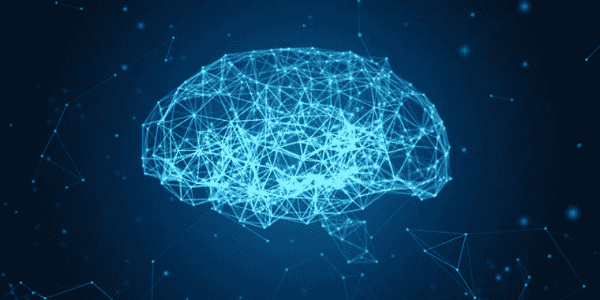
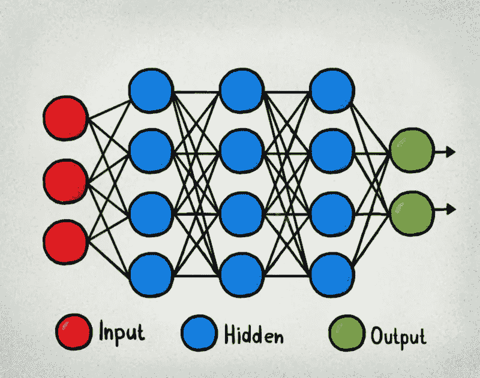
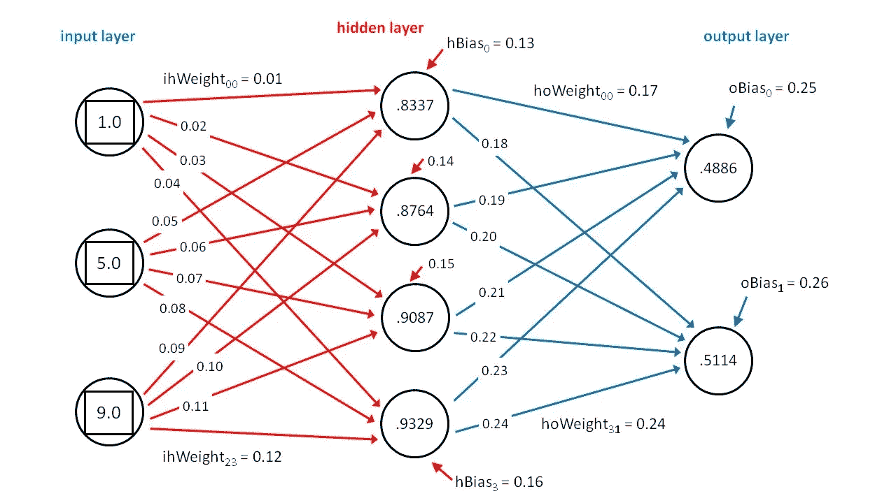

# 人工神经网络综述

> 原文：<https://blog.devgenius.io/an-overview-of-artificial-neural-networks-d3b5c9204f19?source=collection_archive---------13----------------------->

计算机大脑的摘要插图-马林·奥特马尼

A 机器学习(人工智能)中的人工神经网络(ANN)是算法的复杂化合物，它们以有组织的方式工作，以提取给定数据集的标签或结果。据信，这项技术类似于人类中枢神经系统(CNS)中神经元的生物排列；其中一组神经元将刺激传递到另一组神经元，从而将它们与另一组神经元相关联，直到大脑开始解释刺激并引发反应。每种算法的化合物都模拟了一个人类神经元(神经细胞)，它与兄弟算法的其他化合物相连，以进行计算和传输信息。虽然这种[与脑细胞]的比较是非正式的，因为我们还不太确定人类中枢神经系统是如何错综复杂地工作的，因此我们不能简单地将其与人工神经网络进行比较，后者在智能、果断性和独创性方面显然是不称职的。这就是为什么有些人会告诉你，计算机永远不可能像人类一样聪明，或者至少不可能拥有相同类型的自然[有生命的]智能，因为人工神经网络本身就是这些[人工智能]计算机的模拟大脑，似乎还不能与人脑相比。然而，当涉及到数据(或信息)处理时，我们今天拥有的人工智能以及我们对未来的感知非常令人印象深刻。这可能是计算机超越人类的冠军，因为今天，我们可以让 1GB 的计算机处理存储数据的速度比人类学生快得多——当然，如果学生拥有人工神经网络这样的超能力，他们就不会对记住考试中的东西感到困惑。那么，如果人工神经网络确实在数据处理方面有能力，这一优势在今天的人工智能中产生了很多令人惊叹的东西，它们是如何做到的呢？

一个典型的人工神经网络(人工智能的大脑)由几个、几十个、几分、几千个甚至上百万个被称为**单元**—**的人工神经元组成，就像人脑有数十亿个脑细胞一样。人工神经网络的单元排列在一系列层中，每一层都连接到两侧的层。**

由三层隐藏的人工神经元组成的神经网络。

从上面的图像中，我们看到了这些层的排列。第一层接收人工神经网络试图识别和处理的数据、输入或信号(如果是传感器的话)——因此，它被称为**输入层**。就在最后一层之前的下一组层被称为**隐藏层**，由其他人工神经元组成，这些人工神经元从输入层获取处理后的结果，对它们进行重新处理。最后一层是**输出层**，它简单地输出前几层的计算结果。简单的人工神经网络，如**感知器**，由一个人工神经元输入层、一个或几个人工神经元隐藏层和一个人工神经元输出层组成。其他复杂的人工神经网络将由数十、数百、数千和数百万个隐藏层组成，以便它们从一层(输入层)获得输入或原始信息，通过内部非常丰富的无数层对其进行处理，然后通过最后一层(输出层)给出计算结果——这些被称为**深度神经网络** (DNN)。

神经网络除了其众多的层之外，还具有更复杂的结构和每层的单个人工神经元之间的连接。每个人工神经元，即一层中的一个单元，可以与下一层的一个或多个人工神经元相连，如前一幅图所示。人工神经元之间的连接由称为**权重**的单个数字表示，权重可以是正的，也可以是负的，这取决于网络中哪个人工神经元接替了另一个人工神经元。权重较大的人工神经元在计算中的影响会比权重较小的人工神经元更大——这恰好是脑细胞通过称为突触的微小间隙相互触发的方式。**偏置**是赋予每个人工神经元的常规值。

人工神经网络中的权重和偏差

每个人工神经元都有自己的号码与之相关联，称为**激活**。这个数字代表人工神经元，也用于它的计算。在连接的激活、权重和偏差之间存在复杂的计算，以获得网络中目的人工神经元的值(或激活)。诸如 **sigmoid 函数**、**整流线性激活单元、简称为**的 ReLU 函数、**阈值函数**和**双曲正切函数**的数学函数被用作完成这些计算**的算法的基础。**这些函数中的每一个都旨在通过计算具有给定偏差的连接单元的乘积之和来计算网络中目的人工神经元的值。第一个隐藏层获取其中单个人工神经元的值，并将这些值传递给后续隐藏层的计算——就像化学中的链式反应一样。这篇论文的目的不是剖析计算机大脑中的数学逻辑流程，而是让你了解我们如何使用机器学习来构建人工智能大脑的概述——因此，我们将简要讨论人工神经网络的应用，这是一种不太抽象的东西；我不想用数学来烦你(在这篇“综述”中)。

人工神经网络(ANN)用于识别系统，如语音识别、手写或文本识别、计算机视觉，以及自然语言处理(对话机器人使用的)。我们无法列出神经网络的所有应用，因为我们还不知道人工智能本身的局限性。人工神经网络是人工智能系统的大脑，任何声称应用人工智能但其代码背后没有算法神经网络的计算机程序就像一些活着但没有大脑的无脊椎动物一样。发达国家和一些发展中国家的警察部门在他们的计算机视觉系统中使用人工神经网络来从他们的交通摄像机中识别汽车的牌照号码。这些系统可以检测汽车的速度或司机是否违反任何交通法规，只需通过数学计算它们的速度。他们捕捉警察将从系统中获得的那辆汽车的牌照号码；因此，法律不需要为寻找罪犯或起诉无辜者而困惑，人工智能可以获得罪犯的确切车牌号码和其他必要的细节。

人工神经网络有几种类型，但最常见的有**卷积神经网络(CNN)、前馈神经网络(FNN)、递归神经网络(RNN)、模块化** **神经网络(MNN)** 、 **Kohonen 自组织神经网络、
径向基函数神经网络、**等等。这些网络受到生物大脑概念的启发，尽管我们看不到任何明显的相似之处。基本上，它们在抽象结构、功能和用途上是不同的。

在很大程度上，更高的数学知识对于任何渴望从事人工智能大脑领域的程序员来说都是必不可少的，但似乎一切都有更便宜的替代选择。有些 python 程序可以在这些神经网络中编写，而不需要程序员了解使算法工作的所有数学逻辑和归纳，因此，如果他们愿意，他们可以学习更多关于这个领域的知识。顺便说一下，人工神经网络不断发展，我们每天都看到更好的计算，因为人工智能不断学习。很快，即使人工智能，在我看来，肯定不会有人类类型的智能，但将会有难以与人类行为区分的计算机行为。