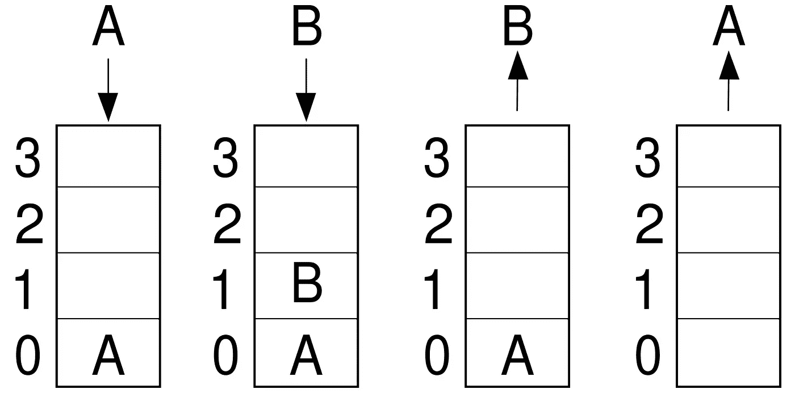
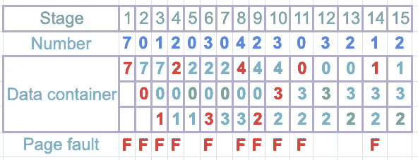
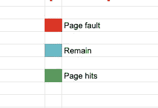

# 缓存及其策略概述

> 原文：<https://blog.devgenius.io/an-overview-of-cache-and-its-policy-542bc40a8cbf?source=collection_archive---------1----------------------->

## 缓存和最流行的缓存回收策略

在 [Unsplash](https://unsplash.com?utm_source=medium&utm_medium=referral) 上由 [Vladimir Mokry](https://unsplash.com/@vmokry?utm_source=medium&utm_medium=referral) 拍摄的照片

缓存意味着将频繁的数据放在更近的地方以便访问。这有助于流程更快地访问这些数据。随处缓存被广泛使用。你会发现几乎没有大公司不使用缓存。了解这些会对你有很大帮助。

# 让我们有一个想法

假设你带着一个特定的想法在做研究，为此，你从许多书中获得帮助。所有的书都在你家的图书馆里。每次你需要一本书的时候，你需要去图书馆然后把它带来。这既费时又麻烦。

现在，如果你知道这种研究可能需要这些特定的书，那么你可以一次把它们都带来，放在你的桌子上。这样你就不需要一次又一次地去图书馆了。现在你的进程比以前快多了。

这正是缓存的作用。您只是缓存了您经常需要的东西来加快您的进程。

照片由[王思然·哈德森](https://unsplash.com/@hudsoncrafted?utm_source=medium&utm_medium=referral)在 [Unsplash](https://unsplash.com?utm_source=medium&utm_medium=referral) 拍摄

# 缓存回收策略

你可能会想，为什么我应该替换缓存中的东西？事实上，缓存太贵了。显然你有一个极限。整个数据不能存储在高速缓冲存储器中。

假设您的缓存有 100 个数据的容量，而您刚刚超过了您的限制。缓存会自动删除一个。你最好定义规则。还有更多的既定政策。一些受欢迎的政策是

*   先进先出
*   后进先出法
*   最近最少使用(LRU)
*   时间感知最近最少使用(TLRU)
*   最近使用的(MRU)

# 先进先出

照片由 [Levi Jones](https://unsplash.com/@levidjones?utm_source=medium&utm_medium=referral) 在 [Unsplash](https://unsplash.com?utm_source=medium&utm_medium=referral) 上拍摄

FIFO 的行为与我们在数据结构中使用的 FIFO 相同。先进先出我们的方法是，当缓存已满时，先来的人必须先走。缓存按照块添加的顺序驱逐块。没有其他优先权在这里不适用。数据有多重要或者数据被使用的频率有多高并不重要。

下面是 C++中管理 FIFO 的代码部分。请看一看。

所以这不是缓存管理中使用策略。有时候这是有用的。取决于你的需要。

# 后进先出法

这和 FIFO 正好相反。这个也是熟悉数据结构知识的。当缓存已满时，最后来的人将先走。这不是一个流行的缓存策略。想想现实生活中的问题。我们不需要像往常一样使用后进先出法。

图片来源: [Wiki](https://de.wikipedia.org/w/index.php?title=Datei:Lifo.svg&filetimestamp=20090108115010&)

下面是一段 C++代码。请看一看

[来源](https://www.geeksforgeeks.org/lifo-last-in-first-out-approach-in-programming/)

# 最近最少使用(LRU)

LRU 策略首先弹出最近最少使用的项目。该算法始终跟踪数据使用情况，并保留最近最少使用的数据。下面是一个例子。假设我们有一个 701203042303212 的序列。这是一个接一个的数据序列。

## 页面错误

如果数字不在数据容器中，则发生页面错误。我们在数据容器中将其标记为红色，还有一个页面错误列，表示页面错误发生在哪个阶段。

## 页面点击量

如果该数字已经在数据容器中，则发生页面点击。当页面点击发生时，我们把它们变成绿色。

## 页面的其余部分

我们为剩下的页面设置了浅蓝色。

下面是颜色的定义。

LRU 是缓存管理中使用最广泛的驱逐策略之一。

# 时间感知最近最少使用(TLRU)

TLRU 是 LRU 的另一种变体。不同的是，数据有一个有效的生命周期，另一方面，LRU 没有这样的条件。TLRU 主要用于网络缓存系统，如信息中心网络(ICN)、内容交付网络(cdn)和一般的分布式网络。

# 其他人

你还会发现更多的驱逐政策。首先，找出你需要什么，然后选择符合你要求的驱逐政策。如今，大型知名公司会问很多关于缓存及其政策的问题。这些知识也会对你有所帮助。

# 包裹

在这里，我们可以找到缓存的基础知识及其一些策略。知道这些对你以后会有帮助。感谢您的阅读。

参考:【https://en.wikipedia.org/wiki/Cache_replacement_policies 