# 推荐系统概述—第一部分(背景)

> 原文：<https://blog.devgenius.io/an-overview-of-recommendation-systems-part-1-cdc4caae8a14?source=collection_archive---------6----------------------->

> 作者:Shahram Akbarinasaji
> 网站:[https://www.akbarinasaji.com](https://www.akbarinasaji.com)

在这篇文章中，我们将了解推荐系统，什么是推荐引擎，它们在何时何地最常用，以及存在哪些不同类型的推荐引擎。

# 什么是推荐系统？

推荐系统是机器学习在商业中最成功和最广泛的应用之一，它为用户和企业带来了巨大的好处。简而言之，推荐系统是试图发现交互模式的数据过滤工具。你在任何平台上执行的操作，例如，在网飞上看电影，在亚马逊上购买产品，或者在 booking.com 上给酒店评分，都是交互的例子。学习这些交互中可用的模式有助于通过提供定制和个性化的内容来解决信息过载问题。然后，推荐系统将对这些商品进行评级，并引导消费者只购买他们可能感兴趣的产品或服务。传统上，这些建议来自与销售人员的讨论、与朋友或家人的交谈。然而，如今计算机和算法已经超越了这一职责。

# 谁从推荐系统中受益？

推荐系统是救生员，也是众多在线服务(尤其是内容和产品提供商)无限沸腾的海洋中的关键组成部分。各个领域的在线服务都受益于推荐系统。这些领域可能包括:

*   电子商务:亚马逊、Booking.com 等。
*   社交媒体:Instagram、脸书等。
*   在线视频流:网飞，渴望等。
*   其他:新闻服务、工作列表等。

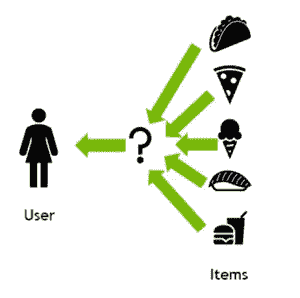

你可能想知道企业是否只从推荐系统中受益。答案是否定的。对消费者来说，推荐系统的优点包括改善了客户体验，消除了选择的专制，并使决策更加顺畅。另一方面，这些系统促进了企业的在线销售。

# 数据源

我们可以使用来自用户和项目的显式和隐式信息的数据组合作为数据源。推荐系统有两种主要类型的数据:

**用户-项目交互:**

*   关于评级的信息
*   关于购买项目的信息
*   关于帖子赞的信息，

**特征信息:**

*   关于项目的信息，如类别、关键字等。
*   用户及其偏好和简档。

# 传统推荐系统

传统系统有两种主要类型:

*   协同过滤:建立在用户-项目交互数据之上。
*   基于内容的过滤:使用特征信息数据构建。

# 协同过滤

协同过滤通过收集许多用户的历史偏好(协作)来自动推荐(过滤数据)用户的兴趣。它使用用户偏好行为的相似性，给定用户和项目之间的先前交互。

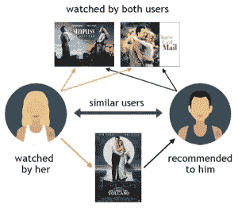

这张图片向我们展示了协同过滤系统是如何工作的。但是，我们需要将这个图像转换成机器可读的格式。为此，我们将创建一个用户项目矩阵，如下所示。

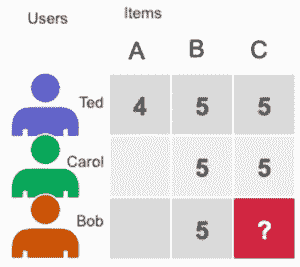

这个矩阵的行显示用户，矩阵的列显示列。矩阵中每个单元格内的值显示了每个用户对特定项目的评分。例如，“Ted”将项目“C”评为 5 级。目标是估计矩阵中的未知值，例如，“？”的值是多少。

基于这个矩阵，既然“Ted”和“Carol”把“B”和“C”评价为 5，“Bob”把“B”评价为 5，那么也许应该把“C”推荐给“Bob”。

我们可以用“矩阵分解”和“交替最小二乘法”来解决这个问题。该算法将稀疏的用户-项目评级矩阵(U x P)近似为两个密集矩阵(大小为(U x F)和(F x P)的用户和项目因子矩阵)的乘积。

*   u:用户数量
*   f:潜在特征的数量
*   p:项目的数量

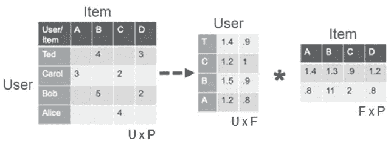

因子矩阵代表算法试图发现的潜在或隐藏的特征。用户矩阵试图揭示每个用户的隐藏属性，项目矩阵试图发现每部电影的潜在属性。ALS 反复学习代表用户或物品的数字因子。在每次迭代中，一个因子矩阵保持固定，而另一个将被优化。这里的目标是最小化损失函数，最小二乘，相对于另一个。我们将不得不继续这一进程，直到趋同。

例如，假设我们有一个用户项目评级矩阵，如下所示。矩阵 U 是用户潜在特征矩阵，矩阵 P 是项目潜在特征矩阵。为了简单起见，在这个例子中，潜在特征的数量(F)被选择为 1。

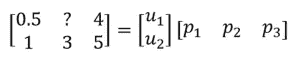

用任意值初始化矩阵 U，然后尝试求解矩阵 p。在这种情况下，为了计算的清晰性，我们选择了值 1:

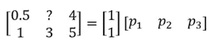

这给了我们 5 个等式:

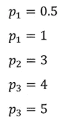

然后我们将求解:

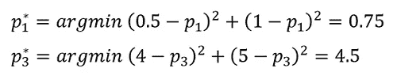

我们对矩阵 P 的估计是:

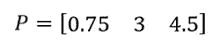

现在，我们必须在下一次迭代中使用矩阵 P 来求解矩阵 U:

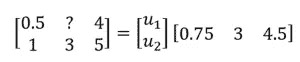

我们将再次有另外 5 个等式:

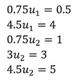

如果我们求解这些方程并重复相同的过程 20 次迭代，我们将得到以下结果，这是对原始用户-项目矩阵的估计。使用该矩阵，我们可以发现用户 1(第 1 行)可能会将项目 2(第 2 列)评分为 1.897，并且基于该值，我们可以决定项目 2 是否是用户 1 的好建议。

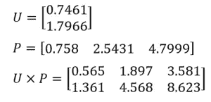

# 基于内容的过滤

基于内容的过滤使用项目的属性或特征以及用户简档特征来推荐与用户偏好相似的其他项目。这是基于项目和用户特征的相似性，给定关于用户和他们已经交互的项目的信息:

*   人口统计:年龄、性别等。
*   餐馆菜肴的种类
*   电影的类型:喜剧、戏剧等。
*   一部电影的平均评论

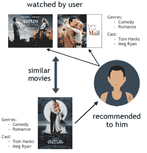

有两种方法计算相似性:

**余弦相似度**

该算法找到轮廓向量和项目向量之间的角度的余弦。这个分数的范围在(-1，+1)之间。

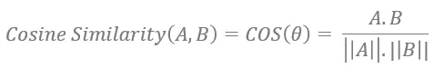

其中:

*   答。B 是矢量 A 和 B 的点积
*   ||A||是向量 A 的范数
*   ||B||是向量 B 的范数

最后，我们必须按降序排列分数。对于项目建议，我们可以使用

*   前 n 名方法:挑选前 n 名分数作为建议。
*   评级尺度方法:挑选分数高于预定阈值的项目。

**欧几里德距离**

在欧几里德距离中，相似的项目在 n 维空间中彼此非常接近。我们可以计算项目之间的距离，并使用它向用户推荐项目:

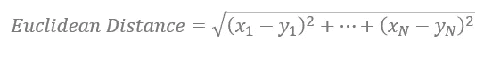

欧氏距离的缺点是在高维空间中性能下降，限制了它的应用范围。

# 协作过滤与基于内容的过滤

在本节中，我们比较了协作过滤和基于内容的过滤。

协作过滤:

*   简单易行。
*   需要每个交互的用户 id 和项目 id 作为输入。
*   在提供有意义的推荐之前，需要最少的交互次数，否则不相关的推荐将被提供给新用户。
*   遭受数据稀疏和冷启动问题。

基于内容的过滤:

*   仅单独利用每个用户的交互
*   很好地处理了用户冷启动问题。
*   倾向于产生过滤器气泡问题。过滤气泡是这样一种情况，其中系统仅推荐与用户之前交互过的项目非常相似的项目。

# 新变体

# 混合推荐系统

顾名思义，这些系统结合了所讨论的传统系统的优点来创建更全面的推荐系统

# 上下文感知推荐系统

这些系统利用用户的当前环境，如操作系统、日期、时间、时区、地区等。做一个预测。

# 基于会话或序列的推荐系统

在这一类别中，推荐引擎在推荐过程中使用会话内的用户项目交互序列。该系统可以预测在线购物车中的下一件商品，或者预测序列中要观看的下一个视频。

# 更强大的推荐系统

深度学习是机器学习的一个子领域，在图像识别、序列建模、自然语言处理等多个领域取得了巨大成功。推荐系统也从这一成功中受益。出于多种原因，有必要从传统的机器学习模型过渡到高度表达的深度学习模型。第一个原因是可用数据量的增长。下一个也是更重要的一个是处理复杂的交互模式以进行特征提取。交互的复杂性显著增加，简单的线性函数无法发现这些模式。因此，我们需要更强大的系统来学习这些模式，并提高最能反映用户偏好的推荐质量。

深度学习生命周期可以分为两个阶段，即训练和推理。

# 培养

在训练阶段，模型被训练来预测用户-项目交互概率。为此，我们需要向模型呈现用户和项目之间交互(或非交互)的历史示例。

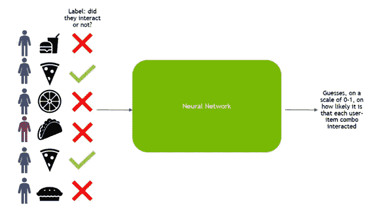

# 推理

一旦模型被充分训练，我们就可以把它作为服务来部署，以推断新交互的可能性。

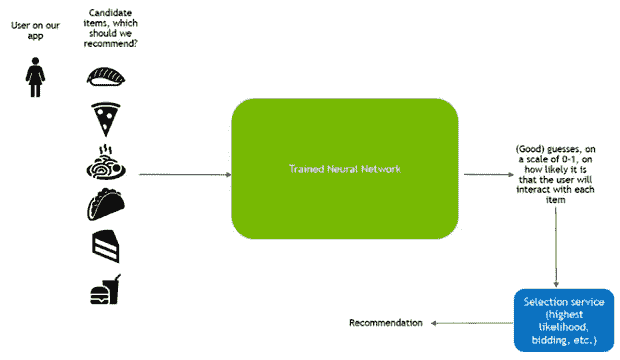

推理阶段的数据消耗包括三个相继出现的主要阶段:

*   候选生成:根据学习到的用户-项目相似性，将用户与数百或数千个候选项目配对。
*   候选排名:对用户喜欢每个项目的可能性进行排名。
*   过滤:向用户展示他们最有可能喜欢的项目。

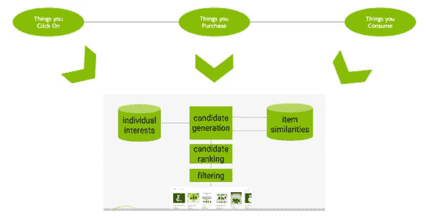

# 神经网络结构变化

在本节中，我们回顾了一些著名的人工神经网络(ANN)架构，它们可用于推荐目的。人工神经网络(ANN)有不同的变体。

# 前馈神经网络

前馈神经网络是一种神经网络(NN ),其中信息仅从一层前馈到下一层。

# 多层感知器(MLP)

多层感知器(MLP)是一种至少有三层的前馈，即输入层、隐藏层和输出层。这些是灵活的网络，可以应用于各种场景。

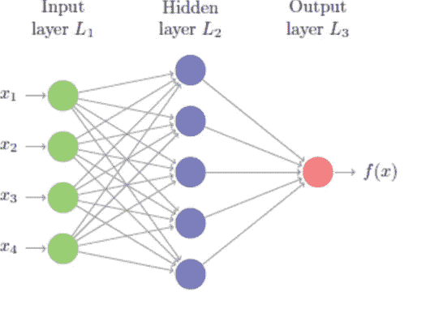

# 卷积神经网络(CNN)

鉴于有效的特征提取，CNN 架构非常适合于非结构化多媒体数据处理。这种架构可用于处理多媒体数据，如图像、文本、音频和视频。CNN 最擅长的是识别图像中的物体。

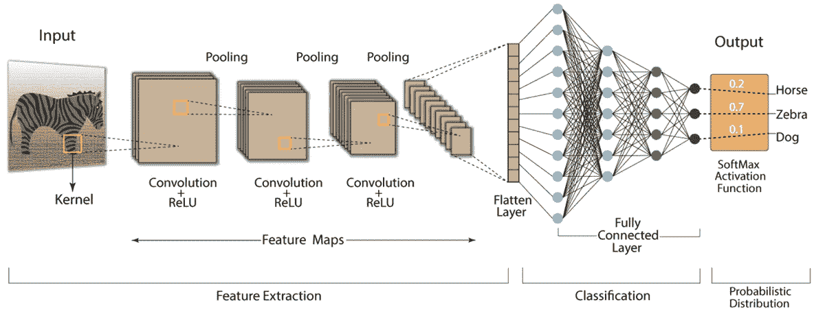

# 递归神经网络(RNN)

RNNs 可以被视为解析语言模式和序列数据的数学引擎。它们是顺序数据处理的杀手级特性，定义了交互的时间动态和顺序用户行为模式。我们可以利用 RNN 来构建基于会话的推荐。

但是，在推荐系统中使用 RNN 时，我们需要注意一些限制。我们可能需要用户登录来跟踪导航，或者使用 cookie 机制来代替。

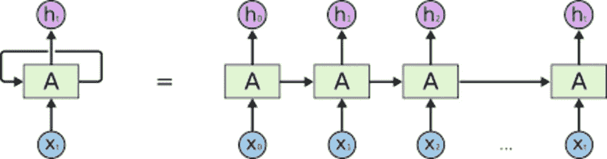

虽然还有许多其他的架构可以使用，但我们只提到了几个著名的架构。我强烈建议看一看[4]中的架构的完整列表。

这是这篇关于推荐系统的博文的第一部分。在下一篇文章中，我们将回顾著名的神经协同过滤(NCF)的架构。

**参考文献**

[1][https://medium . com/sci force/inside-recommendations-how-a-recommenders-system-recommenders-9 AFC 0458 BD 8 f](https://medium.com/sciforce/inside-recommendations-how-a-recommender-system-recommends-9afc0458bd8f)

[2][https://developer . NVIDIA . com/blog/how-to-build-a-winning-recommendation-system-part-1/](https://developer.nvidia.com/blog/how-to-build-a-winning-recommendation-system-part-1/)

[3][https://en.wikipedia.org/wiki/Collaborative_filtering](https://en.wikipedia.org/wiki/Collaborative_filtering)

[4][https://developer . NVIDIA . com/blog/how-to-build-a-winning-recommendation-system-part-2-deep-learning-for-recommender-systems/](https://developer.nvidia.com/blog/how-to-build-a-winning-recommendation-system-part-2-deep-learning-for-recommender-systems/)

[5][https://towards data science . com/deep-learning-based-recommender-systems-3d 120201 db7e](https://towardsdatascience.com/deep-learning-based-recommender-systems-3d120201db7e)

[6][https://medium . com/sci force/deep-learning-based-recommender-systems-b 61 a5 DDD 5456](https://medium.com/sciforce/deep-learning-based-recommender-systems-b61a5ddd5456)

[https://sophwats.github.io/2018-04-05-gentle-als.html](https://sophwats.github.io/2018-04-05-gentle-als.html)