# AWS EC2 终极假人指南

> 原文：<https://blog.devgenius.io/an-ultimate-dummies-guide-to-aws-ec2-87e300b2f4a6?source=collection_archive---------2----------------------->

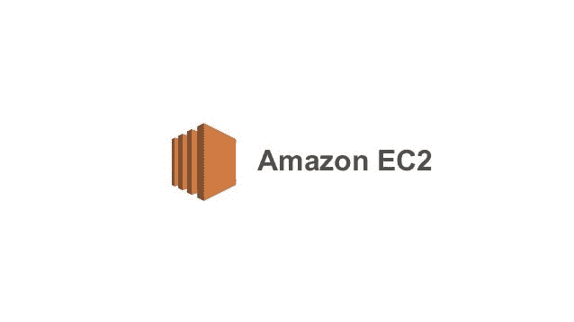

这是我写的关于虚拟云的系列文章中的第二篇，我用一个实际例子详细解释了不同的服务。

# **未发起的发起**

EC2 是 AWS 提供的一种计算服务的简称，它是 T2、T4、计算机、计算机的缩写。使用 EC2，您只需在 AWS 云上点击几下鼠标，就可以部署服务器。还有呢？服务器的安全、维护和保养也可以自动化([见此处](https://docs.aws.amazon.com/systems-manager/latest/userguide/systems-manager-patch.html))。听起来不错，对吧。

无论您是业余爱好者、初创企业、中型企业还是大型企业，AWS 提供的机器系列都能满足每个人的需求。

有了这个，让我们深潜。

**本文的结构涵盖了以下几个方面**

a.EC2 的一些业余爱好者用例

b.AWS 在 EC2 上的免费层优势

c.关于如何使用 AWS 控制台创建 EC2 实例的教程

d.如何在 EC2 中运行一个简单的 web 服务器

我希望您对云计算和 AWS 帐户有所了解，以便继续学习。如果您还没有 AWS 帐户，您可以立即在下面创建一个。

 [## AWS 控制台-注册

### 编辑描述

portal.aws.amazon.com](https://portal.aws.amazon.com/gp/aws/developer/registration/index.html?nc2=h_ct&src=default) 

起初，对于一些人来说，我为什么应该在云上拥有一台计算机，或者就此而言，当我需要时，我如何才能访问计算机，这可能会令人困惑。我将用适当的例子来阐述这些观点。

**业余爱好者在云上使用计算机/服务器的一些情况:**

1.  你可以在云上运行你自己的个人网站。(这并不是唯一的方法，但是使用 EC2 实例运行简单的 web 服务器会带来额外的好处)

这里有一篇我写的关于使用 AWS S3 托管一个简单网站的文章，如果你感兴趣的话。

[](https://rajesh-r6r.medium.com/hosting-a-free-website-on-aws-s3-with-freenom-domains-for-dummies-a363aac39b1e) [## 在 AWS S3 上托管一个免费网站，为傻瓜提供免费域名

### 这是我的傻瓜指南系列教程的一部分。

rajesh-r6r.medium.com](https://rajesh-r6r.medium.com/hosting-a-free-website-on-aws-s3-with-freenom-domains-for-dummies-a363aac39b1e) 

2.在云上运行您的机器学习工作负载。虽然这可能需要一台质量更好的机器，花费您几美元，但它比运行一台本地机器的成本低得多。

3.您可以从世界任何地方访问的个人云计算机。即使是从您的电话，只要您安装了终端客户端。稍后会详细介绍。

**对于小型创业公司或企业工作负载，这样的例子不胜枚举。**

**AWS EC2 中的自由层:**

像它的许多服务一样，AWS 在 EC2 中提供了一个免费层。如果您想了解更多详情，请访问[此处](https://aws.amazon.com/free/?all-free-tier.sort-by=item.additionalFields.SortRank&all-free-tier.sort-order=asc)

对于本文，让我们关注 EC2。

1.  在 12 个月内，您可以在 Linux 版本实例和 Windows 实例上分别获得 750 小时的免费计算时间

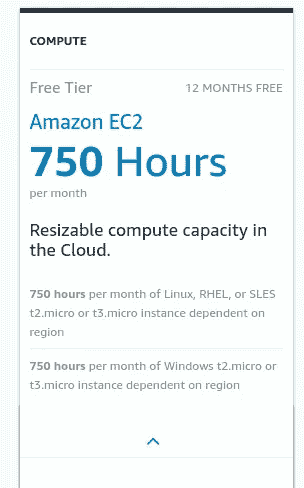

EC2 自由层

2.从技术上讲，您可以在 12 个月内完全免费运行两台服务器，一台 Linux 服务器和一台 Windows 服务器，前提是您仅限于免费层中指定的实例类型。

现在让我们理解什么是实例类型。

**AWS EC2 中的实例类型**

下面是了解 AWS EC2 的最佳资源之一(尽管非官方提供了更好的功能来缩小实例类型以满足您的需求)。

 [## Amazon EC2 实例比较

### 名称 API 名称内存计算单元(ECU)GPU GPU 型号 GPU 内存 CUDA 计算能力 FPGAs 每个 vCPU 的 ECU 物理…

ec2instances.info](https://ec2instances.info/) 

通常，在自由层中，您将获得 t2 个微实例，它们对于简单的工作负载来说绰绰有余。如果你在寻找更好的 CPU 和内存配置(**我指的是 RAM 而不是存储**)，你可以随时调整你的镜像配置以获得更好的配置。

**存储在 AWS EC2 中**

EC2 中的存储由 **EBS 或电子块存储**AWS 的另一项服务提供。免费层实例没有内置存储。但是使用 EBS，您可以拥有高达 30 GB 的存储空间(SSD / GP 2 磁性)。稍后会详细介绍。

通过可收费实例，您可以获得一些与实例价格一致的内置存储，并且要获得更多存储，您可以随时利用 EBS。

教程时间到了。

# 关于如何部署和访问 EC2 实例的教程

对于本教程，如果你使用的是 Windows 系统的机器，你最好拥有以下工具之一**。对于 Linux 和 Mac 用户来说，你可以开始了。**

****GitBash** —一个用于 Windows 的 linux 终端仿真器([在此下载](https://git-scm.com/downloads/guis))**

****Putty** —一个免费的 Windows telnet 客户端和终端模拟器([在此下载](https://www.putty.org/))**

****重要提示:** *您还需要做一个额外的步骤来使用 Putty 远程访问您的机器。在本教程中会有更多的介绍。***

**[](https://rajesh-r6r.medium.com/a-guide-to-connecting-to-ec2-instances-with-secret-keys-ce8a8238241) [## 使用密钥连接到 EC2 实例的指南

### 这是一个快速教程，更多的是我在 EC2 上的虚拟云文章的附加信息。

rajesh-r6r.medium.com](https://rajesh-r6r.medium.com/a-guide-to-connecting-to-ec2-instances-with-secret-keys-ce8a8238241) 

## 步骤 1:创建一个 EC2 实例

在控制台搜索栏中，键入 EC2 并选择 EC2

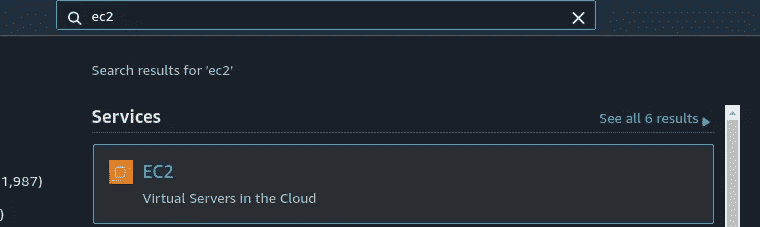

## 步骤 2:单击启动实例按钮

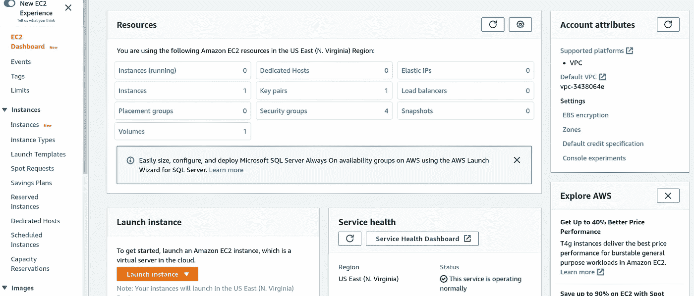

## 步骤 3:选择实例类型

请注意，我在侧边栏中选择了“仅自由层”,以仅过滤那些具有自由层的图像。对于我们的教程，我们将使用亚马逊 Linux 2 图像(在这个截图的第一张图片)

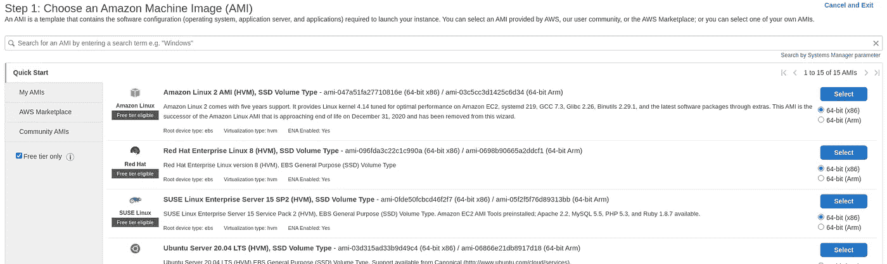

## 步骤 4:选择实例大小

你可以在这里浏览所有的尺码。我们将关注 t2.micro

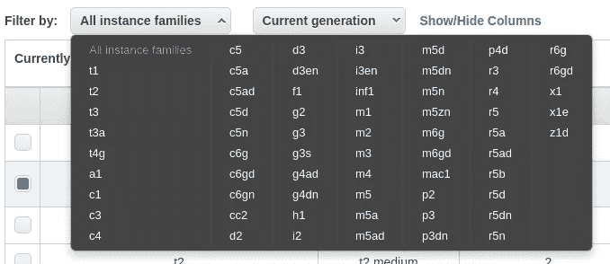

**选择 t2.micro 选项。**

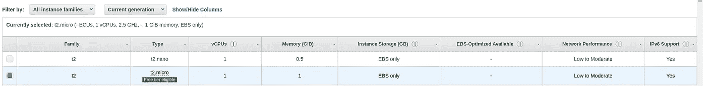

单击“配置实例详细信息”继续


## 步骤 5:定义实例配置

这个页面有很多可以微调的参数。但是在本教程中，我们将只**使用页面底部的“高级详细信息”部分的一个有趣选项“用户数据”**

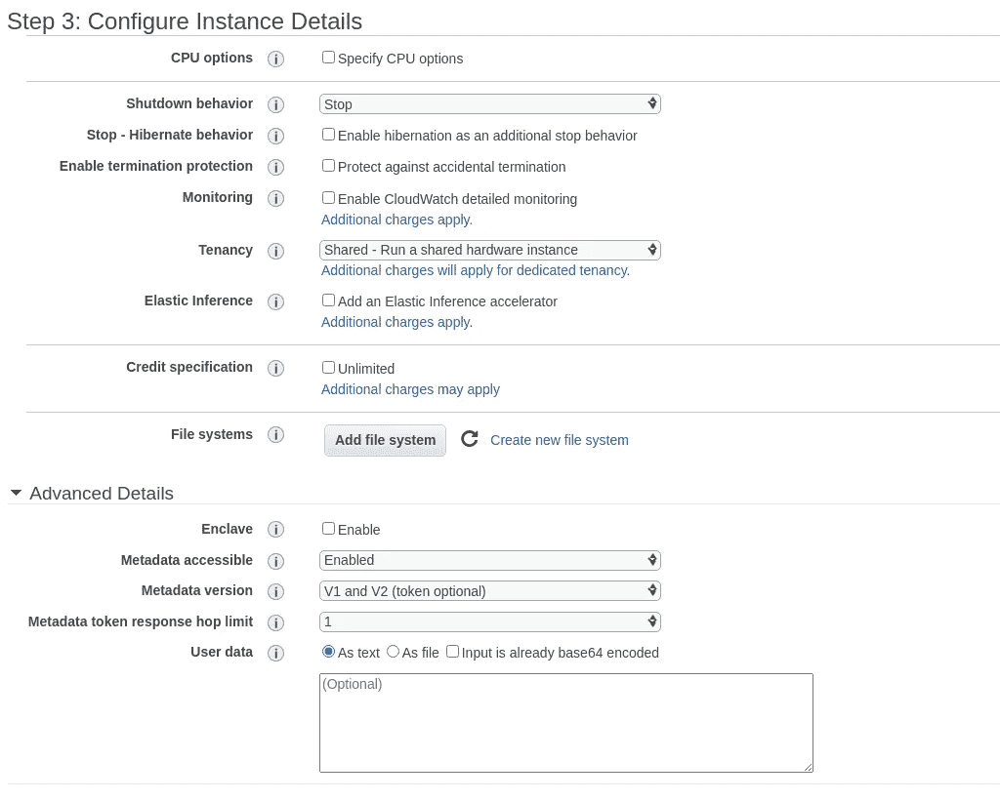

**什么是用户数据？**

用户数据是一组可以在部署时传递给实例的命令，这样当机器启动并运行时，这些步骤就已经完成了。

在 EC2 实例必须快速剥离的自动化部署中，这非常方便。比如灯/ WAMP 堆栈。一个简单的 MySQL 服务或 Apache 服务器。您可以使用用户数据自动安装。

通过在实例中使用以下命令，您可以很容易地查看稍后传递给 EC2 实例的用户数据

**wget**[**http://169 . 254 . 169 . 254/最新/用户数据**](http://169.254.169.254/latest/user-data)

对于我们的教程，我们将安装 httpd 并运行一个简单的 html 网页，显示我们正在运行的机器的公共 IP。

只需将下面的命令复制粘贴到用户数据文本中

```
#!/bin/bash
sudo yum update -y
sudo yum -y install httpd
sudo systemctl start httpd
sudo systemctl enable httpd
sudo systemctl is-enabled httpd
my_ip=$(curl [http://checkip.amazonaws.com)](http://checkip.amazonaws.com))
sudo echo "<html><body>Hello your webserver ${my_ip} is up and running</body></html>" > /var/www/html/index.html
```

这些命令的作用是什么。

**观察线路** #！/bin/bash**。这有助于 EC2 实例识别使用哪个程序来解释这些行。这被称为 [SHEBANG](https://en.wikipedia.org/wiki/Shebang_%28Unix%29) 并且要用 [BASH 终端](https://stackoverflow.com/questions/13872048/bash-script-what-does-bin-bash-mean#:~:text=When%20you%20tell%20%23!%2Fbin,time%20it%20will%20be%20bash.)来解释**

在此之后，该脚本执行以下操作

1.  获取互联网上可用于操作系统的任何更新。通常，Linux 实例依赖于频繁发布的软件包升级。首次部署实例时进行更新是一个很好的做法。此后，您可以使用 AWS 系统管理器([见此处](https://docs.aws.amazon.com/systems-manager/latest/userguide/systems-manager-patch.html))来自动更新。
2.  安装 httpd 服务(一个简单的 http 服务，可以呈现符合 http 协议的文件)([参见此处](https://httpd.apache.org/docs/2.4/programs/httpd.html))
3.  启动 httpd 服务
4.  启用 httpd 服务
5.  检查 httpd 服务是否已启用
6.  通过调用 URL([http://checkip.amazonaws.com](http://checkip.amazonaws.com)))来获取系统的公共 IP，这是一个漂亮的服务
7.  用以下内容创建一个名为 index.html 的文件

注意:我们正在生成一个动态 html 文件，它也向用户显示当前的公共 IP。

```
<html>
   <body>
       Hello your webserver ${my_ip} is up and running
   </body>
</html>
```

在此阶段，单击“Add Storage”继续。

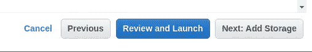

## 第六步:添加存储空间

让我们将它保留为默认值

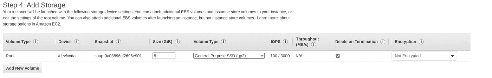

点击添加标签继续


## 步骤 7:添加标签

在 AWS 生态系统中，标签对于出于各种管理原因识别和保护资源非常有用。让我们为这张图片创建一个标签

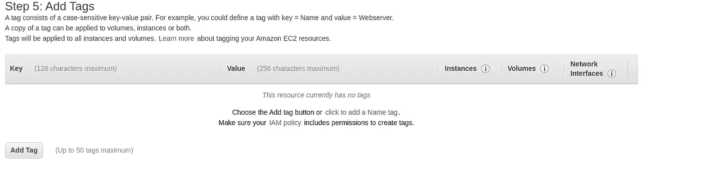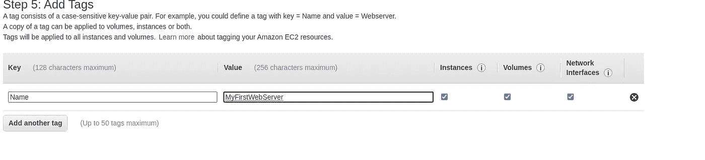

单击“配置安全组”继续


## 步骤 8:配置安全组

通过定义安全组，您可以微调自己、他人或其他 AWS 服务访问实例的方式。因此，一个安全组可以在其内部容纳多个 AWS 服务。

可以在这里配置对世界其他地方和您的 AWS 资源之间的入站/出站通信的细粒度控制。

观察屏幕截图，我设置了一个带有“My IP”选项的入站连接，让系统只允许使用我当前的 IP 访问 SSH。

**注意:当你以后必须访问这个系统时，你必须验证安全设置并更新它以反映你当前的 IP(因为如果你基于你的互联网连接设置，你的 IP 将会改变)**

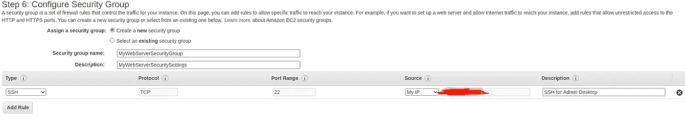

点击启动按钮

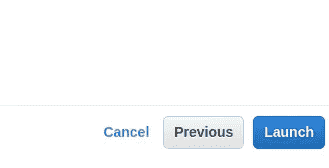

## 步骤 9:下载密匙 par /创建一个新的密匙对来通过 SSH 访问您的机器

在这个阶段，如果有必要的话，您可以创建一个新的密钥对(本质上是一个 PEM 文件，将其视为连接到服务器所需的秘密密钥)。

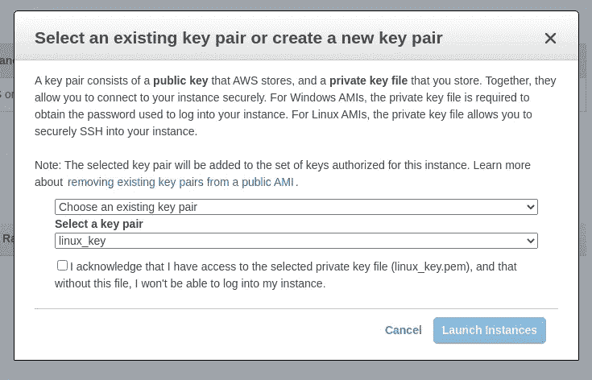

如果您正确地完成了所有步骤，那么现在您应该可以看到 View Instance 按钮了。点击并继续

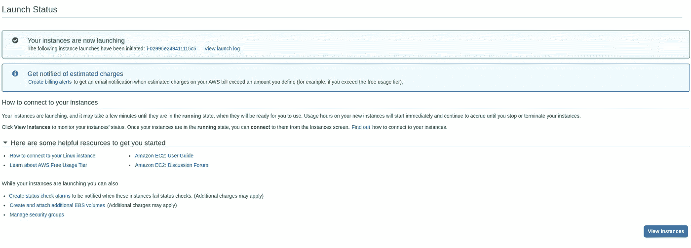

好了，你的服务器正在运行

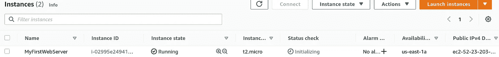

## 步骤 10:验证 web 服务器是否正在运行

我们如何做到这一点？

单击您创建的实例，您将看到公共 IP 详细信息(如下所示)

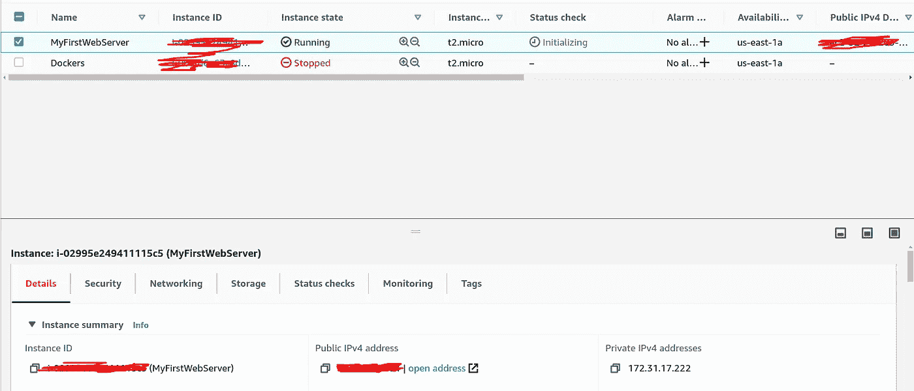

但是在此之前，您需要向您的安全组添加一个设置。那就是“允许到端口 80 的入站连接”，这是 http 通信的标准端口。

为此，选择安全选项卡


单击您的安全组


点击编辑入站规则，然后**点击添加规则按钮**

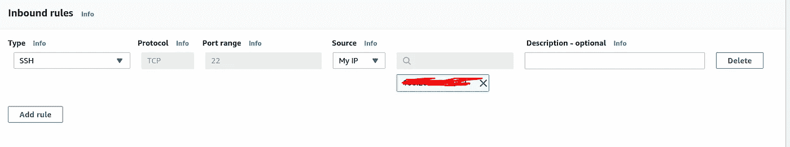

添加新规则以允许从任何地方进行 HTTP 80 访问。不要忘记点击保存规则按钮。

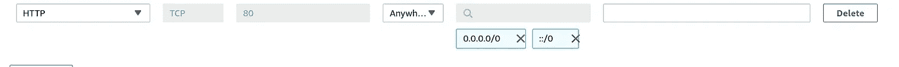

现在单击实例来查看您的实例

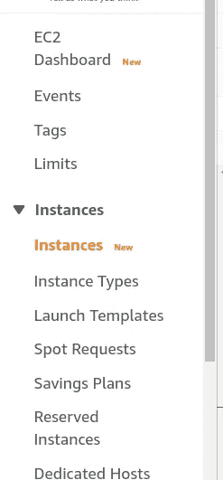

现在，单击您的实例 URL

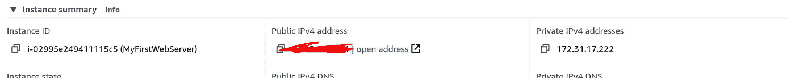

这就是你的页面和你通过命令传递的网页一起运行。

**注意:有时你必须使用这样的完整 url，根据一天中的时间，有时你可能会看到服务器启动和运行的延迟。有点耐心**

**http:// <你的实例 ip > /index.html**

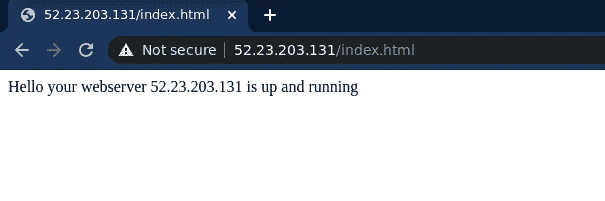

原来如此。您已经成功配置了 web 服务器。

## 步骤 11:清理

在这样的练习之后，清理你的资源是非常重要的，这样你就不会烧掉你的免费积分/账单。

为了避免这种复杂性，只需终止实例

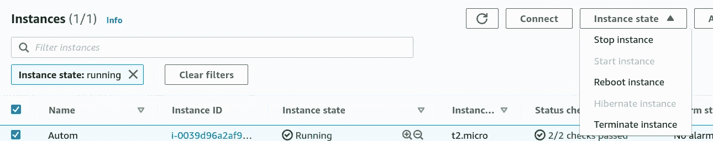

就是这样。你可以走了。

**主要收获**

1.  EC2 提供了广泛的设备配置
2.  图像自动化成为可能(请关注我的下一篇文章)
3.  安全组提供细粒度的访问控制
4.  12 个月内在 Linux 和 Windows 实例上的免费计算时间价值 750 小时
5.  每月 30 GB 的 EBS，为期 12 个月

如果你已经走了这么远，请考虑关注我，阅读更多关于云、数据科学和许多新兴技术的精彩文章。**