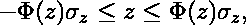

# 用 R 分析和想象幸福

> 原文：<https://blog.devgenius.io/analyse-and-visualise-happiness-with-r-9464ba125d81?source=collection_archive---------10----------------------->

# 介绍

原来幸福是可以衡量的。一个由著名科学家组成的团队找到了一种方法，可以在近 150 个国家进行无处不在的调查，以确定世界上最快乐的人。我们将分析他们研究得出的数据，并试图回答一个非常重要的问题:幸福是否与金钱有关？

# 先决条件

让我们从熟悉 WHR 2021 官方[网站](https://worldhappiness.report/ed/2021/)的研究开始。

接下来，下载[数据集](https://github.com/Vice10/datasets/blob/main/whr_2021.csv)并准备编码。

# 特征

数据集中有七个数字列:

1.  阶梯分数(阶梯)
2.  记录的人均国内生产总值
3.  社会保障
4.  健康预期寿命(HLE)
5.  做出生活选择的自由
6.  慷慨(G)
7.  对腐败的看法

注意，这些特征描述了发展，因此包含了负值。例如，芬兰人与前一年相比变得更加贪婪。下面来看看吧。

# 超散点图

直方图、核密度函数、微型散点图、皮尔逊相关系数——都可以放入一个超级散点图中。还有比这更好的吗？

超散点图

# 相关热图

下面是一种呈现相关矩阵的智能方法:

我们使用了分层聚类算法来创建热组。很奇特，不是吗？

相关热图

# 相关图表

你也可以做一些拓扑魔术，把上面的数值结果转移到二维空间。

相关图表

# 比较相关系数(CC)

Pearson CC 使用参数方法来估计变量之间的关联强度。

Spearman 和 Kendall 引入了排序来比较连续变量或分类变量。

Pearson CC 估计点(沿线)的分组程度，其他两个检查单调性。

# 皮尔逊相关检验

我们来找两个变量的皮尔逊 CC:阶梯(阶梯分数)和 SS(社会保障)。

试验结果

事实上，*“95%置信区间”*背后的数学原理并不简单。我们来分解一下。

# 95%置信区间背后的数学

与均值周围的置信区间不同，Pearson CC 周围的置信区间(为简便起见，我们将其表示为 *r* )是不对称的。这是因为 *r* 的分布是偏斜的。例如，假设 *r* = 0.95，那么实际的人口相关性不能高于 1.0，但是它可以低得多。

围绕 *r* 的置信区间基于费希尔的 z 变换。具体来说，假设 n 个 xᵢ-yᵢ对的样本产生某个值 *r* 。考虑到这种转变

这里， *z* 近似正态分布，期望值等于

其中 *ρ* 是总体相关性，r 是估计值。 *z* 的标准偏差等于

置信区间可以在 *z* 空间中构造为

其中，ф(*z*)对应于期望的置信水平(在 95%置信区间的情况下为 1.96)，定义为

在正态累积分布函数情况下。置信区间的上下*z*-极限将被转换回上下*r*-极限。

在我们的例子中，n=149， *r* =0.756，我们正在寻找 95%的置信区间。让我们来计算一下 *z* :

它的分布标准偏差等于

因此， *z* 空间中的置信区间上限和下限为

和

为了将*z*-空间转换回*r*-空间，我们必须找到费希尔 *z* 变换的反函数。显而易见，这种倒置会产生

然后可以使用上面的等式计算区间上限和下限:

和

因此， *r=* 0.756 的 95%置信区间的范围是从 0.68 到 0.815，这正是我们一直在寻找的(我们的计算并不十分精确，所以它们与测试结果的差异可以忽略不计)。

# 结论

这篇文章简要概述了一个简单而强大的统计工具来分析和可视化数据——相关性。它还解释了 Pearson CC 置信区间背后的数学原理。

不，幸福不仅仅与金钱有关。

*本文的源代码可从* [*这里*](https://github.com/Vice10/ds_notebooks/blob/main/whr_src.r) *。*