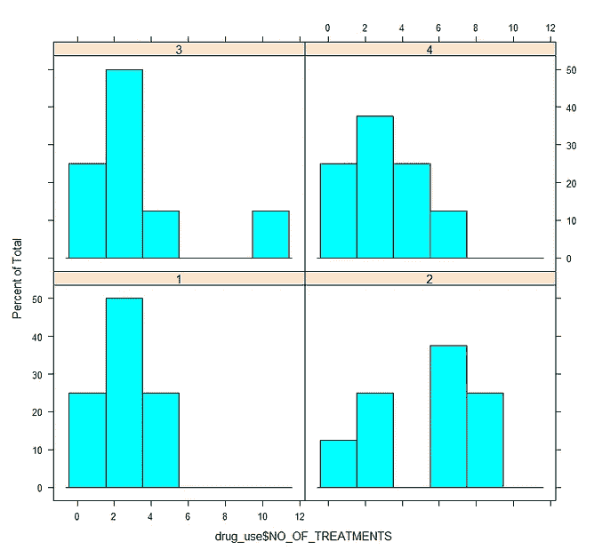
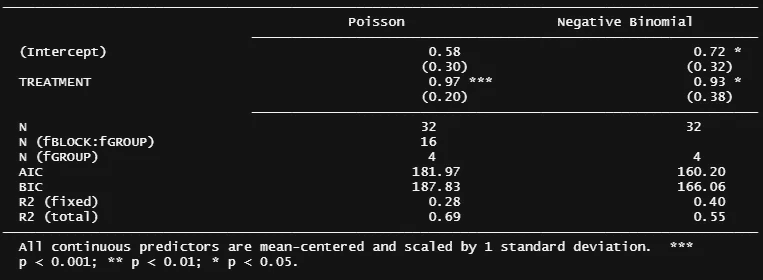
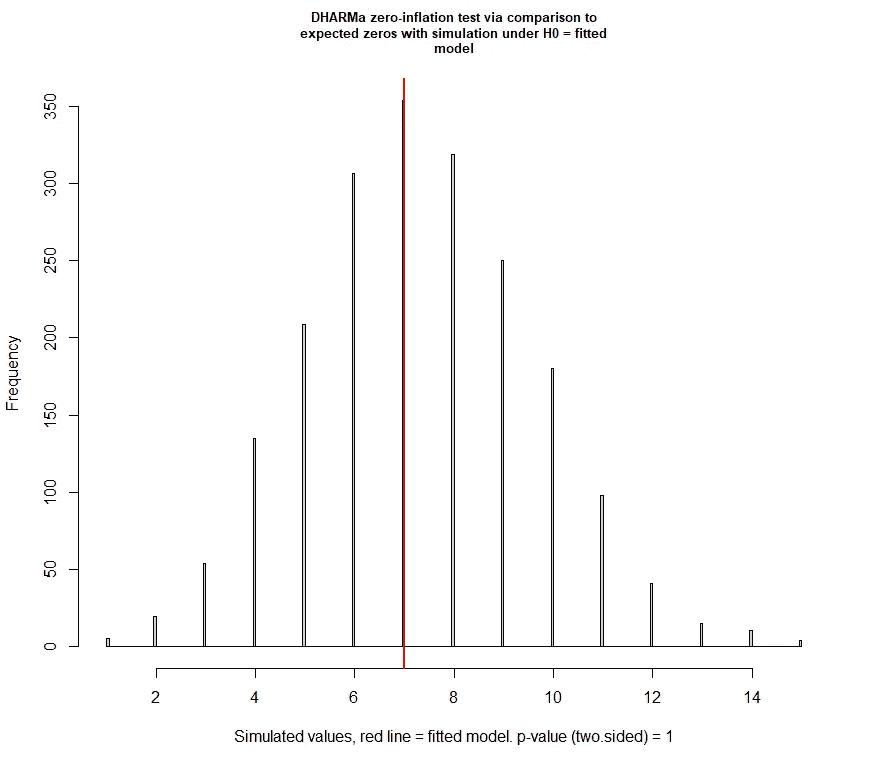

# 小数据集 R 中计数数据分析

> 原文：<https://blog.devgenius.io/analysis-of-count-data-in-r-3345f5373695?source=collection_archive---------10----------------------->

## 泊松和(负)二项分布

这是一个来自奶牛的商业数据示例，在此期间需要使用[泊松和负二项分布](https://medium.com/@marc.jacobs012/analyzing-ordinal-data-in-sas-poisson-and-negative-binomial-distribution-5f46b039aaeb)来处理(离散)计数数据。因为它是商业的，我不能分享数据，但我会尽我所能展示它的结构。这样，这里显示的代码和分析应该发人深省，并适用于其他离散数据。尤其是因为数据很难建模。利用有限的数据，你可以做很多事情。

现在，让我们首先加载我使用的库。从根本上说，你不需要所有的方法来分析数据集，但是 R 有多种方法来做同样的事情，但有时会更好一些。

```
rm(list = ls())
#### LIBRARIES ####
library(readxl)
library(foreign)
library(lme4)
library(ggplot2)
library(rms)
library(plyr)
library(dplyr)
library(Hmisc)
library(data.table)
library(reshape2)
library(lubridate)
library(boot)
library(sjPlot)
library(sjstats)
library(sjmisc)
library(psych)
library(interval)
library(data.table)
library(effects)
library(AICcmodavg)
library(piecewiseSEM)
require(parallel) 
library(scales)        
library(gridExtra)
library(coefplot) 
library(coda)      
library(aods3)     
library(plotMCMC) 
library(bbmle)     
library(nlme)
library(MCMCglmm)
library(merTools)
library(RLRsim) 
library(pbkrtest)
library(blme)
library(MASS)
library(multcomp)
library(splines)
library(car)
library(bbmle)
```

让我们看看数据本身。它描述了药物在奶牛身上的使用和测量结果:

1.  治疗日期
2.  治疗次数
3.  健康事件的数量

所有都是离散计数数据。不易建模。

```
#### DATA IMPORT & MANAGEMENT ####  
drug_use <- read_excel("drug use.xlsx",sheet = "for SAS")
str(drug_use)
drug_use$TREATMENT<-as.factor(drug_use$TREATMENT)
drug_use$NO_OF_HEALTHEVENTS<-as.integer(drug_use$NO_OF_HEALTHEVENTS)
drug_use$fGROUP<-as.factor(drug_use$GROUP)
drug_use$fBLOCK<-as.factor(drug_use$BLOCK)
drug_use$DT_prop<-drug_use$DAYS_OF_TREATMENT/30
drug_use$DT_N<-rep(30,length(drug_use$IR))
drug_use$ID<-rownames(drug_use)
str(drug_use)
head(drug_use)
```


当您开始使用直方图绘制数据时，这一点变得非常清楚。

```
#### DATA EXPLORATION ####
### Days of treatment
histogram(~drug_use$DAYS_OF_TREATMENT|drug_use$TREATMENT)
histogram(~drug_use$DAYS_OF_TREATMENT|drug_use$fBLOCK)
histogram(~drug_use$DAYS_OF_TREATMENT|drug_use$fGROUP)
```


现在，计数数据传统上使用泊松模型，但正如我们大多数人所知，它是一个有限的分布，因为均值和方差是相互绑定的。让我们看看这些数据，看看我们能否估计出哪种离散分布能够描述我们所看到的情况。

在这里，我选择了:

1.  正态(*我知道它是连续的，应用于离散数据会低估方差，但如果它适合，我可能会选择贝塔或伽玛分布*)。
2.  泊松
3.  负二项式
4.  二项式

首先，让我们计算均值-方差比。

```
var(drug_use$DAYS_OF_TREATMENT)/mean(drug_use$DAYS_OF_TREATMENT) # 5.157128
sd(drug_use$DAYS_OF_TREATMENT)/mean(drug_use$DAYS_OF_TREATMENT) # 1.153634
mean(drug_use$DAYS_OF_TREATMENT) # 3.875
```

对于*日的治疗*，方差比平均值高 5 倍。如果泊松曲线符合的话，我会很惊讶。然而，如果它会，它将严重低估数据的方差。

```
par(mfrow=c(5,2), oma = c(0, 0, 2, 0))
nbinom <- fitdistr(drug_use$DAYS_OF_TREATMENT, "negative binomial")
npoiss <- fitdistr(drug_use$DAYS_OF_TREATMENT, "Poisson")
hist(drug_use$DAYS_OF_TREATMENT,xlab="Count", ylab="Frequency", main="Observed distribution")
qqp(drug_use$DAYS_OF_TREATMENT, cex=2,xlab="Theoretical Quantiles", ylab="Emperical Quantiles", main="Normal distribution")
hist(rpois(32,npoiss[[1]][[1]]),xlab="Count", ylab="Frequency", main="Simulated Poisson distribution")
qqp(drug_use$DAYS_OF_TREATMENT, "pois", lambda=npoiss[[1]][[1]],cex=2,xlab="Theoretical Quantiles", ylab="Emperical Quantiles", main="Poisson distribution")
hist(rnbinom(32, size = nbinom$estimate[[1]], mu = nbinom$estimate[[2]]),cex=2,xlab="Count", ylab="Frequency", main="Simulated Negative Binomial distribution")
qqp(drug_use$DAYS_OF_TREATMENT, "nbinom", size = nbinom$estimate[[1]], mu = nbinom$estimate[[2]],cex=2, xlab="Theoretical Quantiles", ylab="Emperical Quantiles", main="Negative Binomial distribution")
hist(rbinom(32, size = 30, prob=sum(drug_use$DAYS_OF_TREATMENT)/sum(drug_use$DT_N)),cex=2,xlab="Count", ylab="Frequency", main="Simulated Binomial distribution")
qqp(drug_use$DAYS_OF_TREATMENT, "binom", size=30, prob=sum(drug_use$DAYS_OF_TREATMENT)/sum(drug_use$DT_N),cex=2, xlab="Theoretical Quantiles", ylab="Emperical Quantiles", main="Binomial distribution")
qqp(drug_use$DAYS_OF_TREATMENT[drug_use$TREATMENT=="A"], "binom", size=30, prob=sum(drug_use$DAYS_OF_TREATMENT[drug_use$TREATMENT=="A"])/sum(drug_use$DT_N[drug_use$TREATMENT=="A"]),cex=2, xlab="Theoretical Quantiles", ylab="Emperical Quantiles", main="Binomial distribution Treatment A")
qqp(drug_use$DAYS_OF_TREATMENT[drug_use$TREATMENT=="B"], "binom", size=30, prob=sum(drug_use$DAYS_OF_TREATMENT[drug_use$TREATMENT=="B"])/sum(drug_use$DT_N[drug_use$TREATMENT=="B"]),cex=2, xlab="Theoretical Quantiles", ylab="Emperical Quantiles", main="Binomial distribution Treatment B")
mtext("Probable Distributions for Days of Treatment", outer=TRUE, side=3, cex = 1.5)
```


(负)二项式似乎非常适合。

接下来，可能有点矫枉过正，看看均值和方差的关系(跨区块——这是一个[随机完整区块](https://medium.com/@marc.jacobs012/building-and-optimizing-randomized-complete-block-designs-using-sas-c973d127d862)研究),看看几个分布如何处理自己。不难看出小样本量是如何限制推断的。然而，它清楚地表明，泊松分布不是一个很好的拟合。

```
mvtab <- ddply(drug_use,
               .(fBLOCK),
               summarise,
               callmean=mean(DAYS_OF_TREATMENT),
               callvar=var(DAYS_OF_TREATMENT))qplot(callmean,callvar,data=mvtab)+theme_bw()+
  geom_smooth(aes(colour="NB1"), method="lm",formula=y~x-1, alpha=0.5)+ geom_smooth(aes(colour="LOESS"), alpha=0.5)+ geom_smooth(aes(colour="NB2"),method="lm",formula=y~I(x^2)+offset(x)-1, alpha=0.5)+ geom_abline(aes(colour="POISSON"), intercept=0,slope=1, colour="orange")+ scale_colour_manual(name="Fit",values=c(NB1="blue", 
                               LOESS="red", 
                               NB2="purple", 
                               POISSON="orange"))+
  guides(color=guide_legend(override.aes=list(fill=NA)))
```


让我们看看作为结果所需的*治疗数量*。

```
### Number of treatments
histogram(~drug_use$NO_OF_TREATMENTS|drug_use$TREATMENT)
histogram(~drug_use$NO_OF_TREATMENTS|drug_use$fBLOCK)
histogram(~drug_use$NO_OF_TREATMENTS|drug_use$fGROUP)
```



不容易建模。

```
var(drug_use$NO_OF_TREATMENTS/mean(drug_use$NO_OF_TREATMENTS) # 2.6
sd(drug_use$NO_OF_TREATMENTS)/mean(drug_use$NO_OF_TREATMENTS) # 0.9
mean(drug_use$NO_OF_TREATMENTS) # 3.3par(mfrow=c(5,2), oma = c(0, 0, 2, 0))
nbinom <- fitdistr(drug_use$NO_OF_TREATMENTS, "negative binomial")
npoiss <- fitdistr(drug_use$NO_OF_TREATMENTS, "Poisson")
hist(drug_use$NO_OF_TREATMENTS,xlab="Count", ylab="Frequency", main="Observed distribution")
qqp(drug_use$NO_OF_TREATMENTS, cex=2,xlab="Theoretical Quantiles", ylab="Emperical Quantiles", main="Normal distribution")
hist(rpois(32,npoiss[[1]][[1]]),xlab="Count", ylab="Frequency", main="Simulated Poisson distribution")
qqp(drug_use$NO_OF_TREATMENTS, "pois", lambda=npoiss[[1]][[1]],cex=2,xlab="Theoretical Quantiles", ylab="Emperical Quantiles", main="Poisson distribution")
hist(rnbinom(32, size = nbinom$estimate[[1]], mu = nbinom$estimate[[2]]),cex=2,xlab="Count", ylab="Frequency", main="Simulated Negative Binomial distribution")
qqp(drug_use$NO_OF_TREATMENTS, "nbinom", size = nbinom$estimate[[1]], mu = nbinom$estimate[[2]],cex=2, xlab="Theoretical Quantiles", ylab="Emperical Quantiles", main="Negative Binomial distribution")
hist(rbinom(32, size = 30, prob=sum(drug_use$NO_OF_TREATMENTS)/sum(drug_use$DT_N)),cex=2,xlab="Count", ylab="Frequency", main="Simulated Binomial distribution")
qqp(drug_use$NO_OF_TREATMENTS, "binom", size=30, prob=sum(drug_use$NO_OF_TREATMENTS)/sum(drug_use$DT_N),cex=2, xlab="Theoretical Quantiles", ylab="Emperical Quantiles", main="Binomial distribution")
qqp(drug_use$NO_OF_TREATMENTS[drug_use$TREATMENT=="A"], "binom", size=30, prob=sum(drug_use$NO_OF_TREATMENTS[drug_use$TREATMENT=="A"])/sum(drug_use$DT_N[drug_use$TREATMENT=="A"]),cex=2, xlab="Theoretical Quantiles", ylab="Emperical Quantiles", main="Binomial distribution Treatment A")
qqp(drug_use$NO_OF_TREATMENTS[drug_use$TREATMENT=="B"], "binom", size=30, prob=sum(drug_use$NO_OF_TREATMENTS[drug_use$TREATMENT=="B"])/sum(drug_use$DT_N[drug_use$TREATMENT=="B"]),cex=2, xlab="Theoretical Quantiles", ylab="Emperical Quantiles", main="Binomial distribution Treatment B")
mtext("Probable Distributions for Number of Treatments", outer=TRUE, side=3, cex = 1.5)
```


可以用几种分布来模拟。

然后，让我们看看健康事件的*数量。*

```
### Number of health events
histogram(~drug_use$NO_OF_HEALTHEVENTS|drug_use$TREATMENT)
histogram(~drug_use$NO_OF_HEALTHEVENTS|drug_use$fBLOCK)
histogram(~drug_use$NO_OF_HEALTHEVENTS|drug_use$fGROUP)
```


似乎更容易一些，至少在不同的治疗中。

```
var(drug_use$NO_OF_HEALTHEVENTS)/mean(drug_use$NO_OF_HEALTHEVENTS) 1.062035 
sd(drug_use$NO_OF_HEALTHEVENTS)/mean(drug_use$NO_OF_HEALTHEVENTS) 0.8084305
mean(drug_use$NO_OF_HEALTHEVENTS) 
1.625par(mfrow=c(5,2), oma = c(0, 0, 2, 0))
nbinom <- fitdistr(drug_use$NO_OF_HEALTHEVENTS, "negative binomial")
npoiss <- fitdistr(drug_use$NO_OF_HEALTHEVENTS, "Poisson")
hist(drug_use$NO_OF_HEALTHEVENTS,xlab="Count", ylab="Frequency", main="Observed distribution")
qqp(drug_use$NO_OF_HEALTHEVENTS, cex=2,xlab="Theoretical Quantiles", ylab="Emperical Quantiles", main="Normal distribution")
hist(rpois(32,npoiss[[1]][[1]]),xlab="Count", ylab="Frequency", main="Simulated Poisson distribution")
qqp(drug_use$NO_OF_HEALTHEVENTS, "pois", lambda=npoiss[[1]][[1]],cex=2,xlab="Theoretical Quantiles", ylab="Emperical Quantiles", main="Poisson distribution")
hist(rnbinom(32, size = nbinom$estimate[[1]], mu = nbinom$estimate[[2]]),cex=2,xlab="Count", ylab="Frequency", main="Simulated Negative Binomial distribution")
qqp(drug_use$NO_OF_HEALTHEVENTS, "nbinom", size = nbinom$estimate[[1]], mu = nbinom$estimate[[2]],cex=2, xlab="Theoretical Quantiles", ylab="Emperical Quantiles", main="Negative Binomial distribution")
hist(rbinom(32, size = 30, prob=sum(drug_use$NO_OF_HEALTHEVENTS)/sum(drug_use$DT_N)),cex=2,xlab="Count", ylab="Frequency", main="Simulated Binomial distribution")
qqp(drug_use$NO_OF_HEALTHEVENTS, "binom", size=30, prob=sum(drug_use$NO_OF_HEALTHEVENTS)/sum(drug_use$DT_N),cex=2, xlab="Theoretical Quantiles", ylab="Emperical Quantiles", main="Binomial distribution")
qqp(drug_use$NO_OF_HEALTHEVENTS[drug_use$TREATMENT=="A"], "binom", size=30, prob=sum(drug_use$NO_OF_HEALTHEVENTS[drug_use$TREATMENT=="A"])/sum(drug_use$DT_N[drug_use$TREATMENT=="A"]),cex=2, xlab="Theoretical Quantiles", ylab="Emperical Quantiles", main="Binomial distribution Treatment A")
qqp(drug_use$NO_OF_HEALTHEVENTS[drug_use$TREATMENT=="B"], "binom", size=30, prob=sum(drug_use$NO_OF_HEALTHEVENTS[drug_use$TREATMENT=="B"])/sum(drug_use$DT_N[drug_use$TREATMENT=="B"]),cex=2, xlab="Theoretical Quantiles", ylab="Emperical Quantiles", main="Binomial distribution Treatment B")
mtext("Probable Distributions for Number of Health Events", outer=TRUE, side=3, cex = 1.5)
```


两个二项式(负的和正的)在这里都可以实现。

现在，让我们使用泊松建立第一个治疗日的模型，其中我假设均值和方差相等。这使得泊松分布成为最容易处理的分布之一，但它很少(如果有的话)做到这一点。

```
fit.poisson<-glmer(DAYS_OF_TREATMENT~TREATMENT+(1|fGROUP/fBLOCK), 
                   data=drug_use, 
                   family="poisson"(link = "log"))
summary(fit.poisson)Generalized linear mixed model fit by maximum likelihood (Laplace
  Approximation) [glmerMod]
 Family: poisson  ( log )
Formula: DAYS_OF_TREATMENT ~ TREATMENT + (1 | fGROUP/fBLOCK)
   Data: drug_useAIC      BIC   logLik deviance df.resid 
   182.0    187.8    -87.0    174.0       28Scaled residuals: 
    Min      1Q  Median      3Q     Max 
-1.9755 -1.1386 -0.2341  0.5595  4.1493Random effects:
 Groups        Name        Variance Std.Dev.
 fBLOCK:fGROUP (Intercept) 0.1574   0.3967  
 fGROUP        (Intercept) 0.2020   0.4495  
Number of obs: 32, groups:  fBLOCK:fGROUP, 16; fGROUP, 4Fixed effects:
            Estimate Std. Error z value Pr(>|z|)    
(Intercept)   0.5771     0.3037   1.900   0.0574 .  
TREATMENTB    0.9734     0.1980   4.916 8.83e-07 ***
---
Signif. codes:  0 ‘***’ 0.001 ‘**’ 0.01 ‘*’ 0.05 ‘.’ 0.1 ‘ ’ 1Correlation of Fixed Effects:
           (Intr)
TREATMENTB -0.473
```

让我们从一开始就开始尝试负二项式。

```
fit.nb<-glmer.nb(DAYS_OF_TREATMENT~TREATMENT+(1|fGROUP), 
                 data=drug_use,
                 control = glmerControl(optimizer = "bobyqa", nAGQ = 10))
summary(fit.nb)
Generalized linear mixed model fit by maximum likelihood (Laplace
  Approximation) [glmerMod]
 Family: Negative Binomial(1.3084)  ( log )
Formula: DAYS_OF_TREATMENT ~ TREATMENT + (1 | fGROUP)
   Data: drug_use
Control: glmerControl(optimizer = "bobyqa", nAGQ = 10)AIC      BIC   logLik deviance df.resid 
   160.2    166.1    -76.1    152.2       28Scaled residuals: 
    Min      1Q  Median      3Q     Max 
-0.9323 -0.8156 -0.3945  0.5203  2.7030Random effects:
 Groups Name        Variance Std.Dev.
 fGROUP (Intercept) 0.08269  0.2876  
Number of obs: 32, groups:  fGROUP, 4Fixed effects:
            Estimate Std. Error z value Pr(>|z|)  
(Intercept)   0.7179     0.3179   2.258   0.0239 *
TREATMENTB    0.9311     0.3754   2.480   0.0131 *
---
Signif. codes:  0 ‘***’ 0.001 ‘**’ 0.01 ‘*’ 0.05 ‘.’ 0.1 ‘ ’ 1Correlation of Fixed Effects:
           (Intr)
TREATMENTB -0.633
```

然后，是时候比较泊松和负二项式模型了。泊松嵌套在负二项式中，因为过度离差参数在负二项式中估计，但在泊松中保持不变。负二项式更适合。

```
pchisq(2 * (logLik(fit.nb) - logLik(fit.poisson)), df = 1, lower.tail = FALSE) 'log Lik.' 3.070599e-06 (df=4)
```


ICtab(fit.poisson，fit.nb)

```
require(jtools)
jtools::plot_summs(fit.poisson, fit.nb, scale = TRUE, 
                   plot.distributions = TRUE,
                   model.names=c("Poisson", "Negative Binomial"))
export_summs(fit.poisson, fit.nb, scale = TRUE,model.names=c("Poisson", "Negative Binomial"))
```


泊松的过度离差在这里清楚地显示出来，它的参数分布小得不合理，如果您绑定均值和方差，这种情况经常发生。



让我们继续尝试使用比例来拟合药物数据。因为每天都有记录，所以我们有固定的天数，因此有固定的试验次数(30)。

```
fit.DT<-glmer(DAYS_OF_TREATMENT/DT_N~TREATMENT+
           (1|fGROUP/fBLOCK),
         data=drug_use,
         weight=DT_N,
         family="binomial", 
         control = glmerControl(optimizer = "bobyqa", nAGQ = 10))
print(fit.DT, corr=FALSE)
summary(fit.DT)
plot_model(fit.DT)
tab_model(fit.DT)
```


让我们来看看第二个模型，包括一个随机 ID，它自动成为一个准二项式模型。我在这里所做的是通过将行号作为随机效应(即一个[正态分布方差分量](https://medium.com/mlearning-ai/introduction-to-mixed-models-in-r-9c017fd83a63))来模拟每个观察值之间的额外方差。

```
fit.DT2<-glmer(DAYS_OF_TREATMENT/DT_N~TREATMENT+
            (1|fGROUP/fBLOCK)+(1|ID),
          data=drug_use,
          weight=DT_N,
          family="binomial", 
          control = glmerControl(optimizer = "bobyqa", nAGQ = 10))
anova(fit.DT,fit.DT2) # m2 better so overdispersion
exp(confint(fit.DT2)) # profile confidence intervals of odds ratio
```


第二款表现更好！

让我们开始分析处理的*数量*，并将它们建模为比例。不要忘记，早期的评估似乎暗示了在建模*治疗数量*结果时每个二项分布的有效性。

```
drug_use$NT_prop<-drug_use$NO_OF_TREATMENTS/30
fit.NT<-glmer(NO_OF_TREATMENTS/DT_N~TREATMENT+
           (1|fGROUP/fBLOCK),
         data=drug_use,
         weight=DT_N,
         family="binomial", 
         control = glmerControl(optimizer = "bobyqa", nAGQ = 10))
summary(fit.NT)fit.NT2<-glmer(NO_OF_TREATMENTS/DT_N~TREATMENT+
                (1|fGROUP/fBLOCK) +(1|ID), # not a great fit, because BLOCK nested in Group already gives unique values 
              data=drug_use,
              weight=DT_N,
              family="binomial", 
              control = glmerControl(optimizer = "bobyqa", 
nAGQ = 10))
summary(fit.NT2)
table(drug_use$GROUP, drug_use$BLOCK)
exp(fixef(fit.NT))-exp(fixef(fit.NT2))
exp(confint(fit.NT))
exp(confint(fit.NT2))
AICtab(fit.NT, fit.NT2)
```


同样在这里，添加一个由行观察值组成的随机组件似乎做得更好。

现在，我正在向*个卫生事件*个结果迈进。

```
drug_use$HE_prop<-drug_use$NO_OF_HEALTHEVENTS/drug_use$DT_N
hist(drug_use$HE_prop)
fit.HE<-glmer(drug_use$HE_prop/DT_N~TREATMENT+
                (1|fGROUP),
              data=drug_use,
              weight=DT_N,
              family="binomial", 
              control = glmerControl(optimizer = "bobyqa", nAGQ = 1))
summary(fit.HE)
```


红色是一种可爱的颜色，但我不喜欢在这里看到它。每当有关于黑森的问题，你必须非常小心地处理结果。其实就别管结果了。

接下来，我将利用之前的失败来看看我是应该将所有东西放在一起还是通过随机组件*块*进行分析。

```
fit.HE.pooled<-glm(cbind(NO_OF_HEALTHEVENTS, DT_N-NO_OF_HEALTHEVENTS)~TREATMENT, family="binomial", data=drug_use)fit.HE.unpooled<-glm(cbind(NO_OF_HEALTHEVENTS, DT_N-NO_OF_HEALTHEVENTS)~TREATMENT+as.factor(BLOCK)+as.factor(GROUP), family="binomial", data=drug_use)anova(fit.HE.pooled, fit.HE.unpooled)
```


似乎池模型表现最好。

```
summary(fit.HE.pooled) 
summary(fit.HE.unpooled) 
fit.HE.pooled.qbinom<-glm(cbind(NO_OF_HEALTHEVENTS, DT_N-NO_OF_HEALTHEVENTS)~TREATMENT, family="quasibinomial", data=drug_use)
fit.HE.unpooled.qbinom<-glm(cbind(NO_OF_HEALTHEVENTS, DT_N-NO_OF_HEALTHEVENTS)~TREATMENT+as.factor(BLOCK)+as.factor(GROUP), family="quasibinomial", data=drug_use)
summary(fit.HE.pooled.qbinom)
summary(fit.HE.unpooled.qbinom)jtools::plot_summs(fit.HE.pooled,
                   fit.HE.unpooled,
                   fit.HE.pooled.qbinom, 
                   fit.HE.unpooled.qbinom, 
                   scale = TRUE, plot.distributions = TRUE)
export_summs(fit.HE.pooled,
             fit.HE.unpooled,
             fit.HE.pooled.qbinom, 
             fit.HE.unpooled.qbinom,
             scale = TRUE)
AICtab(fit.HE.pooled,
       fit.HE.unpooled,
       fit.HE.pooled.qbinom, 
       fit.HE.unpooled.qbinom)
tab_model(fit.HE.pooled,
                   fit.HE.unpooled,
                   fit.HE.pooled.qbinom, 
                   fit.HE.unpooled.qbinom)
```


准版本甚至没有导致任何东西，因为模型矩阵是秩亏的。


正如你所看到的，这些模型在他们的估计上并没有太大的不同，这些置信限的大小适合于他们的小样本量。对 leats 来说，分析这样一个数据集是具有挑战性的。

每个混合模型都需要有一个适当的评估，其中一个值得检查的部分是假设随机分量遵循一个属于正态分布的 QQ 图。

```
fit.poisson<-glmer(NO_OF_HEALTHEVENTS~1+(1|IR), 
                   data=drug_use, 
                   family="poisson"(link = "log"))
summary(fit.poisson)
plot_model(fit.poisson, type="diag")
```


看起来正常，但是置信区间很宽。

```
fit.poisson<-glmer(DAYS_OF_TREATMENT~1+(1|IR), 
                   data=drug_use, 
                   family="poisson"(link = "log"))
summary(fit.poisson)
plot_model(fit.poisson, type="diag")
```


看起来正常，但置信区间非常宽，尤其是在开始阶段。你可以清楚地看到这里的块来自随机完全区组设计。

```
fit.poisson<-glmer(NO_OF_TREATMENTS~1+(1|IR), 
                   data=drug_use, 
                   family="poisson"(link = "log"))
summary(fit.poisson)
plot_model(fit.poisson, type="diag")
```


看起来正常，但置信区间非常宽，尤其是在开始阶段。你可以清楚地看到这里的块来自随机完全区组设计。

现在，在处理离散数据时，需要检查过度偏差(通过受限分布低估数据的方差)。我们可以通过图形化的方式来实现，建模一次，或者建模一次，然后引导结果。

```
### Testing for overdispersion 
fit.poisson2<-glmer(DAYS_OF_TREATMENT~TREATMENT+(1|fGROUP)+(1|fBLOCK), 
                    data=drug_use, 
                    family="poisson"(link = "log"), 
                    control = glmerControl(optimizer = "bobyqa", nAGQ = 10))
summary(fit.poisson2)
simulationOutput<-simulateResiduals(fittedModel=fit.poisson2, n=2000)
plot(simulationOutput)
testZeroInflation(simulationOutput)
```


看起来不错。

```
fit.poisson3<-glmer(DAYS_OF_TREATMENT~TREATMENT+(1|GROUP)+(1|BLOCK)+(1|IR),data=drug_use, family="poisson"(link = "log"),control = glmerControl(optimizer = "bobyqa", nAGQ = 10))
summary(fit.poisson3)fit.nb<-glmer.nb(DAYS_OF_TREATMENT~TREATMENT+(1|GROUP), 
                      data=drug_use, control = glmerControl(optimizer = "bobyqa", nAGQ = 10))
summary(fit.nb)par(mfrow=c(1,2))
hist(drug_use$DAYS_OF_TREATMENT)
hist(rgamma(32,1.3084)) 
# 1.3084 is shape parameter as indicated via glmer.nb, which is also used for gamma
```


```
#### MODEL EVALUATION DofT - PROPORTION DATA ####
simulationOutput<-simulateResiduals(fittedModel=fit.DT2, n=2000, refit=F)
plot(simulationOutput)
testZeroInflation(simulationOutput) 
```


看起来不错。

```
#### MODEL EVALUATION NofT - PROPORTION DATA ####
simulationOutput<-simulateResiduals(fittedModel=fit.NT2, n=2000, refit=F)
plot(simulationOutput)
testZeroInflation(simulationOutput) 
```


看起来不错。

```
simulationOutput<-simulateResiduals(fittedModel=fit.HE.pooled, n=2000, refit=F)
plot(simulationOutput)
testZeroInflation(simulationOutput)
```



看起来不错。

因此，这是一篇关于如何对具有三个离散计数数据结果的数据集建模的快速帖子。不容易建模，但我希望很清楚，你必须找到一个分布，可以处理自己，检查过度分散，正常的误差(解释和未解释的方差)和停止建模的结果时，没有足够的数据。

尽情享受吧！