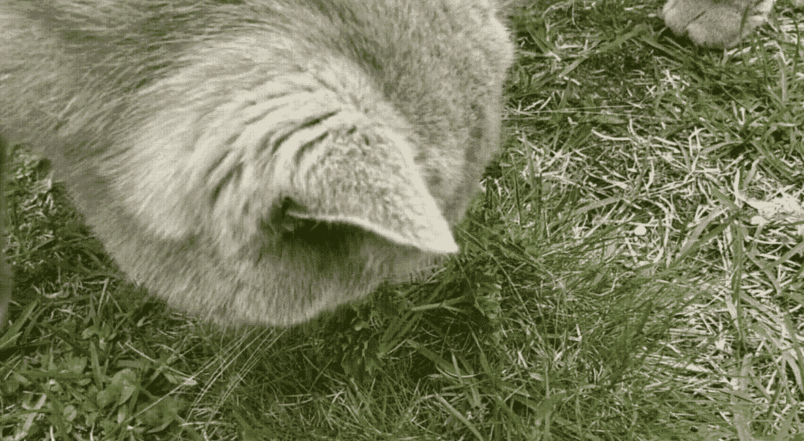
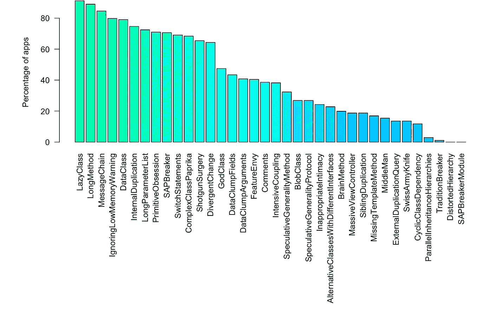
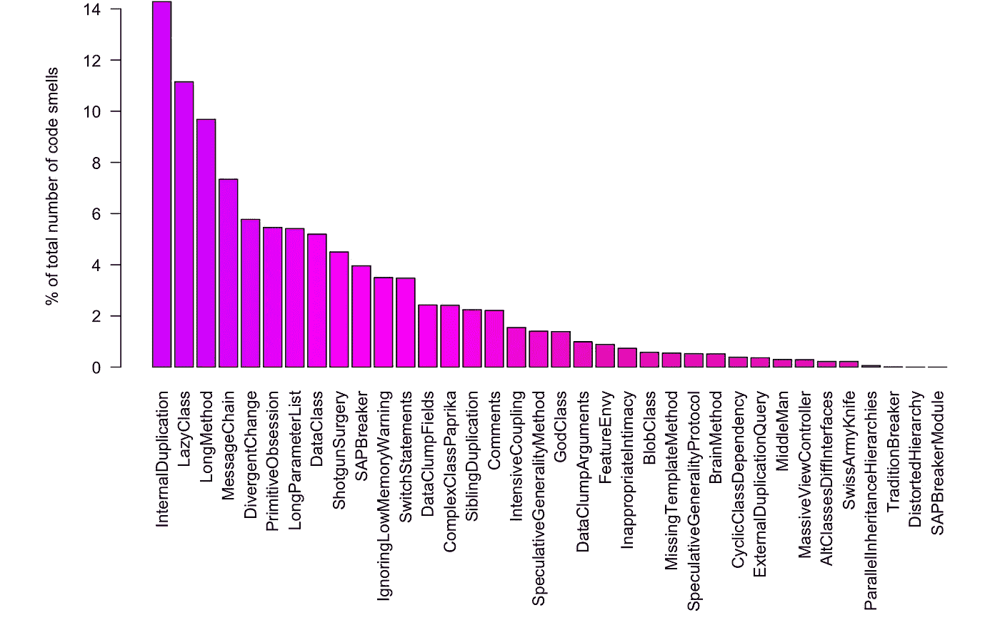
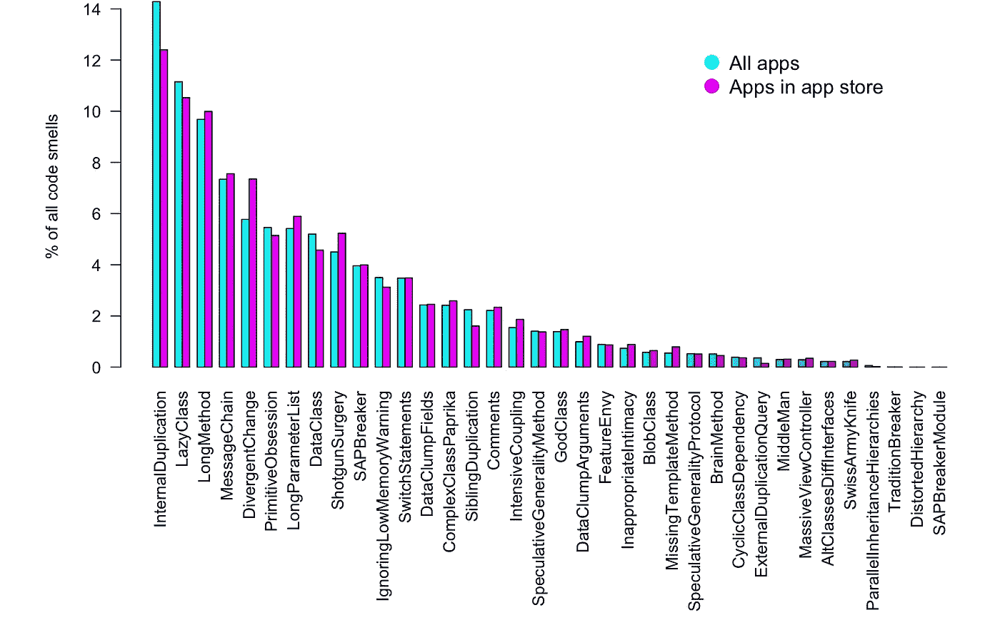

# 开源 iOS 应用分析

> 原文：<https://blog.devgenius.io/analysis-of-open-source-ios-apps-b7466fb20de3?source=collection_archive---------9----------------------->

## 代码有多臭，测试呢？

我们分析了 273 个用 swift 编写的开源 iOS 应用程序，其中 33 个面向对象，2 个特定于 iOS 的代码味道。我们还观察了这些应用程序的测试情况。

## 我们在哪里找到开源应用程序？

开源应用在 iOS 中不像在 Android 中那样常见，但 GitHub 上有一个开源 iOS 应用的合作列表。有些应用程序在 app store 中，但不是全部。

 [## dkhamsing/开源 ios 应用程序

### iphone:开源 ios 应用协作列表-dkhamsing/开源 iOS 应用

github.com](https://github.com/dkhamsing/open-source-ios-apps) 

一些统计数据

*   用 swift 编写的 568 个应用程序
*   成功分析了 273 个应用
*   其中 68 个应用程序还在应用程序商店
*   最小的应用程序有 2 个类
*   最大的应用程序有 1112 个类
*   共 10569 节课
*   总共 45867 种方法
*   总共 2993 次测试

## 什么是代码气味，我们如何检测它们？

代码味道是代码中的模式，指示可能导致代码更难维护和理解的问题。有异味的代码不一定不正确，但可能表明有问题。

本文很好地概述了面向对象代码的味道，并涵盖了 Fowler 定义的大多数代码味道:

 [## 写干净的代码，用现实生活中的例子摆脱代码的味道

### 代码气味是一组常见的标志，表明你的代码不够好，需要重构…

codeburst.io](https://codeburst.io/write-clean-code-and-get-rid-of-code-smells-aea271f30318) 

我们实现了一个分析 swift 代码和检测代码气味的工具。它使用 [sourcekitten](https://github.com/jpsim/SourceKitten) 框架，并在 neo4j 图形数据库中存储有关分析应用程序的信息。代码气味被定义为查询。这使得一次分析大量应用成为可能。

## 那么，这些 app 到底有多臭？

我们的工具能够检测 35 种代码气味。下图显示了包含代码味道的应用程序的百分比。

大多数应用程序都受到懒惰类、长方法、消息链的影响。但是需要注意的是，在这个统计数据中已经有一个长方法或一个惰性类应用了。更有趣的是，只有大约 20%的应用程序受到大规模视图控制器的困扰。

下图显示了代码气味的分布:

最常见的代码气味是内部重复，占所有代码气味的 14%以上。其次是懒类和长方法。

了解非开源应用程序是否有什么不同将会很有趣。不幸的是，现在我们需要源代码来执行分析。但我们确实调查了在应用商店发布的应用程序和没有发布的应用程序之间是否有任何差异。

气味的分布非常相似。内部重复略有减少，这可能表明更多的质量控制。

## 这些应用程序测试得如何？

测试很重要，对吗？我们统计了每个应用程序的测试文件中断言的数量。测试次数的中位数？….一

我们感兴趣的是找出一个应用程序测试的好坏和它的代码有多臭之间是否有关系。但遗憾的是发现开源的 iOS apps 应用几乎根本不测试。这是一种规范吗？还是闭源应用程序经过了更好的测试？你在写测试吗？

如果没有，那么你可能想了解一下 iOS 应用程序的单元测试。这是一篇相当不错的文章:

 [## Swift 中的单元测试—第 1 部分:原理

### 无论您是否在进行 TDD，拥有验证您的代码的测试是信心的巨大来源，无论…

medium.cobeisfresh.com](https://medium.cobeisfresh.com/unit-testing-in-swift-part-1-the-philosophy-9bc85ed5001b) 

## 工具呢？

用于检测这些气味的工具(GraphifySwift)是用 Swift 编写的，使用 SourceKitten 来分析应用 AST。这里是开源可用[。该工具的灵感来自于分析安卓应用的](https://github.com/kristiinara/GraphifySwift)[辣椒粉](https://github.com/GeoffreyHecht/paprika)。

是的，我确实在它自己的代码上运行了这个工具，是的，它很难闻。我确实计划对其进行改进，并希望将其转换成 XCode 扩展。欢迎任何改进建议。

## 一些未来的想法:

*   比较 iOS 和 Android 上的代码味道
*   分析架构模式
*   包括其他类型的代码气味、iOS 特有的气味、安全气味
*   改进工具，使其对开发人员有用