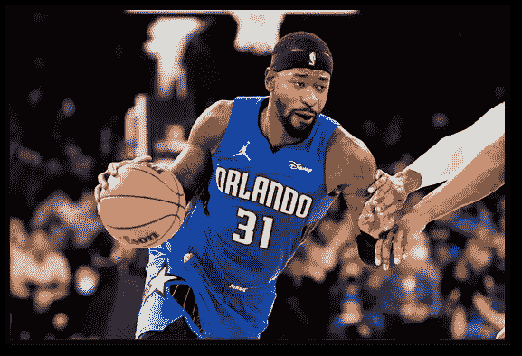
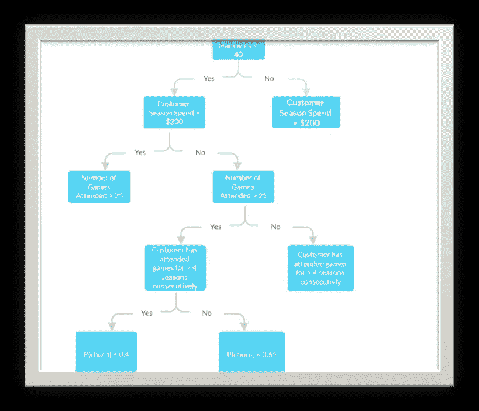
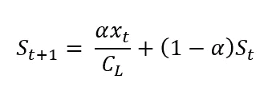
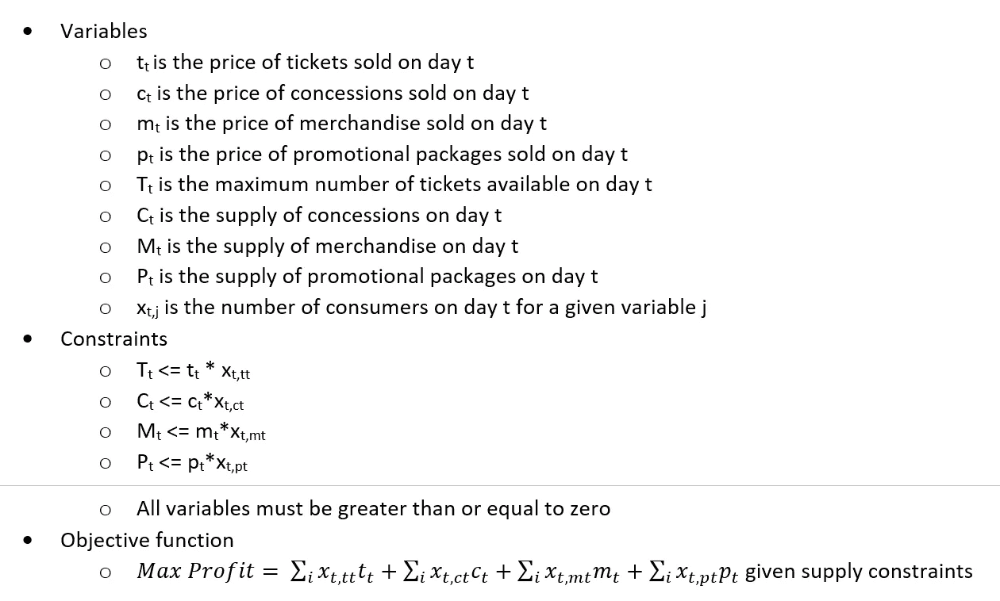

# SAS 分析应用分析模型改善粉丝体验和团队绩效

> 原文：<https://blog.devgenius.io/analysis-of-sas-application-of-analytics-models-to-improve-fan-experience-and-team-performance-6d1f0efe1b41?source=collection_archive---------14----------------------->

# 摘要

在分析与奥兰多魔术队相关的 SAS 客户成功案例时，本文将尝试解释 SAS 为实现奥兰多魔术队的业务目标而使用的模型、所需数据、数据收集方法和模型优化。

# 目的

本文的目的是从所提供的分析公司(IBM、SAS、Informs)中选择一个客户成功案例，并分析为了实现项目目标可能利用了哪些模型、数据和技术。列出的预测可能与应用的模型不同，但将基于客户成功案例的事实得到支持。

# 介绍

奥兰多魔术队是一家获得 SAS 帮助来改善整体业务的客户。奥兰多魔术队自 2013 年以来的胜率低于平均水平，只有 33.4%，尽管有少数优秀球员，但缺乏真正的明星力量。尽管如此，每年仍有 682，000 名球迷参加，100%的季票持有者使用团队应用程序，应用程序用户总数增加了 120%,球迷对场馆内体验的满意度通过技术的使用增加了 20%。从核算的角度来看，2013/14 赛季至今单场收入增长 91%，魔术在卖出门票的球队中排名前五。从篮球迷的角度来看:这些数字完全出乎意料，与赢球是推动球队受欢迎程度、成功和粉丝参与度的第一推动力的观念相反。这就引出了一个问题:奥兰多魔术队和 SAS 队是如何运用分析技术以如此成功的方式发展篮球运营的？

# 分析的使用

在尝试分解所使用的模型之前，报告的这一部分将重点关注客户成功案例的关键方面，这些方面表明了分析的使用方式。这些可以分为两类:球迷体验和收入增长，以及体育表现分析。

第一，粉丝体验和收入增长。奥兰多魔术队正在利用从他们的团队应用程序中收集的数据，通过可变票价、定制商品交易和改善与优惠和忠诚度奖励相关的场内体验，来建立可定制的球迷体验。基于魔术粉丝群体数据的个性化报价通过电子邮件和通知推送给他们，以提高销售和促销的转化率，并通过预测可能流失的客户来留住消费者。

魔术队进军数据分析的下一阶段是利用球员分析来推动球员培训和收购决策。NBA 中跟踪的数据量逐年增加，这使得魔术队和 SAS 等组织可以根据不断增加的变量和先进的篮球统计数据来创建更复杂的模型。由于 SAS 客户成功案例页面显示这些模型的开发和实施处于早期阶段，本文将尝试根据可用数据预测可能开发的模型，而不是已经开发的模型。

# 改善风扇体验的模型

项目的这一部分将重点关注从魔术队应用程序收集的数据可能已经实施了哪些模型，以改善粉丝体验。

该模型中粉丝体验改善的一个例子是通过高级分析实现粉丝体验的个性化，使粉丝满意度提高了 20%。这方面的例子包括通过购买获得的个性化忠诚度奖励，可兑换为场内体验和通过避免排长队获得优惠的建议。可能已经用于这些项目的两个模型是 k-最近邻和排队模拟模型。

k-最近邻

在无标记数据的情况下使用 K-最近邻。因为在这种情况下没有与消费者相关联的响应，所以我们可以认为消费者数据是未标记的。

o 使用 k 近邻的前提是根据人口统计和购买行为对相似的客户进行分组。一旦对消费者进行了分组，就可以根据消费者可能有兴趣获得的奖励，向他们推销特定的忠诚度奖励，并根据他们的兴趣提供赚取额外忠诚度积分的方法

例如:一位有小孩且可支配收入较高的顾客可能会获得一项“游戏交易”,购买两包爆米花可额外获得 40 个忠诚度积分，同时提醒顾客与神奇吉祥物自拍可获得 40 个忠诚度积分。该应用程序将之前表示自己有年幼子女的人分组，并根据他们的消费习惯估计他们有较高的可支配收入，因此它试图向他们出售两种商品，预测孩子会向父母索要食物的食物，并以忠诚度奖励诱惑父母他们的孩子会喜欢增加该客户的粉丝体验，利用如果孩子想要食物，父母也可能会购买食物的事实。

该 k-最近邻居模型所需的数据将是主要应用用户的年龄、与应用用户已经为其购买门票的其他个人相关联的年龄、当前参加给定游戏的用户组的大小和年龄、用户先前的消费金额以及用户在当前游戏中购买了什么。给定这些数据，模型可以将用户分组到特定的组中。然后，该模型需要一组标识人口统计类型的标签，以确定向哪个群体发布给定的促销广告。例如，如果一个组被识别为有年幼的孩子，先前在游戏上花了钱，并且没有在当前游戏上花钱；他们将成为此次促销活动的目标。

总之，给定先前的购买行为、人口统计和当前的游戏状态；可以应用 k-最近邻来提供可能导致正面粉丝体验的忠诚度购买。

排队模拟模型

o 可以预见，排长队等待将导致球迷满意度下降。这可能是由于错过游戏动作和随之而来的价值失落感，以及无法参与其他活动造成的。

o 通过创建一个排队模型，并知道队列的到达率，该模型可以估计在各个特许摊位的等待时间，并通知消费者，以便他们可以确定在较短的排队时间内进行购买。在高估计排队时间期间，该模型可以提供获得优惠的额外方法(例如通过额外付费将它们送到座位上)，从而预测粉丝需求并提高满意度。

这个排队模型所需的数据如下。首先，需要预测每个队列的客户数量。在这种情况下，人口将是有限的，可以估计为 n 个最近的体育场部分的总人口。队列的到达率需要根据之前的数据进行估计，但是为了便于讨论，我们假设每个单独队列的到达率为泊松分布，根据体育场区域的不同，λ值也不同。可以持续跟踪每次销售的平均时间，以提供每个特许经营点的服务费率( )的实时更新估计值。队列类型将是先来先服务，每个特许摊位将是一个单独的，单独的渠道服务。考虑到所有这些因素，一旦估计了每个站的λ和值，就可以使用以下公式将等待时间估计为 M/M/1 模型:

基于平均到达率和服务时间的队列等待时间计算。

然后可以在应用程序中向用户提供等待时间，以便用户可以做出明智的决定，即他们是愿意排队等待还是支付少量费用来获得优惠递送。

总之，使用队列到达率和服务率，可以估计每个优惠队列的等待时间，允许消费者选择他们获得优惠的方法，增加他们游戏体验的积极性。

# 收入流增强模型

项目的这一部分将重点关注从 Magic team 应用程序收集的数据可能已经实施了哪些模型，以提高收入。对于这一部分，Magic 列出了决策树、随机森林模型、季节性预测和线性规划作为收入管理方法的使用，因此这一部分可以关注每个模型可能需要哪些数据以及这些数据如何对组织有用。

1)用于保留建模和随机森林的决策树

客户流失可以被认为是一种成本，因为先前客户失去的业务减少了潜在的收入。决策树可能会根据一些因素来确定客户是否会流失。为了这个项目的目的，下面构建了一个样本决策树。基于能够表明客户是否会流失的四个关键因素创建了一个树，并提供了最终响应(流失概率)。那些有很高流失率的人可以得到神奇组织的特别优惠，以保住他们的生意。该示例模型所需的数据是本赛季的客户支出、本赛季参加的比赛、参加比赛的赛季数以及魔术队本赛季的胜利数。为了简单起见，只有一半的模型在每一层分支，但另一半将是对称的，除了最终的响应概率。

客户流失概率的样本购物车模型

这可以解释为:在一个赛季中，球队赢得的比赛少于 40 场，客户花费少于 200 美元，参加的比赛多于 25 场，并且是球迷超过 4 个赛季，他们流失的概率是 40%。在相同的情况下，但是球迷参加比赛的次数少于 4 个赛季，他们的流失率可能是 65%。为了留住这个粉丝，魔术可以返回到上一节的 k 近邻模型，并确定向该粉丝提供什么额外津贴以阻止他们搅动。

随机森林被列为用于识别潜在客户。这将表明，与保留相比，在潜在客户识别的情况下，在每个级别上对决策树进行分支的关键指标并不明显，因此，创建了大量树的黑盒模型，以根据大量不同决策树而不是单个树提供的平均响应，给出目标客户的更大概率。在这个模型中，每个单独的树在每一层都有不同的分隔符，并且很可能会根据人口统计标识符、经济状况、家庭状况和与团队的关系强度来开发数百个树，但是在微观层面上很难解释这个模型，只能提供宏观响应。

2)具有季节性的时间序列预测

这个模型很清晰。所需的数据将是前几季的大量门票销售数据。既然有季节性，就必须创造一个间隔。由于主场比赛不会总是在同一天，间隔可以选择为赛季周，因为一个赛季的周数是一致的，并且每个周往往在一年中的同一时间。考虑到这一点，可以将一个倍增的季节性因子分配给该季的每一周，用于预测门票销售，如下所示:

基于每周季节性和指数平滑的销售预测公式

其中:

St+1 是对下周门票需求的预测

St 是本周的预测购票数量

CL 是本周的季节性因素

xt 是本周实际购买的门票数量

α是一个介于 0 和 1 之间的值，如果接近 1，它会将预测加权到本周售出的门票数量(随机误差较小)，如果接近 0，则加权到本周的预测(系统随机误差较大)。

季节性因素也需要在每个时间间隔更新，如下所示:

更新销售的季节性系数

在这个等式中，gamma 类似于 alpha(一个 0 到 1 之间的值，对系统中的随机性进行加权响应),但用于季节性而不是预测。

基于所需的数据和上面的模型，魔术可以预测一周内对游戏的需求，如果需求低，则选择降低价格以增加销售，如果需求高，则选择提高价格以增加收入。

# **3)线性规划**

在客户页面上，“魔术使用线性规划告知销售组合策略，并帮助优化整体收入。因此，可以基于可用的数据和约束来设置样本优化。

不同收入流的利润优化示例设置

显然，这种解决方案是一种简化，因为不同的门票级别将具有不同的价格，不同的优惠，商品和促销将花费不同的金额，促销套餐的价格也将不同，但它确实有助于提供对如何建立具有线性方程和不等式约束的线性规划和线性目标函数的基本理解，以优化各种收入流的利润。

# 运动表现分析

对于这一部分，由于没有创建模型，可以创建用于识别自由代理目标的潜在模型。最近几年流行的一个篮球指标是 FiveThirtyEight 的 RAPTOR，它代表使用球员跟踪和开/关评级的鲁棒算法。该指标使用每 100 次控球的球员加/减(得分——当他们在场上时对球队的得分),与联盟平均水平和他们球队球员的表现进行比较。它还考虑了球员在各种条件下的方块得分(得分，篮板，助攻)。当应用于多个赛季时，猛禽得分通过复杂的线性回归模型分配给球员。这个模型在前几个赛季已经被证明可以指示好的球员和球队；例如，2018/19 赛季猛龙队净胜最高的球队是多伦多猛龙队，他们在那个赛季不可避免地赢得了 NBA。在 2021/22 赛季，根据加权平均猛禽队的最佳球员是尼古拉·约基奇，乔尔·恩比德，詹尼斯·阿内托昆博，杰森·塔图姆和鲁迪·戈贝尔，他们都是联盟 MVP 或年度最佳防守球员奖的最有希望的球员。考虑到这一点，可以应用回归模型来观察 NBA 是否存在市场效率。

## 1.确定 RAPTOR 是否是团队胜率的强有力预测器

通过按球队和赛季对球员的猛禽得分进行分组作为预测变量，并以该赛季球队的胜率作为响应，可以创建线性回归模型。如果有一个高的正的 R2 值，那么它将表明猛禽得分是一个玩家或团队赢得比赛的强有力的预测器。这个回归模型需要与使用其他预测器的模型进行比较，以查看这些模型是否提供了更好的获胜预测，或者 RAPTOR 是否具有最低的误差和最少的无法解释的方差。

## 2.确定 NBA 球员市场是否有效

如果上述结果是真的(猛禽最佳预测胜率)，那么预计猛禽得分较高的玩家应获得更多报酬。线性模型可以用每个赛季球员的工资作为响应，他们在那个赛季的猛禽队得分作为预测。如果市场是有效的，将会观察到高的 R2 值(并且比第一部分中测试的其他模型的值更大)。

## 3.确定自由球员的目标。

不管市场是无效率的还是有效率的，只要(1)成立，这一节就起作用。如果市场是有效的，球队可以瞄准每个工资水平的球员，这些球员具有该工资水平的最高 raptor 得分，因为这将对获胜产生最大的积极影响，因为球队可以优化最高 RAPTOR 得分，给定每个位置所需的球员数量和联盟工资帽给出的最高工资支出。如果市场是无效率的，团队可以找到无法解释的方差，只隔离那些工资低于 RAPTOR 分数的预测工资的人，以便确定与 RAPTOR 分数保证的工资相比实际工资最低的球员。这些球员对胜率的影响将比他们目前的薪水所预测的要大得多，这意味着魔术可以以较低的成本获得对胜率的影响比他们的相关薪水所显示的更大的球员。

# 结论

SAS 和奥兰多魔术队目前有许多方法应用分析来改善球迷体验和利润。通过他们团队应用程序中的数据收集和分析模型的应用，可以对粉丝进行细分，并为他们提供定制的交易和信息，从而使他们花更多的钱并减少流失，使魔术成为一项成功的业务。展望未来，随着魔术和 SAS 将其分析模型扩展到体育表现，他们可以寻求创建新的模型来优化球员训练例程，确定关键的自由球员目标，并最好地利用他们的工资帽来提高胜率，以使魔术成为一个成功的体育团队，展示如何应用分析来推动企业各个方面的改进。

# 引用的作品

[1]里奥拉，J. (2022)。“预测分析和人工智能提供了一种成功的粉丝体验”。奥兰多魔术队的 SAS 分析。[https://www.sas.com/en_us/customers/orlando-magic.html](https://www.sas.com/en_us/customers/orlando-magic.html)

[2]西尔弗，N. (2019)。“我们的 RAPTOR Metric 如何工作”。五三八。[https://fivethirtyeight . com/features/how-our-raptor-metric-works/](https://fivethirtyeight.com/features/how-our-raptor-metric-works/)

[3]贝斯特，R. *等著*。(2022).《猛禽》评选的最佳 NBA 球员。五三八。[https://projects.fivethirtyeight.com/nba-player-ratings/](https://projects.fivethirtyeight.com/nba-player-ratings/)