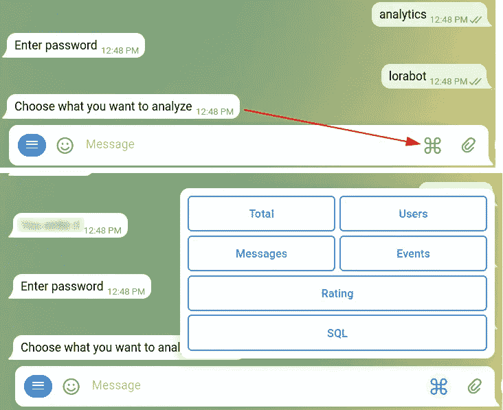
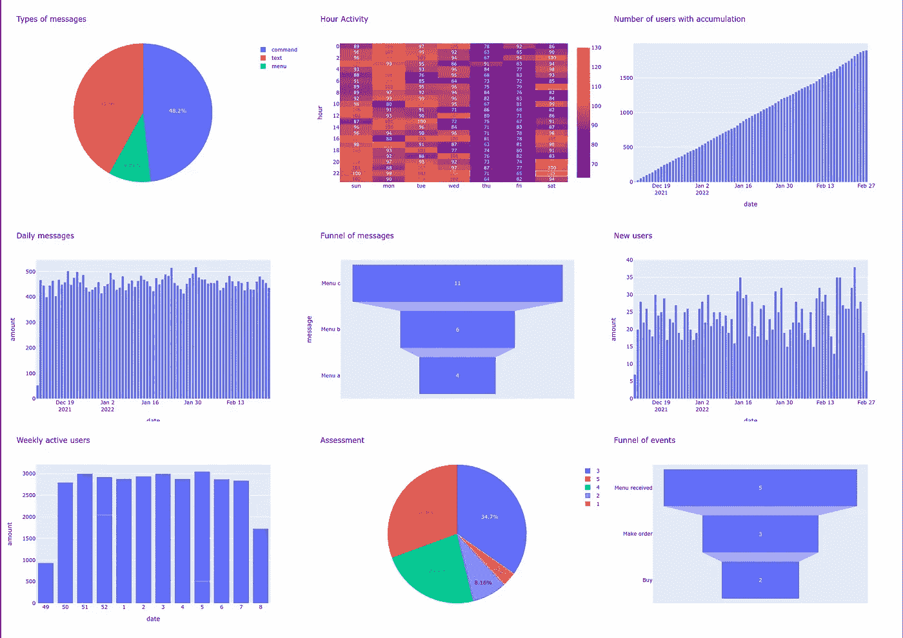
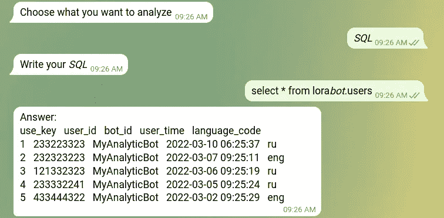
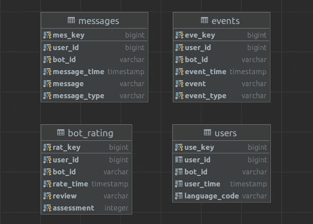

# Python 中聊天机器人的分析

> 原文：<https://blog.devgenius.io/analytics-of-chatbots-in-python-e044024c0db7?source=collection_archive---------16----------------------->

即使创建了一个聊天机器人，创建者也总是想知道有多少人使用它，他们给机器人写了什么。尤其是如果这个机器人是为商业目的编写的。Telegram 中的广告出现后，聊天机器人的分析变得更加必要，因为现在可以直接向用户宣传机器人。与市场上的其他解决方案相比，我的解决方案的优势在于:它是免费的，易于实施，20 个分析指标，您可以创建自己的指标，数据只与您一起存储，适合每月任何数量的消息，存储整个连接时间的历史记录，可以在一个地方存储任何数量的机器人的数据。此外，该解决方案不仅可以用于电报聊天机器人，还可以用于任何其他聊天机器人(Slack、Discord、Vk 等)。


我将这个库命名为[劳拉机器人](https://github.com/aleksspevak/lorabot)。Analytics 作为第三方库连接到您的 bot，所有数据都存储在 PostgreSQL 中。您可以使用 docker-compose 文件在服务器上部署数据库，该文件位于存储库中。如果您有自己的数据库，或者想将它作为 SaaS 部署在云中，您需要自己创建一个用户，运行 [create_tables.sql](https://github.com/aleksspevak/lorabot/tree/main/lorabot/sql) 文件并将凭证放入。环境文件。此外，在[库](https://github.com/aleksspevak/lorabot)中，你可以找到 Telegram、Slack、Discord、Vk 聊天机器人，它们已经实现了分析功能，并且可以从 LoraBot 获取分析信息。

## 如何在你的聊天机器人中实现分析？

你需要下载 LoraBot 作为 [zip](https://github.com/aleksspevak/lorabot) 或者使用 git:

```
git clone https://github.com/aleksspevak/lorabot.git
```

使用以下命令运行 LoraBot 的数据库。如果你没有安装 docker-compose，你可以在这里阅读如何安装:[https://docs.docker.com/compose/install/](https://docs.docker.com/compose/install/)

```
docker-compose up -d
```

为 LoraBot 安装必要的库:

```
pip3 install -r requirements.txt
```

设置密码以访问中的分析。环境文件:

```
ANALYTICS_PASSWORD=lorabot
```

在你的机器人中初始化 LoraBot:

```
from lorabot import LoraBot
lora_bot = LoraBot("your bot's name")
```

设置您需要 LoraBot 功能的位置，开始获取信息进行分析，如下例所示:

```
#to track new users, for example, in a telegram, it is appropriate to put a function in the processing functions of the /start command
lora_bot.user(USER_ID)
#to track commands, menu messages, messages
lora_bot.message(TEXT, TEXT_TYPE, USER_ID)
#to track events
lora_bot.event(EVENT, EVENT_TYPE, USER_ID)
#to track review 
lora_bot.review(REVIEW, USER_ID)
#to track bot assessment
lora_bot.assessment(RATING_IN_INT_FORMAT, USER_ID)
```

要获得分析，进行某种条件分支，例如在 telegram_bot.py 文件中，条件是接收带有关键字的消息，之后检查密码，然后 bot 所有者获得对分析的访问权限:



## 分析度量



跟随[链接](https://github.com/aleksspevak/lorabot#analytics-metrics)找到 LoraBot 中分析的所有指标。请注意，一些指标具有用于设置分析周期、返回的数据量或用于设置消息/事件类型的参数。此外，有些函数只返回文本信息，但有些函数同时返回数据可视化和文本信息。以下是如何在电报机器人中从分析中返回信息的一些示例:

```
#Return total information of users that using your bot(only text)
info = lora_bot.analyze_total(START_PERIOD, END_PERIOD)
bot.send_message(message.chat.id, info)
#Return information about daily active users(photo+text)
photo, info = lora_bot.analyze_dau(START_PERIOD, END_PERIOD)
bot.send_message(message.chat.id, info)
bot.send_photo(message.chat.id, photo)
```

劳拉机器人总共有 [20 个指标](https://github.com/aleksspevak/lorabot#analytics-metrics)，可以分为以下几组:

*   [通用指标](https://github.com/aleksspevak/lorabot#total-metrics)
*   [用户指标](https://github.com/aleksspevak/lorabot#users-metrics)
*   [消息分析的指标](https://github.com/aleksspevak/lorabot#messages-metrics)
*   [事件分析的指标](https://github.com/aleksspevak/lorabot#events-metrics)
*   [用于分析机器人用户评论和评级的指标](https://github.com/aleksspevak/lorabot#assessment-and-review-metrics)
*   [其他指标](https://github.com/aleksspevak/lorabot#other-metrics)

还有一个单独的[函数](https://github.com/aleksspevak/lorabot#how-create-custom-metrics)，您可以直接从 bot 向其传递 SQL 查询。这将有助于创建自定义指标。



存储用户、消息、事件和评论信息的数据库模式:



## 结论

目前，这个解决方案已经被我测试了一个月，结果令我满意。我希望这个解决方案也能帮助你。

**附言**分析当然是好的，但是如果你需要你的机器人在没有手动启动的情况下工作，把它包装在 docker 文件中，并在启动数据库的同一个 docker-compose 文件中运行它。在服务器上托管一个机器人将变得更加容易。