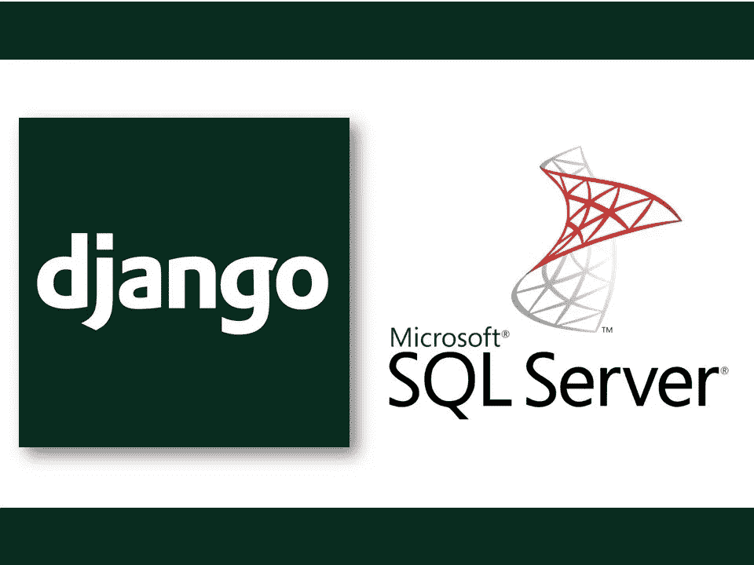
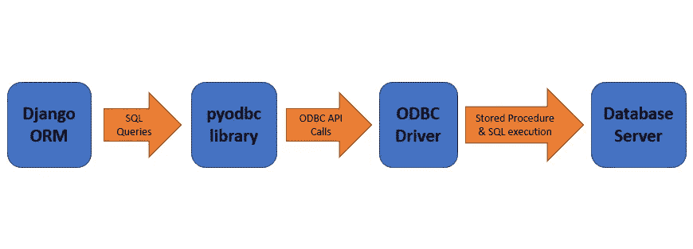

# 分析和优化与 Django 和 pyodbc 的数据库交互

> 原文：<https://blog.devgenius.io/analyzing-and-optimizing-database-interactions-with-django-and-pyodbc-427ce491fa3?source=collection_archive---------11----------------------->

最近，我对我领导的基于 Django 的数据平台的数据库交互活动进行了一些调查，以发现需要优化的地方，并发现了一些令人惊讶的行为。



有很多方法可以查看 Django 应用程序查询的 SQL 语句输出，比如配置`django.db.backends`日志记录器或者使用 [django-debug-toolbar](https://github.com/jazzband/django-debug-toolbar) 这样的工具。这将提供对您的应用程序的数据库交互行为的良好理解，以便隔离要优化的区域，然而这并不是故事的结尾。

# SQL 之下

Django ORM 查询产生的一个简单的参数化 SQL 语句(或者直接传递给 [pyodbc](https://github.com/mkleehammer/pyodbc) 的`execute()`方法)可能看起来像这样:

```
INSERT INTO person (first_name, last_name, date_of_birth, address) 
VALUES (?, ?, ?, ?); params=(‘John’, ‘Smith’, '1995-06-21', '123 Long Street')
```

这应该只需要与数据库进行一次交互，对吗？不对。让我们潜入更深的地方。



数据库查询流程图

上面的流程图概括了使用 Django 和任何 ODBC 数据库后端进行数据库查询时所涉及的层。执行参数化 SQL 查询时，涉及多个步骤:

1.  准备语句—这允许数据库服务器解析和编译语句，然后可以多次有效地重用该语句。这对应于 [SQLPrepare ODBC API 函数](https://docs.microsoft.com/en-us/sql/odbc/reference/syntax/sqlprepare-function?view=sql-server-ver15)。
2.  绑定参数—参数值需要绑定到准备好的 SQL 语句中的参数标记。这对应于 [SQLBindParameter ODBC API 函数。](https://docs.microsoft.com/en-us/sql/odbc/reference/syntax/sqlbindparameter-function?view=sql-server-ver15)
3.  执行查询-使用绑定的参数值执行准备好的语句。对应于 [SQLExecute ODBC API 函数](https://docs.microsoft.com/en-us/sql/odbc/reference/syntax/sqlexecute-function?view=sql-server-ver15)。
4.  取消准备语句—当不再需要该语句时，应该从数据库服务器中释放其编译的资源。对应于 [SQLFreeHandle ODBC API 函数。](https://docs.microsoft.com/en-us/sql/odbc/reference/syntax/sqlfreehandle-function?view=sql-server-ver15)

因此，一个简单的 SQL 查询实际上可以转化为与数据库的多次交互！

# 深入挖掘

理想情况下，当使用可能执行多次但具有不同参数值的参数化语句时，应该准备一次，然后语句句柄可以在每次后续执行中重复使用以提高效率。然而， *pyodbc* 仅在准备好的语句与**之前的**语句相同时才重用该语句(一些扩展的准备好的语句缓存优化已经提出，但尚未实现)。

因此，大多数情况下，每次执行查询都需要重复上述多步骤过程，即使在应用程序中经常重复使用该语句。幸运的是，在 MS SQLServer(可能还有其他数据库)中，一个 SQL 查询的准备和执行步骤实际上可以合并成一个与`sp_prepexec` [存储过程调用](https://docs.microsoft.com/en-us/sql/relational-databases/system-stored-procedures/sp-prepexec-transact-sql?view=sql-server-ver15)的交互。您可以使用类似 SQLServer Profiler 的工具来查看与您的数据库进行了哪些交互。

将参数绑定到准备好的语句需要提供要绑定的参数的 SQL 数据类型。正如作者在[这篇文章](https://github.com/mkleehammer/pyodbc/wiki/Binding-Parameters)中所描述的， *pyodbc* 经常可以使用提供的参数值的 Python 数据类型来推断适当的对应 SQL 类型，并将这些类型提供给`SQLBindParameter` ODBC API 函数调用。

然而，这对于`None`参数值来说是不可能的(即使值为 NULL，也仍然需要提供参数的 SQL 数据类型)。在这种情况下， *pyodbc* 需要向数据库执行一个额外的请求，以检索关于参数的 SQL 类型的元数据(使用[sqldescripeparam](https://docs.microsoft.com/en-us/sql/odbc/reference/syntax/sqldescribeparam-function?view=sql-server-ver15)ODBC API 函数)。在 SQLServer 中，这导致了一个额外的`sp_describe_undeclared_parameters`过程调用，它占用的时间和数据库资源与下面执行实际数据操作的`sp_prepexec`调用一样多。这最适用于`INSERT` 语句，因为`IS NULL` SQL 子句应该在其他语句类型的`WHERE` 条件中使用(而不是将列等同于`NULL` 值)。

这意味着包含`None`参数值的参数化 SQL 语句可能需要额外的数据库交互，因此比不需要的语句要慢。

# 结果

这项调查揭示了两种潜在的提高应用程序数据库交互性能的方法:

1.  如果同一个 SQL 语句在您的应用程序中被多次重用(但是具有不同的参数值)，那么如果可能的话，请将它们一起批处理执行，这样就不需要每次都进行准备
2.  尽可能避免插入 None 值——在 Django 的上下文中，这可能涉及到在保存之前寻找没有指定非 None 值的带有`null=True`和`default=None`的模型字段。

这些建议可能被认为是针对大容量查询的微优化，并且在大多数情况下，业务或应用程序逻辑需求应该优先考虑(与其他不适当的缺省值/空白值相比，最初保存字段中具有空值的模型/表条目可能更有意义)。

正如在 [Django 文档](https://docs.djangoproject.com/en/4.0/topics/db/optimization/)中所讨论的，还有其他方法可以优化数据库访问，这些方法可能会产生更大的影响，应该首先探索:

*   当涉及模型关系时，在 Django 查询中添加`select_related()`和`prefetch_related()`调用
*   使用`bulk_create()`(或 *pyodbc* `executemany()`)进行批量插入
*   实现缓存(可以是视图级或查询级，使用类似于 [django-cachalot](https://github.com/noripyt/django-cachalot/blob/master/docs/index.rst) 的东西)
*   重构应用程序结构或逻辑，以减少数据库交互(例如执行完整的选择，并在内存中创建一个本地缓存来检查，而不是以后检查许多单独的目标选择)

我希望你喜欢这篇文章，也许对你自己的项目有所帮助！