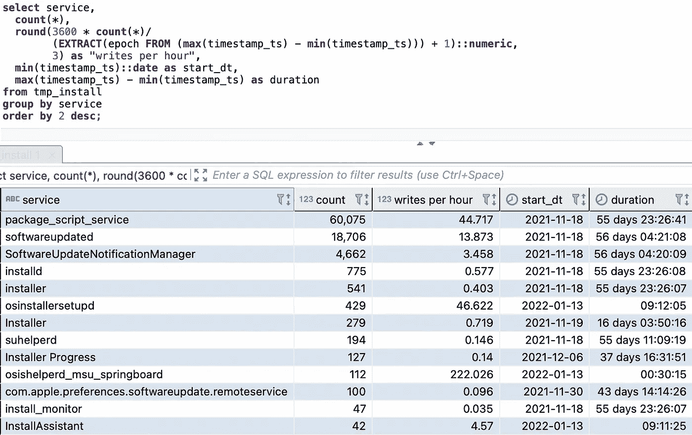

# 使用 SQL 分析应用程序和基础架构日志(不需要解析器)

> 原文：<https://blog.devgenius.io/analyzing-application-logs-with-sql-2c607ba8d39e?source=collection_archive---------16----------------------->

# 介绍

这篇文章是为 SQL 爱好者写的，他们喜欢 SQL，喜欢使用它的能力，并且很少遇到集成问题，以便从所有可用的工件中获得洞察力。我将展示如何轻松地对应用程序和基础设施日志运行特定的 SQL 查询，筛选出嵌入日志中的金块信息，并将其与存储在数据仓库中的数据结合起来，以分析和预测系统健康和用户旅程。事实证明，要实现这一点，除了您喜欢的 RDBMS 之外，您不一定需要专业工具。要了解如何做，请继续阅读。

当我们将业务逻辑处理委托给短暂的云容器或 SaaS 服务(如 AWS Lambda)时，分析应用程序日志的能力在无服务器计算的现代时代非常重要。该行业通过仔细检查和监控应用程序和基础架构日志及遥测技术，确立了生产环境故障排除的最佳实践。然而，随着应用程序及其组件的复杂性和粒度不断增加，传统的 grep 向导无法扩展，需要延长故障排除 SLA。

首先，让我们检查一下现实:这里没有魔法。通常，专注于满足最后期限的工程师和经理对自己撒谎，并在过程中误导他们的业务和领导。他们相信一旦每个组件都建立了日志记录(检查！)，系统投产时一切都会在掌控之中(成功！)… *如果我们遇到意料之外的边缘情况(这怎么可能呢！？)，通过查看日志就可以很容易地缩小问题的范围。没什么好担心的！* …直到有了*。*我过去共事过的许多非常聪明的人都成了这种自我欺骗的受害者——所以我想分享一些技巧，告诉你如何利用你很可能已经拥有的系统，以最小的代价控制局面。

在复杂系统的世界中，通常有许多服务和不连贯的子系统记录有价值的遥测和业务逻辑信息。没有事先的设计，推断独立记录的事实之间的相关性是很困难的。许多人提到了 AWS 云观察或其他云服务的力量，它们可以在需要时提供帮助。这让我想起了以前的好时光，那时 XML 开始流行，许多人认为只要在他们的文档和有效载荷中放上尖括号，他们所有的问题都可以解决。不幸的是，情况并非如此，如果系统的架构不合理，最终会花费更多的成本——不管是在本地还是在云中，也不管您使用什么数据存储格式。

如果您没有提前考虑、建模和设置所有子系统的日志记录，那么一旦工程兴奋和音乐停止，真正的生产工作负载开始，就很难理解记录的数据。当生产问题陷入困境时，你想成为沃森，而不是夏洛克。用放大镜浏览所有子系统是一项艰难的侦查工作——它可能带来一些工作保障，但总体项目可能会失败。您希望将故障排除的成本和时间降至最低。

# “日志优先”模式

流行的"[测试优先](https://en.wikipedia.org/wiki/Test-driven_development)"工程范例对于确保我们考虑已知的测试用例是很棒的。我在这里描述的是一个“日志优先”的工程范例，旨在减轻系统的未知和意外的健康问题和边缘情况，使您能够在最终用户升级之前检测到它们。

当然，我们需要做的第一件事是在我们所有的子系统中建立日志记录，并弄清楚如何将日志从服务器和容器传输到一个集中的存储。但这只是一个非常基本的勾号，会造成一种虚假的自信感。细节决定成败。以下是我建议遵循的一些规则:

1.  在交易系统中，有许多活动的部分和维度，如用户交互、分布式交易、客户、账户、活动等。，**日志可以帮助追踪这些物体的行程和生命周期**。为此，我们需要将这些对象和事务的元数据合并到跨前端、中间层和后端发出的日志中，这将允许跨所有应用层跟踪沿袭和执行根本原因分析。
2.  不同的系统可能独立发展——用不同的语言编写，遭受不同数量的技术债务，等等。—因此，标准化日志结构和格式可能超出了我们的控制范围，但这种情况仍然是可以管理的。重要的不是*如何创建*日志，而是*记录了什么*。**如果关键信息(如公共对象和事务的标识符)被记录，我们将找到一种方法来提取知识并加以利用。**

> 当心建造巴别塔的风险:如果整体的各个部分在关键时刻不能相互理解，那么整个系统就可能分崩离析。当提到共同的关键对象和事件时，所有子系统应该使用相同的词汇和术语。确保这是在控制之下，否则你将需要处理大量的技术债务。

以下是一些需要考虑的其他挑战:

1.  您可以控制您的团队设计的系统，但是您对第三方组件和服务的控制较少。
2.  大量不重要的日志记录会产生噪音，浪费空间，并减慢系统进程。确保在迁移到生产环境时，应用程序日志包含所有必要的信息，但不要超出必要的范围。这就是艺术。

此外，设计良好的日志架构为我们提供了分析用户、事务、批处理作业、项目等的数据。一旦与我们的数据湖中的核心交易和参考数据集成，我们就可以在复杂的业务逻辑计算和机器学习算法中利用从日志中提取的知识。这给了我们额外的能力来推导事件和异常值之间的相关性，学习和计算预测，并推动建议。 **一个设计良好的日志记录系统是一个强大的工具，可以发现异常的根本原因，并在用户受到影响之前预测潜在的问题。**

# 技术方法

关于如何实际发出日志的技术细节和最佳实践超出了本文的范围。有很多很棒的日志工具和库，比如 [log4j](https://www.loggly.com/docs/java-log4j/) 、 [log4net](https://www.loggly.com/docs/net-logs/) 、apache logs 等等。(如果你还没有使用它们)你可以通过搜索网络和这里的[媒体](https://medium.com/search?q=application%20logging)找到。重要的是，您对感兴趣的领域有一个标准的模式，并且您的所有应用程序都遵循既定的标准，无论它们是用 Java、C/C++、Python、Go 还是其他语言编写的。

现在，您的系统正在生成日志，您需要一个日志分析解决方案。有许多强大的供应商工具专注于日志分析和托管日志解决方案。他们收取这么高的费用是有原因的——看看 Gartner 和其他咨询公司的一些优秀供应商评论。但是，有时成本(许可证、额外的基础设施、额外的技术技能和时间)可能不值得投资。此外，有时您需要一个定制的解决方案和与现有系统集成的能力，这是商业日志解析和分析工具不容易支持的。

在本文中，我们将研究如何在现有的数据仓库中接收和分析日志。我们将在日志文件上创建示例 SQL 视图，这些视图可以在分析查询中用来监视、分析和排除生产系统的故障。我还将向您展示如何使用 Postgres 实现日志优化。一旦您熟悉了这种方法，您应该能够轻松地将其扩展到其他系统(基于 MySQL 的系统、雪花系统、Redshift 系统、BigQuery 系统、SQL Server 系统、Oracle 系统等)。).

这里介绍的简单解决方案基于在 Xcalar 开发的工作(在 Xcalar，我领导一个产品工程团队开发一个计算平台，以加速云规模数据应用程序的开发和运营)。目标是在 Xcalar 数据引擎本身中处理多个子系统的日志，因为它从数百个 Kafka 流中获取和处理数据。我们想吃自己的狗粮，用 Xcalar 分析 Xcalar。你可以在 YouTube 上找到描述这项工作的视频:

[数据库月:SQL NYC，NoSQL & NewSQL，2020](https://www.youtube.com/watch?v=RAQ4OnIBkss&t=3914s)

[2020 年洛杉矶数据会议](https://www.youtube.com/watch?v=kId44PF7iXk&t=1337s)

# 示例实现和代码

让我们看一个简单的例子，它演示了如何在不使用任何额外工具和解析器的情况下，使用 Postgres SQL 接收和分析各种格式的日志。您应该能够将这种方法扩展到其他用例。如果您有任何问题或需要进一步的指导，请随时联系我！

网上有大量的日志样本可供使用。例如，看看[这个由 LogPai 收集的来自不同系统的日志的大集合](https://github.com/logpai/loghub)。您可以使用这些文件来测试不同的解析模式；然而，您甚至不需要走那么远:您可以在您的个人或云计算机上找到系统和应用程序日志。例如，macOS(以及 Linux)将系统日志存储在 */var/log* 目录中(取决于您的 OS 版本，它可能在 */Library/Logs/或~/Library/Logs/)* 。这是我的 MacBook 笔记本电脑的快照:

为了便于说明，让我们解析 *install.log* 来找到最活跃的安装程序和补丁活动。我们需要做的第一件事是创建原始日志表，该表有一个接收原始日志条目的文本列。我们还将创建一个自动递增的列，该列将由 Postgres 自动填充，并与源日志文件的行号相对应。当我们未来的 SQL 操作需要行顺序上下文时，这个数据字段将会派上用场。

创建原始日志表

接下来，我们将利用 awesome Postgres *COPY* 命令将日志文件中的所有记录提取到一个名为 *log_record 的列中。*因为 Postgres *COPY* 命令需要一个分隔符，所以我们需要使用一个保证不会出现在日志文件中的字符。对于这个例子，我们将使用一个声音哔([铃声](https://en.wikipedia.org/wiki/Bell_character))字符。

使用“哔”字符作为分隔符，以确保日志行作为单个字段加载

瞧，我们快到了。现在我们的原始数据表中有了日志记录，我们将解析它们。Postgres 支持正则表达式，这使得解析变得非常容易。

> 所有主流的 RDBMS(基于 MySQL、雪花、红移、BigQuery、SQL Server、Oracle 等。)支持正则表达式。然而，如果你的 RDBMS 不支持正则表达式，没问题。您可以使用基本的 ANSI SQL 字符串操作函数(子字符串、索引等)获得类似的结果。)，可能比正则表达式要罗嗦一点。我将在下面的代码示例中说明其中的一些内容。

我使用[regex101.com](https://regex101.com/)在线工具来开发和测试我的正则表达式:

我注意到，大多数日志条目都有一个共同的模式，只是略有不同:一些记录在发出的消息的信息部分有额外的子结构。下面的脚本说明了:

在上面的第 4 行，我们首先应用公共正则表达式，然后在第 12–17 行，我们处理变化(由一些子系统发出的日志条目有一个额外的部分，我们将它分割到 msg_action 字段，而一些子系统跳过它)。第 12–17 行还说明了如果 RDBMS 不支持正则表达式，如何解析日志条目。

以下是结果集的一个片段:

现在我们已经完全解析了日志，我们可以看到哪些应用程序安装程序在您的机器上是最活跃的(或者说，最活跃地记录了它们的活动)。例如，我们可以运行一些统计查询，如下所示:

显示最多产的伐木工

分析写入频率

> 注意，Postgres 过滤掉了 10%的日志记录，因为它们与 regex 模式不匹配。我分析了这些记录，它们看起来并不有趣，但是您应该始终确保测试异常值和异常情况，以避免丢失信息:

完整的 SQL 脚本在这里:

这种方法的美妙之处在于民主化的程度。只要有一个适配器(在这种情况下是一个简单的 SQL 查询)可以提取日志分析所需的语义，应用程序和服务就可以自由地以任何方便的格式编写信息。当然，理想情况下，所有系统都应该努力实现单一标准。利用如上所示的 SQL 适配器，可以构建抽象层，使企业能够向前推进，同时标准化工作可以并行进行。

> 注意:为了避免暴露专有信息，我在这个练习中使用了一个相当随机的例子和命名对话。当然，一旦您遇到需要解决的特定日志分析问题，您应该遵循组织中采用的适当命名约定和最佳实践。

如果您喜欢这种方法，您可能需要开始考虑接下来的步骤。比如开发更深更复杂的解析模式；聚集来自多个系统的日志；从 S3、Azure/GCP blob 或其他云存储媒体摄取日志；增加历史博客；跟踪错误堆栈跟踪；丰富您的数据仓库中的其他数据集并与之连接；在聚集的数据集上运行机器学习模型；等等。敬请关注，如果你对这些话题感兴趣，请给我写封私信，发表评论，或者在 LinkedIn 上联系我。