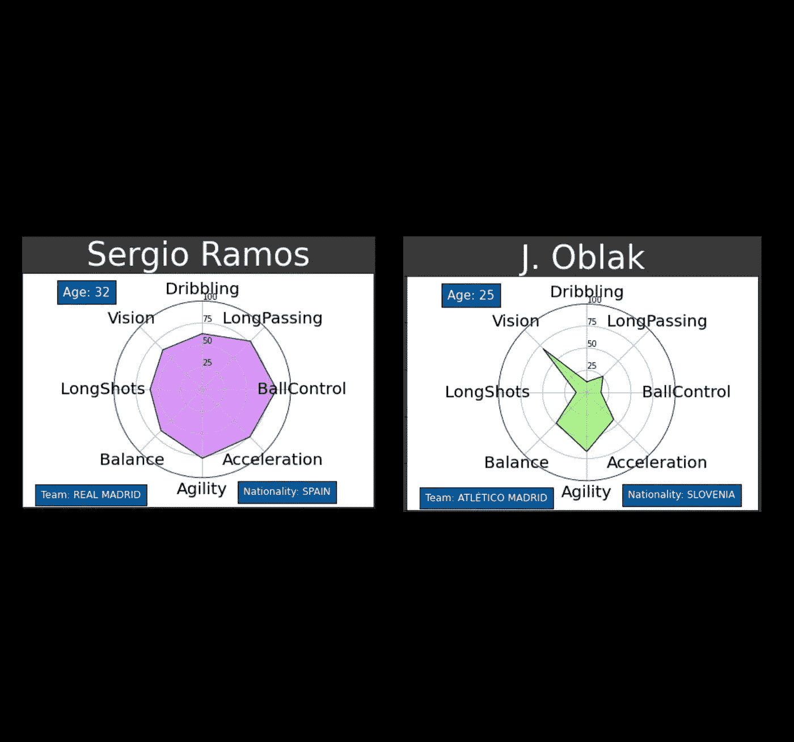

# 分析 FIFA 19 数据集

> 原文：<https://blog.devgenius.io/analyzing-fifa-19-dataset-b546a6759e59?source=collection_archive---------12----------------------->

FIFA 19 最佳 10 名球员

[来源](https://www.easports.com/fifa/ultimate-team/news/2017/fut-online-match-modes)

在本帖中，我们将对 FIFA 19 数据集进行数据分析。数据集可以在 [Kaggle](https://www.kaggle.com/karangadiya/fifa19) 上找到。FIFA(国际足球联合会)和 FIFA 19 是 FIFA 系列的一部分，足球视频游戏是世界上最受欢迎的游戏之一，EA 表示，自 1993 年第一次推出以来，足球特许经营[的终身销量已超过 2.6 亿份。](https://venturebeat.com/2018/09/05/ea-sports-fifa-franchise-surpasses-260-million-copies-sold/)

我们将分析 FIFA 19 球员。数据集有 89 列，但我们将使用大约 25 列来抓取数据集最重要的列。使用以下主题:

*   能力最强的 10 名选手。
*   最佳 10 名球员价值对释放条款。
*   分析前 100 名玩家的平均年龄。
*   分析前 100 名选手的首选脚和弱项脚。
*   分析一下 FIFA19 哪个国家的球员最多？
*   前 100 名选手的哪些特征高度相关。
*   最佳 10 名球员潜力对比工资

我们开始吧！！

# **拥有自己能力的最佳 10 名选手。**

多边形的每个角都是玩家的属性之一。离中心越远，属性越高。**形状凸起**。凸意味着玩家在所有属性上大体平衡。

像梅西这样全面的球员会显示出高比例的多边形阴影，而弱球员会在中间附近显示出很少的阴影区域。

这个图表直观地向我们展示了一个玩家在所有玩家属性上的强大程度

# **最佳 10 名球员价值对抗释放条款。**

支付免责条款是什么意思？

经理可以通过支付球员的释放条款来签下球员，这将高于球员的市场价值，而不必依赖球员的所有者。

## 免责条款是如何设置的？

最初，根据以下规则自动建立玩家的释放条款:

*   市值 100 万的球员将有一个 166%市值的解约条款。
*   释放条款永远不能低于市场价值。因此，它将根据市场价值进行更新。任何想要保护他们的玩家的用户都可以通过从他们的预算中支付 1:2 的比例来提高释放条款。例如，如果你想提高 2M 的释放条款，你将不得不从你的预算中支付 100 万英镑。

前 100 名球员的平均年龄。

# 根据 FIFA 前 100 名球员的数据，他们的平均年龄是 27 岁

前 100 名选手的首选脚和弱项脚。

# 我们可以清楚地看到，游戏中的大多数玩家都是天赋异禀的职业，以及著名的回声和他们所处环境中的佼佼者

我的意思是，在这里，我们有前 100 名球员的弱脚，他们的评分从 1 到 5，每个人都有自己对自己喜欢的脚的支持程度，有些球员的弱脚对他们没有任何帮助，而其他人的弱脚得到了完美的处理。

FIFA 19 中哪个国家的球员最多

# 从整个数据集中，我们得到了 FIFA 19 中最常见的 5 个国籍。如你所见，英格兰是最常见的国籍，有 1662 项记录，其次是德国，有 1198 项，西班牙有 1072 项。

前 100 名选手的哪些特征高度相关。

# 我们将从数字列中生成一个热图，它将向我们显示每个变量与其他变量的相关性有多强。我们过滤了数据帧，使其仅包含数值，并从结果数据帧生成热图:

最佳 10 名球员潜力对比工资

# 你可以清楚地看到，一些球员的潜力比其他人小，但却赚得更多，而另一些球员的潜力几乎发挥到了极致，并获得了他们应得的回报。我制作这个图表是为了看看球员们是否因为他们的高潜力而获得了他们应得的。

还有更多的东西需要分析，但我会就此打住。这个帖子的代码会在 [Github](https://github.com/YinmiAlas/YinmiAlas.github.io/blob/master/LS_DS__build_week_project.ipynb) 上提供。感谢您的阅读！

There is much more to analyze but I will stop here. The code of this post will be available on [Github](https://github.com/YinmiAlas/YinmiAlas.github.io/blob/master/LS_DS__build_week_project.ipynb). Thank you for reading!