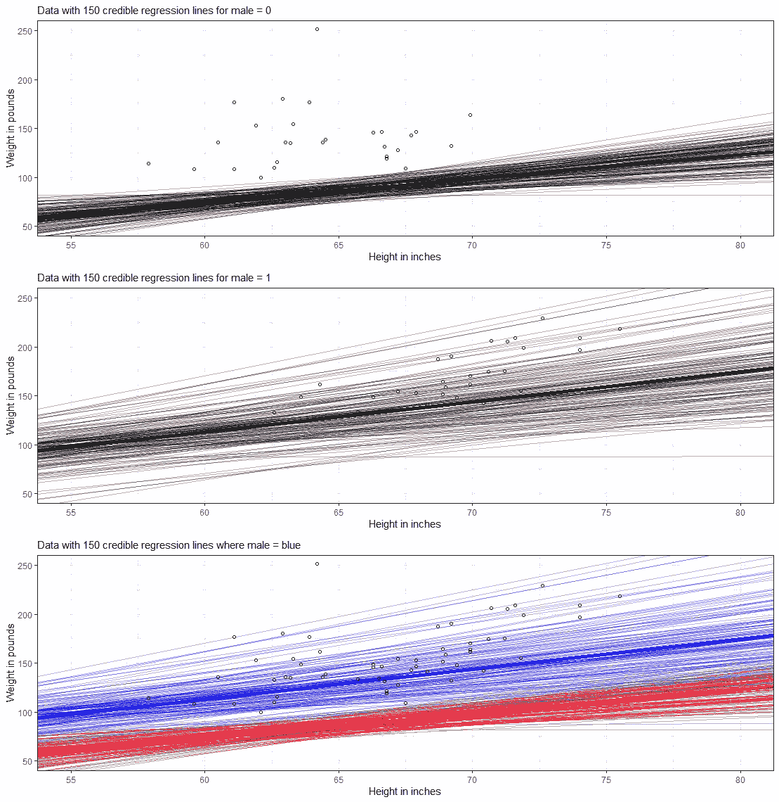

# 分析身高和体重

> 原文：<https://blog.devgenius.io/analyzing-height-weight-5ba7449d6431?source=collection_archive---------10----------------------->

## 通过贝叶斯分析

因此，我开始了一个系列，在这个系列中，我将浏览几个不同的数据集，并通过贝叶斯分析对它们进行分析。这不是第一个例子，因为我之前已经发布过关于[非线性](https://towardsdatascience.com/in-modelling-the-first-steps-are-the-hardest-a4250b80a0f2)和[纵向](https://medium.com/mlearning-ai/mixed-models-of-chicks-weight-a41413c99b51)贝叶斯的例子。

在这个例子中，我将使用一个随机生成器，这里创建的[是](https://github.com/boboppie/kruschke-doing_bayesian_data_analysis/blob/master/2e/HtWtDataGenerator.R)，用三个参数制作一个数据集:*身高*、*体重*和*性别*。这个数据集的好处是，尽管它们之间的关系有一种直观的吸引力，但我们可以指定一个完全不符合我们先前假设的数据集，和/或创建一个“奇怪”但可行的先验。

定义先验是贝叶斯分析中最重要的部分，它本身需要实验设计。因此，支持先验是纯粹的研究，虽然我在这里没有对可行的先验做任何研究，但我确实使用了信息性先验。也就是说，我决定变量之间的关系必须是一个给定的函数，我支持它，没有使之前的分布中的方差变大。

因此，我使用信息性的先验，我支持使用它们是为了向你展示它们的影响，而不是最可行的先验，这需要通过已知的文献对身高、体重和性别进行彻底的分析。

好，我们开始吧。

数据生成器的前六行。

绘制生成的数据。

和三个线性回归模型的结果。

模型与上一个模型的曲线相吻合。

最后一个模型的置信区间。

以及三个嵌套模型的 ANOVA 比较。如您所见，最后一个模型**模型 fit2.2** 的性能最好，这应该是因为它最符合数据生成流程。

让我们建立一个贝叶斯模型。因为几乎所有的 R 包都查看 STAN 编译器的贝叶斯抽样，所以也很高兴看到用 R 编写的代码是如何发送给 STAN 的。你可以在下面看到，使用一个没有先验，只有数据的模型。

**stancode** 函数展示了 **brms** 包如何将 R 代码转换成 **STAN** 代码，这是 STAN 编译器工作所必需的。

样品看起来不错——链条不错，而且变化多样。

现在，以上是没有什么壮观的。考虑到我们没有指定任何先验，这只是可能性分析。

**brms** 中的一款新车型，有着广泛的前科。然而，正如你将看到的，它们偏离了数据，因为我所做的是说明，平均来说，我认为身高和体重之间没有任何关系。

模型拟合

并且可能性( **y** 和后验概率( **yrep** )之间的偏差非常明显。没什么好担心的，这是科学。

可以看到 **yrep** 的采样很漂亮，但是离 **y** 很远。这就是当你的先验和可能性大大偏离时你所得到的。再说一次，没什么好担心的，这就是科学的工作方式。

这个阴谋将动摇大多数人，怀疑他们的先验。但是，如果我可以证明，我相信身高和体重之间没有关系，先验是没问题的，所以我们有一些真正有趣的东西。当然，身高和体重肯定是有关系的。但是，如果我能为他们为什么没有辩护，我就在科学的核心——知识积累上移动。

现在，让我们更进一步，让先验知识更具知识性和方向性。

包括 **brms** 型号和**标准**代码。

取样顺利

条件概率-一个用于连续预测值，一个用于分类预测值。

现在，你们中大多数查过贝叶斯分析的人可能也读到过，只有遵循贝叶斯分析，才能说来自模型的值的区间可以真实地陈述:“在 XX%的情况下，变量 Y 的值将落在这个范围内”。这就是我们所说的可信区间，考虑到它是贝叶斯分析的基础，它应该有自己的博客文章。然而，现在，我将只向您展示，当指定无信息先验时，当使用[等尾可信区间](https://rdrr.io/cran/bayestestR/man/eti.html#:~:text=Description,as%20Credible%20Interval%20(CI).)时，[置信度](https://medium.com/mlearning-ai/inference-estimates-p-values-and-confidence-limits-a-frequentist-approach-acdd45d94bd5)和[可信区间](https://easystats.github.io/bayestestR/articles/credible_interval.html)几乎相等。不使用[最高密度区间](https://www.sciencedirect.com/topics/mathematics/highest-density-interval#:~:text=Second%20Edition)%2C%202015-,4.3.,highest%20density%20interval%2C%20abbreviated%20HDI.&text=The%20HDI%20indicates%20which%20points,cover%20most%20of%20the%20distribution..)时。

当要求等尾区间时，置信区间和可信区间重叠。

从模型中抽取的前六个后位。

回归线来自后半部分，点来自女性的可能性。

回归线来自后验概率点来自男性。

平均后验和后验来自数据之上的贝叶斯模型。

以上所有情节结合起来。

现在，让我们再次回顾一下最高密度区间(HDI)。我下面做的是绘制 sigma 变量的分布，这是均值= 0 的残差的标准偏差。直方图是 85%的 HDI，海绿色覆盖图是 95%的置信区间(CI)。黑点和绿点是它们各自模式和含义。

人类发展指数表明分布的哪些点是最可信的，哪些点覆盖了分布的大部分。对于正态分布，由于正态分布的对称性，HDI 和 CI 通常会重叠。

最后，但同样重要的是，让我们看看完整的蒙蒂:置信区间和预测区间，以及可信区间。下面是来自模型预测的数据。

如你所见，置信区间和预测区间是完全不同的。置信区间表示参数的不确定性，预测区间表示单个数据点的不确定性。

来自贝叶斯模型的置信区间。

好吧，我希望这是一个很好的例子，让你们可以学习。更多将在未来几天发布！如果有什么不对劲，请务必让我知道！

在代码下面。