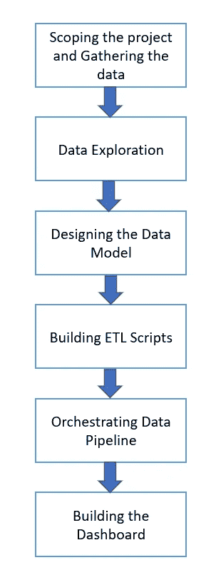

# 使用火花和气流分析专利数据

> 原文：<https://blog.devgenius.io/analyzing-patent-data-using-spark-and-airflow-74a6860b03ac?source=collection_archive---------3----------------------->

我的梦想是成为一名全栈数据科学家，能够处理从数据准备到模型构建到部署的端到端数据科学项目。在建立机器学习模型之前，有必要获取数据并将其转换为模型可以使用的格式。出于这个原因，我完成了一个数据工程的 Udacity 纳米学位项目，以获得对数据工程的基本理解。

在这篇文章中，我将与你分享我的纳米学位项目的最终项目。对于最后的项目， *Udacity* 让我选择我自己的项目或者做他们准备的项目。为了挑战自己，我决定通过思考要解决什么问题、如何解决问题以及结果应该是什么来策划我的项目。

我选择专利分析作为我的最终项目，因为公共数据很容易获得，而且大多数人都熟悉专利。


照片由 [Alexas_Fotos](https://unsplash.com/@alexas_fotos?utm_source=medium&utm_medium=referral) 在 [Unsplash](https://unsplash.com?utm_source=medium&utm_medium=referral) 上拍摄

> 根据世界知识产权局(WIPO)的规定，专利是授予发明的专有权，发明是一种产品或工艺，通常提供一种新的做事方式，或为一个问题提供一种新的技术解决方案。

因此，专利活动是可用于评估技术进步的宝贵数据来源。分析专利可能有助于公司在其行业的关键发展中保持领先，识别关键参与者(竞争对手)，并识别潜在的研究主题。

在整篇文章中，我将讨论我完成项目所采取的步骤，从确定项目范围、收集数据到构建仪表板。



项目的步骤

除此之外，我还会谈到我遇到的挑战，以及可以改进的地方。

该项目采用以下技术实现:[*【py spark】*](https://spark.apache.org/docs/latest/api/python/)[*气流*](https://airflow.apache.org/)[*亚马逊红移*](https://aws.amazon.com/redshift/)[*Tableau*](https://www.tableau.com/)。你可以在 [GitHub](https://github.com/tjoakarlina/Udacity-Patents-Analytics-Data-Pipeline) 上找到该项目的源代码

# 确定项目范围并收集数据

## 寻找正确的数据

找到正确的数据是这个项目的关键步骤之一，因为它将决定可以执行哪种转换和分析。Udacity 建议我们查看各种公共数据源，如 [*Kaggle 数据集*](https://www.kaggle.com/datasets) 、 [*Github: Awesome 公共数据集*](https://github.com/awesomedata/awesome-public-datasets) 和 [*UCI 机器学习库*](https://archive.ics.uci.edu/ml/datasets.php) 来找到一个数据集。我的目标是找到我能理解并感兴趣的数据集。在我的搜索中，我偶然发现了由[*USPTO patents view*](https://patentsview.org/download/data-download-tables)提供的专利数据。数据根据 [*知识共享署名 4.0 许可*](https://creativecommons.org/licenses/by/4.0/) 进行许可，这意味着它可以与署名一起共享和改编。

## 查看数据

我查看了数据集，以确定它包含哪些信息以及哪些可能是有趣的。该数据包含*美国专利商标局*截至 2021 年授予的专利，共计 7，991，058 项专利。这些数据包括有关专利、专利分类、受让人和发明人等信息。

我还读了一些关于专利的书，以获得更深入的理解，并确定进一步研究的领域。《2022 年世界知识产权报告》中关于创新方向的文章有助于确定应该寻找什么样的见解。

## 定义项目目标

下一步是决定我想要构建什么样的最终产品。查看完数据集后，我确定了可以从数据中提取的信息。这些是其中的一些:

*   可以对专利数量进行评估，以确定哪些行业随着时间的推移经历了增长。
*   特定领域前 10 或 20 家公司的专利所有权表明了该领域的主要参与者。
*   专利关键词提取可以作为获得特定技术领域中的研究方向的有价值的方法。

为了方便用户浏览这些数据，我决定创建一个仪表板来显示这些信息。

# 数据探索

在构建任何提取转换加载(ETL)脚本之前，我们需要理解数据并识别任何数据质量问题，比如缺失值、无效值、重复值等。

虽然专利数据集的大小只有大约 5.9 GB，但我使用了 *Spark* 来执行数据探索和其他数据转换，以利用 *Spark* 的分布式数据处理。

*Spark* 是一个计算平台，能够快速处理大型数据集，并将数据处理任务分配给多个节点。我使用了 *PySpark* ，一个用于与 *Apache Spark* 交互的 Python 库。除了 *Python* ， *Scala* ， *Java* ， *R* 也可以用来和 *Spark* 交互。

Spark 集群可以以多种方式运行，包括本地运行。然而，我们会受到机器计算能力的限制。另一种选择是在云中使用托管的 *Spark* 集群，就像 [*亚马逊 EMR*](https://aws.amazon.com/emr/) 一样。 *Amazon EMR* 允许我们指定集群规格，例如节点数量以及每个节点的计算和存储需求。我们也可以在需要时启动和停止集群。在这个项目中，我使用了一个*亚马逊 EMR* 集群来运行 *Spark* 脚本。

为了让*亚马逊电子病历*可以访问数据集，我把它们上传到了*亚马逊 S3* 。之后，我可以使用 *JupterLab* (与 *Amazon EMR* 一起提供)加载数据，并分析每个字段以检查任何问题。我们可以使用 *Spark SQL* 来查询和分析数据。分析看起来像这样


使用 JupyterLab 进行数据探索

我记录了发现的问题以及我计划解决它们的步骤。运行上述步骤后，在数据集中发现了以下问题:

*   专利的所有者位置包含多个字段，包括*城市*、*县*、*县 _fips* 、*州*、*州 _fips* 、*国家*、*纬度*和*经度*。但是，数据集可能在这些字段中包含空值。由于这个原因，我决定将位置聚合到国家的级别，因为这是位置的最高级别。当数据不包含关于*国家*字段的信息时，我通过使用[*py geology*](https://pypi.org/project/PyGeodesy/)Phyton 库和 [*GeoNames*](https://www.geonames.org/) 国家多边形数据，将*纬度*和*经度*坐标映射到*国家*。
*   许多专利不包含关于*受让人*的信息。在这种情况下，专利*的发明人*被视为专利*的受让人*。

# 设计数据模型

在通过数据探索对数据有了更深入的理解之后，我为我们的分析数据库设计了一个合适的数据模型。

数据模型遵循星型模式，以专利和*专利关键词*作为事实表，以*日期*、*细节*、*知识分类*、*位置*和*所有者*作为维度。


数据模型

我选择 *Amazon 红移*来存储结果，因为*红移*是为数据仓库目的而构建的，并且支持高效的分析查询。它采用列式表设计，能够对分布在不同节点上的数据进行大规模并行处理。

*红移*允许我们指定表分布样式和分布键来优化我们的查询。我们指定分布样式和分布键的目的是在集群节点之间均匀地分布工作负载，并在查询执行期间最小化数据移动。

对于小表，比如*日期*、*所有者*和*位置*，我将分布样式设置为 *ALL* ，这意味着这些数据在所有节点上都被复制。同时，对于较大的表格，如 *WIPOClassifications* 、 *Patents* 和 *Patent Keywords* ，我将分发样式设置为 *KEY* 。这将允许数据根据指定的 *DISTKEY* 分布在各个节点上。

# 构建 ETL 脚本

在这一步中，我构建了脚本来执行数据清理、关键字提取和 ETL 到红移。首先，我使用 *JupterLab* 编写脚本，对数据进行实验。之后，我将代码重写为 *Python* 脚本。

## 数据清理

这一步包括从*亚马逊 S3* 读取原始数据，执行数据探索期间记录的清理步骤，并将结果写回*亚马逊 S3* 。以下是我采取的一些净化步骤的例子:

*   过滤自 2000 年起授权的专利数据
*   将位置信息映射到*国家*级别
*   根据专利*受让人*和专利*发明人*信息派生出专利所有者

## 关键词提取

为了构建专利关键词云，我从专利的*标题*和*摘要*中提取了专利关键词。我试验了各种算法，像[](https://github.com/csurfer/rake-nltk)*[*Keybert*](https://github.com/MaartenGr/KeyBERT)[*YAKE*](https://github.com/LIAAD/yake)。与其他的相比， *Keybert* 的输出是最相关的。但是，我为这个项目选择了 *YAKE* 关键字提取，因为它速度更快(在这个数据集上大约快 4 倍)，并且有一个 *Spark* 库实现这个算法: [*Spark NLP*](https://github.com/JohnSnowLabs/spark-nlp) 。关键词提取的结果存储在亚马逊 S3 的文件夹中。*

# *ETL 到红移*

*在这一步中，清理后的数据从*亚马逊 S3* 文件夹中读取，转换成维度模型，然后写入*亚马逊红移*。*

*数据转换可以简单到从清理后的数据中选择一些列，也可以复杂到连接几个表。*

*在写入*红移*时需要注意的一点是， *PySpark* 会在*亚马逊 S3* 中创建临时文件，为将要写入*亚马逊红移*的数据做准备。因此，在向*红移*写入数据的库中，我们需要提供*亚马逊 S3* 文件夹的路径来存储这些临时文件，并创建一个 *IAM 角色*来使*红移*能够读取*亚马逊 S3* 。这是我创建的将数据加载到*红移*的函数。*

```
*def load_data_to_redshift(
    spark: SparkSession,
    data: DataFrame,
    db_jdbc_url,
    db_username,
    db_password,
    s3_temp_dir,
    iam_role,
    table,
):
    spark_logger = logging.Log4j(spark)
    spark_logger.warn(f"Writing data to redshift table {table}")
    url = f"{db_jdbc_url}?user={db_username}&password={db_password}"
    data.write.format("io.github.spark_redshift_community.spark.redshift").option(
        "url", url
    ).option("tempdir", s3_temp_dir).option("dbtable", table).mode("overwrite").option(
        "aws_iam_role", iam_role
    ).save()*
```

*如果你想了解更多关于如何从*亚马逊 EMR* 写信给*红移*，亚马逊在[这篇文章](https://docs.aws.amazon.com/emr/latest/ReleaseGuide/emr-spark-redshift.html)中提供了很好的文档。*

# *将 Jupyter 笔记本代码重写为 Python 脚本*

*使用 *JupyterLab* 运行 python 代码非常适合探索，但是当我们想要生产我们的代码时，我们需要将它转换成能够提交给 *Spark* 集群的 *Python* 脚本。*

*我的目标是构建我的项目，以便我可以编写干净的代码，执行单元测试，并有效地处理模块和包之间的依赖关系。 [*PySpark 示例项目*](https://github.com/AlexIoannides/pyspark-example-project) 对构建 *PySpark* 项目有很好的建议。我根据他们的建议组织了我的项目。我的文件夹结构如下所示*

**

*PySpark 项目结构*

*   **configs* 文件夹包含了 *PySpark* 作业的所有配置，比如*红移*数据库连接和*亚马逊 S3* 路径。*
*   **dependencies* 文件夹包含在我们的作业之间共享的功能。这样做允许我减少代码重复。*
*   **作业*文件夹包含将要执行的 *PySpark* 脚本。脚本由脚本功能组织，如数据清理、关键字提取和 ETL。*
*   **测试*文件夹包含了 *PySpark* 脚本的单元测试。该结构模仿*作业*文件夹的结构。*

**Pyspark 示例项目*提供了一个名为 *build_dependencies.sh* 的脚本，它将 *Pipfile* 中指定的所有 python 依赖项和 *dependencies* 文件夹中的所有文件构建到一个名为 *packages.zip* 的文件中。这大大减轻了管理 *Python* 在 *Spark* 节点中的依赖关系的负担。*

*向 Spark 集群提交 *PySpark* 脚本时，我们需要提交脚本本身、 *packages.zip* 和配置文件。我将在下一节描述我如何使用*气流*向 spark cluster 提交作业。*

# *编排数据管道*

*一旦我有了所有可用的 PySpark 脚本，接下来的步骤就是设置它们的顺序和依赖关系。我选择了 *Airflow* 作为 orchestrator 引擎，因为我可以编程地创作、调度和监控工作流。我对这个项目的整体架构如下所示。*

**

*架构图*

*我使用 *Airflow* 来编排任务，包括原始数据下载、数据清理、关键字提取和 ETL 到*红移*。*

*除了上面的主要任务，合并一些数据质量检查也是一个好主意。数据质量检查可能看起来很麻烦，但我们需要尽快发现数据管道的问题，以防止下游工作被浪费。此外，数据质量对我们的最终用户至关重要，因为如果出现数据质量问题，他们可能会对数据失去信心。*

*这是我创建的气流 DAG，合并了沿途的数据质量检查:*

**

*气流有向无环图*

*在将结果写入*亚马逊 S3* 的任务之后，我检查了结果文件在那里是否可用。在将数据写入*红移*表之后，我使用 *Airflow 的*[*SQLColumnCheckOperator*](https://airflow.apache.org/docs/apache-airflow-providers-common-sql/stable/operators.html)来验证字段值，例如:检查空值、检查唯一值以及最小值和最大值。检查表格质量的其他选项包括 [*极大期望*](https://greatexpectations.io/) 和 [*PyDeequ*](https://github.com/awslabs/python-deequ)*

*您可能还对如何通过 Airflow 向 Amazon EMR 集群提交作业感兴趣。Airflow 提供了几个用于与 Amazon EMR 交互的操作符:*

*   *[*emrcreatejobflow operator*](https://airflow.apache.org/docs/apache-airflow/1.10.13/_api/airflow/contrib/operators/emr_create_job_flow_operator/index.html):创建 *EMR* 集群的操作员*
*   *[*EmrAddStepsOperator*](https://airflow.apache.org/docs/apache-airflow/1.10.12/_modules/airflow/contrib/operators/emr_add_steps_operator.html):向 *EMR* 集群添加步骤的操作员*
*   *[*EmrStepSensor*](https://airflow.apache.org/docs/apache-airflow/1.10.13/_modules/airflow/contrib/sensors/emr_step_sensor.html):监视 *EMR* 步骤执行的传感器*
*   *[*emrterminatejobflow operator*](https://airflow.apache.org/docs/apache-airflow/1.10.14/_modules/airflow/contrib/operators/emr_terminate_job_flow_operator.html):终止 *EMR* 集群的操作员*

*这个项目中有几个任务我需要提交给 *EMR* 集群，比如清理数据、提取关键字、执行 ETL。我在 airflow 插件中创建了一个可重用的函数 *build_emr_task* ，用于向 *EMR* 集群提交作业。它执行以下操作:*

*   *从本地路径上传 *PySpark* 脚本、配置和依赖关系到*亚马逊 S3**
*   *使用指定的配置创建新的 *EMR* 集群*
*   *将 *PySpark* 脚本添加到 *EMR* 集群的步骤中*
*   *跟踪 *EMR* 集群步骤的执行情况*
*   *完成所有步骤后，终止 *EMR* 集群*

*你可以在 [*GitHub*](https://github.com/tjoakarlina/Udacity-Patents-Analytics-Data-Pipeline/blob/master/airflow/plugins/task_builder/build_emr_task.py) 上查看代码*

# *构建仪表板*

*现在我已经得到了*红移*中的所有数据，数据质量检查也通过了，接下来是可视化分析数据的时候了。*

*在“**设计数据模型**一节中，您可以看到我已经设计了事实数据模型和维度表。然而，[*Amazon quick sight*](https://aws.amazon.com/quicksight/)需要将事实表和维度表连接在一起，然后才能在仪表板中可视化。*

*通常，为了处理这个问题，人们在维度模型之上构建度量层。然后，下游应用程序使用来自指标层的准备好的数据。有许多度量层可用，如[*Transform.co*](https://transform.co/)和 [*LookML*](https://cloud.google.com/looker/docs/what-is-lookml) 。然而为了简单起见，我在 Redshift 中创建了一个物化视图来存储连接的数据。*

*根据 AWS 文档，物化视图包含一个基于 SQL 查询的预计算结果集。这有助于加速可预测的和重复的查询，就像那些针对 *QuickSight* 的查询。此外，*红移*提供自动刷新选项，当集群资源可用时进行刷新，以限制对其他工作负载的中断。*

*配置 *QuickSight* 来访问*红移*数据库非常简单。首先，我们需要让*quick sight’*s 访问*亚马逊红移*。[本文](https://docs.aws.amazon.com/quicksight/latest/user/enabling-access-redshift.html)解释了实现这一点的步骤。之后，我们只需要选择自动*红移*连接器和我们想要分析的视图。使用 *QuickSight* 构建仪表板是非常直观的拖放操作。*

*因为与公众共享 *QuickSight* 仪表盘需要购买企业许可证，所以我使用 *Tableau Public* 创建了一个类似的仪表盘。由于*Tableau*Public 只能支持一千五百万行，仪表盘只显示 2021 年授权的专利数据。你可以点击查看*桌面*仪表盘*

# *结论*

*根据这些数据，我可以得出以下结论:*

## *成长中的技术领域*

*在过去的 20 年里，专利申请的数量稳步增长。与所有其他技术领域相比，计算机技术处于技术革新的最前沿。其他蓬勃发展的领域还包括*数字通信*、*电气工程*、*电机与电器、能源*、*医疗技术*和*半导体*等领域。*

**

*按授权年份分列的专利数量*

## *顶级专利发明人*

*对专利受让人的分析表明，技术公司主导着美国的专利活动，其中*国际商业机器公司(IBM)* 以近 130，000 项授权专利领先。*

**

*前 20 名专利所有者*

## *公司技术发明区*

*这个数据分析项目也可以用来检查公司开发的发明类型。在下面的例子中，关键词*车辆*、*电池*、*传感器*和*位置*是从*福特全球技术有限责任公司*拥有的专利中提取的。这些关键词暗示了*福特*也在电动车领域探索。*

**

*摘自福特全球技术有限责任公司专利的关键词列表*

# *后续步骤*

*这个项目提供了许多改进的机会。如果我有更多的时间，这些是我想改进的地方。如果你想寻求挑战，那就试试吧。*

## *改进关键词提取*

*关键词提取过程还不是最优的，有些词作为专利关键词是没有意义的，例如: *via* 、 *support* 、 *component* 和 *coupled* 。我们可以微调 *YAKE 关键字提取*参数，或者探索其他关键字提取算法来获得更相关的关键字。*

## *添加实体解析*

*在某些情况下，专利所有人的名字拼写不同。一个例子是 IBM 的*，其拼写如下:**

*   *国际商业机器公司*
*   *国际商业机器公司*
*   *国际商业机器公司*
*   *纽约阿蒙克国际商业机器公司*

*这可能会导致这些公司的专利号不准确。为了解决这个问题，可以考虑实体解析。*

## *自动化数据管道*

*到目前为止，气流管道没有根据任何间隔进行调度，因为数据集不会频繁更新(从我的观察来看，数据集每半年更新一次)。为了完全自动化，我们必须将气流管道配置为每半年运行一次，并且只处理数据集的增量。*

## *增强数据可视化*

*考虑终端用户感兴趣的其他可视化。*

# *参考*

1.  *知识产权组织。*什么是专利？*[https://www.wipo.int/patents/en/](https://www.wipo.int/patents/en/)*
2.  *知识产权组织。*2022 年世界知识产权报告——创新的方向*[https://www . WIPO . int/edocs/pub docs/en/WIPO-pub-944-2022-en-World-Intellectual-Property-Report-2022 . pdf](https://www.wipo.int/edocs/pubdocs/en/wipo-pub-944-2022-en-world-intellectual-property-report-2022.pdf)*
3.  *美国专利商标局专利视图[https://patentsview.org/](https://patentsview.org/)*
4.  *地名[https://www.geonames.org/](https://www.geonames.org/)*
5.  *阿历克斯·劳恩尼德斯。 *PySpark 范例项目*[https://github.com/AlexIoannides/pyspark-example-project](https://github.com/AlexIoannides/pyspark-example-project)*
6.  *火花 NLP[https://nlp.johnsnowlabs.com/](https://nlp.johnsnowlabs.com/)*
7.  *AWS。*使用 Spark on Amazon Redshift 搭配连接器*[https://docs . AWS . Amazon . com/EMR/latest/release guide/EMR-Spark-Redshift . html](https://docs.aws.amazon.com/emr/latest/ReleaseGuide/emr-spark-redshift.html)*
8.  *阿帕奇气流。*在 Docker* [运行 air flow https://air flow . Apache . org/docs/Apache-air flow/stable/how to/Docker-compose/index . html](https://airflow.apache.org/docs/apache-airflow/stable/howto/docker-compose/index.html)*
9.  *开始数据工程。*如何从气流向 EMR 集群提交 Spark 作业*[https://www . startdata engineering . com/post/How-to-submit-Spark-jobs-to-EMR-cluster-from-air flow/](https://www.startdataengineering.com/post/how-to-submit-spark-jobs-to-emr-cluster-from-airflow/)*
10.  *AWS。*亚马逊红移工程的高级表设计剧本:分发样式和分发键*[https://AWS . Amazon . com/blogs/big-data/Amazon-Redshift-Engineering-Advanced-Table-Design-剧本-分发样式和分发键/](https://aws.amazon.com/blogs/big-data/amazon-redshift-engineerings-advanced-table-design-playbook-distribution-styles-and-distribution-keys/)*