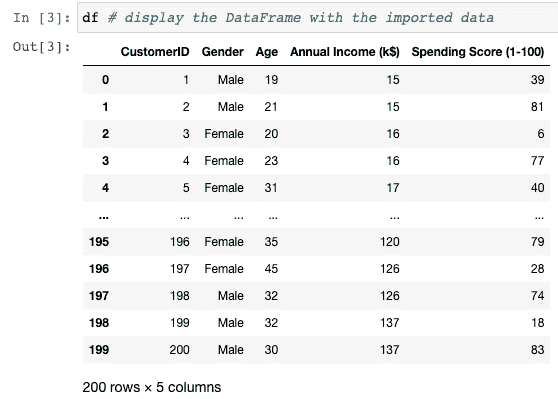

# 分析原始数据:SQL 与 Python

> 原文：<https://blog.devgenius.io/analyzing-raw-data-sql-vs-python-eca2e434705d?source=collection_archive---------2----------------------->


作者图片

当我们需要分析原始数据时，我们有许多选择。在这篇文章中，我想重点谈谈使用 SQL 和 Python 的利与弊。

```
· [Introduction](#9587)
· [SQL](#e002)
  ∘ [Data set size: how many rows and columns?](#bbe7)
  ∘ [Data set visualization](#83ac)
  ∘ [Column Cardinalities, missing values, stats](#5c64)
  ∘ [Business-focused insights](#0963)
· [Python](#4250)
  ∘ [Data set visualization & size: how many rows and columns?](#5a3b)
  ∘ [Column Cardinalities, missing values, stats](#1b71)
  ∘ [Business-focused insights](#3c8a)
· [Raw data with SQL vs Python — Pros and Cons](#1ef7)
```

# 介绍

当我们在任何类型的数据项目上工作时，我们必须理解我们的源数据，它们通常是相当原始的形式。任何数据科学流程都需要一些清理和转换，以使原始数据可被其他数据流程消化，如机器学习、商业报告、数据湖等。

为了了解一组新数据，我们至少需要做以下事情:

*   **导入数据**
*   **技术探索**:数量、基数、缺失值、数据质量问题
*   **商业探索**:从原始数据中提取有价值的商业信息:最有价值和最无价值、数据分割、相关性

假设我们的原始源数据在一个 csv 文件中。我想比较 SQL 和 Python 完成这三个主要任务的方法，指出它们的优缺点。

让我们在这里使用可用的商场客户数据集。

如果你想运行下面的 SQL 代码，我用 MySQL 格式写的，但是它可以在大多数数据库上运行。


作者图片

# 结构化查询语言

在这个例子中，我将使用 MySQL，但方法与其他数据库和代码编辑器非常相似。

为了导入数据，我们可以使用 MySQL 工作台编辑器，连接到 MySQL 数据库。

在这里，我创建了一个名为 RawDataExplorer 的新模式，它将包含表和我们可能想要创建的任何 SQL 对象。


作者图片

一旦创建了模式，我们就可以使用向导了(右击模式)


作者图片

只需几个步骤，您就可以将源文件加载到新的数据库表中。


作者图片

现在，实际的原始数据探索开始了:让我们运行一些典型的 SQL 查询来了解我们的数据。

## 数据集大小:有多少行和多少列？

当处理一个新的数据源时，我们自然会问自己的最自然的问题是关于大小和格式。这将影响我们在以后阶段对新数据源编写数据分析查询的方式。尤其是当我们使用大数据时。

这给了


关于 **describe** 命令，根据我们正在处理的数据库，我们可以运行如下命令(MySQL)或等效命令，以获得列名、数据类型、可空性、默认值的完整描述。


作者图片

## 数据集可视化

然后我们探究实际数据。这里我们只有 200 行，所以我们可以显示所有的行。但是如果有很多行，可以只限制检索的行数。

**结果**:


作者图片

很明显，每一行都指向一个客户。

## 列基数、缺失值、统计数据

列的基数是其中不同值的数量。对于我们的数据源来说，发现潜在的唯一指示符或键是很有用的。

缺失值和源数据上的一些统计数据为我们提供了关于原始数据质量的有用信息，以及我们接下来需要做什么操作来清理和准备数据以实现我们的目标。

在 SQL 中，有几种不同的方法可以做到这一点，但是基本思想没有改变:对于源数据集中的每一列，我们编写一个查询，一次性计算所有的指标。然后我们通过 UNION ALL 操作符组合所有的查询。

对于我们的 mall_customers 示例，单列的查询可以是:

在我们的例子中，我们有更多的列，所以我们可以通过 UNION 操作符追加它们。

产生以下摘要:


作者图片

我们可以看到，在我们使用的数据源中，没有缺少值的列(参见 NbrNULLs always 0)，如果我们需要，CustomerID 是唯一列的候选列(不同值的数量等于简单计数)，并且三个数字列分布在不同的范围内。这告诉我们，我们接下来可以尝试更多地钻取年龄、年收入和支出分数列，以构建可视化效果，研究它们的分布和相关性，通过特定的业务规则对客户进行细分，并应用机器学习模型对新客户进行预测，等等。

## 以业务为中心的见解

一旦我们理解了我们刚刚生成的基本信息，这些信息大多只是我们数据的技术方面，我们通常会通过问自己一些问题来开始对数据的实际业务探索，这些问题允许我们将原始数据转化为业务知识。要做到这一点，我们通常会对数据进行子集划分，应用过滤器，并尝试想象我们可以瞄准哪个洞察。

这是创意部分，没有菜谱。

仅举一个例子，这里我想探究高消费分数(> 50)的客户的性别和年龄


作者图片

通常在这个阶段，我们可以想象我们可以用原始数据源做什么，我们需要应用哪种转换，我们可以计划从中提取哪些信息，以及原始数据的数据质量的一般想法。


作者图片

# 计算机编程语言

在本文中，我将通过编写一个 Jupyter 笔记本来使用 Anaconda 发行版的 Python。如果你需要更多关于它的信息，你可以阅读我的文章[Python 数据处理入门](https://datatelier.com/getting-started-with-python-data-processing/)。

为了用 Python 分析我们的原始数据集，我们可以首先将源文件复制到 Jupyter 默认文件夹中，这样我们的 Jupyter 笔记本就可以很容易地访问它。

然后我们可以导入 Pandas 和 Numpy 库，并导入源 csv 文件。我在这里讲得很快，但是你可以在我的另一篇文章 [Python 数据处理——导入库&数据](/python-data-processing-importing-libraries-data-datatelier-b3b4c7ac43e1)中找到更多关于库和导入文件的信息。

现在让我们熟悉一下源数据集，并按原样显示它。

## 数据集可视化和大小:有多少行和列？



作者图片

或者，为了严格显示列数和行数，我们可以使用**形状**属性(注意:不是方法！)


通过简单地查看 df 数据帧的结构和值，我们已经知道了它的大小和它包含的内容。

对于巨大的导入文件，您可以通过方法仅过滤和显示数据帧的第一行或最后一行。

## 列基数、缺失值、统计数据

为了进一步了解我们的原始数据，我们继续运行 **info()** 方法。它描述了我们的数据帧的结构(类似于 SQL **describe** 命令)，加上一些更多的信息，比如每一列的数据类型，以及缺失值的数量。


作者图片

补充 **info()** 的另一个基本方法是 **describe()** ，它显示数据框架中每一列的值的统计数据。


作者图片

让我们通过 **nunique()** 方法找出每一列的基数。


作者图片

## 以业务为中心的见解

在 Python 中，我们可以用比 SQL 更多的方式来洞察原始数据。这包括子集化、切片和图形化表示数据帧。

让我们假设现在我们只对之前在 SQL 中看到的例子感兴趣，并且我们想要找到具有高消费分数(> 50)的客户的性别和年龄，下面是我们在 Python 中可以实现的几种方法之一。这篇文章的目的不是解释代码的每个部分做什么。


作者图片


作者图片

# 总之:使用 SQL 和 Python 处理原始数据——利弊

我们用 SQL 和 Python 做了同样的原始数据探索。以下是我的利弊:

*   除非我们的原始数据已经在一个数据库中，否则与 SQL 相比，在 Pandas library 中导入 Python 要容易得多。一些特定的数据库为访问外部文件提供了更高级的功能(例如 Oracle)，但是通过 Pandas 的方法更加灵活和简单。
*   技术探索:在很少的命令中，Python 提供了比 SQL 更多的信息
*   以业务为中心的见解:Python 允许比 SQL 更多的分析可能性(例如，可视化，或通过 ML 算法的预测分析)。另一方面，SQL 通过使用嵌套查询和分析函数，使得基于复杂的需求和条件构建分析变得更加容易，尤其是在同时关联多个源的情况下。

Python 似乎是 SQL 的明显赢家。仅用几行代码，它就提供了原始数据源的结构和内容的完整视图。当应用复杂的业务逻辑时，或者当源不是单个表，而是整个关系模型时，SQL 有一些优势。在这种情况下，Python 代码的编写、阅读和维护可能会更加复杂。

我们所说的都适用于单一来源的原始数据。但是，在实际项目中，我们可能需要处理几个与数据相关的来源。要对它们进行全局分析，最自然的方法是使用 SQL，从它们中构建一个统一的数据源，并在其上使用 Python 来释放其分析能力。

简而言之，我们都应该掌握 SQL 和 Python，并根据我们想要做的具体事情交替使用它们。

感谢阅读。

[随时订阅我的**《分享数据知识》**简讯**。**](http://eepurl.com/humfIH)


如果你想订阅《灵媒》,请随意使用我的推荐链接[https://medium.com/@maw-ferrari/membership](https://medium.com/@maw-ferrari/membership):对你来说，费用是一样的，但它间接有助于我的故事。

*原载于 2022 年 8 月 28 日 https://datatelier.com**的* [*。*](https://datatelier.com/analyzing-raw-data-sql-vs-python/)