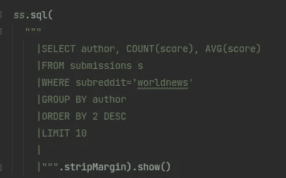
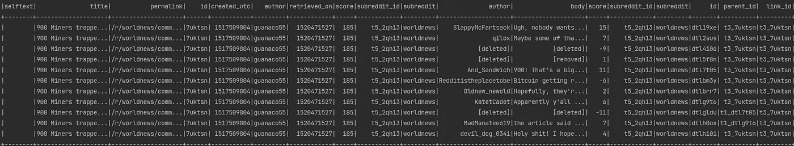

# 使用 Scala、Spark 和 Spark-SQL 分析 Reddit 数据

> 原文：<https://blog.devgenius.io/analyzing-reddit-data-using-scala-spark-and-spark-sql-6246c75463c6?source=collection_archive---------11----------------------->



多亏了 Spark-SQL，我们可以对 Reddit 数据运行 SQL 查询

不久前，我开始熟悉 Scala 和 Spark。真正强大而有趣的技术，我对自己说。因此，我自然决定用一个真实的用例来测试它。

一个有趣的数据是 Reddit。鉴于这是一个巨大的社交网络，这些数据为许多有趣的项目提供了空间。我还发现一个名为 [Pushshift](https://files.pushshift.io/reddit/) 的网站正在存档 Reddit 数据。所以我试了一下。

我感兴趣的是摘录一些帖子和贴在上面的评论。该资源先按文件夹，然后按每月或每天的快照对它们进行组织。在这篇文章中，我们将看看如何读取和分析这些数据，以及如何使用 Scala、Spark 和 Spark-SQL 来完成。

像往常一样，如果您想继续学习，请参考 Github 库。

# 入门指南

首先，我们从 [Pushshift](https://files.pushshift.io/reddit/) 网站下载了两份每日数据摘录——一份是提交的内容，一份是与之相关的评论。在那里发现的另一个有用的东西是样本数据，对于[提交](https://files.pushshift.io/reddit/submissions/sample.json)和[评论](https://files.pushshift.io/reddit/comments/sample_data.json)，它可以用来在处理数据之前理解数据的结构。从文件中可以看出，这些是 JSONL(换行符分隔的 JSON 文件)。

另一件要注意的事情是，所提供的文件是压缩的(GZ 或 ZSTD)，所以我们需要提供适当的选项来允许动态解压缩或预先提取档案。在我的例子中，我们的文件是 gz 加密的，我必须将 **hadoop-xz** 库添加到我的 **build.sbt** 文件中。

```
*libraryDependencies* ++= Seq(
  "org.apache.spark" %% "spark-core" % sparkVersion,
  "org.apache.spark" %% "spark-sql" % sparkVersion,
  "org.scalactic" %% "scalactic" % "3.2.9",
  "org.scalatest" %% "scalatest" % "3.2.9" % "test",
  "io.sensesecure" % "hadoop-xz" % "1.4"
)
```

# 数据形状

接下来，查看提供的样本文件，我们需要选择与我们想要分析的内容相关的列。基于此，我为提交和评论创建了一个 Case 类。

```
case class Submission(
                       selftext: String,
                       title: String,
                       permalink: String,
                       id: String,
                       created_utc: BigInt,
                       author: String,
                       retrieved_on: BigInt,
                       score: BigInt,
                       subreddit_id: String,
                       subreddit: String,
                     )case class Comment(
                    author: String,
                    body: String,
                    score: BigInt,
                    subreddit_id: String,
                    subreddit: String,
                    id: String,
                    parent_id: String,
                    link_id: String,
                    retrieved_on: BigInt,
                    created_utc: BigInt,
                    permalink: String
                  )
```

然后，我们可以使用 case 类来构建 Spark 数据帧模式。

```
val *commentSchema* = ScalaReflection.*schemaFor*[Comment].dataType.asInstanceOf[StructType]

val *submissionSchema* = ScalaReflection.*schemaFor*[Submission].dataType.asInstanceOf[StructType]
```

然后，可以创建数据帧

```
val *submissions* = *ss*.read.schema(*submissionSchema*)
  .option("io.compression.codecs","io.sensesecure.hadoop.xz.XZCodec")
  .json(s"**$***assetsPath*/RS_2018-02-01.xz").as[Submission]

val *comments* = *ss*.read.schema(*commentSchema*)
  .option("io.compression.codecs","io.sensesecure.hadoop.xz.XZCodec")
  .json(s"**$***assetsPath*/RC_2018-02-01.xz").as[Comment]
```

我们现在可以快速计算一下，看看每个数据帧有多少个条目，代表一天的 Reddit 数据。

```
//3194211 comments
println(comments.count())

//387140 submissions
println(submissions.count())
```

现在，让我们使用 Spark SQL 来查询这些数据。我们首先将数据帧别名化为视图，使它们在 Spark SQL 上下文中可用。

```
*submissions*.createOrReplaceTempView("submissions")

*comments*.createOrReplaceTempView("comments")
```

我们现在可以对这两个逻辑视图运行 SQL 查询。在下面的查询中，我们加入了提交的文章和它们各自的评论，只保留子编辑“世界新闻”(类似于子论坛)上的文章，只过滤一个文章 id。我们将 id/link_id 列连接起来，其中“t3_”部分是文章类型，在这里详细描述。

```
*ss*.sql(
  """
    |SELECT * FROM submissions s
    | join comments c on replace(c.link_id,"t3_","") = s.id
    | where s.subreddit='worldnews' and s.id = '7uktsn'
    |
    |
    |""".stripMargin).show()
```



我们可以通过访问以下网址在网站上看到这篇文章。

```
[https://www.reddit.com/r/worldnews/comments/7uktsn](https://www.reddit.com/r/worldnews/comments/7uktsn)
```

我们还可以运行一个查询来找出在特定的一天中发表最多帖子的作者的平均分数:

```
*ss*.sql(
  """
    |SELECT author, COUNT(score), AVG(score)
    |FROM submissions s
    |WHERE subreddit='worldnews'
    |GROUP BY author
    |ORDER BY 2 DESC
    |LIMIT 10
    |
    |""".stripMargin).show()
```

# 其他考虑

*   如果您想查询 ZSTD 压缩的数据，您可能想看看下面的[示例](https://gist.github.com/cnstlungu/3e284fc674f1550be150d9d970ff5a09)。
*   请注意规模和性能，归档时相当于一个月的十几 GB 数据，解压缩时相当于 180 多 GB 的数据。小规模测试，仅提取您需要的内容，并了解如何配置和调优 Spark 作业(也适用于我)。
*   这样的分析放在 Jupyter 笔记本里会很整洁。我们可以为 Jupyter 设置一个 Scala 内核。我的工作流程是这里的[这里的](https://gist.github.com/cnstlungu/50a3a7d51a262677224e51e49803771e)，一个例子是这里的。

# 结论

在这篇短文中，我们已经了解了如何利用 Scala 和 Spark 来读取和处理 Reddit 数据，使用优秀的 SQL，为一系列有趣的应用铺平了道路。感谢阅读！

*善意提醒一下，这篇文章的配套源代码可以在*[*Github*](https://github.com/cnstlungu/scala-spark-reddit-example)*上找到。*