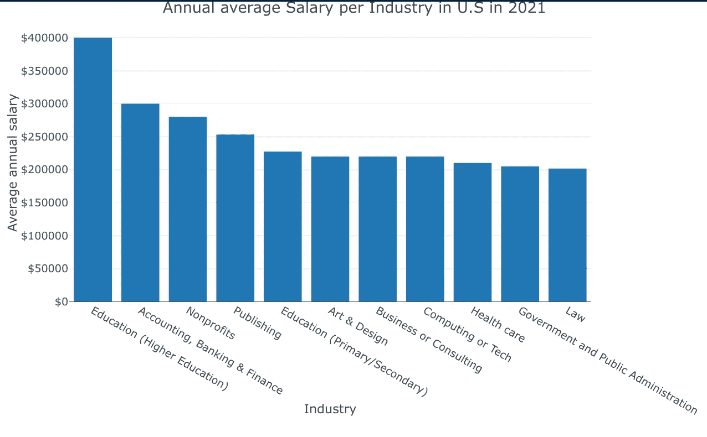
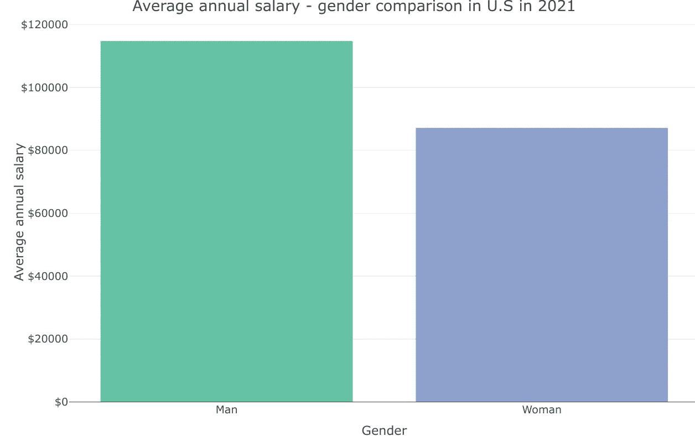
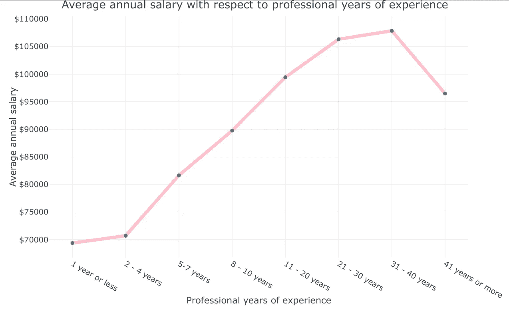
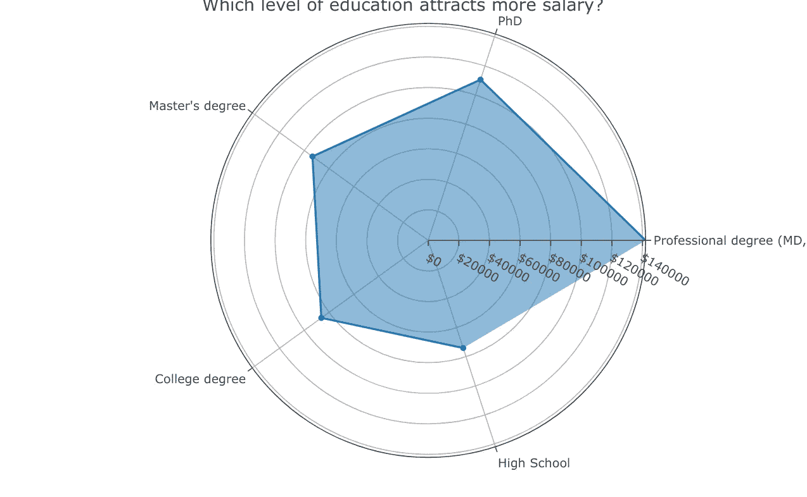
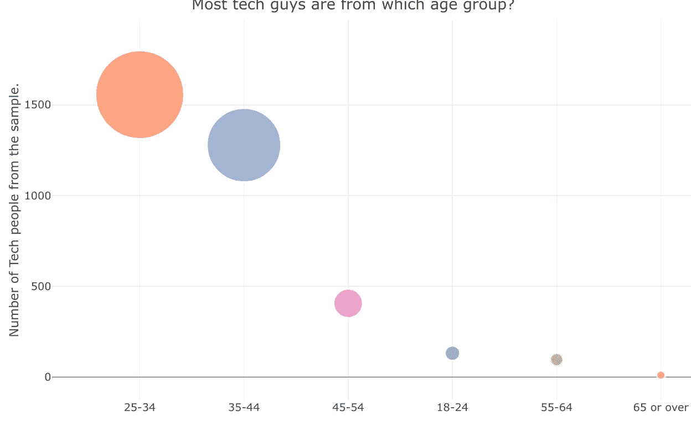

# 使用 R 分析美国的薪资

> 原文：<https://blog.devgenius.io/analyzing-salaries-for-united-states-of-america-using-r-83a4a3a160e9?source=collection_archive---------13----------------------->


照片来自 [unsplash](https://unsplash.com/s/photos/salary)

这篇文章的目的是回答以下涉及美国工资的问题。这个想法是为了理解决定专业人员工资差异的各种因素。

*   哪个行业工资最高？
*   男女工资如何比较？
*   工作年限的增加会带来更多的薪水吗？
*   不同学历的专业人士薪酬是否有显著差异？
*   在计算或技术领域，各年龄组的人数相比如何？

## 数据简介

分析中使用的数据来自 askamanager.org 在 T2 进行的薪资调查。当我下载数据的时候，它已经达到了 27k 记录，当我写这篇文章的时候，它可能已经超过了 27k。获得的数据已被进一步清理和争论，其脚本可以在[这里](https://oyogo.github.io/r/2022/04/22/Data-cleaning.html)访问。

注意:分析的数据仅针对美国提交的数据。

## 加载库

```
library(data.table) #for data wrangling
library(plotly)#data visualization package
```

## 输入数据

```
salary_data.US <- fread("data/salary_data_cleaned.csv")
```

1.  哪个行业平均工资最高？

```
# calculate the average annual salary per industry
salary.by.industry <- salary_data.US[,.(avg.salary=mean(annual_salary)),
                                  by=.(industry)][,.(avg.salary = sort(avg.salary, decreasing = TRUE),industry)]plot_ly(data = salary.by.industry[1:11,],
        x = ~reorder(industry,-avg.salary),
        y = ~avg.salary,
        type = "bar") %>% 
  layout(title = "Annual average Salary per Industry in U.S in 2021",
         yaxis = list(title = "Average annual salary", tickformat = "$"),
         xaxis = list(title = "Industry")
         )%>%
       config(displayModeBar = FALSE, displaylogo = FALSE, 
              scrollZoom = FALSE, showAxisDragHandles = TRUE, 
              showSendToCloud = FALSE)%>%
       config(displayModeBar = FALSE, displaylogo = FALSE, 
              scrollZoom = FALSE, showAxisDragHandles = TRUE, 
              showSendToCloud = FALSE)
```



图一

我们可以清楚地看到，根据 2021 年收集的数据，教育、会计和银行、非营利行业是薪酬最高的三个行业。

**2。男性和女性的工资相比如何？**

首先，让我们总结一下按性别分组的数据，看看每个性别类型的提交情况。

```
salary_gender_summarized <- salary_data.US[,.(count=.N),by=.(gender)]knitr::kable(salary_gender_summarized)
```


图 2

请注意，与男性相比，女性提交的总数量有如此巨大的差异。总之，回到我们正在讨论的问题。让我们算出两组的平均值，看看他们如何比较。

```
# calculate the averages and select only the required variables 
gender.data <- salary_data.US[gender %in% c("Woman","Man" ),]gender.data <- gender.data[,.(avg.salary = mean(annual_salary)), by=.(gender)]

plot_ly(gender.data, 
        x = ~gender,
        y = ~avg.salary,
        color = ~gender,
        showlegend = FALSE,
        type = "bar") %>%
  layout(title = "Average annual salary - gender comparison in U.S in 2021",

         xaxis = list(title = "Gender"),
         yaxis = list(tickformat = "$", title = "Average annual salary"))%>%
       config(displayModeBar = FALSE, displaylogo = FALSE, 
              scrollZoom = FALSE, showAxisDragHandles = TRUE, 
              showSendToCloud = FALSE)%>%
       config(displayModeBar = FALSE, displaylogo = FALSE, 
              scrollZoom = FALSE, showAxisDragHandles = TRUE, 
              showSendToCloud = FALSE)
```



图 3

我们知道，根据 2021 年在美国收集的数据，平均而言，男性比女性收入高。

**3。与工作经验年限相比，薪水如何**

我们可能要解决的下一个问题是，薪水和工作年限之间的关系如何比较。薪资会随着工作年限的变化而变化吗？
要回答这个问题，我们首先需要将具有多年经验的列排序为有序因子。

```
# change the column professional_experience_years into an ordered factor. 
salary_data.US$professional_experience_years <- factor(salary_data.US$professional_experience_years, levels = c("1 year or less","2 - 4 years","5-7 years",
                                                                                                                "8 - 10 years","11 - 20 years","21 - 30 years",
                                                                                                                "31 - 40 years","41 years or more"),ordered = TRUE)# let us now calculate the average annual salary with respect to years of experience.salary.experience <- salary_data.US[,.(avg.salary=mean(annual_salary)),by=.(professional_experience_years)] %>% arrange(professional_experience_years)# plot a line graph to see the relationshipplot_ly(salary.experience,
        x = ~professional_experience_years,
        y = ~avg.salary,
        type = "scatter",
        line = list(color = "pink", width = 5),
        mode = "lines+markers") %>%
  layout(title="Average annual salary with respect to professional years of experience", 
         yaxis = list(title = "Average annual salary", tickformat = "$"),
         xaxis = list(title = "Professional years of experience"))%>%
       config(displayModeBar = FALSE, displaylogo = FALSE, 
              scrollZoom = FALSE, showAxisDragHandles = TRUE, 
              showSendToCloud = FALSE)%>%
       config(displayModeBar = FALSE, displaylogo = FALSE, 
              scrollZoom = FALSE, showAxisDragHandles = TRUE, 
              showSendToCloud = FALSE)
```



图 4

从上面的线图可以看出，随着工作经验的增加，薪水也有可能增加。这告诉我们，经验水平是决定一个人薪资的重要因素。

**4。你的教育水平决定了你能挣多少钱吗？**

```
salary.edulevel <-  salary_data.US[,.(avg.salary=mean(annual_salary)),by=.(highest_edu_level)]# %>% #arrange(-avg.salary) %>%
     salary.edulevel %>%  arrange(-avg.salary) %>%  
     plot_ly(
          type = 'scatterpolar',
          mode = "lines+markers",
          r = ~round(avg.salary,0),
          theta = ~highest_edu_level,
          fill = 'toself',
          text = ~ paste0("Level of education: ", salary.edulevel$highest_edu_level,"\n", "Average annual salary: ", round(salary.edulevel$avg.salary)),
          hoverinfo = "text"
        )%>%
        layout(
          title = "Which level of education attracts more salary?",
          polar = list(
            radialaxis = list(
              tickformat = "$",
              visible = T,
              range = c(0,max(salary.edulevel$avg.salary))
            )
          ),
          plot_bgcolor  = "rgba(0, 0, 0, 0)",
          paper_bgcolor = "rgba(0, 0, 0, 0)",
          fig_bgcolor   = "rgba(0, 0, 0, 0)",
          showlegend = F

        ) %>%
       config(displayModeBar = FALSE, displaylogo = FALSE, 
              scrollZoom = FALSE, showAxisDragHandles = TRUE, 
              showSendToCloud = FALSE)
```



图 5

哇！很高兴看到雷达图显示，随着你受教育程度的提高，薪水也会增加。这些信息可能对那些希望从大学学位到硕士学位深造的人有所帮助。正如我们在上面看到的，多年的经验导致了与教育水平相似的工资的积极变化。因此，人们可能会问自己，我是应该去读硕士，还是应该随着时间的推移积累更多的经验，从而获得加薪？投资回报会值得吗？

**5。在计算或技术领域，各年龄组的人数相比如何？**

嗯，我是一名技术人员，我很想知道计算或技术行业的大多数受访者是什么年龄段的人，至少从样本来看是这样的。

```
salary.tech <- salary_data.US[industry == "Computing or Tech",.(count=.N),by=.(age)]# For this plot let us do a bubble chart just to explore the various data visualizations.salary.tech %>% 
  plot_ly() %>%
        add_trace(x = ~reorder(age, -count), 
                  y = ~count,
                  size = ~count,
                  color = ~age,
                  alpha = 1.5,
                  type = "scatter",
                  mode = "markers",
                  marker = list(symbol = 'circle', sizemode = 'diameter',
                                line = list(width = 2, color = '#FFFFFF'), opacity=0.8)) %>%
        add_text(x = ~reorder(age, -count), 
                        y = ~age, text = ~count,
                        showarrow = FALSE,
                        color = I("black")) %>%
        layout(
          showlegend = FALSE,
          title="Most tech guys are from which age group?",
          xaxis = list(
            title = "Age group"
          ),
          yaxis = list(
            title = "Number of Tech people from the sample."
          )
        ) %>%
        config(displayModeBar = FALSE, displaylogo = FALSE, 
              scrollZoom = FALSE, showAxisDragHandles = TRUE, 
              showSendToCloud = FALSE)
```



图 6

太神奇了！
有趣的是，大多数计算机或技术人员大多在 25-44 岁之间，至少从样本来看是这样。鉴于我们的样本不是 MECE，这可能不是结论性的(相互排斥和集体穷举)，但它确实有助于给出接近所有人都知道的迹象，我的意思是，任何人几乎都可以猜到大多数技术人员可能都很年轻。