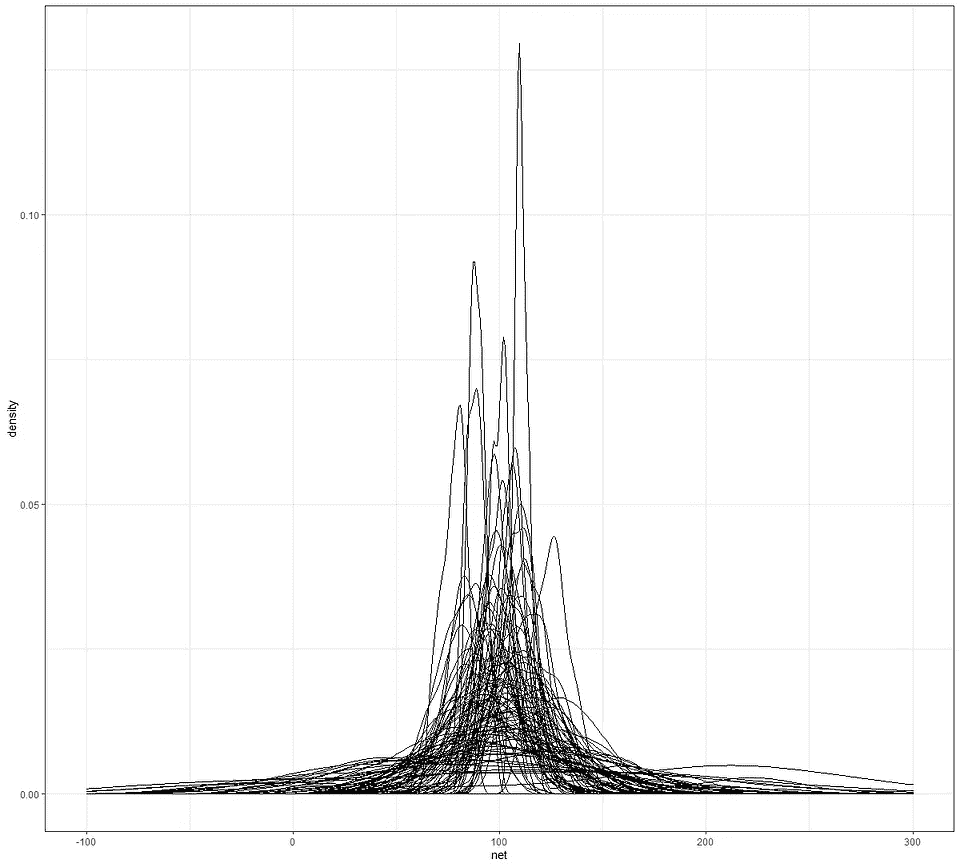
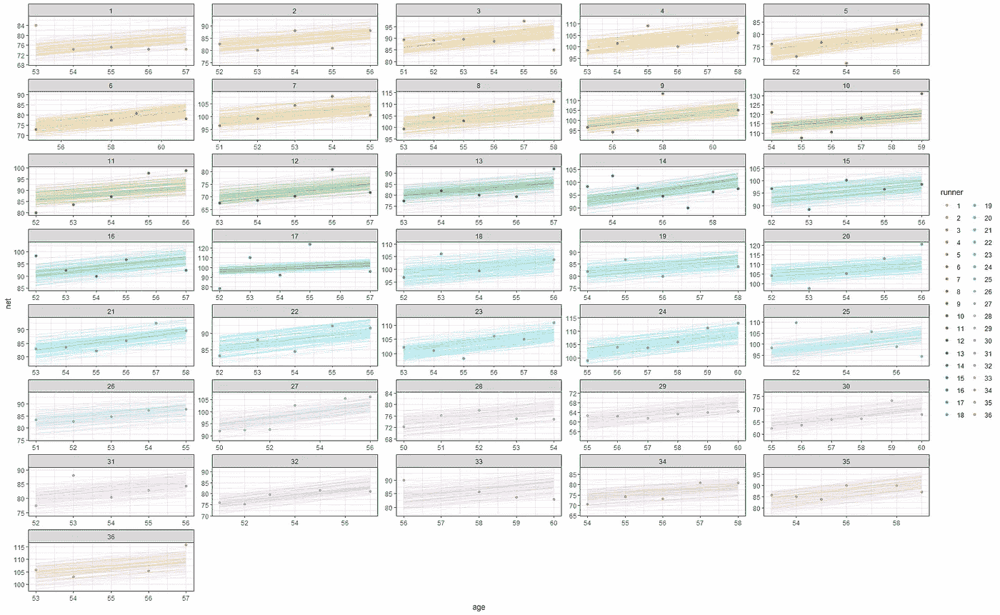

# 分析樱花数据集

> 原文：<https://blog.devgenius.io/analyzing-the-cherry-blossom-dataset-bab0626c308e?source=collection_archive---------9----------------------->

## 贝叶斯随机截距随机斜率模型。

[cherryblossom 数据集](https://cran.r-project.org/web/packages/cherryblossom/readme/README.html)包含来自[樱花跑](http://www.cherryblossom.org/)的数据，这是一年一度在 DC 华盛顿州举行的公路赛。这是一个很好的标准数据集，可用于教学目的，如数据辩论、可视化，当然还有贝叶斯统计。

数据集的[内容如下:](https://vincentarelbundock.github.io/Rdatasets/doc/mosaicData/TenMileRace.html)

```
A data frame with 8636 observations on the following variables.

* state State of residence of runner.
* time Official time from starting gun to finish line.
* net The recorded time (in seconds) from when the runner crossed the starting line to when the runner crossed the finish line. This is generally less than the official time because of the large number of runners in the race: it takes time to reach the starting line after the gun has gone off.
* age Age of runner in years.
* sex A factor with levels F M.
```

因此，让我们跳过任何进一步的介绍，使用代码来为自己说话。

```
rm(list = ls())
library(brms)
library(skimr)
library(ggplot2)
library(posterior)
library(bayesplot)
library(rethinking)
library(BayesFactor)
library(bayesrules)
library(rstanarm)
library(tidybayes)
library(broom.mixed)
library(janitor)
library(grid)
library(gridExtra)
library(ggstatsplot)
library(GGally)
```

让我们通过*skimir*包和绘图来精确地查看数据。首先，我将根据年龄和记录的时间来绘制数据。

```
data(cherry_blossom_sample)
skimr::skim(cherry_blossom_sample)
running <- cherry_blossom_sample
nrow(running)
ggplot(running, aes(x = age, y = net)) + 
  geom_point() + 
  facet_wrap(~ runner)+
  theme_bw()
```


数据集及其内容位于左侧，年龄和记录时间之间的关系位于右侧。

让我们画更多的图，看看跑步者，他们记录的时间和他们的年龄。我喜欢绘制数据，因为你可以如此快速地解读数据，而不必真的进行任何种类或形式的分析。

```
ggplot(running, aes(x = runner, y = net)) + 
  geom_boxplot() + theme_bw()
ggplot(running, aes(x = age, y = net, group = runner)) + 
  geom_smooth(method = "lm", se = FALSE, color = "gray", size = 0.5) + 
  geom_abline(aes(intercept = 75.2, slope = 0.268), color = "blue") + theme_bw()
head(running, 2)
ggplot(running, aes(y = net, x = age)) + 
  geom_point() + theme_bw()
```


然后我们也有年份，我们可以进一步破译数据，我们有特定的枪使用。

```
ggplot(running, aes(y = net, x = age, size=gun, color=as.factor(year))) + 
  geom_point() + theme_bw()
```


一个简单的相关矩阵，以获得更多的见解，如果他们可以提供任何。

```
ggcorrmat(
  data     = running,
  title    = "Correlalogram for Cherry blossom dataset")
```


以及绘制分布、相关性和因素影响的更先进的方法。这种剧情看起来极其好看，但可能会矫枉过正。

```
running$year<-as.factor(running$year)
running%>%
  dplyr::select(age, net, gun, year)%>%
  ggpairs(.,
          aes(color = year),
          upper = list(continuous = wrap('cor', size = 3)),
          lower = list(combo = wrap("facethist", bins = 30)),
          diag = list(continuous = wrap("densityDiag", alpha = 0.5)),
          title = "Scatterplot matrix of `Cherry Blossom` Grouped by Year")+theme_bw()
```


如你所见，数据集没有那么多，也不是非常令人兴奋，所以让我们转到贝叶斯部分，我们在其中建模数据。我将从一个[完全汇集的模型](https://medium.com/towards-artificial-intelligence/blups-and-shrinkage-in-mixed-models-sas-3fbc6662fa6b)开始，其中包含一些简单的、半信息性的先验知识。

```
get_prior(net ~ age, 
          data = running, family = gaussian)

                    prior     class coef group resp dpar nlpar bound       source
                   (flat)         b                                       default
                   (flat)         b  age                             (vectorized)
 student_t(3, 89.4, 14.2) Intercept                                       default
    student_t(3, 0, 14.2)     sigma                                       default

complete_pooled_model <- stan_glm(
  net ~ age, 
  data = running, family = gaussian, 
  prior_intercept = normal(0, 2.5, autoscale = TRUE),
  prior = normal(0, 2.5, autoscale = TRUE), 
  prior_aux = exponential(1, autoscale = TRUE),
  chains = 4, iter = 5000*2, seed = 84735)

> tidy(complete_pooled_model, conf.int = TRUE, conf.level = 0.80)
# A tibble: 2 x 5
  term        estimate std.error conf.low conf.high
  <chr>          <dbl>     <dbl>    <dbl>     <dbl>
1 (Intercept)   75.2      24.6     43.7     106\.   
2 age            0.268     0.446   -0.302     0.842
```

展示模型结果及其适用性的最佳方式是展示预测。在这种情况下是后验密度。但首先，我将绘制原始数据，显示完全汇集的模型永远不够，这是因为每个跑步者有太多的差异。我们已经可以在这张图中看到这一点，就像之前展示的那样。


一条回归线，将所有跑步者视为偏离一个池，而不是单独的跑步者。

对原始数据的绘图。

```
examples <- running %>% 
  filter(runner %in% c("1", "20", "22"))
g1<-ggplot(examples, aes(x = age, y = net)) + 
  geom_point() + 
  facet_wrap(~ runner) + 
  geom_abline(aes(intercept = 75.2242, slope = 0.2678), 
              color = "blue") + theme_bw()
g2<-ggplot(examples, aes(x = age, y = net)) + 
  geom_point() + 
  geom_smooth(method = "lm", se = FALSE, fullrange = TRUE) + 
  facet_wrap(~ runner) + 
  xlim(52, 62) + theme_bw()
grid.arrange(g1,g2)
```


从模型中，我们可以通过提取截距和系数并在绘图中使用它们来创建一个汇集的模型线。

```
> model_summary
# A tibble: 2 x 5
  term        estimate std.error conf.low conf.high
  <chr>          <dbl>     <dbl>    <dbl>     <dbl>
1 (Intercept)   75.2      24.6     43.7     106\.   
2 age            0.268     0.446   -0.302     0.842
> B0 <- model_summary$estimate[1];B0
[1] 75.19995
> B1 <- model_summary$estimate[2];B1
[1] 0.2679488
```

```
ggplot(running, aes(x = age, y = net)) + 
  geom_point() + 
  geom_abline(aes(intercept = B0, slope = B1))+
  theme_bw()
```


这里我们有来自贝叶斯模型的混合回归线。如你所见，这些点看起来像方差，但事实上，它们是由不同的跑步者组成的。[在](https://medium.com/dev-genius/meta-regression-on-published-results-in-r-76d77ecba8b7)之前，我已经在博客上讨论过完全池化和部分池化模型的区别。部分混合模型也称为[混合模型](https://medium.com/mlearning-ai/introduction-to-mixed-models-in-r-9c017fd83a63)。

现在，在前一个例子中，我已经插入了先验知识，但是没有展示它们的影响。先验的影响是不可误解的，我现在要做的是展示它们实际上是什么样的。 *prior_PD=TRUE* 注释将告诉模型从先前的预测分布中提取，而不是以结果为条件。你会得到模型的结果，正如你所看到的，但它们不是来自后验。另外，如果你仔细观察，你会发现我们现在正通过添加 *(1 | runner)* 来移动到一个随机截距模型。

```
running_model_1_prior <- stan_glmer(
  net ~ age + (1 | runner), 
  data = running, family = gaussian,
  prior_intercept = normal(100, 10),
  prior = normal(2.5, 1), 
  prior_aux = exponential(1, autoscale = TRUE),
  prior_covariance = decov(reg = 1, conc = 1, shape = 1, scale = 1),
  chains = 4, iter = 5000*2, seed = 84735, 
  prior_PD = TRUE)
summary(running_model_1_prior)
```


但是抽取将来自先前的预测分布。下面你可以看到年龄和记录时间之间的关系，每个跑步者，来自以前。

```
set.seed(84735)
running %>% na.omit() %>%
  add_fitted_draws(running_model_1_prior, n = 9) %>%
  ggplot(aes(x = age, y = net)) +
  geom_line(aes(y = .value, group = paste(runner, .draw))) + 
  facet_wrap(~ .draw)+theme_bw()
running %>% na.omit() %>%
  add_predicted_draws(running_model_1_prior, n = 100) %>%
  ggplot(aes(x = net)) +
  geom_density(aes(x = .prediction, group = .draw)) +
  xlim(-100,300)+theme_bw()
```



“后验”来自先前的预测分布，而不是以结果为条件。

现在，让我们从真实的后验样本中取样，并对模型进行一些后验检查。

```
running_model_1 <- update(running_model_1_prior, prior_PD = FALSE)
prior_summary(running_model_1)
summary(running_model_1)
mcmc_trace(running_model_1)
mcmc_dens_overlay(running_model_1)
```


包含后验概率的贝叶斯模型。您可以使用下面的模型输出来检查右侧显示的模型输出，该输出显示了先前的模型采样。


我们之前做的模型，从先验中取样。如您所见，输出有所不同，但是您很容易忘记这些值来自之前的值，因为**模型信息**不会让您记住。

检查贝叶斯模型的最佳方法是查看迹线图，并查看后验密度，看是否可以在采样中找到持续的不规则性。不需要额外的统计计算。


现在我们有了我们想要的模型，我们可以开始显示固定的效果并绘制合适的图形。记住，这个模型不再是完全混合的，而是部分混合的(难怪我们在后面的绘制中会得到这么多的图)。

```
tidy_summary_1 <- tidy(running_model_1, effects = "fixed",
                       conf.int = TRUE, conf.level = 0.80)
B0 <- tidy_summary_1$estimate[1]
B1 <- tidy_summary_1$estimate[2]
tidy_summary_1
running %>% na.omit() %>%
  add_fitted_draws(running_model_1, n = 200, re_formula = NA) %>%
  ggplot(aes(x = age, y = net)) +
  geom_line(aes(y = .value, group = .draw), alpha = 0.1) +
  geom_abline(intercept = B0, slope = B1, color = "blue") +
  lims(y = c(75, 110))+theme_bw()
```


用于制作线的回归系数。


正如所料，随机截距模型将为每个跑步者提供相同的斜率，但不同的起点。

从这个模型中，我们可以得到具体的系数，然后我们可以绘制。这仍然来自随机截距模型。

```
runner_summaries_1 <- running_model_1 %>%
  spread_draws(`(Intercept)`, b[,runner]) %>% 
  mutate(runner_intercept = `(Intercept)` + b) %>% 
  dplyr::select(-`(Intercept)`, -b) %>% 
  median_qi(.width = 0.80) %>% 
  dplyr::select(runner, runner_intercept, .lower, .upper)
runner_summaries_1 %>% 
  filter(runner %in% c("runner:4", "runner:5"))
```


```
running %>% na.omit() %>%
  filter(runner %in% c("4", "5")) %>% 
  add_fitted_draws(running_model_1, n = 100) %>%
  ggplot(aes(x = age, y = net)) +
  geom_line(
    aes(y = .value, group = paste(runner, .draw), color = runner),
    alpha = 0.1) +
  geom_point(aes(color = runner))+
  theme_bw()
```


```
running %>% na.omit() %>%
  add_fitted_draws(running_model_1, n = 100) %>%
  ggplot(aes(x = age, y = net)) +
  geom_line(
    aes(y = .value, group = paste(runner, .draw), color = runner),
    alpha = 0.1) +
  geom_point(aes(color = runner))+
  facet_wrap(~runner, ncol=5, scales="free")+
  theme_bw()
```



```
ggplot(running, aes(y = net, x = age, group = runner)) + 
  geom_abline(data = runner_summaries_1, color = "gray",
              aes(intercept = runner_intercept, slope = B1)) + 
  geom_abline(intercept = B0, slope = B1, color = "blue") + 
  lims(x = c(50, 61), y = c(50, 135))+
  theme_bw()
```


随机截距模型，我们在开头已经看到了，实际上太简单了。但让我们再次策划重申。

```
running %>% 
  filter(runner %in% c("4", "5", "20", "29")) %>% 
  ggplot(., aes(x = age, y = net)) + 
  geom_point() + 
  geom_smooth(method = "lm", se = FALSE) + 
  facet_grid(~ runner)+
  theme_bw()
```


当然，随机截距模型是不够的。

```
ggplot(running, aes(x = age, y = net, group = runner)) + 
  geom_smooth(method = "lm", se = FALSE, size = 0.5)+
  theme_bw()
```


我们只需要在这个图中放置一个随机的斜率分量，以年龄的形式。

因此，让我们通过以年龄的形式放置一个随机斜率组件来扩充前面的模型。

```
options(mc.cores=parallel::detectCores())
running_model_2 <- stan_glmer(
  net ~ age + (age | runner),
  data = running, family = gaussian,
  prior_intercept = normal(100, 10),
  prior = normal(2.5, 1), 
  prior_aux = exponential(1, autoscale = TRUE),
  prior_covariance = decov(reg = 1, conc = 1, shape = 1, scale = 1),
  chains = 4, iter = 5000*2, seed = 84735, adapt_delta = 0.99999)

> tidy(running_model_2, 
+      effects = "fixed", 
+      conf.int = TRUE, 
+      conf.level = 0.80)
# A tibble: 2 x 5
  term        estimate std.error conf.low conf.high
  <chr>          <dbl>     <dbl>    <dbl>     <dbl>
1 (Intercept)    18.5     12.0       3.18     33.9 
2 age             1.32     0.224     1.03      1.60
> tidy(running_model_2, 
+      effects = "ran_vals", 
+      conf.int = TRUE, 
+      conf.level = 0.80)
# A tibble: 72 x 7
   level group  term        estimate std.error conf.low conf.high
   <chr> <chr>  <chr>          <dbl>     <dbl>    <dbl>     <dbl>
 1 1     runner (Intercept) -0.00560    0.384   -0.746     0.771 
 2 1     runner age         -0.257      0.0591  -0.336    -0.181 
 3 2     runner (Intercept) -0.00166    0.288   -0.593     0.594 
 4 2     runner age         -0.100      0.0587  -0.177    -0.0240
 5 3     runner (Intercept)  0.00344    0.263   -0.556     0.575 
 6 3     runner age          0.0173     0.0566  -0.0569    0.0910
 7 4     runner (Intercept)  0.00653    0.350   -0.667     0.693 
 8 4     runner age          0.209      0.0581   0.132     0.284 
 9 5     runner (Intercept) -0.0107     0.367   -0.736     0.686 
10 5     runner age         -0.232      0.0579  -0.306    -0.157 
# ... with 62 more rows
> tidy(running_model_2, 
+      effects = "ran_pars", 
+      conf.int = TRUE, 
+      conf.level = 0.80)
# A tibble: 4 x 3
  term                       group    estimate
  <chr>                      <chr>       <dbl>
1 sd_(Intercept).runner      runner     1.31  
2 sd_age.runner              runner     0.251 
3 cor_(Intercept).age.runner runner    -0.0873
4 sd_Observation.Residual    Residual   5.17  
> tidy(running_model_2, 
+      effects = "auxiliary", 
+      conf.int = TRUE, 
+      conf.level = 0.80)
# A tibble: 2 x 5
  term     estimate std.error conf.low conf.high
  <chr>       <dbl>     <dbl>    <dbl>     <dbl>
1 sigma        5.15     0.306     4.79      5.57
2 mean_PPD    90.0      0.539    89.3      90.6 
```

并显示每个跑步者不仅截距而且斜率将如何变化。

```
runner_chains_2 <- running_model_2 %>%
  spread_draws(`(Intercept)`, b[term, runner], `age`) %>% 
  pivot_wider(names_from = term, names_glue = "b_{term}",
              values_from = b) %>% 
  mutate(runner_intercept = `(Intercept)` + `b_(Intercept)`,
         runner_age = age + b_age)
runner_summaries_2 <- runner_chains_2 %>% 
  group_by(runner) %>% 
  summarize(runner_intercept = median(runner_intercept),
            runner_age = median(runner_age))
> head(runner_summaries_2, 3)
# A tibble: 3 x 3
  runner    runner_intercept runner_age
  <chr>                <dbl>      <dbl>
1 runner:1              18.5       1.06
2 runner:10             18.5       1.75
3 runner:11             18.5       1.32 
```


策划总是比展示更好。

```
ggplot(running, aes(y = net, x = age, group = runner)) + 
  geom_point(alpha=0.2)+
  geom_abline(data = runner_summaries_2, color = "gray",
              aes(intercept = runner_intercept, slope = runner_age)) + 
  lims(x = c(50, 61), y = c(50, 135))+theme_bw()
```


最后，我们可以展示和比较所有的模型。尽管有各种各样的统计方法，但我一直喜欢用 *pp_check* 来显示模型拟合和模型差异。然而，你不应该坚持让后验样本非常相似的可能性。这毫无意义，因为后验概率是先验概率和可能性的组合。

```
runner_summaries_2 %>% 
  filter(runner %in% c("runner:1", "runner:10"))
tidy(running_model_2, effects = "ran_pars")
p1<-pp_check(complete_pooled_model) + 
  labs(x = "net", title = "complete pooled model")
p2<-pp_check(running_model_1) + 
  labs(x = "net", title = "running model 1")
p3<-pp_check(running_model_2) + 
  labs(x = "net", title = "running model 2")
grid.arrange(p1,p2,p3,ncol=3)
```


三款。完全汇集的模型具有较小的传播，这是有意义的，因为它认为单一的回归线和其余的是讨厌的。随机截距(**模型 1** )和随机截距随机斜率(**模型 2** )没有什么不同，后者模型有一些额外的方差。

我们可以通过预测概要来比较模型，预测概要实际上是后验密度的拟合概要。

```
running %>% 
  na.omit() %>% 
  prediction_summary(model = complete_pooled_model, data = .)
running %>% 
  na.omit() %>% 
  prediction_summary(model = running_model_1, data = .)
running %>% 
  na.omit() %>% 
  prediction_summary(model = running_model_2, data = .)
running %>% 
  na.omit() %>% 
prediction_summary_cv(model = running_model_2, data =.,
                      k = 10, group = "runner")
```


如您所见，随机斜率随机截距的误差最小，但非常接近随机截距模型。因此，随机斜率是否能增加那么多信息还有待观察。


十重交叉验证。这将需要一些时间来运行。

最后，[留一交叉验证方式检查模型拟合](https://avehtari.github.io/modelselection/CV-FAQ.html#12_What_is_the_interpretation_of_ELPD__elpd_loo__elpd_diff)。我从未发现这些值非常有用，但它们是显示模型预测能力有多好的另一个指标。

```
elpd_hierarchical_1 <- loo(running_model_1)
elpd_hierarchical_2 <- loo(running_model_2)
> loo_compare(elpd_hierarchical_1, elpd_hierarchical_2)
                elpd_diff se_diff
running_model_2  0.0       0.0   
running_model_1 -1.9       1.2
```


检查模型预测能力的更好、更直观的方法是创建预测。我将在下面这样做，使用随机截距和随机截距随机斜率模型，基于我想预测的跑步者的相同特征。我要寻找的是预测的传播。

```
predict_next_race_1 <- posterior_predict(
  running_model_1, 
  newdata = data.frame(runner = c("1", "Miles", "10"),
                       age = c(61, 61, 61)))

predict_next_race_2 <- posterior_predict(
  running_model_2, 
  newdata = data.frame(runner = c("1", "Miles", "10"),
                       age = c(61, 61, 61)))

p1<-mcmc_areas(predict_next_race_1, prob = 0.8) +
  ggplot2::scale_y_discrete(labels = c("runner 1", "Miles", "runner 10"))
p2<-mcmc_areas(predict_next_race_2, prob = 0.8) +
  ggplot2::scale_y_discrete(labels = c("runner 1", "Miles", "runner 10"))
grid.arrange(p1,p2,ncol=2)
```


左边是随机截距模型，右边是随机截距随机斜率模型。就点估计和效应的不确定性而言，它们看起来非常相似。

比较估计值的更好方法是叠加它们的图。

```
predict_next_race_1<-as.data.frame(predict_next_race_1);predict_next_race_1
predict_next_race_1$model="Model 1"
predict_next_race_2<-as.data.frame(predict_next_race_2);predict_next_race_2
predict_next_race_2$model="Model 2"

combined<-rbind(predict_next_race_1, predict_next_race_2)
combined_melt<-reshape2::melt(combined)
variable.labs<-c("runner 1", "Miles", "runner 10")
names(variable.labs) <- c("1", "2", "3")
ggplot(combined_melt,
       aes(x=value, fill=as.factor(model)))+
  geom_density(alpha=0.5)+
  theme_bw()+
  facet_wrap(vars(variable),
             labeller = labeller(variable = variable.labs),
             scales="free")+
  labs(x="Estimate P | age = 61", 
       y="Density", 
       fill="Model", 
       title="Comparing Bayesian Model estimates")
```


如您所见，模型确实有所不同，但差别并不大。

就是这样了，伙计们。我希望你喜欢这个小练习！