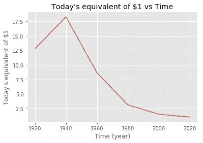
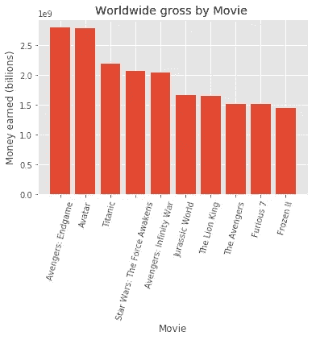
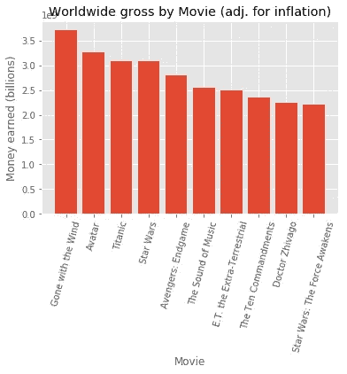

# 分析有史以来最受欢迎的电影:通货膨胀对人们感知的影响

> 原文：<https://blog.devgenius.io/analyzing-the-most-popular-movies-of-all-time-inflations-effects-on-people-s-perceptions-8d07925b7bba?source=collection_archive---------46----------------------->

## 《复仇者联盟 4：终局之战》真的是票房最高的电影吗？是的。但不是真的在同一时间？让我解释一下。

由[Ahmet yalnkaya](https://unsplash.com/@ahmetyalcinkaya?utm_source=unsplash&utm_medium=referral&utm_content=creditCopyText)在 [Unsplash](https://unsplash.com/s/photos/movies?utm_source=unsplash&utm_medium=referral&utm_content=creditCopyText) 上拍摄的照片

如果有人问你哪部电影赚了最多的钱，你会怎么回答？大概是*复仇者联盟 4：终局之战*。也许如果你不是漫威的超级粉丝，你可能会说*头像*。也许如果你在过去的二十年里不是一个电影人，你可能会说*泰坦尼克号*。我是说，这些都是很可靠的答案。今天，最受关注的答案是*复仇者联盟 4：终局之战。*为什么？嗯，它在全球赚了 28 亿美元。《复仇者联盟 4：终局之战》的整体成功是前所未有的，因为它在《阿凡达》举办九年后，将《阿凡达》从榜首位置上赶了下来。那为什么我说《复仇者联盟 4：终局之战》不是有史以来最受欢迎的电影呢？简单。通货膨胀。

# 通货膨胀

让我快速回顾一下我所说的“通货膨胀”到底是什么意思。简单地说，通货膨胀指的是货币随着时间的推移而贬值的趋势，因为有更多的货币在流通。

可以看出，1920 年的一美元远比今天的一美元值钱，现在可以买到价值超过 12 美元的商品。1940 年，一美元价值超过 17.5 美元(按今天的价格计算)。这有助于解释为什么我们在票房最高的电影名单中没有看到任何老电影。

# 票房最高的电影

不考虑通货膨胀，大多数人都是对的。《复仇者联盟 4：终局之战》无疑是有史以来票房最高的电影。在这方面，它胜过所有其他电影，包括《泰坦尼克号》、《阿凡达》。

榜单上其他知名电影包括《侏罗纪世界》和《狮子王》。但是再看看。尽管《复仇者联盟 4：终局之战》和《阿凡达》的上映时间相差十年，但这两部电影的全球票房几乎相同。嗯……当我们考虑通货膨胀时会发生什么？

# 票房最高的电影(经通货膨胀调整后)

一旦我们考虑到通货膨胀的惊人影响，我们就会看到《复仇者联盟 4：终局之战》相对于其他电影的真正差距。

击败新《复仇者联盟》的电影包括《飘》和《T2》以及《泰坦尼克号》。我们之前也提到过《阿凡达》似乎和《T4》和《复仇者联盟 4：终局之战》赚得一样多；然而，现在我们看到，由于通货膨胀对增加新电影总收入的影响，这种时间差是很重要的。榜单现在肯定更加平衡了，2000 年之前的电影比 2000 年之后的电影出现在前十名。这是合理的，因为电影业已经存在了二十多年。

# 结论

尽管从分析角度来看，《复仇者联盟 4：终局之战》被更经典的电影击败，但这并不能抹杀这样一个事实，即它过去是，现在是，而且很可能会继续是，有史以来最受期待的系列电影。最终电影并不总是在票房上表现惊人，所以看到超级英雄大结局与经典电影如*飘*相提并论，真正强调了一个事实，即更多现代流派的新一波电影有能力经受时间的考验，成为未来的经典。

注:为撰写本文，数据取自[https://www.usinflationcalculator.com/](https://www.usinflationcalculator.com/)和[https://en . Wikipedia . org/wiki/List _ of _ highest-grossing _ films](https://en.wikipedia.org/wiki/List_of_highest-grossing_films)。