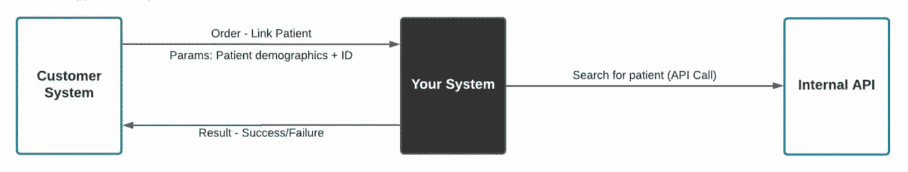
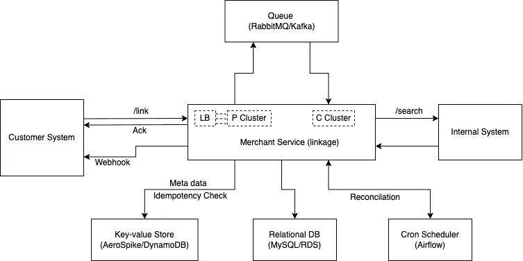

# 系统设计面试剖析:例子

> 原文：<https://blog.devgenius.io/anatomy-of-a-system-design-interview-the-example-6b2ec3a0a040?source=collection_archive---------5----------------------->


复杂就是简单。

有什么比过一遍真实的系统设计面试问题(2022 年 6 月面试)。

# 1.要求

查看下面的端到端设计。**你需要设计你的系统**。您的系统负责将客户患者链接到内部系统，维护该映射，并让客户系统知道您的系统是否能够建立链接。

*   通信是异步的。
*   订单必须尽快确认。
*   系统必须是容错的。
*   系统必须可靠、可用且可扩展。
*   系统需要保存来自客户和内部系统的患者 ID。



预期设计

# 2.概观

# 2.1.架构图



架构图

# 2.2.成分

商户服务的不同组成部分概述如下:

*   **商家服务**:代理链接服务(类似于买卖的商家)将客户的患者 id 链接到内部系统的`patient-id`。
*   **LB(负载平衡器)**:接收公共流量，并在商业服务生产者集群(计算实例)中分配负载。
*   **P 集群**:水平扩展的商业服务应用程序生产者集群(例如:EC2 集群，具有自动扩展功能，目标组连接到负载均衡器)，接收来自负载均衡器的请求，并将消息推送到队列。
*   **队列**:处理高流量的消息传递代理，以流/批的形式处理长时间运行的/异步的任务。
*   **C 集群**:商业服务应用程序消费者集群处理队列中的消息，并返回适当的响应。
*   **Cron 调度器**:调度 Cron 作业以协调处于挂起状态的工作流。
*   **关系数据库**:数据库主要有两个表:“workflows”用来跟踪和管理传入请求的状态，直到完成为止，还有`patient-mapping`用来存储客户和内部`patient-id`之间的映射。
*   **键值存储**:用于存储传入的请求数据(客户和患者详细信息)和请求的幂等键。

# 2.3.数据存储

# 关系数据库(SQL)

**工作流**:一个`workflows`表，用于跟踪从客户处收到的请求并管理状态，直到状态转换到结束状态。

*   表**工作流**:工作流标识、请求标识、客户标识、患者标识、状态、请求类型
*   其中，状态:`RECEIVED`、`IN_PROGRESS`、`LINKED`、`NO_RESULTS`、`COMPLETED`、`FAILED`，请求类型:`LINK`

**链接**:一个`patient-mapping`表将客户患者 id 链接到内部患者 id。

*   表**患者映射**:客户号、客户-患者号、内部-患者号、状态、工作流程号
*   其中，状态:`LINKED`，`DE-LINKED`

# 2.3.2.键值存储(NoSQL)

*   **等幂** : Key: ( `idempotency-key` + `customer-id`)，Value:来自客户/顾客的等幂键。
*   **请求数据** : Key:(唯一`request-id`)，Value:请求数据(客户和患者详细信息)。

# 3.工作流程

# 3.1.客户系统的请求

从客户系统到商家服务的负载均衡器的 API 调用。

方法:`POST`，路径:`/link`表头:

```
"idempotency-key": "String"
"customer-token": "String"
```

请求正文:

```
{
	"patient": {
		"id": "UUID",
		"full_name": "String",
		"dob": "DateTime",
		...
		"contact": {
			"address": "String",
			"phone": "String",
			"email": "String"
		}
		"insurance": {
			...
		}
	},
	"webhook": "url"
}
```

要执行幂等请求，顾客/客户必须向请求添加一个`idempotency-key`报头。幂等性的工作方式是保存结果状态代码、响应正文和给定幂等性键的第一个请求的正文；具有相同密钥的后续请求返回相同的结果(或者直到状态改变)，直到预定义的 TTL(通常为 24 小时)。

客户令牌用于访问控制，并在后端解密以检索客户详细信息(例如:unique `customer-id`)。类似于 JSON Web 令牌模型。

# 3.2.确认:先失败后快速失败

**验证**:正则表达式匹配预期的输入模式、等幂检查、已经链接或正在进行等。

**坚持**:

*   **请求数据**:将请求数据存储在键值存储中(键值作为唯一的请求 id，值作为请求数据—客户和患者详细信息)。
*   **工作流程详情**:“工作流程”表中:`workflow-id`、`request-id`、`customer-id`、`patient-id`、`status` ( `RECEIVED`)、`request-type` ( `LINK`)、`timestamp`。

**队列**:将消息推入队列(第 3.3 节)——静默失败重试

**响应**:

*   在持久化之前或期间返回错误响应/异常—如果有的话(快速失败)，
*   存储预期响应的`idempotency-key`
*   返回带有状态代码 202(请求被接受)和`workflow-id`的响应。客户/顾客可以使用`workflow-id`检查请求的状态。回复正文:`{ "workflow-id": "String" }`

**状态 API** :

*   一旦返回带有`workflow-id`的 202，商家服务保证有效的响应。顾客/客户可以检查来自`workflow-id`的请求状态，或者获得对 webhook 的回调。
*   方法:`GET`，路径:`/link/status/<workflow-id>`响应:`{ "status": "workflows.status" }`

**注**:

*   链接客户-内部`patient-id`后，如有必要，可将请求数据存档。
*   不建议轮询状态 API 如果完成，可能需要缓存。

# 3.3.处理请求

**商家服务生产者**在转发流(第 3.2 节)或协调(第 4 节)中将消息推送到队列。消息正文如下:

```
{
	"workflow-id": "String",
	"request-id": "String",
	"customer-id": "String",
	"patient-id": "String",
	"request-type": "LINK",
}
```

**商家服务消费者**从队列中挑选消息:

**工作流程详情**:通过`workflow-id`从`workflows`表中获取详情，并将工作流程状态更新为`IN_PROGRESS`。

**患者和客户详细信息**:从键值存储的`request-id`中获取客户和患者详细信息。

**搜索**:对内部服务进行 API 调用，搜索患者；

*   **清空搜索结果**:在工作流程表中标记状态`NO_RESULTS`。
*   **非空搜索结果**:在`patient-mapping`表中创建一个条目(`customer-id`、`customer-patient-id`、`internal-patient-id`、`status`、`workflow-id`)，标记状态`LINKED`。

**响应**:更新`idempotency-key`在 NoSQL 商店的响应，返回成功/错误响应(webhook)，在`workflows`表中标记状态`COMPLETED`。

**注**:

*   失败在`workflows`表中被标记为`FAILED`以重试/调试(通配符停止工作流)。
*   使用具有预定义的 from-to 状态和转换的有限状态机。
*   webhook URL 通常不是请求的一部分，而是预先配置为商家-客户登录的一部分，并作为客户详细信息的一部分。

# 4.容错和协调

# 4.1.应用程序失败

协调是必要的，以确保在用 202 响应和`workflow-id`响应客户系统的请求之后处理请求。在这个阶段，我们在`workflows`表中有一个条目，请求数据的一个键-值对包含客户和患者的详细信息。

诸如 Airflow 之类的调度器被配置为检查超出预期时间间隔的处于挂起状态的工作流(`RECEIVED`、`IN_PROGRESS`、`LINKED`、`NO_RESULTS`)。例如，如果预期处理时间最多为 7 分钟，则带有`(current timestamp - updated_at) > 7 minutes`的工作流将被放回队列，直到它达到结束状态(重试次数的限制)。随后每小时或每天报告处于挂起状态的工作流，以便进一步调试。

因此，cron 作业/调度程序以一定的频率(比如每 5 分钟)运行，以检查处于挂起状态的工作流。

# 4.2.资源故障

**容错**和高可用性携手并进。虽然 HA 确保最小的服务中断，但容错的目标是无服务中断或零停机时间，从而导致更高的成本。通常满足于在故障切换时切换到备用服务器和存储系统。例如:

*   **MySQL/RDS** :自动切换到另一个站点/可用性区域中的备用副本或辅助实例(多 AZ 数据库实例)。
*   **Compute/EC2** :跨站点/az 的备用消费者/生产者集群，用于处理故障转移。
*   **Aerospike/DynamoDB** :多站点/AZ 集群中的节点大小相同，并均匀分布在所有站点上，以处理故障转移并实现性能和恢复的对称性。
*   **消息总线/队列**:在 Kafka 中——通过设置合适的复制因子将分区数据复制到其他代理(副本)来完成。

最后，一个时序数据存储(InfluxDB)用于应用程序事件和异常检测和补救:[https://www.pyblog.xyz/anomaly-detection-and-remediation](https://www.pyblog.xyz/anomaly-detection-and-remediation)

# 5.可扩展性、可用性和可靠性

商家服务的可伸缩性、可用性、可靠性和容错性取决于第 2.2 节中提到的组件。

*   使用**负载平衡器**允许我们通过增加/减少生产者/消费者集群中的实例数量来水平扩展应用程序以处理流量。此外，健康检查通过取消不健康实例的注册并启动新的健康实例来确保集群的高可用性和可靠性。
*   **消息传递代理/总线**比如 RabbitMQ/Kafka 已经构建了集群能力，可以水平扩展，并且是 HA(高可用)。此外，即使队列中的消息丢失了，我们也可以通过协调来重现消息(第 4 节)。
*   当水平分片时， **NoSQL** 数据库和**关系数据库** (ACID vs BASE)是可扩展的。此外，使用主-从配置结合频繁的快照提供了可用性和可靠性。
*   **工作流协调器/调度器**如 Airflow 是一种高度可用的服务，在及时协调中发挥着重要作用。也就是说，调度程序的不可用性可能会延迟失败进程的响应时间，直到恢复为止。

# 6.假设

# 6.1.唯一搜索结果

搜索 API 返回单个患者条目；然而，要处理搜索结果中的患者列表，一种可能的方法是选择最佳结果，并自动链接或让客户/客户决定最佳链接(合规性和患者数据隐私？).

# 6.2.同步搜索

对内部系统搜索患者的 API 调用是同步的。然而，异步 API 调用的工作方式如下:

*   对内部系统的搜索 API 请求返回一个 202 状态码，带`search-id`，回调 URL 是预先配置好的(webhook)。
*   `search-id`现在是`workflows`表中的一列。
*   搜索 search-id 保存在状态为`REQUESTED`的`workflows`表中，该状态属于待决状态，以在一个时间间隔之外执行对帐。
*   注意:对内部系统的搜索调用是在接收到来自消费者的消息之后进行的，而不是在将消息推入生产者的队列之前；因此，搜索标识最初为空。

# 6.3.患者详情

`/link` API 用于确认链接状态，另一个 API `/patient/<patient-id>`在成功链接后提供患者详情。

# 7.问题

*   链接请求应该如何工作？3.1, 3.2, 3.3
*   当您的系统收到请求时会做什么？3.1, 3.2
*   它如何以及何时做出回应？3.2, 3.3
*   您的系统使用哪些数据存储？2.3
*   在可靠性、可用性和可扩展性方面，您需要考虑哪些因素？4, 5
*   您的系统容错能力如何？4, 5
*   您的整体解决方案是什么样子的？系统内部有哪些组件？2, 3
*   描述您在系统中设计的 API、响应和任何行为。3.1, 3.2, 3.3