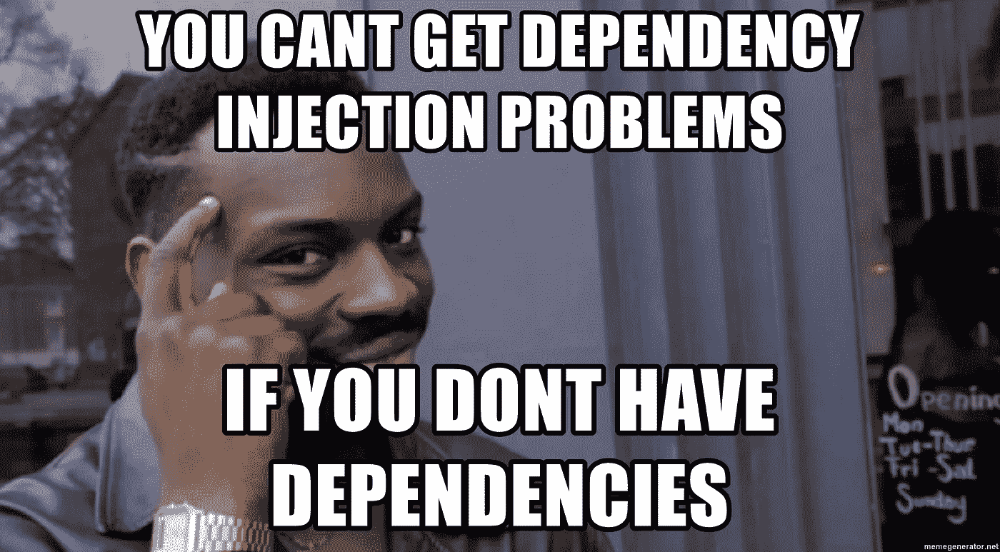

# Android 103:构造函数注入和 Dagger 中的 provides 方法有什么不同？

> 原文：<https://blog.devgenius.io/android-103-how-is-constructor-injection-different-from-provides-method-in-dagger-66ff0209ebb3?source=collection_archive---------9----------------------->

在第一篇 [**文章**](https://saurabhofficial.medium.com/android-101-what-does-dagger-really-generate-behind-the-scenes-db1300f9ce82) 中，我们探讨了 dagger 如何为注入的构造函数依赖关系生成工厂，在这篇文章中，我们将探讨更多关于当我们使用 **@Provides** 方法代替构造函数注入来定义依赖关系或绑定时 dagger 生成的代码。



正如在上一篇文章中提到的，Dagger 为每个构造函数注入的依赖项生成一个工厂，在生成的组件类中使用这个工厂来创建声明的依赖项的实例。

> 但是我们为什么需要@provides 注释呢？什么时候我们可以使用构造函数注入来定义绑定，甚至不需要创建 dagger 模块？
> 只要我们可以注释任何类的构造函数，我们就应该这样做，而不是创建一个模块并定义@provides 方法，但在某些情况下，我们会被模块卡住，例如，当我们无法访问我们希望作为应用程序中注入依赖项的类的构造函数时，就像 Android 中的 Activity 类

我们将通过定义一个依赖于 DummyModule 的 DummyComponent 来研究生成的代码，并看看 Dagger 生成了哪些类。

```
**@Module
object DummyModule {
**    
    @Singleton
    @Provides
    fun provideDummy(): Dummy {
        return Dummy()
    }
**}**
```

这是我写的 **DummyModule** ，也是这里的 **DummyComponent**

```
**@Component(modules = [DummyModule::class])
@Singleton
interface DummyComponent {
**    fun getDummy(): Dummy
**}**
```

当我们使用 provides annotated 方法时，dagger 会为 DummyModule 中声明的每个绑定/依赖项生成一个工厂。即**dummy module _ providedummy factory**

```
**// One such factory is generated for each binding in Module****public final class DummyModule_ProvideDummyFactory implements Factory<Dummy>** { @Override
  public Dummy get() {
    return *provideDummy*();
  }

  public static DummyModule_ProvideDummyFactory create() {
    return InstanceHolder.*INSTANCE*;
  }

  public static Dummy provideDummy() {
    return Preconditions.*checkNotNullFromProvides*(DummyModule.*INSTANCE*.provideDummy());
  }

  private static final class InstanceHolder {
    private static final DummyModule_ProvideDummyFactory *INSTANCE* = new DummyModule_ProvideDummyFactory();
  }
**}**
```

这个生成的工厂几乎类似于我们使用构造函数注入而不是 provides 方法时生成的工厂，只是名称发生了变化，以反映我们使用的是 provides 方法，而不是从构造函数注入生成的工厂。

这个生成的工厂在生成的 Dagger 组件中被使用，以获得 Dummy 类的实例，这与上一篇文章非常相似，除了一个不同之处是**组件构建器**。

```
**public final class DaggerDummyComponent implements DummyComponent {
**  private final DaggerDummyComponent dummyComponent = this;

  private Provider<Dummy> provideDummyProvider;

  private DaggerDummyComponent() {
    initialize();
  }

  public static Builder builder() {
    return new Builder();
  }

  public static DummyComponent create() {
    return new Builder().build();
  }

  @SuppressWarnings("unchecked")
  private void initialize() {
    this.provideDummyProvider = DoubleCheck.*provider*(DummyModule_ProvideDummyFactory.*create*());
  }

  @Override
  public Dummy getDummy() {
    return provideDummyProvider.get();
  }

 **public static final class Builder {**    **private Builder() {
    }**

    */**
     * @deprecated This module is declared, but an instance is not used in the component. This method is a no-op. For more, see https://dagger.dev/unused-modules.
     */* **@Deprecated
    public Builder dummyModule(DummyModule dummyModule) {
      Preconditions.*checkNotNull*(dummyModule);
      return this;
    }

    public DummyComponent build() {
      return new DaggerDummyComponent();
    }
  }**
}
```

由于这个组件依赖于一个模块来获得它的依赖项，Dagger 生成了一个构建器，这样我们就可以用所有需要的模块来初始化我们的组件。

**需要注意的细节！**

1.  **生成的代码中那个大的弃用警告是什么？**
    弃用说明告诉我们，组件不需要模块的任何实例来调用内部的 provides 方法，因为所有方法都是可访问的，甚至不需要创建模块的任何实例，因为它被声明为[对象](https://play.kotlinlang.org/byExample/03_special_classes/04_Object)，这使得生成的代码更有效，因为组件不需要实例化模块。理想情况下，当我们写模块的时候，我们应该试着让它里面的所有方法都是静态的(或者在 kotlin 中作为一个对象类)。
2.  我们为什么需要模块类的实例呢？为什么我们不能总是把它声明为一个对象？有时我们希望我们的模块类是有状态的，也就是说，我们希望在模块内部声明一些变量，以供 provides 方法使用，在这种情况下，我们将把它声明为一个适当的类。在这种情况下，组件将需要模块的一个实例来调用模块中声明的 provides 方法。这个[教程](https://codinginflow.com/tutorials/android/dagger-2/part-7-stateful-modules)涵盖了完全相同的场景。
    你可以试着在 **DummyModule** 声明中用一个简单的**类**替换**对象**，看看生成的代码有何不同！

我会试着在这个系列中写更多关于 Dagger 的内容，并在这里更新相关文章/**WIP*/

如果你觉得这篇文章很有见地，请给我一个掌声😄，快乐阅读！