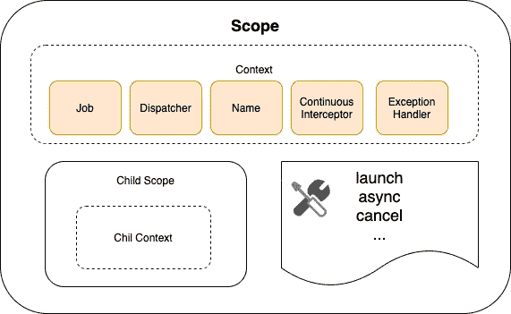

# Android 104:我们真的需要 Kotlin 协程吗？

> 原文：<https://blog.devgenius.io/android-104-do-we-really-need-kotlin-coroutines-c57e5d0278c8?source=collection_archive---------1----------------------->

**TLDR，**简答，**是的**我们做！

**什么不是科特林花冠？协程不是线程，也不是任何轻量级线程，我在各种文章中看到过模糊的类比，但它混淆的次数比帮助的次数多。**

**什么是 kotlin 协同程序？**
严格来说，**协程**是可挂起计算的实例，也就是说，它们本质上是在一个线程上执行的作业。
此外，它们是可挂起的，即它们可以在完全随机的线程上暂停和恢复。


为什么我们突然需要它们？不是突然，我们总是想避免混乱的嵌套回调，迄今为止的一种方法是 RxJava，现在我们在协程中有了另一种选择。

> 我还没有在本文[中讨论使用 RxJava 和协程之间的权衡，这里](https://blog.danlew.net/2021/01/28/rxjava-vs-coroutines/)很好地解释了这种权衡。

```
**1\. With callbacks :** **fun fetchAndDisplay() {
**     fetchObject { data ->
         showObject(data)
     } 
}**2\. With Coroutines :** **suspend fun fetchAndDisplay() {
**    val data = fetchObject();
    showObject(data);
}
```

在上面的例子中，我们可以看到协同例程如何帮助我们摆脱混乱的异步回调，并让我们以同步的方式编写异步代码。

在我们开始摆弄协程之前，我们需要了解一些组件，我将一个一个地介绍它们。



学分谷歌:P

**1。作用域:为什么协程作用域是相关的？由于协程是计算，我们可能希望给这些计算附加一个生命周期，即它们何时应该被销毁。
例如，如果我们在一个活动中开始一个计算，如果这个活动被破坏了，我们可能想要取消这个计算。这就是为什么我们需要范围，它帮助我们定义协程执行的边界。**

```
**GlobalScope.**<couroutine-builder>
**lifecycleScope.**<couroutine-builder> **viewModelScope.**<couroutine-builder>
```

有一些预定义的协同例程作用域可以帮助我们在应用程序中的各种场景下编写协同例程，GlobalScope 将保持任何未完成的协同例程运行，直到应用程序被终止，
类似地，对于**生命周期作用域**和**视图模型作用域**，它将继续运行，直到那个**生命周期所有者**或**视图模型**被销毁。

**2。调度程序:**调度程序决定协程将在哪个线程上执行。它们可以作为参数传递给协同例程生成器。
例如调度员**。IO、Main、Default、unconfixed**(名称不言自明)

```
GlobalScope.launch(**Dispatchers.IO**) {
    // computation
}
```

**3 .协同构建器:**构建器负责构建，有时启动协同(当启动类型不懒惰时)。
有一些非常常用的预定义共程构建器。

**a)启动**:它类似于 java 中的可运行界面，因为它不返回结果，它只是生成一个协同程序并进行计算，尽管它返回一个 **Job** 对象，该对象支持一些操作，如启动、取消、连接等。

```
**runBlocking {
**    val job1 = lifecycleScope.*launch* {delay(1000)}    val job2 = lifecycleScope.launch {delay(2000)} print("control is past both jobs") // both these jobs will be executed in parallel 
    // we can join these jobs if we need both these results
    // together for some other computation. job2.join()
    job1.join()**}** 
```

在上面的例子中，该控件将并行启动两个协同程序，直接进入 print 语句，并打印`control is past both jobs`然后它将暂停父协同程序，直到作业 2 完成，然后对作业 1 也是如此。
在父协同作用域(即这里的 runBlocking 作用域)内完成所有子协同作用之前，父作用域不会结束。

**b)异步:**它更类似于从计算中返回结果的可调用接口，不同之处在于它返回一个 **Future** 对象，而在异步构建器中它返回一个**Deleted**对象，该对象扩展了 **Job** 类本身(即有结果的 Job)

```
**runBlocking {
**    val deferred1 = lifecycleScope.*async* {delay(1000)}    val deferred2 = lifecycleScope.async {delay(2000)} print("control is past both jobs") // both these jobs will be executed in parallel again
    // we can use **await()** similarly to wait for the deferred 
    // computation to complete.**}**
```

这两个协同构建器都有微妙的不同之处，除此之外，它们的返回类型也有明显的不同，比如异常处理和结构化并发……

**细节值得关注！**

**1。验尸官上下文是如何传递给孩子验尸官的？**
默认情况下，子花冠继承父花冠的执行上下文，但有一个参数`Job`除外，该参数不是子花冠从父花冠继承的。
每个花冠都有自己的工作，如果我们把任何工作作为一个参数传入，它就会被用作这个新的子花冠的父项。

```
**runBlocking {
**   val job: Job = launch {
       delay(1000)
       // this is the child coroutine
   } val parentJob: Job = coroutineContext.job
 **println(job == parentJob) // false**   
   val parentChildren: Sequence<Job> = parentJob.children
 **println(parentChildren.first() == job) // true
}**
```

**2 .什么是 runBlocking？** 这是另一个协同构建器，但是除了构建和启动协同程序之外，它还会阻塞当前的执行线程，直到协同程序完成执行。
此外，一个花冠要到它的所有子代都完成了执行，它才会完成执行。

**3 .什么是挂起功能？** 暂停功能只是**在**之后可以暂停而**在**之后可以恢复的功能。他们可以执行一个长时间运行的操作，并等待它完成，而不阻塞当前线程。

```
**runBlocking {
**   suspend1()
   suspend2() 

**}****void suspend fun suspend1() {**
    delay(1000)
    Log.i("suspend 1 completed")
**}****void suspend fun suspend2() {
**    delay(1000)
    Log.i("suspend 2completed")
**}**
```

暂停功能将按顺序执行，即在本例中，首先执行第一个功能，完成后等待 1000 毫秒，然后执行第二个功能。我还没有写暂停函数和延续参数的内部内容，如果你好奇的话，这里有一篇详细的文章。

在我的下一篇文章中，我将尝试在 coroutine 中写更多关于异常处理和作业取消的内容

如果你觉得这篇文章很有见地，请给我一个掌声😄，快乐阅读！