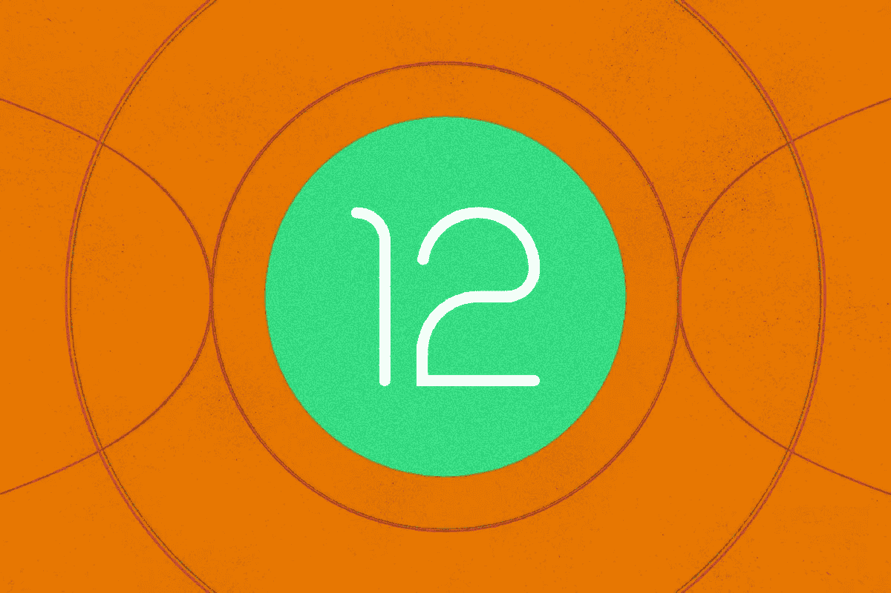
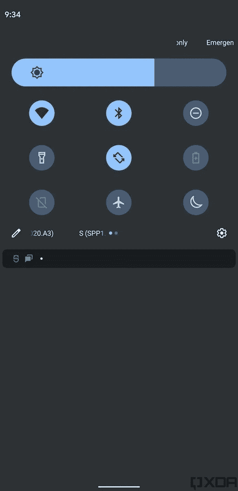
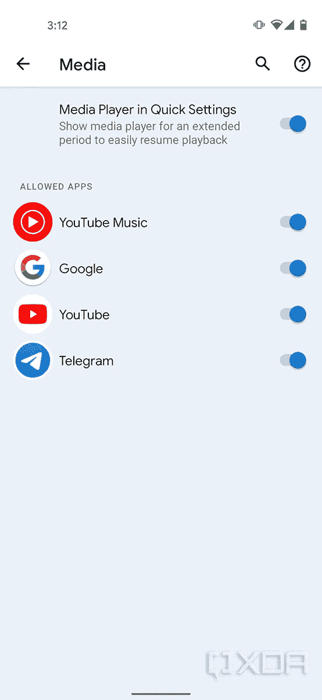
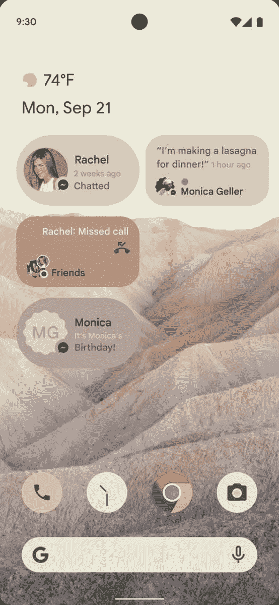
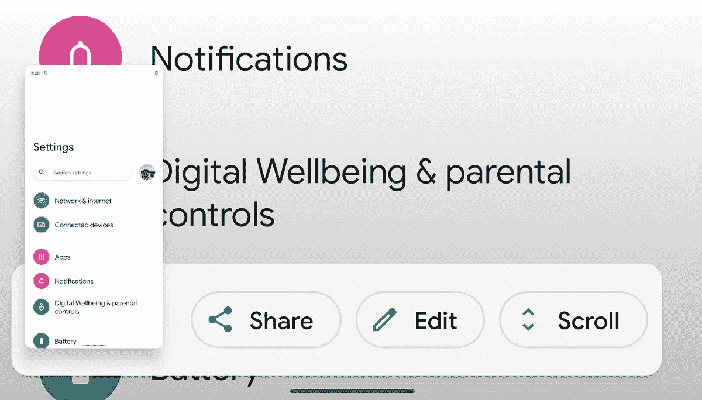
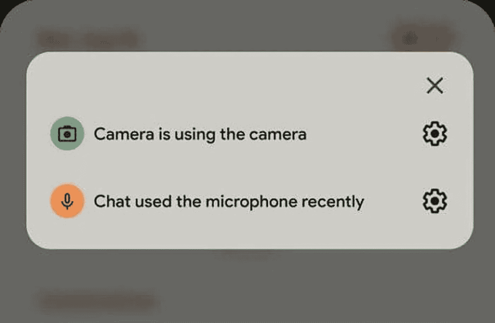
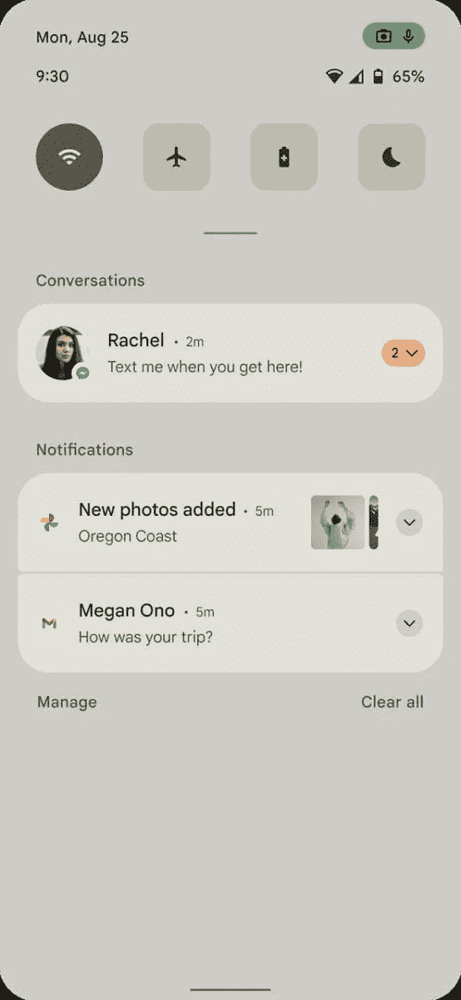

# Android 12 和一切重要的东西。

> 原文：<https://blog.devgenius.io/android-12-and-everything-that-matters-2fa81318f2af?source=collection_archive---------1----------------------->

来自 Google 的第一个开发者预览版在这里！

**Android 12 Logo**

谷歌最近发布了 Android 12 的首个开发者预览版，这是 Android 的下一个重大更新。

这很令人兴奋，因为就在几周前，我们今年可能会看到一些泄漏，从 UI 重新设计到小部件大修，谢天谢地，看起来这些都可能是真的。

我将简单介绍一下 Google 宣布的主要内容，以及隐藏在代码中的一些内容，这些内容很可能会在每年 5 月的发布会和公开测试中发布。

**Android 12 发布时间表。**

所以，让我们从我们确切知道的开始…

*   **通知用户界面**:基于 Android 11，Android 12 将提供一个“更现代、更易用、功能更强”的通知设计，改进了动画和过渡。

正在重新设计用户界面。| 图片来自 [XDA](https://www.xda-developers.com/android-12-new-lockscreen-notifications-design-leak/)

*   **改进了对丰富内容的支持**:一个新的统一 API 允许你从剪贴板、键盘和拖放中提取内容。在 Android 12 中，用户可以更容易地在应用程序之间移动照片、gif 或视频等内容。
*   **触觉绑定音频** : Android 12 允许“音频耦合触觉反馈”似乎你的手机将能够在特定环境下“播放”基于声音动态生成的触觉。
*   **HEVC 和 HDR 转码** : Android 12 将允许应用程序使用新格式，即使不直接支持，也可以在 HEVC 或 HDR 和 AVC 之间轻松转换，开发者也很容易实现。对你来说，这意味着在播放 iPhones 等其他设备上录制的内容时，问题会更少。
*   **AVIF 图像支持** : Android 12 增加了对新容器格式的支持，与旧格式相比，它可以在更小的尺寸下达到更高的质量。

这些是谷歌没有提到的一些花絮，一些隐藏在代码中的花絮已经被一些开发者挖掘出来，这些都应该在谷歌通常的五月活动中展示。

*   **单手模式**:默认情况下是禁用的，但它的工作原理类似于苹果在 iPhones 上的可达性功能。
*   新的蓝色主题 : Android 12 的设置中有一个淡蓝色的主题，可以大胆地运用到其他领域。
*   **控制哪些应用程序可以在快速设置中显示媒体控件**:如果您不希望某个特定的应用程序能够在您的快速设置面板中显示，您可以单独禁用它们的权限。

**媒体控制访问快速设置。** |图片来自 [XDA](https://www.xda-developers.com/android-12/)

*   **紧急呼救按钮**:很像 iOS 中的功能，你可以快速按下电源按钮，触发紧急模式，拨打紧急电话。
*   改进的窗口小部件:在 iOS 上发现的窗口小部件堆叠和一个新的对话窗口小部件即将推出，窗口小部件今年终于得到了谷歌的关注。Android 12 漏洞中发现的对话小部件将突出显示最近的消息、未接来电和活动状态，这似乎是谷歌迄今为止唯一的新部件，但我希望旧部件会收到更新。

**泄露可能的对话小工具设计。|** 图片来自 [XDA](https://www.xda-developers.com/android-12-conversation-widget-first-look/)

*   **截图编辑器**:更多工具可以在你拍摄后标记截图，包括文字和表情贴纸。
*   **“重定向振动”到游戏控制器**:将你的设备上的隆隆声带给你的外部游戏控制器。
*   **滚动截图**:它们终于出现了，但还没有出现在第一个开发预览版中，预计在未来几个月内会出现。

**滚动截图|**@米沙拉赫曼

*   **附近共享 Wi-Fi 密码**:你不必再分享一个二维码，只需用附近共享无线发送给他们，这是苹果在 iOS 上做的类似的事情，我很高兴看到 Android 采用它。
*   **改进的隐私功能:**这也是 iOS 上的一个很棒的功能，可以一眼看到哪些应用程序正在使用摄像头或麦克风，屏幕的左上方会显示一个绿色或橙色的图标，点击它会显示哪个应用程序正在访问它。

**隐私设置获得新功能。**

*   **可能的重新设计**:“Silky home”给了 Android 12 设置菜单一个新的三星 One UI 风格的外观，这是之前泄露的，可能不是最终的设计，但预计在 5 月的测试版中会看到最终的设计。

可能的用户界面重新设计。

其中一些功能显然来自 iOS，但苹果最近也从 Android 那里拿了不少，所以这是公平的游戏，只改进了两个操作系统。

就我个人而言，我喜欢 Android 12 的改进，我期待着看到谷歌在 5 月份还会带来什么。对锁屏和快速设置进行轻微的用户界面改变的可能性很有趣，因为它在过去几年里感觉有点儿没动过，有时看起来有点儿杂乱。

我们将在未来几个月了解更多信息，但目前不建议在您的日常设备上使用开发预览，因为它可能会耗尽电池，停用 Google pay，并且毫无疑问会有一些错误。

随着 5 月份 Android 12 活动的临近，我一定会更新我的发现和信息。