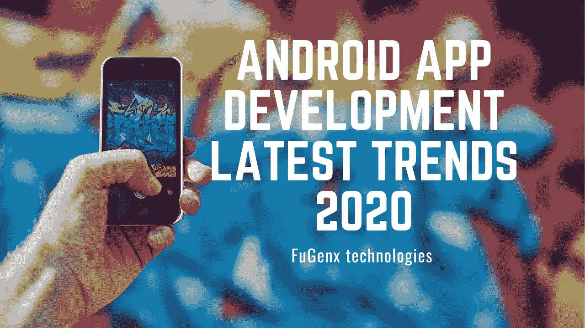

# 2020 年安卓应用开发最新趋势

> 原文：<https://blog.devgenius.io/android-app-development-latest-trends-2020-c740a29aabe1?source=collection_archive---------12----------------------->

您是否看到了 Android 应用程序开发中最热门的关键趋势，这些趋势为您的 Android 应用程序带来了竞争优势？这篇博客讨论了将在 2020 年流行的 Android 应用的设计和发展趋势。

智能手机让我们的生活变得更加便捷。随着智能手机背后的技术不断发展，移动应用行业也在不断发展，与时俱进。用令人惊叹的技术展望 Android 应用程序开发的未来，可以毫不夸张地说，Android 移动应用程序开发是当今企业的一个有利可图的机会。

谷歌 Play 商店上有超过 296 万个应用程序(并且还在增加)，Android 从一开始就获得了发展势头，并以超过 85%的市场份额领先竞争对手。每年，Android 在移动应用程序的开发中都会不断地提出新的想法、创新、方法和工具。Android 应用程序开发的未来非常有前途，将帮助你在竞争中保持领先

每年都会带来新的想法、创新和趋势，这些都意味着变革。大多数情况下，创新指的是未来的趋势。在你沉迷于探索和驾驭变革的浪潮或雇佣移动应用程序开发人员来开发应用程序之前，了解 Android 生态系统的趋势和影响是很重要的。不要模仿变化，使用移动公用事业开发公司的好处。

在这里，我们介绍了 Android 应用程序开发趋势的快速更新，这将让您更好地理解。

我们来看看 2020 年安卓应用开发趋势！

**延续 Android Instant Apps** 通过 Google Play Instant，Android 用户可以点击尝试一个完全绕过安装过程的应用或游戏。由于用户不需要即时应用程序来下载应用程序，所以它们非常容易用作网站，并直接从云进行管理。因此，这些应用程序不会占用您移动设备上的额外空间。

这些应用消除了设备上不需要的应用的混乱。谷歌最近为 Android 应用程序开发者推出了许多新功能，使下载较小的应用程序更容易，下载速度更快，允许潜在用户试用新应用程序，而不必安装它。

Android 的新应用发布格式 Android 应用捆绑包是向提供快速 Google Play 即时体验的方向迈出的一步。2019 年，Android 即时应用将取得进一步进展。

**Android 应用程序的结构架构** 谷歌的架构指南定义了创建 Android 应用程序的最佳实践，以及为创建高性能和健壮的应用程序而推荐的结构。Android 应用程序组件是创建一致应用程序的良好起点。使用架构组件，开发人员可以用更少的样板代码构建应用程序，并将更多的精力放在使应用程序独一无二的代码上。

Android 应用程序结构帮助 Android 应用程序开发人员社区创建一致的应用程序，并消除对 MVC、MVP 或 MVVM 等 Android 被动设计的困惑。

**新兴技术和安卓时代** 现在的重点是在各个方面智能地使用谷歌和人工智能，从自动驾驶汽车到智能手机。谷歌以人工智能为中心的战略现在正在扩大移动应用开发的人工智能和机器学习的范围。帮手越来越受欢迎。许多助手作为聊天机器人包含在应用程序中。

谷歌已经通过在谷歌 I / O 引入“动作”和“切片”来介入，允许应用程序直接与设备上的助手集成。谷歌希望用户在某些平台上花费更多的时间，例如谷歌镜头，其视觉搜索工具旨在用你的相机流畅地搜索你周围的世界。

通过引入包括视觉定位服务(VPS)在内的沉浸式技术的进步，Android 应用程序开发正在通过 AR / VR 与 AI 的集成实现下一次飞跃。这是在消费环境中检测和模仿视觉特征的最新 AR 技术之一。

多平台开发方兴未艾由谷歌开发的 Flutter 允许你从一个代码库在 iOS 和 Android 上创建漂亮的原生应用。新的结构是可定制和可扩展的小部件，提供了一个框架，无需桥接 Mobile SDK for JavaScript 的被动视图。

Cotlin / Native，一种将 cotline 编译成本地二进制的技术。它允许在本地库和设备的帮助下开发应用程序。Kotlin 编译器生成独立的可执行文件，可以在没有任何虚拟机的情况下运行。Kotlin / Native 将在 2019 年流行起来。

**安卓企业** 安卓设备，仅次于 iOS 设备，是公司工作中使用最多、首选的设备。该计划由谷歌领导，在 Android Enterprise 企业生态系统中建立了 Android 应用程序的最佳实践，并提供了对企业拥有的应用程序和数据的完全控制。

为程序开发人员提供 API 和其他工具，为 Android 的企业移动管理(EMM)解决方案提供全面支持。

**利用机器学习巧妙设计应用** *人工智能(AI)安卓应用开发*展示了给世界带来惊人变革的潜力。这项技术有能力做出不可逆转的改变。在 Android 应用程序开发的世界里，适应和开发变化是非常必要的。

人工智能(AI)功能与 Android 应用程序开发；许多智能手机都展示了先进的技术，如地标识别、图像标签、条形码扫描、人脸识别和文本识别。Android 手机中的人工智能功能可以简化用户的工作，以及建立令人惊叹的用户体验和内置的 Android 应用程序。

*   **文本识别:**文本识别是为移动开发者提供的，用于在智能设备上识别拉丁字母。在设备识别中，它返回包含单词、块、段落和符号的全文的影印施工文档。
*   **地标识别:**识别最好最有名的地方是非常明显的。它主要在云中工作，并在 SDK 中提供结果。
    面部识别:用于识别人脸的图像，并返回边框和验证照片。
*   **条形码扫描:**使用 MLKit，条形码有多种格式。它不仅负责定制数据，还处理一些预定义的事件，如发短信、Wi-Fi 连接检测和添加日历事件。
*   **图片标注:**图片标注有很多用途，比如一个人上传一张照片，指示用户进行标签类型标注，另一个人在图库中命名照片组。
    Android 开发人员可以使用 Image Labeler 应用程序为图像提供交互式标签。使用这种技术很容易对图像进行分类，命名为矩形 ROI(感兴趣区域)和像素语义分离。

图像标签使体验更具互动性，让用户对图像和物体更有归属感。

*机器学习(ML)* 提供根据经验自动学习和改进 Android 应用的能力，而无需显式编程。它与使用结构化数据的应用程序兼容，如图像和文本或带有大量参数的暗示。Android 为各种各样的机器学习工具和方法提供了关键支持。

**区块链科技** 一股愈演愈烈的趋势，黑链技术正在各个行业掀起轰动。它有望在安全、公共&私人区块链架构和财团架构方面蓬勃发展。预计到 2024 年底，区块链移动应用开发市场将达到 200 亿美元。区块链和区块链应用程序的开发越来越受欢迎，达到了难以想象的高度。根据区块链的宣传，一家公司改变它的名字和商业模式已经成为一个时髦的词。

**便捷的支付方式** 安卓应用下载量已经超过 iOS。然而，在收入方面，iOS 仍然领先。谷歌希望通过为新兴市场的消费者引入一种创新的支付应用程序的方式来弥补收入差距:用现金。它推出了“待处理交易”，无需信用卡或其他传统在线支付方式就能向客户付款。

信用卡的可用性意味着新兴市场的消费者更喜欢有免费游戏和广告支持游戏的应用，而不是付费下载和应用内购买。为了吸引更多依赖现金的客户，谷歌现在创造了另一种支付方式。

**Android Jetpack** Jetpack 是一套库、工具和指南，允许开发者轻松编写高质量的应用。这些组件允许您遵循最佳实践，将您从生成样板代码中解放出来，并简化复杂的任务，以便您可以专注于您所关心的系统。Android Jet‌pack 保留了所有现有的支持库、结构和结构，以处理应用程序管理和滞后兼容性等主要问题。
Google 将所有东西都构建到一个包中，分为四类:架构、基础、UI 和行为。

1.  **基础组件** 支持核心系统功能、Kotlin 扩展和自动化测试。
2.  **架构组件**
    构建可靠、可测试和可管理的应用程序。从管理 UI(用户界面)组件生命周期管理和数据一致性的类开始。
3.  **行为组件**
    将应用与通知、权限、共享和助手等 Android 服务相集成。
4.  **UI 组件**
    让您的手机应用不仅简单易用，而且充满乐趣。此外，该应用程序可以在不同版本的平台上运行。Android Jetpack 组件是通过提供向后兼容性构建的。

Jetpack 是在兴趣、测试能力和 Kotlin 集成的基础上产生的。使用较少的代码开发高性能和高质量的应用程序是可能的。

**以下是 Android Jetpack 的 5 大功能:**

*   汽车用安卓系统
*   基准
*   生物识别提示
*   照相机
*   限制布局 2
*   企业
*   生命周期和 LiveData KTX
*   安全性
*   具有保存状态的视图模型
*   观众 2

**按需应用** 安卓应用开发因改善客户服务和体验而广为人知。2020 年，按需应用程序可能会主导不断增长的应用程序开发趋势和移动应用程序开发。这些应用程序有助于使日常任务更快、更方便。

随需应变的应用程序遵循许多好处，如食品交付，零售，杂货，美容，医疗保健和其他好处。他们可以分析客户位置并提供必要的服务。客户可以通过点播应用获得即时服务。

**基于云的移动应用** 现在没有云空间，操作移动应用有点慢。因此，最好的数据应用程序开发者倾向于基于云的 Android 应用程序，以减轻加载大量数据的负担。

基于云的 Android 应用程序在保护重要数据而不侵占手机内存方面发挥着重要作用。用户可以随时随地轻松访问基于云的 Android 应用。

## 总结

每年都会带来新的想法、创新和趋势，这些都意味着变革。纵观前面提到的最新 Android 开发趋势，毫无疑问，Android OS 正在走向旨在交付前所未有的客户需求的统一体验。如果你的企业期待开发 Android 应用，考虑上述趋势肯定有助于提高你的企业的投资回报率。

2020 年标志着 Android 应用程序开发行业的重大变革。谷歌的操作系统现在正朝着更快、更统一的体验发展，目标是满足客户的期望。虽然 Android 应用程序的开发趋势仍在继续，但评估最新的技术更新以识别和捕捉将为您的公司创造竞争优势的机会非常重要。

如果你有一个移动应用开发的想法，为什么不[联系](https://www.fugenx.com/contact-us/)一个由[最优秀的移动应用开发者](https://www.fugenx.com/services/)组成的团队