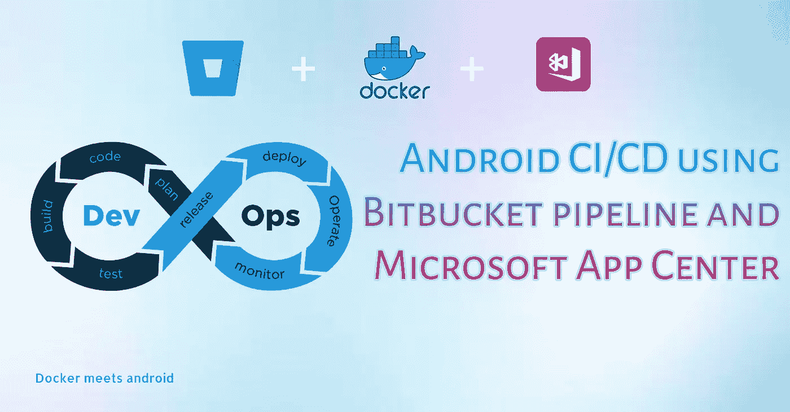
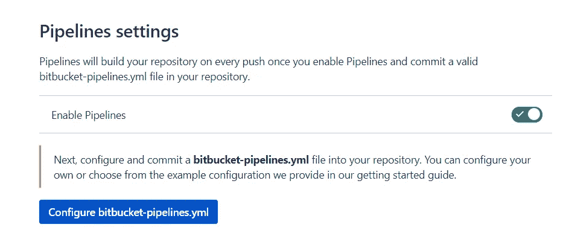
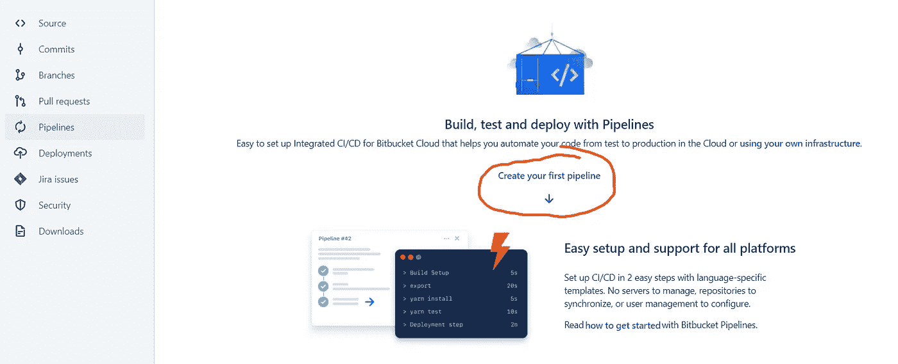
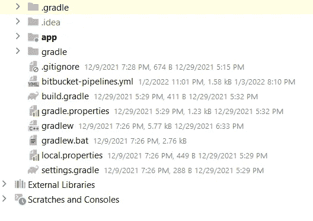

# 使用 Bitbucket 管道的 Android CI/CD，并部署到 Microsoft 应用中心

> 原文：<https://blog.devgenius.io/android-ci-cd-using-bitbucket-pipeline-and-deploy-to-microsoft-app-center-d2a1074bfb67?source=collection_archive---------2----------------------->



# 先决条件

> 关于 CI/CD、
> app center 账户的知识。

# 动机

**对于像我这样拥有低配置 PC/笔记本电脑并且需要大量时间来生成构建的人(开玩笑)。**


所有其他平台，如后端、web 前端，都使用 CI/CD 与服务器集成。为了部署到产品中，我们需要通过一些单元测试、lint 警告检查、UI 测试等。我们可以通过自动化流程来完成，并且可以将构建分发到任何分发系统，包括 google play 商店。有关 CI/CD 的更多信息，请访问[此](https://www.infoworld.com/article/3271126/what-is-cicd-continuous-integration-and-continuous-delivery-explained.html)链接。

可以手动**做**。
做了很多年。我认为自动化节省的时间无法弥补建立工作管道的努力。我错了。自动化不仅节省了时间，还使流程更加可靠，更不容易出错(人为错误),并鼓励更频繁地部署/发布。总的来说，开发周期加快了，不仅仅是 bug 修复，还有特性发布。

市场上还有其他一些工具。 [**【浪子】**](https://fastlane.tools/)[**詹金斯**](https://www.jenkins.io/)[**切尔莱西**](https://circleci.com/)[**特拉维斯 CI**](https://www.travis-ci.com/)[**team city**](https://www.jetbrains.com/teamcity/)**。**

# 概观

设置管道有一些步骤:

1.  在位存储库中启用管道。请转到

```
 repository > Repository Settings  >Find pipeline section on left menu > goto settings of pipeline section>Enable it.
```



管道启用

*或*您可以从管道部分启用它。



正在创建管道文件

2.您可以通过此设置配置您的**bit bucket-pipelines . yml**文件，也可以在 android studio 中手动创建您的**bit bucket-pipelines . yml**文件。**bit bucket-pipelines . yml**文件必须位于根包中。



管道文件放置

3.配置管道文件。

为了配置 **bitbucket-pipelines.yml** 文件，我们需要使用特殊的关键字概念来编写脚本和命令。点击[这个](https://chrisfrewin.medium.com/the-last-bitbucket-pipelines-tutorial-youll-ever-need-mastering-ci-and-cd-28a027fc5e40)链接了解更多详情。所以在这个项目中，我们将使用默认的**管道。我们将分两步走。第一步是构建 apk 工件，第二步是将 apk 发布到微软应用中心。**

## 步骤 1.0

## 步骤 1.5

在执行步骤之前，我们必须获得一个 app center 用户令牌。请转到

```
 Account Settings > User API tokens > New Token 
```

或者访问[此](https://docs.microsoft.com/en-us/appcenter/api-docs/#creating-an-app-center-user-api-token)链接，了解 app center 应用程序/用户令牌的更多详细信息。然后将令牌保存在安全的地方。

## 第 2.0 步

附上第二步。

所以我将详细说明第 2 步的最后一行。

```
- appcenter distribute release — group Collaborators — file “app/build/outputs/apk/debug/app-debug.apk” — release-notes ‘Test release Notes’ — app organization_name_or_your_account_name/app_name — token “your_token” — quiet
```

这个单行命令有六个不同的命令。

```
1\. appcenter distribute release — group Collaborators
// means the group those can access the app2\. file “app/build/outputs/apk/debug/app-debug.apk”
//indicating the file to upload3\. release-notes ‘Test release Notes’
//adding test notes when you upload is finished.4\. app organization_name_or_your_account_name/app_name
//indicate the app repository and organization name where you want //to upload.If your app is not under any organization then just //use your username as organization.5\. token “your_token”
// your user api token that you created earlier.6\. quiet
//for quiting.
```

因此，让我们具体化这两个步骤并最终确定我们的。yml 文件。


仅此而已。现在，您可以构建您的应用程序，而无需您的机器来完成这项工作。所有的构建过程现在都由 docker 和 bitbucket 处理。

感谢阅读。

# 编码快乐！