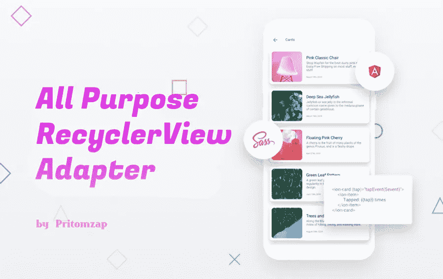

# Android 通用 RecyclerView 适配器

> 原文：<https://blog.devgenius.io/android-generic-recyclerview-adapter-67eb8f826cad?source=collection_archive---------1----------------------->



# 先决条件

> Kotlin、Recyclerview、Viewbinding、Kotlin [高阶函数和 Lambdas](https://kotlinlang.org/docs/reference/lambdas.html) (可选)

对于 android 开发人员来说，为每个回收器视图创建大量适配器是非常累人的，尽管我们最喜欢的 ANDROID STUDIO IDE 为我们提供了许多功能来编写更少的代码。在作为 Android 开发人员的几年中，我不得不为每个条目列表编写几个适配器。但是每一个新的特性往往会让我面临更大的挑战，这给我带来了经验，也带来了一些问题。

我遇到的最大挑战之一是在创建适配器和视图固定器后更改适配器列表数据类型，因为您必须多次更改整个适配器类中的模型对象，还必须更改视图固定器绑定方法。

对于一个使用了大量 recyclerview 的大项目来说，这真的很烦人。

# 解决办法

简单！！。只需创建一个泛型类型适配器和视图容器。

**第一步:**

创建名为 ***BaseAdapter.kt*** 和***base view holder . kt***或任何你喜欢的类。

```
**class** BaseAdapter{}**class** BaseViewHolder{}
```

现在，在 kotlin 泛型中，我们简单地使用“T”关键字来定义泛型类型。那么有哪些泛型呢？仿制药是-

> 为了创建这样一个类的实例，我们需要提供类型参数。

欲了解更多信息，请访问此[链接](https://kotlinlang.org/docs/reference/generics.html)。所以，让我们把泛型放到我们的代码中。

```
**class** BaseAdapter<T>{}**class** BaseViewHolder<T>{}
```

**第二步:**

继承 ***RecyclerView。适配器*** 并实现覆盖方法。

```
**class class** BaseAdapter<T>: RecyclerView.Adapter<BaseViewHolder<T>(){
   **override** **fun** onCreateViewHolder(parent: ViewGroup, 
                                   viewType:**Int**):BaseViewHolder<T> {
   }
   **override** **fun** onBindViewHolder(holder: BaseViewHolder<T>
                                 ,position:**Int**{
   }
   **override** **fun** getItemCount(): **Int** { }
}
```

创建一个通用类型的列表。这个列表是我们想要显示的项目的主要列表。

```
**var** listOfItems:MutableList<T>? = mutableListOf()
```

现在，让我们变个戏法。每当我们从列表中添加、更新或删除一个条目时，我们需要使用***notifydatascethanged()***方法通知适配器。让我们在这里不使用任何方法。

```
**var** listOfItems:MutableList<T>? = mutableListOf()
**set**(value) {
   field = value
   notifyDataSetChanged()
}**class class** BaseAdapter<T>: RecyclerView.Adapter<BaseViewHolder<T>(){
   **var** listOfItems:MutableList<T>? = mutableListOf()
   **set**(value) {
     field = value
     notifyDataSetChanged()
   }
   **override** **fun** onCreateViewHolder(parent: ViewGroup, 
                                   viewType:**Int**):BaseViewHolder<T> {
   }
   **override** **fun** onBindViewHolder(holder: BaseViewHolder<T>
                                 ,position:**Int**{
   }
   **override** **fun** getItemCount(): **Int** { }
}
```

**第三步:**

让我们完成***base view holder . kt***

添加构造函数和带有“T”类型的绑定方法。因为我们希望将项目与“T”类型的视图绑定。

```
**class** BaseViewHolder<T> **internal** **constructor**(){
  **fun** bind(item:T){ }
}
```

但是现在我们应该在哪里绑定项目。


照片由[蒂姆·莫斯霍尔德](https://unsplash.com/@timmossholder?utm_source=medium&utm_medium=referral)在 [Unsplash](https://unsplash.com?utm_source=medium&utm_medium=referral) 上拍摄

让我们将根 viewBinding 放在 viewHolder 类的构造函数中。因为每个布局的 viewBinding 类都有一个父类叫做 ***ViewBinding*** 。此外，为 bind 方法的主体创建一个 lambda，并用构造函数传递它。像这样-

```
**private** **val** experssion:(T,ViewBinding)->**Unit**
```

最后，我们的取景框看起来像这样—

最终 BaseViewHolder 类

**第四步:**

让我们更新我们的 BaseAdapter。

我们将创建两个 lambda 变量，名为***expressionViewHolderBinding***和***expressionOnCreateViewHolder。***

***expressionviewHolder binding—***我们必须在我们的 view holder 类中提供表达式 lambda。所以这个 lambda 表达式将完成这项工作。

***expressionOnCreateViewHolder—***该表达式将直接从活动/片段中进行膨胀工作。

```
**var** expressionViewHolderBinding: ((T,ViewBinding) -> **Unit**)? = **null****var** expressionOnCreateViewHolder:((ViewGroup)->ViewBinding)? = **null**
```

onCreateViewHolder 看起来会像这样—

```
**override** **fun** onCreateViewHolder(parent: ViewGroup, 
                                   viewType:**Int**):BaseViewHolder<T> {
 return BaseViewHolder(expressionOnCreateViewHolder(parent)
                       ,expressionViewHolderBinding)}
```

所以让我们结束这个适配器—

最终基本适配器


由 [Markus Spiske](https://unsplash.com/@markusspiske?utm_source=medium&utm_medium=referral) 在 [Unsplash](https://unsplash.com?utm_source=medium&utm_medium=referral) 上拍摄的照片

现在如何在任何片段或活动中使用它—

用在片段中

# 结论

您可以在此适配器中使用 DiffUtil、Snaphelper 和许多其他助手核心库。也可以在 ViewPager2 中使用。

感谢阅读这篇文章，我希望现在你会发现它是有帮助的。这是我发表的第一篇关于媒介的文章。任何疑问请在评论中告诉我。