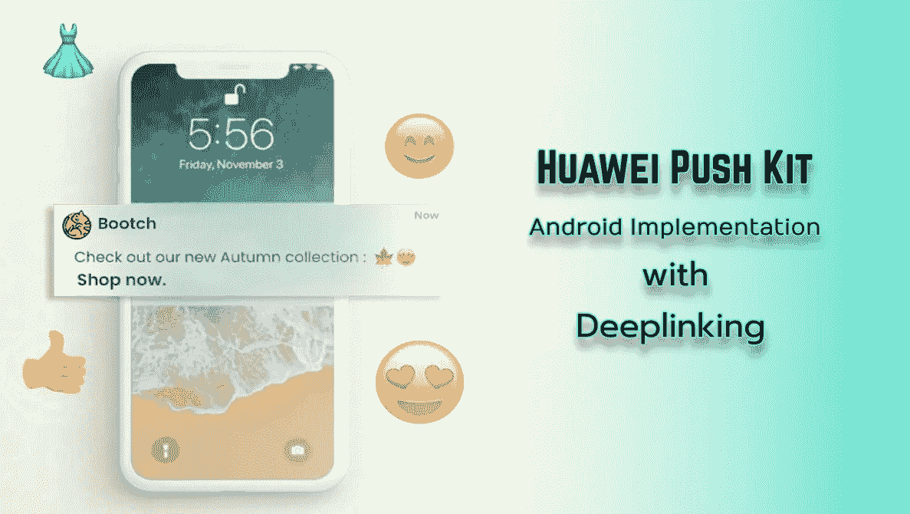
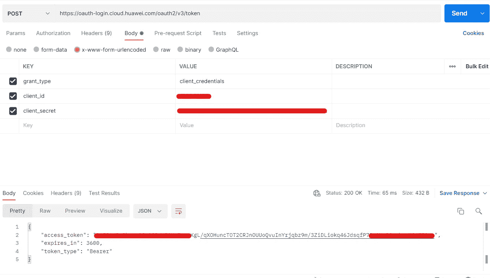
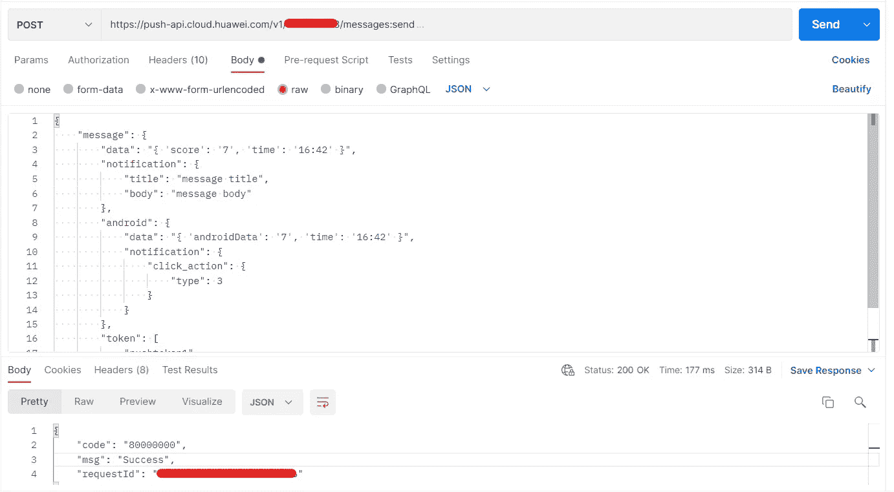
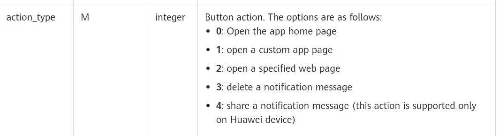

# 带有深度链接的 Android 华为推送通知

> 原文：<https://blog.devgenius.io/android-huawei-push-notification-with-deep-linking-b76cbe79354a?source=collection_archive---------10----------------------->



# 介绍

大家好，

我们将查看来自华为设备的接收推送通知。我们将随着深度链接一起谈论 [***华为推套件***](https://developer.huawei.com/consumer/en/doc/development/HMS-Plugin-Guides/introduction-0000001050176404) 。

H UAWEI Push Kit 是为您提供的一项消息服务，用于建立从云端到设备的消息通道。它具有与***FCM(Firebase Cloud messaging)相似的功能。*** 您可以自定义自己的通知，并从 ***HMS(华为消息服务)*** 控制台上传不同的设计。此外，您可以添加自定义按钮推送通知。很酷，不是吗？

# 设置

按照 [**这个**](https://developer.huawei.com/consumer/en/codelab/HMSPushKit/index.html#0) 链接进行服务的初始设置。

所以让我们跳过这一部分，深入研究如何从服务器端发送推送通知。我们必须使用 ***华为推送 API 手动发送推送通知。*** 所以华为给了我们两个不同的发送推送通知的 API。

```
1) Oauth 2.0 access token,POST /oauth2/v3/token HTTP/1.1
Host: oauth-login.cloud.huawei.com
Content-Type: application/x-www-form-urlencoded**params**grant_type=client_credentials& //default
client_id=<Client ID>& //Collect from app console
client_secret=<Client secret> //Collect from app console
```



邮递员视图

转到 [**此**](https://developer.huawei.com/consumer/fr/doc/development/HMSCore-Guides/web-get-access-token-0000001050048946) 链接，了解有关获取访问令牌的更多信息。

```
2) Push cloud API for Sending Downlink Messageshttps://push-api.cloud.huawei.com/v1/*appid*/messages:sendPOST /v1/***appid***/messages:send HTTP/1.1
Host: [oauth-login.cloud.huawei.com](https://push-api.cloud.huawei.com)**Header**Authorization = Bearer ***access_token*****Data payload/Request Body**
{
    "message": {
        "data": "{ 'score': '7', 'time': '16:42' }",
        "notification": {
            "title": "message title",
            "body": "message body"
        },
        "android": {
            "data": "{ 'androidData': '7', 'time': '16:42' }",
            "notification": {
                "click_action": {
                    "type": 3
                }
            }
        },
        "token": [
            "pushtoken1"
        ]
    }
}
** This is a sample notification message**
```



云推送 API 邮差视图

这就是通过华为推送云 API 从任何后端服务获得简单推送通知的全部内容。

# 深层链接

有两种类型的消息可以通过 push kit 发送。 ***通知报文*** 和 ***数据报文。***

## **通知消息**

```
***Notification message body***
{
    "message": {
        "notification": {
            "title": "message title",
            "body": "message body"
        },
        "android": {
            "notification": {
                "click_action": {
                    "type": 1,
                    "intent": "intent://com.huawei.xahmspushdemo/deeplink?#Intent;scheme=pushscheme;launchFlags=0x4000000;i.age=180;S.name=abc;end"
                }
            }
        },
        "token": [
            "pushtoken1"
        ]
    }
}
```

在 ***点击 _ 动作*** 部分**【类型】:1** 表示你想打开一个自定义意向。**“意图”:“xxxx”**表示名称和深度链接方案。要了解更多关于 click_action 的信息，请访问[这个](https://developer.huawei.com/consumer/en/doc/development/HMSCore-References/https-send-api-0000001050986197#EN-US_TOPIC_0000001134031085__p431142991615)链接。

```
***A simple deeplink scheme attached to an activity***
<activity android:name=".DeeplinkActivity">
    <intent-filter>
        <action android:name="android.intent.action.VIEW" />
        <category android:name="android.intent.category.DEFAULT" />
        <category android:name="android.intent.category.BROWSABLE" />
        <data
            <!-- Customize the following information:-->
            android:host="com.huawei.codelabpush"
            android:path="/deeplink"
            android:scheme="pushscheme" />
    </intent-filter>
</activity>
```

要了解更多关于深度链接方案的信息，请点击这里。

您可以向推送通知的按钮添加自定义动作和数据。

```
*** Deep-link action to a specific button of a push***
{
    "validate_only": false,
    "message": {
        "android": {
            "notification": {
                "title":"message title",
                "body":"message body",
                "click_action": {
                    "type": 3
                },
                "style": 0,
                "buttons": [
                    {
                        "name": "DETAILS",
                        "action_type": 1,
                        "intent_type": 0,
                        "intent": "intent://com.huawei.codelabpush/deeplink?#Intent;scheme=pushscheme;launchFlags=0x04000000;i.age=180;S.name=abc;end",
                        "data": "{\"key1\":\"value1\"}"
                    }
                ]
            }
        },
        "token": ["pushtoken1"]
    }
}
```



按钮动作类型

## 数据报文

```
***Data message body***
{
    "validate_only": false,
    "message": {
        "data": "{'param1':'value1','param2':'value2'}",
        "token": ["pushtoken1"]
    }
}
```

接收数据消息类似于 FCM 数据消息。对于深度链接，您必须手动将方案 URL 传递给 **"data":** 参数。您将接收这个确切的数据到推送通知服务类的***on message received***override 方法。

HmsPushService 类

# 注意

> 每个 OAuth 令牌都有 3600 秒的过期时间。因此，每次到期后，您都必须创建一个新令牌。

# 结论

在这篇文章中，我试图解释如何使用带有深度链接方案的华为 Push Kit。我希望这篇文章对每个人都有用。感谢您抽出时间阅读。